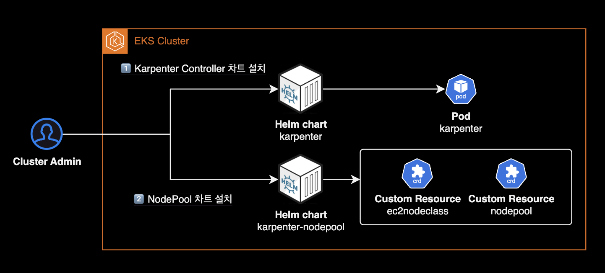

## 개요


클러스터 운영자를 위한 Karpenter 운영 가이드입니다.

이 글은 DevOps Engineer 혹은 SRE를 대상으로 작성되었으며 Karpenter에 대한 운영 방법과 몇 가지 팁이 포함되어 있습니다.

&nbsp;

## 환경

- **Karpenter 버전** : [v0.35.4](https://github.com/aws/karpenter-provider-aws/releases/tag/v0.35.4)
- **설치 방식** : [Helm chart](https://github.com/aws/karpenter-provider-aws/tree/release-v0.35.4/charts/karpenter)

&nbsp;

## 설치 가이드

Karpenter 설치에는 크게 2가지 방법이 있습니다.

1. EKS Terraform Module에 포함된 Karpenter 서브모듈을 사용하는 방법
2. Helm chart로 설치하는 방법

Karpenter 공식문서의 [Getting Started](https://karpenter.sh/v0.35/getting-started/) 페이지에는 테라폼 모듈을 사용한 설치 방법은 언급되어 있지 않으며, 헬름 차트를 이용한 설치만 설명하고 있습니다.

&nbsp;

제가 2023년 9월에 작성한 [Karpenter v0.27 설치 가이드](/blog/karpenter)는 현재 Deprecated 된 게시글이므로 참고 정도만 해주세요.

&nbsp;

## 운영 가이드

&nbsp;

### Drift

EC2NodeClass에 지정된 `spec.amiSelectorTerms` 값이 없는 경우, Karpenter는 Amazon EKS 최적화 AMI에 대해 게시된 SSM 파라미터를 모니터링합니다.

```yaml
apiVersion: karpenter.k8s.aws/v1beta1
kind: EC2NodeClass
metadata:
  name: default
spec:
  amiFamily: AL2
  role: karpenterNodeRole-$CLUSTER_NAME
  securityGroupSelectorTerms:
  - tags:
      alpha.eksctl.io/cluster-name: $CLUSTER_NAME
  subnetSelectorTerms:
  - tags:
      alpha.eksctl.io/cluster-name: $CLUSTER_NAME
  tags:
    intent: apps
    managed-by: karpenter
```

&nbsp;

Karpenter 0.33 버전 이상부터는 기본적으로 Drift 기능이 활성화되어 있습니다.

```yaml
# karpenter/values.yaml
# -- Global Settings to configure Karpenter
settings:
  # ... truncated ...
  featureGates:
    # -- drift is in BETA and is enabled by default.
    # Setting drift to false disables the drift disruption method to watch for drift between currently deployed nodes
    # and the desired state of nodes set in nodepools and nodeclasses
    drift: true
```

Karpenter의 Drift 기능을 비활성화하려면 `settings.featureGates.drift` 값을 `false`로 변경합니다.

더 자세한 사항은 [Karpenter Drift를 사용하여 Amazon EKS 워커 노드를 업그레이드하기](https://aws.amazon.com/ko/blogs/tech/how-to-upgrade-amazon-eks-worker-nodes-with-karpenter-drift/) AWS Blog 글을 참고합니다.

&nbsp;

### 카펜터 노드 수동으로 늘리기 (Inflate)

Karpenter 노드는 ASG<sup>Auto Scaling Group</sup>를 사용하지 않는 특성으로 인해 Cluster Autoscaler와 다르게 각 노드그룹의 최소(Min), 현재(Desired), 최대(Max) 인스턴스 개수를 지정할 수 없습니다. 이것이 Karpenter와 Cluster Autoscaler의 가장 큰 차이점입니다.

기본적으로 Karpenter는 클러스터의 워크로드 요구 사항을 감지하고 적절한 시점에 노드를 자동으로 추가하거나 제거하여 리소스 사용을 최적화합니다. 그러나 특정 상황에서는 클러스터 관리자가 카펜터 노드 수를 수동으로 조절할 필요가 있을 수 있습니다.

Karpenter에서는 수동으로 노드 수를 늘리는 행위를 인플레이트<sup>inflate</sup>라고 부르며, 일반적인 방법은 임시 워크로드를 생성하여 클러스터에 리소스 요구 사항을 인위적으로 생성하는 것입니다. 이를 통해 Karpenter나 다른 자동 스케일러가 더 많은 노드를 추가하도록 유도할 수 있습니다.


&nbsp;

인플레이트 제어를 위한 Deployment 입니다. Pause 컨테이너 이미지를 사용합니다.

```bash
KARPENTER_NODEPOOL_NAME=default
cat << EOF | kubectl apply -f -
---
apiVersion: apps/v1
kind: Deployment
metadata:
  name: karpenter-inflate
spec:
  # spec.replicas 값을 증가시키면, 각각의 파드가 다른 노드에 배포될 것입니다.
  replicas: 1
  selector:
    matchLabels:
      app: karpenter-inflate
  template:
    metadata:
      labels:
        app: karpenter-inflate
    spec:
      terminationGracePeriodSeconds: 0
      containers:
      - name: inflate
        image: public.ecr.aws/eks-distro/kubernetes/pause:3.7
        resources:
          requests:
            cpu: 1
      affinity:
        podAntiAffinity:
          requiredDuringSchedulingIgnoredDuringExecution:
          - labelSelector:
              matchExpressions:
              - key: app
                operator: In
                values:
                - karpenter-inflate
            topologyKey: "kubernetes.io/hostname"
        nodeAffinity:
          requiredDuringSchedulingIgnoredDuringExecution:
            nodeSelectorTerms:
            - matchExpressions:
              - key: karpenter.sh/nodepool
                operator: In
                values:
                - ${KARPENTER_NODEPOOL_NAME}
EOF
```

Kubernetes에서 `nodeAffinity`와 `podAntiAffinity` 설정은 함께 사용될 때 AND 조건으로 작동합니다. 이는 파드가 스케줄링될 때, nodeAffinity에 정의된 노드 선택 조건 그리고 podAntiAffinity에 정의된 다른 파드와의 위치 분리 조건을 동시에 만족해야 함을 의미합니다.

따라서 위 `karpenter-inflate` deployment를 사용하면 `default` 노드풀에 속하는 Karpenter Node는 `spec.replicas` 개수와 동일하게 늘어나게 됩니다.

아래 명령어를 통해 `default` nodepool에 속한 노드를 6개로 고정합니다.

```bash
kubectl scale deployment karpenter-inflate --replicas 6
```

&nbsp;

karpenter controller pod 로그에서 Karpenter Node Autoscaling 과정을 실시간으로 확인할 수 있습니다.

```bash
kubectl logs -f \
  -n kube-system \
  -l app.kubernetes.io/name=karpenter \
  -c controller

# Check the list of newly created Karpenter Nodes
kubectl get nodeclaim -o wide
```

&nbsp;

---

&nbsp;

### Karpenter 커스텀 리소스 관리

Karpenter 팀은 Karpenter 커스텀 리소스용 헬름 차트를 공식적으로 제공하지 않으며 사용자가 직접 작성하여 사용하길 권장하고 있습니다. 저 역시 Karpenter를 도입하기 전에 관련 차트를 찾아보았지만, 많은 옵션이 없어 결국 직접 차트를 만들게 되었습니다.

Kubernetes에서는 직접적으로 YAML을 사용하여 클러스터의 리소스를 설치하고 관리하는 것을 권장하지 않는 전형적인 안티 패턴으로 여겨집니다. 따라서, YAML 파일을 직접 작성하는 대신, 저는 [karpenter-nodepool](https://github.com/younsl/charts/tree/main/charts/karpenter-nodepool) 헬름 차트를 사용해 GitOps 방식으로 설치 및 관리하는 방식을 추천합니다.



이는 제가 직접 개발한 차트로, Karpenter Node 프로비저닝에 필요한 nodepool과 ec2nodeclass 리소스를 포함하고 있습니다.

&nbsp;

---

&nbsp;

### 노드 중단 예외처리

Karpenter Controller가 특정 Karpenter Node 또는 중요 파드가 배치된 Karpenter Node를 중단시키지 않도록 막으려면 약속된 Annotation을 붙입니다.

#### Pod level에서 설정

파드에 `karpenter.sh/do-not-disrupt: "true"` 어노테이션을 설정하여 Karpenter Controller가 특정 파드를 중단 대상으로 선택하는 것을 방지할 수 있습니다.

Karpenter disruption으로부터 예외처리 해야하는 워크로드 파드의 예시로는 중단하고 싶지 않은 실시간성 게임이나 중단된 경우 다시 시작해야 하는 긴 일괄 작업(예: 머신러닝 배치, 앱 빌드를 수행하는 Actions Runner)이 있습니다.

```yaml
apiVersion: apps/v1
kind: Deployment
spec:
  template:
    metadata:
      annotations:
        karpenter.sh/do-not-disrupt: "true"
```

&nbsp;

Pod의 어노테이션에 Karpenter 중단 예외처리가 정상 적용된 경우, Karpenter Node에서는 다음과 같이 `Cannot disrupt Node: Pod ... has "karpenter.sh/do-not-disrupt" annotation` 이벤트가 발생합니다.

```bash
kubectl describe node ip-xx-xxx-xxx-xxx.ap-northeast-2.compute.internal
```

```bash
Events:
  Type    Reason             Age                   From       Message
  ----    ------             ----                  ----       -------
  ...     ...                ...                   ...        ...
  Normal  DisruptionBlocked  33s                   karpenter  Cannot disrupt Node: Pod "<REDACTED>/xxx-vvj6g-z598z" has "karpenter.sh/do-not-disrupt" annotation
```

&nbsp;

#### Node level에서 설정

[Node-Level Controls](https://karpenter.sh/v0.35/concepts/disruption/#node-level-controls)

특정 카펜터 노드에 `karpenter.sh/do-not-disrupt: "true"` 주석을 설정하여 Karpenter가 특정 노드를 자발적으로 중단하지 못하도록 차단할 수 있습니다. 예외처리 Annotation이 붙은 노드는 Karpenter Controller가 수행하는 [중단<sup>Disruption</sup>](https://karpenter.sh/docs/concepts/disruption/) 작업에서 제외되므로 어떠한 경우에도 내려가지 않습니다.

&nbsp;

특정 카펜터 노드를 중단(Disruption)으로부터 예외처리 적용 또는 해제 방법은 다음과 같습니다.

먼저 예외처리할 노드를 식별합니다.

```bash
# Karpenter가 EC2 생성할 때 만드는 nodeclam 리소스 조회
kubectl get nodeclaim -o wide
```

```bash
NAME            TYPE         ZONE              NODE                                                READY   AGE     CAPACITY    NODEPOOL   NODECLASS
default-mfnll   m6i.xlarge   ap-northeast-2a   ip-10-xxx-xxx-x.ap-northeast-2.compute.internal     True    4h55m   on-demand   default    default
default-mlhqr   m6i.xlarge   ap-northeast-2c   ip-10-xxx-xxx-xxx.ap-northeast-2.compute.internal   True    4h57m   on-demand   default    default
default-x2wcj   m6i.xlarge   ap-northeast-2a   ip-10-xxx-xxx-xxx.ap-northeast-2.compute.internal   True    5h3m    on-demand   default    default
```

&nbsp;

nodeclaim을 확인했으니 실제 `node` 리소스를 조회합니다.

```bash
# 전체 워커노드 조회
kubectl get node -o wide
```

&nbsp;

예외처리용 Annotation을 해당 노드에 추가합니다.

Annotation 추가시 `kubectl annotate node <NODE_NAME>` 또는 `kubectl edit node <NODE_NAME>` 명령어 중 편한 방법을 사용하면 됩니다.

```bash
# Disruption 대상에서 제외
kubectl annotate node ip-10-xxx-xxx-xxx.ap-northeast-2.compute.internal karpenter.sh/do-not-disrupt="true"

# Disruption 대상에 포함
kubectl annotate node ip-10-xxx-xxx-xxx.ap-northeast-2.compute.internal karpenter.sh/do-not-disrupt-

```

&nbsp;

`kubectl get node <NODE_NAME> -o yaml` 명령어로 Node 리소스의 설정을 확인해보면 `karpenter.sh/do-not-disrupt: "true"`가 새로 추가된 걸 확인할 수 있습니다.

```yaml
apiVersion: v1
kind: Node
metadata:
  annotations:
    karpenter.sh/do-not-disrupt: "true"
    ...
  finalizers:
  - karpenter.sh/termination
```

&nbsp;

이후 해당 Karpenter 노드에 발생한 Event 정보를 확인합니다.

```bash
kubectl describe node <NODE_NAME>
```

&nbsp;

결과값 마지막에 위치한 Events 항목을 확인합니다.

```bash
...
Events:
  Type    Reason             Age   From       Message
  ----    ------             ----  ----       -------
  Normal  DisruptionBlocked  14s   karpenter  Cannot disrupt Node: Disruption is blocked with the "karpenter.sh/do-not-disrupt" annotation
```

`"karpenter.sh/do-not-disrupt"` annotation에 의해 해당 노드는 중단 작업에서 제외된 걸 이벤트를 통해 확인할 수 있습니다.

&nbsp;

---

&nbsp;

### 자동화된 중단

Karpenter Controller는 Kubernetes 클러스터의 리소스 사용률과 비용 효율성을 높이기 위해 클러스터 관리자 대신 클러스터 운영 업무를 수행합니다. 이는 클러스터의 스케일링과 관리를 자동화하여, 운영자가 수동으로 인프라를 조정하는 데 드는 시간과 노력을 줄여줍니다. Karpenter는 다음과 같은 주요 중단(Disruption) 작업을 통해 클러스터를 관리합니다.

&nbsp;

> **중요**:  
> 예외처리용 Annotation을 파드나 Karpenter Node에 붙이면 다음 세 가지 Karpenter Controller가 수행하는 자동화된 중단작업<sup>Automated methods</sup>에서 관련 노드가 제외됩니다.

1. [**Consolidation**](https://karpenter.sh/v0.36/concepts/disruption/#consolidation) (통합): 이 작업은 클러스터의 리소스 사용률을 최적화하기 위해 수행됩니다. 노드들 사이에 분산된 워크로드를 재조정하여, 사용되지 않는 노드를 축소하거나 제거함으로써 리소스를 보다 효율적으로 사용할 수 있도록 합니다. 즉, 적은 수의 노드로 같은 작업을 수행하여, 전력 소비와 비용을 절감할 수 있습니다.
2. [**Drift**](https://karpenter.sh/v0.36/concepts/disruption/#drift) (변동): 클러스터의 상태가 원하는 구성에서 벗어나게 되는 것을 '드리프트'라고 합니다. 이는 시간이 지남에 따라 자연스럽게 발생할 수 있는데, 예를 들어, 소프트웨어 버전의 차이나 리소스 요구사항의 변경 등이 이에 해당합니다. 드리프트 작업은 이러한 변동을 감지하고, 클러스터를 원래의 또는 최적의 상태로 복원하기 위해 노드를 자동으로 업데이트하거나 교체합니다.
3. **Expiration** (만료): 노드에 설정된 수명이 다하거나 사용하지 않는 리소스를 제거하는 과정입니다. 특정 시간 동안 사용되지 않은 노드를 자동으로 정리함으로써, 리소스를 효율적으로 관리하고 비용을 절감할 수 있습니다. 만료 작업은 오래되거나 더 이상 필요하지 않은 노드를 식별하고 제거하여, 클러스터를 최신 상태로 유지하는 데 도움을 줍니다.

&nbsp;

자동화된 중단 방법은 NodePool 리소스 마다 설정된 중단 예산<sup>[disruption budget](https://karpenter.sh/v0.36/concepts/disruption/#disruption-budgets)</sup>을 통해 속도를 제한할 수 있습니다.

```yaml
apiVersion: karpenter.sh/v1beta1
kind: NodePool
metadata:
  ...
spec:
  disruption:
    budgets:
    - nodes: 10%
    - duration: 10m
      nodes: "0"
      schedule: '@daily'
  ...
```

이러한 작업은 클러스터의 효율성과 비용 효율성을 높이기 위해 중요합니다. 하지만, 특정 Karpenter Node가 이러한 작업의 대상이 되지 않도록 설정하려면, 예외 처리용 Annotation을 사용하여 해당 노드를 제외시킬 수 있습니다. 이는 해당 노드가 중요한 워크로드를 처리하거나, 특별한 구성이 필요한 경우 유용할 수 있습니다.

&nbsp;

### topologySpreadConstraints

`topologySpreadConstraints` 설정을 사용하여 지역, 영역, 노드 및 기타 사용자 정의 토폴로지 도메인과 같은 장애 도메인 사이에서 클러스터 전체에 포드가 확산되는 방식을 제어할 수 있습니다. 이는 파드 고가용성과 효율적인 리소스 활용을 달성하는 데 도움을 쥽니다.

AZ 분산 조건에 충족되지 않더라도 파드를 배포하려면 `whenUnsatisfiable`을 `ScheduleAnyway`로 설정합니다.

```yaml
apiVersion: v1
kind: Pod
metadata:
  name: ingress-nginx
spec:
  topologySpreadConstraints:
  - labelSelector:
      matchLabels:
        app.kubernetes.io/component: controller
        app.kubernetes.io/instance: ingress-nginx
        app.kubernetes.io/name: ingress-nginx
    maxSkew: 1
    topologyKey: topology.kubernetes.io/zone
    whenUnsatisfiable: ScheduleAnyway
```

AZ 분산 조건에 충족되지 않을 경우 파드 배포를 안하려면 `whenUnsatisfiable`을 `DoNotSchedule`로 설정합니다. `whenUnsatisfiable`의 기본값은 `DonotSchedule` 입니다.

```yaml
apiVersion: v1
kind: Pod
metadata:
  name: ingress-nginx
spec:
  topologySpreadConstraints:
  - labelSelector:
      matchLabels:
        app.kubernetes.io/component: controller
        app.kubernetes.io/instance: ingress-nginx
        app.kubernetes.io/name: ingress-nginx
    maxSkew: 1
    topologyKey: topology.kubernetes.io/zone
    whenUnsatisfiable: DoNotSchedule
```

&nbsp;

### AL2023

[Amazon Linux 2 FAQ](https://aws.amazon.com/ko/amazon-linux-2/faqs/)에 따르면 Amazon Linux 2 운영체제는 2025년 6월 30일부로 지원종료됩니다. 이러한 이유로 미리 EKS 워커노드를 Amazon Linux 2에서 Amazon Linux 2023으로 전환하여 대비할 필요가 있습니다.

카펜터 노드를 Amazon Linux 2<sup>AL2</sup>에서 Amazon Linux 2023<sup>AL2023</sup>으로 업그레이드 하려면 `amiFamily` 값을 `AL2`에서 `AL2023`으로만 변경하면 됩니다.

```yaml
apiVersion: karpenter.k8s.aws/v1beta1
kind: EC2NodeClass
metadata:
  name: default
spec:
  amiFamily: AL2023
  amiSelectorTerms:
  - name: amazon-eks-node-al2023-x86_64-standard-1.30-*
  metadataOptions:
    httpEndpoint: enabled
    httpProtocolIPv6: disabled
    httpPutResponseHopLimit: 2
    httpTokens: required
  # ...
```

적용 이후 기존에 nodeClaim에 의해 생성된 Karpenter Node들이 모두 즉시 교체되는 것은 아니고, EC2NodeClass가 업데이트된 이후 시점부터 생성한 노드가 AL2023으로 세팅됩니다.

&nbsp;

Karpenter가 생성한 노드에 아래와 `kubectl node-shell`을 사용해서 접속합니다.

참고로 `kubectl` 패키지 매니저인 `krew`를 사용해서 `node-shell` 플러그인을 설치할 수 있습니다.

```bash
kubectl krew install node-shell
kubectl node-shell ip-xx-xxx-xxx-xxx.ap-northeast-2.compute.internal
```

&nbsp;

기존 Amazon Linux 2 EKS 노드는 노드가 생성될 때 `/etc/eks/bootstrap.sh` 스크립트에 의해 `kubelet` 설정들이 주입되었습니다.

EKS Amazon Linux 2023부터는 YAML 문법을 사용하는 새로운 노드 초기화 프로세스 nodeadm이 도입됩니다.

`nodeadm`의 NodeConfig 예시는 다음과 같습니다.

```yaml
---
apiVersion: node.eks.aws/v1alpha1
kind: NodeConfig
spec:
  kubelet:
    config:
      shutdownGracePeriod: 30s
      shutdownGracePeriodCriticalPods: 10s
      featureGates:
        DisableKubeletCloudCredentialProviders: true
    flags:
      - "--node-labels=node.kubernetes.io/name=basic,node.kubernetes.io/lifecycle=ondemand"
```

&nbsp;

워커노드에 접속한 후 `nodeadm` 명령어를 통해 `kubelet` 설정 상태도 검증할 수 있습니다.

```bash
$ nodeadm
nodeadm - From zero to Node faster than you can say Elastic Kubernetes Service

http://github.com/awslabs/amazon-eks-ami/nodeadm

  Usage:
    nodeadm [config|init]

  Subcommands:
    config   Manage configuration
    init     Initialize this instance as a node in an EKS cluster

  Flags:
       --version         Displays the program version string.
    -h --help            Displays help with available flag, subcommand, and positional value parameters.
    -c --config-source   Source of node configuration. The format is a URI with supported schemes: [imds, file]. (default: imds://user-data)
    -d --development     Enable development mode for logging.

No command specified
```

```bash
$ nodeadm config check --config-source imds://user-data
{"level":"info","ts":1718972521.2758596,"caller":"config/check.go:27","msg":"Checking configuration","source":"imds://user-data"}
{"level":"info","ts":1718972521.2799668,"caller":"config/check.go:36","msg":"Configuration is valid"}
```

&nbsp;

`nodeadm`이 실제 노드에 주입한 `kubelet` 설정 정보는 아래 2개 파일에 저장됩니다.

- `/etc/kubernetes/kubelet/config.jons.d/00-nodeadm.conf`
- `/etc/kubernetes/kubelet/config.json`

더 자세한 사항은 AWS 공식문서 [AL2에서 AL2023으로 업그레이드](https://docs.aws.amazon.com/ko_kr/eks/latest/userguide/eks-optimized-ami.html#al2023)를 참고합니다.

&nbsp;

워커노드에 `node-shell`, SSM, SSH 등을 이용해서 접근한 후 `nodeadm` 명령어로 nodeadm이 실제 적용한 `kubelet` 세부 설정을 확인할 수 있습니다.

```bash
$ cat /etc/kubernetes/kubelet/config.json.d/00-nodeadm.conf
{
    "apiVersion": "kubelet.config.k8s.io/v1beta1",
    "clusterDNS": [
        "172.20.0.10"
    ],
    "kind": "KubeletConfiguration",
    "maxPods": 234,
    "registerWithTaints": [
        {
            "effect": "NoSchedule",
            "key": "application-priority",
            "value": "critical"
        }
    ]
}
```

&nbsp;

## 참고자료

**EKS docs**  
[Karpenter Best Practices](https://aws.github.io/aws-eks-best-practices/karpenter/)

**Karpenter docs**  
[Karpenter v0.35 공식문서](https://karpenter.sh/v0.35/)
