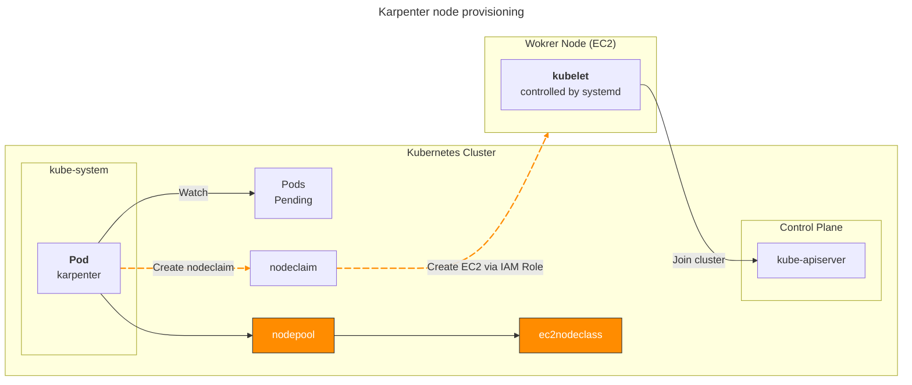
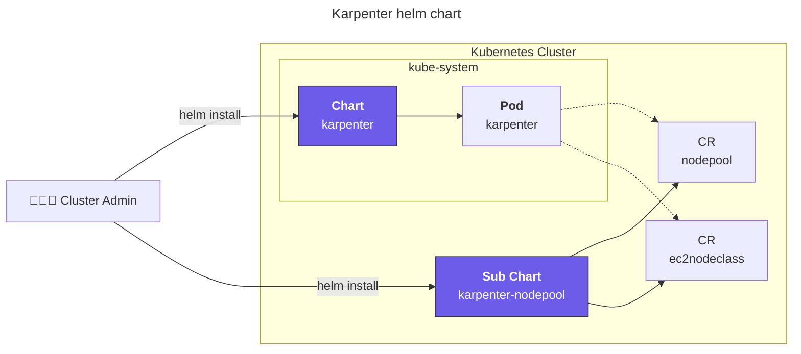
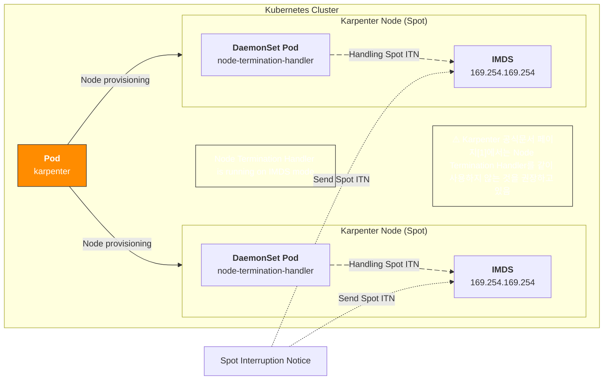
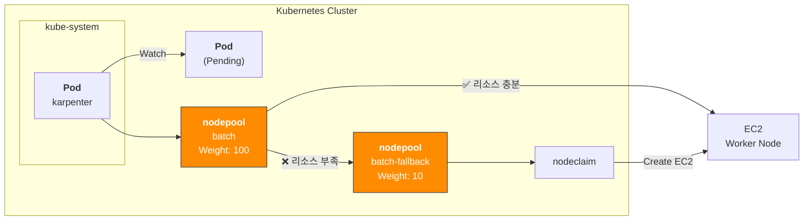
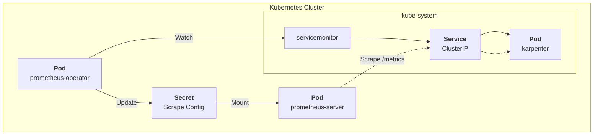
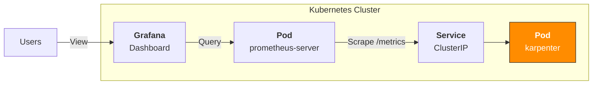
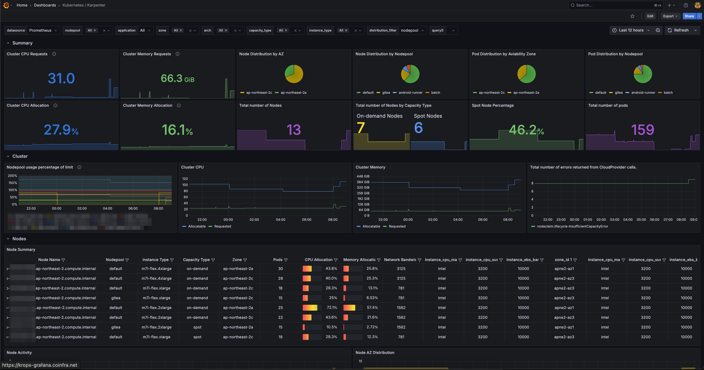
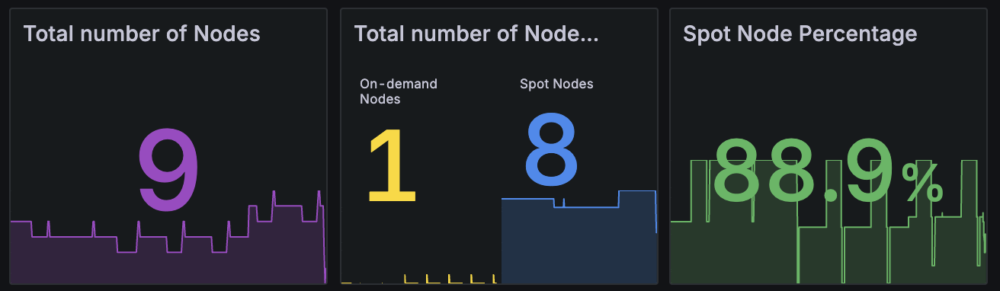

## 개요

컴퓨팅 비용 절감의 가장 확실한 방법은 적절한 리소스 최적화(right-sizing)와 스팟 인스턴스 활용입니다.

Karpenter와 Karpenter의 [Fallback 기능](https://karpenter.sh/docs/concepts/scheduling/#fallback)을 사용하면 스팟 인스턴스를 중단 없이 사용할 수 있습니다.

## 환경

- EKS 1.32
- **Karpenter** 1.8.1 (official helm chart)
- **Node Termination Handler** 1.25.2 (official helm chart)
  - NTH 동작 모드는 IMDS(Instance Metadata Service) 모드로 설정했으며, 데몬셋으로 배포됨

## 설정 가이드

### 노드 프로비저닝

Karpenter가 노드 프로비저닝하는 과정의 트리거는 Pending 상태의 파드가 있는 시점



### Karpenter 헬름차트 구조

Karpenter 설치는 [공식 헬름 차트](https://github.com/aws/karpenter-provider-aws/tree/main/charts)로 쉽게 진행할 수 있습니다. Karpenter v0.32.0부터 OCI registry로 마이그레이션되었습니다.

karpenter 차트 다운로드:

```bash
# 버전 검색
crane ls public.ecr.aws/karpenter/karpenter

# OCI 차트 저장소에서 karpenter 차트 다운로드
helm pull oci://public.ecr.aws/karpenter/karpenter --version 1.8.1 --untar
```



Karpenter의 커스텀 리소스를 담고있는 [karpenter-nodepool 차트](https://github.com/younsl/blog/tree/main/content/charts/karpenter-nodepool)는 공식 제공되는 차트가 아니라 직접 개발해서 운영중입니다.

헬름차트로 Karpenter를 관리하는 이유는 복잡한 Kubernetes 리소스들을 템플릿화하여 환경별 설정값(dev/stage/prod)을 values.yaml 파일로 분리 관리할 수 있고, 차트 버전 기반의 원자적 배포와 즉시 롤백이 가능하기 때문입니다. 특히 Karpenter는 NodePool, EC2NodeClass 등 여러 CRD와 RBAC 설정이 복합적으로 연결되어 있어 헬름의 의존성 관리와 훅(hook) 기능을 활용하면 배포 순서 제어와 설정 일관성을 보장할 수 있으며, GitOps 워크플로우와 결합하여 인프라 변경사항을 코드로 추적하고 검토할 수 있어 운영 안정성이 크게 향상됩니다.

### 스팟 중단 핸들링 방법

Karpenter가 스팟 중단신호(Spot Interruption Notice)를 안전하게 처리하는 핸들링 방식은 크게 2가지입니다.

1. Karpenter + Node Termination Handler
2. EventBridge Rules + SQS + Karpenter

Karpenter 공식문서의 [FAQ 페이지](https://karpenter.sh/docs/faq/#interruption-handling)에서는 SQS를 사용하는 방식을 권장하고 있지만, NTH를 사용하는 방식이 운영 편의성이 더 좋습니다.

Karpenter가 노드 프로비저닝하며 NTH(Node Termination Handler)가 Spot 중단신호 감지 및 파드 Eviction 담당



1: https://karpenter.sh/docs/faq/#interruption-handling

### Spot Nodepool Fallback

[Fallback](https://karpenter.sh/docs/concepts/scheduling/#fallback) 기능을 사용하여 [가중치(Weight)](https://karpenter.sh/docs/concepts/scheduling/#weighted-nodepools) 기반 spot, on-demand 노드풀 선정

#### 노드풀의 가중치(Weight) 설정

nodepool 리소스에 `spec.weight` 필드를 사용하여 가중치(Weight)를 설정하면 됩니다.

```yaml
apiVersion: karpenter.sh/v1
kind: NodePool
metadata:
  name: batch
spec:
  template:
    spec:
      requirements:
      - key: karpenter.sh/capacity-type
        operator: In
        values:
        - spot
  weight: 100 # Set 10 for fallback on-demand nodepool
```

Karpenter는 같은 할당 조건을 가진 노드풀 중에서 가중치가 높은 노드풀을 우선 선택합니다. 높은 가중치의 노드에 할당이 실패하면 가중치가 낮은 노드에 할당을 시도합니다.

파드 설정에서도 기본(스팟) 노드풀과 Fallback 노드풀에 대한 nodeAffinity를 모두 지정해야 합니다.

```yaml
apiVersion: v1
kind: Pod
metadata:
  name: my-pod
  namespace: default
  labels:
    app: my-app
spec:
  affinity:
    nodeAffinity:
      requiredDuringSchedulingIgnoredDuringExecution:
        nodeSelectorTerms:
          - matchExpressions:
            - key: karpenter.sh/nodepool
              operator: In
              values:
              - batch           # Set primary(spot) nodepool
              - batch-fallback  # Set fallback(on-demand) nodepool
```

Karpenter 노드는 생성될 떄 자동으로 자신의 노드풀 이름이 담긴 `karpenter.sh/nodepool` 라벨이 붙습니다. 이 라벨을 사용해서 파드를 특정 노드풀과 폴백 노드풀에 할당할 수 있습니다.

시스템 아키텍처:



노드 프로비저닝 과정이 시작되면 Karpenter Controller는 노드풀의 가중치(Weight)를 참고하여 가중치가 높은 스팟 노드풀을 우선 선택합니다. 만약 스팟 노드풀의 리소스가 부족하면 Fallback 노드풀이 선택됩니다.

AWS Summit Seoul 2025에서 샌드버드가 발표한 'Amazon EKS 기반 클라우드 최적화와 생성형 AI 혁신 전략' 세션에서 많은 부분을 참고했습니다.

### 메트릭 수집 설정

Karpenter는 노드풀 및 클러스터 수준의 거시적인 메트릭을 제공합니다.

[prometheus-operator](https://github.com/prometheus-operator/prometheus-operator)를 사용하는 경우, 서비스 모니터링을 위해 노드풀 레벨의 메트릭을 수집하기 위해 servicemontior 리소스 생성합니다.

아래는 Karpenter 헬름 차트의 설정 예시입니다.

```yaml
# charts/karpenter/values_your.yaml
serviceMonitor:
  # -- Specifies whether a ServiceMonitor should be created.
  enabled: true
```

메트릭 수집 과정



Prometheus Server가 Karpenter 서비스의 `/metrics` 엔드포인트에 접근하여 메트릭을 수집합니다.

### Grafana 대시보드

가시성(Observability)을 높이기 위해 Grafana 대시보드와 Prometheus 메트릭을 연동하여 Karpenter의 성능과 상태를 실시간으로 모니터링할 수 있습니다.



Grafana 대시보드 [ID 20398](https://grafana.com/grafana/dashboards/20398-karpenter/)를 통해 노드풀, 스팟 현황 및 비중, 노드 레벨의 리소스 사용률을 확인할 수 있습니다.



## TLDR

Karpenter 1.8.1 + NTH 조합에 Spot fallback을 사용해본 결과 5개월 동안 스팟 중단으로 인한 영향도는 없었습니다. 결과적으로 클러스터의 80~85% 스팟 노드를 안정적으로 운영했습니다.



위 그래프는 Grafana 대시보드에서 확인한 Karpenter의 Capacity Type별 노드 비율입니다. Spot 인스턴스 비율이 전체의 80~85% 수준으로 안정적으로 유지되고 있으며, 나머지 15~20%는 Fallback용 On-Demand 인스턴스로 구성되어 있습니다.

아래는 kubectl 명령어로 스팟 노드 목록을 조회한 예시입니다.

```bash
kubectl get node -l karpenter.sh/capacity-type=spot
```

```bash
NAME                                               STATUS   ROLES    AGE   VERSION
ip-xx-xxx-xx-xxx.ap-northeast-2.compute.internal   Ready    <none>   8d    v1.32.9-eks-113cf36
ip-xx-xxx-xx-xx.ap-northeast-2.compute.internal    Ready    <none>   23h   v1.32.9-eks-113cf36
ip-xx-xxx-xx-xx.ap-northeast-2.compute.internal    Ready    <none>   13h   v1.32.9-eks-113cf36
ip-xx-xxx-xx-xxx.ap-northeast-2.compute.internal   Ready    <none>   10d   v1.32.9-eks-113cf36
ip-xx-xxx-xx-xxx.ap-northeast-2.compute.internal   Ready    <none>   65m   v1.32.9-eks-113cf36
ip-xx-xxx-xx-xx.ap-northeast-2.compute.internal    Ready    <none>   29m   v1.32.9-eks-113cf36
ip-xx-xxx-xx-xxx.ap-northeast-2.compute.internal   Ready    <none>   13d   v1.32.9-eks-113cf36
```

Spot과 Fallback 노드풀 활용을 통해 EC2 비용 120 USD / 1mo 절감, 월비용으로는 3600 USD 절감되었습니다.

## 관련자료

- [Using Amazon EC2 Spot Instances with Karpenter at AWS Blog](https://aws.amazon.com/ko/blogs/containers/using-amazon-ec2-spot-instances-with-karpenter/)
