## 개요

기존에 이미 생성되어 있는 EKS 클러스터에 Karpenter를 설치하는 가이드입니다.

이 가이드에서는 다음과 같이 기존에 존재하던 EKS 클러스터 환경을 가정하고 있습니다.

- 기존 EKS 클러스터를 사용합니다.
- 기존 VPC와 서브넷을 사용합니다.
- 기존 보안 그룹을 사용합니다.
- EC2 노드가 하나 이상의 노드 그룹에 속합니다.
- 클러스터에 Service Account용 OIDC Provider가 이미 있는 상태입니다.

&nbsp;

## 배경지식

### Karpenter

Karpenter는 예약할 수 없는 파드를 감지하고 새 노드를 자동으로 프로비저닝하는 오픈 소스 클러스터 오토스케일러입니다.


#### 기능과 동작방식

Karpenter는 리소스 부족으로 인해 Pending 상태인 파드의 총 리소스 요구 사항을 분석한 후 이를 실행할 최적의 EC2 인스턴스 유형을 선택합니다.  
데몬셋이 아닌 파드가 없는 인스턴스를 자동으로 축소하거나 종료하여 컴퓨팅 리소스 낭비를 줄입니다.  
또한 Pod를 적극적으로 이동하고 노드를 삭제하거나 더 저렴한 인스턴스 타입으로 교체하여 클러스터 비용을 줄이는 노드 통합 기능<sup>Consolidation</sup>도 지원합니다.

&nbsp;


- 파드의 리소스 CPU, Memory 요구 사항에 따라 노드를 프로비저닝합니다.
- Provisioner의 다양한 옵션을 사용하여 인스턴스 유형별로 다양한 노드 구성을 생성합니다. Karpenter를 사용하면 여러 EKS 노드 그룹을 관리하는 대신 쿠버네티스 내부에 있는 Provisioner 리소스(CRD)만으로도 다양한 워크로드 용량을 쉽게 관리할 수 있습니다.
- Karpenter는 Cluster Autoscaler 보다 신속하게 노드를 시작하고 Pod를 빠르게 예약하며, 요청된 리소스 크기에 맞게 적절한 인스턴스 타입의 노드를 배치하므로 전체적인 클러스터 컴퓨팅 비용이 더 절약됩니다.


- **빠른 프로비저닝 속도** : CA는 ASG를 사용하여 노드 수를 조절합니다. 반면에 Karpenter는 EC2 API를 호출해 직접 생성하므로 노드 프로비저닝 속도가 Cluster Autoscaler 보다 빠릅니다. 늘려야할 노드 수가 클 수록 속도차는 점점 벌어집니다.


&nbsp;

#### General Availability

Karpenter는 2021년 11월 27일에 `v0.5` 버전을 출시했습니다.  
Karpenter `v0.5` 이상부터는 정식 버전<sup>GA, General Availability</sup>이기 때문에 프로덕션 레벨에서도 안심하고 사용 가능합니다.  
[AWS 뉴스 - AWS Karpenter v0.5, 이제 정식 버전 제공](https://aws.amazon.com/ko/about-aws/whats-new/2021/11/aws-karpenter-v0-5/)

&nbsp;

### Provisioner

Karpenter 컨트롤러는 Provisioner라고 하는 리소스(CRD)를 사용합니다. Provisioner는 클러스터에 노드를 동적으로 프로비저닝하는 역할을 수행합니다. Provisioner는 클러스터에 추가 노드가 필요할 때 Karpenter에게 요청을 보내고, Karpenter는 요청에 따라 클러스터에 노드를 자동으로 추가합니다. Provisioner는 이러한 작업을 수행하기 위해 클라우드 제공 업체 API 또는 기타 클러스터 프로비저닝 도구와 통합됩니다.

요약하자면 Karpenter에서 Provisioner는 클러스터 자원을 동적으로 관리하여 애플리케이션의 요구에 따라 적절한 수의 노드를 프로비저닝하는 역할을 하는 리소스입니다.

&nbsp;

### IRSA

IRSA<sup>IAM Role for Service Account</sup>는 Kubernetes의 ServiceAccount 리소스를 사용하여 Pod의 권한을 IAM Role로 제어할 수 있도록 하는 권한 기능을 말합니다.


위 그림은 Pod 내부에서 동작하는 Application이 `s3:ListBuckets` 권한을 얻은 다음 AWS S3 Buket의 목록을 가져오는 경우, IRSA 동작 흐름 예시입니다.  
[Diving into IAM Roles for Service Accounts](https://aws.amazon.com/ko/blogs/containers/diving-into-iam-roles-for-service-accounts/)

&nbsp;

Karpenter Controller와 Karpenter가 생성한 노드의 경우 다음과 같이 IRSA가 구성됩니다.


&nbsp;

## 환경

### EKS 클러스터

- EKS v1.24 <sup>(AWS Management Console에서 생성)</sup>
- EC2 기반의 워커 노드
- Cluster Autoscaler 미설치
- [Karpenter v0.25.0](https://github.com/aws/karpenter/releases/tag/v0.25.0)
  - helm으로 설치

&nbsp;

### 로컬 환경

- AWS CLI 2.10.3
- helm v3.11.1

&nbsp;

## Karpenter 설치

### 초기 환경변수 설정

EKS 클러스터 이름에 대한 환경변수를 설정합니다.

```bash
$ CLUSTER_NAME=YOUR_CLUSTER_NAME_HERE
```

&nbsp;

다른 환경변수도 설정합니다.  
아래 환경변수 4개는 Karpenter 설치 과정에서 사용됩니다.

```bash
$ AWS_PARTITION="aws"
$ AWS_REGION="$(aws configure list | grep region | tr -s " " | cut -d" " -f3)"
$ OIDC_ENDPOINT="$(aws eks describe-cluster --name ${CLUSTER_NAME} \
    --query "cluster.identity.oidc.issuer" --output text)"
$ AWS_ACCOUNT_ID=$(aws sts get-caller-identity --query 'Account' \
    --output text)
```

&nbsp;

#### 환경변수 주의사항

새 터미널 세션을 여는 경우 일부 또는 모든 환경 변수를 다시 설정해야 합니다.  
현재 환경변수 설정상태를 다시 확인하려면 다음 명령어를 실행하세요.

```bash
$ echo $AWS_REGION $OIDC_ENDPOINT $AWS_ACCOUNT_ID
```

&nbsp;

출력값이 다음과 같이 나오면 정상적으로 환경변수 설정이 완료된 것입니다.

```bash
ap-northeast-2 https://oidc.eks.ap-northeast-2.amazonaws.com/id/E123456F789012AE34AECB5C6DA78901 111122223333
```

&nbsp;

### IAM Role 생성

#### Karpenter 노드용 IAM Role

Karpenter 노드용 IAM Role을 생성하기 위해 Role의 신뢰 관계를 생성합니다.

```bash
$ echo '{
    "Version": "2012-10-17",
    "Statement": [
        {
            "Effect": "Allow",
            "Principal": {
                "Service": "ec2.amazonaws.com"
            },
            "Action": "sts:AssumeRole"
        }
    ]
}' > node-trust-policy.json
```

&nbsp;

Karpenter로 생성한 노드에서 사용할 IAM Role을 생성합니다.  
IAM Role의 신뢰 관계는 이전에 만든 `node-trust-policy.json`의 내용을 그대로 적용합니다.

```bash
$ aws iam create-role \
    --role-name "KarpenterNodeRole-${CLUSTER_NAME}" \
    --assume-role-policy-document file://node-trust-policy.json
```

&nbsp;

KarpenterNodeRole에 EKS 노드에게 필수적으로 필요한 권한 4개를 붙입니다.

```bash
$ aws iam attach-role-policy \
    --role-name "KarpenterNodeRole-${CLUSTER_NAME}" \
    --policy-arn arn:aws:iam::aws:policy/AmazonEKSWorkerNodePolicy
```

```bash
$ aws iam attach-role-policy \
    --role-name "KarpenterNodeRole-${CLUSTER_NAME}" \
    --policy-arn arn:aws:iam::aws:policy/AmazonEKS_CNI_Policy
```

```bash
$ aws iam attach-role-policy \
    --role-name "KarpenterNodeRole-${CLUSTER_NAME}" \
    --policy-arn arn:aws:iam::aws:policy/AmazonEC2ContainerRegistryReadOnly
```

```bash
$ aws iam attach-role-policy \
    --role-name "KarpenterNodeRole-${CLUSTER_NAME}" \
    --policy-arn arn:aws:iam::aws:policy/AmazonSSMManagedInstanceCore
```

&nbsp;

KarpenterNodeRole에 연결한 4개의 IAM Policy는 모두 [AWS 관리형 정책](https://docs.aws.amazon.com/IAM/latest/UserGuide/access_policies_managed-vs-inline.html#aws-managed-policies)<sup>AWS managed policy</sup>입니다.

- AmazonEKSWorkerNodePolicy
- AmazonEKS_CNI_Policy
- AmazonEC2ContainerRegistryReadOnly
- AmazonSSMManagedInstanceCore

&nbsp;

Karpenter가 배포한 EC2에서 해당 롤을 사용할 수 있도록 EC2 Instance Profile을 생성합니다.

```bash
$ aws iam create-instance-profile \
    --instance-profile-name "KarpenterNodeInstanceProfile-${CLUSTER_NAME}"
```

```bash
$ aws iam add-role-to-instance-profile \
    --instance-profile-name "KarpenterNodeInstanceProfile-${CLUSTER_NAME}" \
    --role-name "KarpenterNodeRole-${CLUSTER_NAME}"
```

&nbsp;

#### Karpenter 컨트롤러용 IAM Role

이제 Karpenter 컨트롤러가 새 인스턴스를 프로비저닝하는 데 사용할 IAM 역할을 생성해야 합니다.  
Karpenter 컨트롤러는 IRSA<sup>IAM Role for Service Accout</sup> 방식으로 IAM 권한을 얻어 EC2 생성, 삭제를 수행합니다.

&nbsp;

IAM Role의 신뢰 관계를 생성합니다.

```bash
$ cat << EOF > controller-trust-policy.json
{
    "Version": "2012-10-17",
    "Statement": [
        {
            "Effect": "Allow",
            "Principal": {
                "Federated": "arn:aws:iam::${AWS_ACCOUNT_ID}:oidc-provider/${OIDC_ENDPOINT#*//}"
            },
            "Action": "sts:AssumeRoleWithWebIdentity",
            "Condition": {
                "StringEquals": {
                    "${OIDC_ENDPOINT#*//}:aud": "sts.amazonaws.com",
                    "${OIDC_ENDPOINT#*//}:sub": "system:serviceaccount:karpenter:karpenter"
                }
            }
        }
    ]
}
EOF
```

&nbsp;

Karpenter 컨트롤러에서 사용할 IAM Role을 생성합니다.

```bash
$ aws iam create-role \
    --role-name KarpenterControllerRole-${CLUSTER_NAME} \
    --assume-role-policy-document file://controller-trust-policy.json
```

&nbsp;

Karpenter 컨트롤러용 IAM Policy를 생성합니다.

```bash
$ cat << EOF > controller-policy.json
{
    "Statement": [
        {
            "Action": [
                "ssm:GetParameter",
                "ec2:DescribeImages",
                "ec2:RunInstances",
                "ec2:DescribeSubnets",
                "ec2:DescribeSecurityGroups",
                "ec2:DescribeLaunchTemplates",
                "ec2:DescribeInstances",
                "ec2:DescribeInstanceTypes",
                "ec2:DescribeInstanceTypeOfferings",
                "ec2:DescribeAvailabilityZones",
                "ec2:DeleteLaunchTemplate",
                "ec2:CreateTags",
                "ec2:CreateLaunchTemplate",
                "ec2:CreateFleet",
                "ec2:DescribeSpotPriceHistory",
                "pricing:GetProducts"
            ],
            "Effect": "Allow",
            "Resource": "*",
            "Sid": "Karpenter"
        },
        {
            "Action": "ec2:TerminateInstances",
            "Condition": {
                "StringLike": {
                    "ec2:ResourceTag/Name": "*karpenter*"
                }
            },
            "Effect": "Allow",
            "Resource": "*",
            "Sid": "ConditionalEC2Termination"
        },
        {
            "Effect": "Allow",
            "Action": "iam:PassRole",
            "Resource": "arn:${AWS_PARTITION}:iam::${AWS_ACCOUNT_ID}:role/KarpenterNodeRole-${CLUSTER_NAME}",
            "Sid": "PassNodeIAMRole"
        },
        {
            "Effect": "Allow",
            "Action": "eks:DescribeCluster",
            "Resource": "arn:${AWS_PARTITION}:eks:${AWS_REGION}:${AWS_ACCOUNT_ID}:cluster/${CLUSTER_NAME}",
            "Sid": "EKSClusterEndpointLookup"
        }
    ],
    "Version": "2012-10-17"
}
EOF
```

&nbsp;

[인라인 정책](https://docs.aws.amazon.com/ko_kr/IAM/latest/UserGuide/access_policies_managed-vs-inline.html#inline-policies)<sup>Inline Policy</sup>를 Karpenter Controller용 IAM Role에 연결합니다.

```bash
$ aws iam put-role-policy \
    --role-name KarpenterControllerRole-${CLUSTER_NAME} \
    --policy-name KarpenterControllerPolicy-${CLUSTER_NAME} \
    --policy-document file://controller-policy.json
```

&nbsp;

### 서브넷 및 보안 그룹에 태그 추가

Karpenter 컨트롤러가 EC2 노드를 추가 생성 시, 사용할 서브넷을 알 수 있도록 노드 그룹 서브넷에 `karpenter.sh/discovery` 태그를 추가합니다.


&nbsp;

#### Subnet

EKS 클러스터의 서브넷에 태그를 추가하는 AWS CLI 명령어입니다.  
for 반복문 형태로 여러 서브넷에 한 번에 태그가 추가됩니다.

```bash
for NODEGROUP in $(aws eks list-nodegroups --cluster-name ${CLUSTER_NAME} \
    --query 'nodegroups' --output text); do aws ec2 create-tags \
        --tags "Key=karpenter.sh/discovery,Value=${CLUSTER_NAME}" \
        --resources $(aws eks describe-nodegroup --cluster-name ${CLUSTER_NAME} \
        --nodegroup-name $NODEGROUP --query 'nodegroup.subnets' --output text )
done
```

추가되는 태그 정보는 다음과 같습니다.

- **Key** : `karpenter.sh/discovery`
- **Value** : 현재 사용중인 자신의 EKS 클러스터 이름을 찾아 자동 입력됨

&nbsp;

#### Security Group

보안 그룹에 태그를 추가합니다.  
이 명령은 클러스터의 첫 번째 노드 그룹에 대한 보안 그룹에만 `karpenter.sh/discovery` 태그를 지정합니다.  
노드 그룹 또는 보안 그룹이 여러 개인 경우 Karpenter가 사용해야 하는 그룹을 결정해야 합니다.

```bash
$ NODEGROUP=$(aws eks list-nodegroups --cluster-name ${CLUSTER_NAME} \
    --query 'nodegroups[0]' --output text)

$ LAUNCH_TEMPLATE=$(aws eks describe-nodegroup --cluster-name ${CLUSTER_NAME} \
    --nodegroup-name ${NODEGROUP} --query 'nodegroup.launchTemplate.{id:id,version:version}' \
    --output text | tr -s "\t" ",")

# If your EKS setup is configured to use only Cluster security group, then please execute -

$ SECURITY_GROUPS=$(aws eks describe-cluster \
    --name ${CLUSTER_NAME} --query "cluster.resourcesVpcConfig.clusterSecurityGroupId" --output text)

# If your setup uses the security groups in the Launch template of a managed node group, then :

$ SECURITY_GROUPS=$(aws ec2 describe-launch-template-versions \
    --launch-template-id ${LAUNCH_TEMPLATE%,*} --versions ${LAUNCH_TEMPLATE#*,} \
    --query 'LaunchTemplateVersions[0].LaunchTemplateData.[NetworkInterfaces[0].Groups||SecurityGroupIds]' \
    --output text)

$ aws ec2 create-tags \
    --tags "Key=karpenter.sh/discovery,Value=${CLUSTER_NAME}" \
    --resources ${SECURITY_GROUPS}
```

&nbsp;

### aws-auth ConfigMap 업데이트

방금 생성한 노드 IAM 역할을 사용하는 EC2 노드가 EKS 클러스터에 가입하도록 허용해줍니다.

관련 설정은 `aws-auth` ConfigMap에서 관리됩니다.

```bash
$ kubectl edit configmap aws-auth -n kube-system
```

&nbsp;

변경 전 `aws-auth` ConfigMap 내용입니다.

```yaml
apiVersion: v1
data:
  mapRoles: |
    - groups:
      - system:bootstrappers
      - system:nodes
      rolearn: arn:aws:iam::111122223333:role/dev-global-eks-node-iam-role
      username: system:node:{{EC2PrivateDNSName}}
kind: ConfigMap
metadata:
  ...
```

`mapRoles`를 보면 기존 ASG로 관리되는 노드그룹 하나만 등록되어 있습니다.

&nbsp;

`aws-auth` ConfigMap에 `groups`를 새롭게 하나 더 추가합니다.  
`rolearn`의 `YOUR_CLUSTER_NAME_HERE`는 자신의 실제 환경에 맞게 수정합니다.

변경 후 `aws-auth` ConfigMap 내용입니다.

```diff
apiVersion: v1
data:
  mapRoles: |
    - groups:
      - system:bootstrappers
      - system:nodes
      rolearn: arn:aws:iam::111122223333:role/dev-global-eks-node-iam-role
      username: system:node:{{EC2PrivateDNSName}}
+   - groups:
+     - system:bootstrappers
+     - system:nodes
+     rolearn: arn:aws:iam::111122223333:role/KarpenterNodeRole-YOUR_CLUSTER_NAME_HERE
+     username: system:node:{{EC2PrivateDNSName}}
kind: ConfigMap
metadata:
  ...
```

변경 후에는 위와 같이 두 개의 그룹이 있어야 합니다. 하나는 Karpenter 노드 Role용이고 다른 하나는 기존 노드 그룹용입니다.

&nbsp;

### Karpenter 배포

이 가이드에서는 helm 차트를 사용해서 클러스터에 Karpenter `v0.25.0`를 배포합니다.

&nbsp;

작업자의 로컬 환경에 helm CLI `v3.10` 이상이 설치되어 있어야 합니다.

```bash
$ helm version --short
v3.11.1+g293b50c
```

&nbsp;

[Karpenter 릴리즈 노트](https://github.com/aws/karpenter/releases)를 참고하여 배포하려는 Karpenter 버전을 설정합니다.

```bash
$ export KARPENTER_VERSION=v0.25.0
```

이 시나리오에서는 2023년 2월 28일 기준으로 Karpenter 최신 버전인 `v0.25.0`을 사용합니다.

&nbsp;

이제 helm 차트에서 전체 Karpenter 배포 yaml을 생성할 수 있습니다.

```bash
$ helm template karpenter oci://public.ecr.aws/karpenter/karpenter \
    --version ${KARPENTER_VERSION} \
    --namespace karpenter \
    --set settings.aws.defaultInstanceProfile=KarpenterNodeInstanceProfile-${CLUSTER_NAME} \
    --set settings.aws.clusterName=${CLUSTER_NAME} \
    --set serviceAccount.annotations."eks\.amazonaws\.com/role-arn"="arn:${AWS_PARTITION}:iam::${AWS_ACCOUNT_ID}:role/KarpenterControllerRole-${CLUSTER_NAME}" \
    --set controller.resources.requests.cpu=1 \
    --set controller.resources.requests.memory=1Gi \
    --set controller.resources.limits.cpu=1 \
    --set controller.resources.limits.memory=1Gi \
    --set replicas=2 > karpenter.yaml
```

`values.yaml`의 전체 파라미터는 [Karpenter 헬름 차트](https://github.com/aws/karpenter/blob/main/charts/karpenter/values.yaml) 원본에서 확인 가능합니다.

&nbsp;

#### Karpenter Controller Pod의 배치 설정

- Karpenter Controller 파드들은 **Karpenter가 스스로 생성한 워커노드**에 배치되면 안됩니다. 운 나쁘게 자기 자신이 위치한 EC2 노드를 스스로 Terminate 하게 될 경우, 클러스터 전체의 노드 프로비저닝이 멈출 수 있기 때문입니다. 이러한 이유로 Karpenter Controller Pod는 기존 Auto Scaling Group 기반에서 운영되는 노드그룹에 배치되어야 합니다.

```mermaid
---
title: Karpenter Self-Destruction Problem
---
flowchart LR
    direction LR
    subgraph "Cluster"
        subgraph WN["Karpenter Node (EC2)"]
            KARP["`**Pod**
            karpenter-controller`"]
        end
        direction LR
        WN -->|Node Down| DEAD[💀 Terminated]
        DEAD --No provisioner--> WN    
    end

    KARP -->|Decide terminating| EC2
    EC2[AWS EC2 API]
    EC2 -->|Terminate itself| WN

    style KARP fill:darkorange,color:white
    style DEAD fill:#f44336,color:#fff
```



- 위와 같은 이유로 클러스터에 Karpenter를 설치해서 사용하더라도 **최소 1개의 노드그룹**은 반드시 필요합니다. 저도 처음엔 "Karpenter를 쓰면 노드그룹(ASG)은 하나도 필요 없겠네?"라고 생각했지만 현재로서는 불가능합니다. 처음 Karpenter를 쓸 때 쉽게 혼동할 수 있는 부분입니다.

- **적절한 파드 분배** (선택사항): [Karpenter 공식문서](https://karpenter.sh/v0.30/getting-started/migrating-from-cas/#set-nodeaffinity-for-critical-workloads-optional)에서는 클러스터 운영 및 유지에 필요한 핵심 파드들은 `nodeAffinity`를 사용해 기존 ASG로 운영되는 노드그룹에 배치하는 걸 권장하고 있습니다. 파드 배치의 예시는 다음과 같습니다.
  - **기존 노드그룹**<sup>ASG</sup>에 배치
    - karpenter
    - coredns
    - metrics-server
    - prometheus
    - grafana
  - **Karpenter 노드**에 배치
    - Backend Application Pod
    - Frontend Application Pod
    - Data Application Pod

&nbsp;

`vi` 에디터를 사용해서 방금 헬름으로 생성한 `karpenter.yaml` 파일을 수정합니다.

```bash
$ vi karpenter.yaml
```

&nbsp;

`karpenter.yaml` 파일에서 Karpenter의 `nodeAffinity` 설정 부분을 찾습니다.

```diff
      affinity:
        nodeAffinity:
          requiredDuringSchedulingIgnoredDuringExecution:
            nodeSelectorTerms:
            - matchExpressions:
              - key: karpenter.sh/provisioner-name
                operator: DoesNotExist
+           - matchExpressions:
+             - key: eks.amazonaws.com/nodegroup
+               operator: In
+               values:
+               - YOUR_NODE_GROUP_NAME  # 노드그룹 이름은 현재 사용중인 노드 그룹으로 수정하기
```

Karpenter Pod가 기존 노드그룹 중 하나에서 실행되도록 `nodeAffinity` 설정을 수정합니다.

`nodeAffinity` 설정에 의해 Karpenter Controller 파드들은 기존에 사용하던 ASG 기반의 워커노드 그룹에 배포됩니다.

&nbsp;

이제 Karpenter 배포가 준비되었습니다.

`karpenter` 네임스페이스를 새로 만듭니다.

```bash
# 1. Namespace 생성
$ kubectl create namespace karpenter
```

&nbsp;

Karpenter가 새 노드를 프로비저닝할 때 사용하는 CRD인 `provisioners`와 `awsnodetemplates`을 생성합니다.

```bash
# 2-1. provisioners CRD 생성
$ kubectl create -f \
    https://raw.githubusercontent.com/aws/karpenter/$KARPENTER_VERSION/pkg/apis/crds/karpenter.sh_provisioners.yaml
```

```bash
# 2-2. awsnodetemplates CRD 생성
$ kubectl create -f \
    https://raw.githubusercontent.com/aws/karpenter/$KARPENTER_VERSION/pkg/apis/crds/karpenter.k8s.aws_awsnodetemplates.yaml
```

&nbsp;

생성 후에는 `kubectl api-resources` 명령어로 CRD 목록을 확인합니다.

```bash
$ kubectl api-resources \
    --categories karpenter \
    -o wide
```

&nbsp;

`awsnodetemplates`과 `provisioners` 리소스가 새로 추가된 걸 확인할 수 있습니다.

```bash
NAME               SHORTNAMES   APIVERSION                   NAMESPACED   KIND              VERBS                                                        CATEGORIES
awsnodetemplates                karpenter.k8s.aws/v1alpha1   false        AWSNodeTemplate   delete,deletecollection,get,list,patch,create,update,watch   karpenter
provisioners                    karpenter.sh/v1alpha5        false        Provisioner       delete,deletecollection,get,list,patch,create,update,watch   karpenter
```

&nbsp;

`karpenter.yaml` 파일을 사용해서 Karpenter를 클러스터에 배포합니다.

```bash
# 3. Karpenter 배포
$ kubectl apply -f karpenter.yaml
```

&nbsp;

Karpenter Controller 파드는 고가용성을 위해 [기본적으로 2개](https://github.com/aws/karpenter/blob/v0.25.0/charts/karpenter/values.yaml#L33) 배포됩니다.

```bash
$ kubectl get pod -n karpenter
NAME                         READY   STATUS    RESTARTS   AGE
karpenter-558b968fb7-5bq48   1/1     Running   0          9m20s
karpenter-558b968fb7-6g9lw   1/1     Running   0          18m
```

위와 같이 모두 Running 상태면 Karpenter 배포가 완료된 것입니다.

&nbsp;

### Provisioner 생성

Karpenter가 예약되지 않은 워크로드에 대해 원하는 노드 유형을 알 수 있도록 Default Provisioner를 생성해야 합니다.

> **AMI 주의사항**: (2025년 7월 1일 업데이트)   
> Amazon EKS는 2025년 11월 26일 이후 EKS에 최적화된 [Amazon Linux 2(AL2) AMI](https://github.com/awslabs/amazon-eks-ami)를 더 이상 릴리즈하지 않습니다. 또한 Kubernetes 버전 1.32는 Amazon EKS가 AL2 AMI를 릴리스하는 마지막 버전입니다. Amazon EKS는 1.33 버전부터 AL2023 및 Bottlerocket 기반 AMI를 계속 출시할 예정입니다. 자세한 내용은 [Guide to EKS AL2 & AL2-Accelerated AMIs transition features](https://docs.aws.amazon.com/eks/latest/userguide/eks-ami-deprecation-faqs.html)를 참조하세요.

Provisioner 다른 예제는 Karpenter Github의 [Provisioner 예제들](https://github.com/aws/karpenter/tree/v0.25.0/examples/provisioner)에서 참고할 수 있습니다.

```yaml
$ cat <<EOF | kubectl apply -f -
---
apiVersion: karpenter.sh/v1alpha5
kind: Provisioner
metadata:
  name: default
  labels:
    app: karpenter
    version: v0.25.0
spec:
  requirements:
    - key: karpenter.k8s.aws/instance-category
      operator: In
      values: [c, m, r]
    - key: karpenter.k8s.aws/instance-generation
      operator: Gt
      values: ["2"]
  providerRef:
    name: default

---
apiVersion: karpenter.k8s.aws/v1alpha1
kind: AWSNodeTemplate
metadata:
  name: default
  labels:
    app: karpenter
    version: v0.25.0
spec:
  amiFamily: AL2
  subnetSelector:
    karpenter.sh/discovery: "${CLUSTER_NAME}"
  securityGroupSelector:
    karpenter.sh/discovery: "${CLUSTER_NAME}"
EOF
```

위 Provisioner 설정을 해석하면 다음과 같습니다.

- `karpenter.k8s.aws/instance-category` : 카펜터가 노드 타입 선택시 `c`, `m`, `r` 패밀리만 사용합니다.
- `karpenter.k8s.aws/instance-generation` : 카펜터가 노드 타입 선택시 3세대 이상 사용합니다. c3, m3, r3 ...

Provisioner의 설정 방법은 Karpenter 공식문서의 [spec.requirements](https://karpenter.sh/v0.25.0/concepts/provisioners/#specrequirements)를 참고하세요.

&nbsp;

### Karpenter 동작 테스트

노드 그룹으로 추가된 EC2 인스턴스를 제거하기 위해 노드 그룹을 최소 크기로 축소하여 Karpenter와 그 외 중요 서비스들을 유지할 수 있습니다.  
Karpenter에서는 노드 그룹에 대해 최소 2개의 노드를 권장하고 있습니다.

&nbsp;

기존에 사용하던 노드 그룹의 `desiredSize`를 4개에서 2개로 축소합니다.

```bash
$ aws eks update-nodegroup-config \
    --cluster-name ${CLUSTER_NAME} \
    --nodegroup-name ${NODEGROUP} \
    --scaling-config "minSize=2,maxSize=2,desiredSize=2"
```

노드그룹에 속한 EC2 인스턴스가 4대에서 2대로 줄어들게 됩니다.

&nbsp;

Karpenter 컨트롤러의 로그를 확인합니다.

```bash
$ kubectl logs -f \
    -n karpenter \
    -c controller \
    -l app.kubernetes.io/name=karpenter
```

노드 그룹의 `desiredSize`가 축소되면서 클러스터 전체의 리소스가 부족해지게 됩니다.  
Pending 상태의 파드들을 감지하고 Karpenter가 새 노드들을 할당하게 됩니다.

&nbsp;

Karpenter Controller 파드의 로그 모니터링 내용입니다.  
기존 워커노드 그룹에 의해 제어되던 EC2 개수가 감소되자 자동으로 Provisioner에 의해 m5, c6i, m4, m5 등의 인스턴스를 프로비저닝하는 걸 확인할 수 있습니다.

```bash
I0228 08:10:11.231322       1 leaderelection.go:248] attempting to acquire leader lease karpenter/karpenter-leader-election...
2023-02-28T08:10:11.295Z    INFO    controller  Starting informers...   {"commit": "beb0a64-dirty"}
2023-02-28T08:10:11.355Z    INFO    controller.aws.pricing  updated spot pricing with instance types and offerings	{"commit": "beb0a64-dirty", "instance-type-count": 631, "offering-count": 1059}
2023-02-28T08:10:13.646Z    INFO    controller.aws.pricing  updated on-demand pricing   {"commit": "beb0a64-dirty", "instance-type-count": 368}
2023-02-28T08:10:16.753Z    INFO    controller.provisioner  pod mysql/server-mysql-0 has a preferred Anti-Affinity which can prevent consolidation  {"commit": "beb0a64-dirty"}
2023-02-28T08:10:16.902Z    INFO    controller.provisioner  found provisionable pod(s)  {"commit": "beb0a64-dirty", "pods": 2}
2023-02-28T08:10:16.902Z    INFO    controller.provisioner  computed new node(s) to fit pod(s)  {"commit": "beb0a64-dirty", "nodes": 2, "pods": 2}
2023-02-28T08:10:16.903Z    INFO    controller.provisioner  launching machine with 1 pods requesting {"cpu":"655m","memory":"1144Mi","pods":"6"} from types m5d.8xlarge, c6i.4xlarge, m4.4xlarge, m5.xlarge, r6i.xlarge and 182 other(s)    {"commit": "beb0a64-dirty", "provisioner": "default"}
2023-02-28T08:10:16.910Z    INFO    controller.provisioner  launching machine with 1 pods requesting {"cpu":"155m","memory":"120Mi","pods":"6"} from types m5d.8xlarge, c6i.4xlarge, m4.4xlarge, m5.xlarge, r6i.xlarge and 182 other(s) {"commit": "beb0a64-dirty", "provisioner": "default"}
2023-02-28T08:10:16.982Z    DEBUG   controller.provisioner.cloudprovider    discovered kubernetes version   {"commit": "beb0a64-dirty", "provisioner": "default", "kubernetes-version": "1.24"}
2023-02-28T08:10:17.042Z    DEBUG   controller.provisioner.cloudprovider    discovered new ami  {"commit": "beb0a64-dirty", "provisioner": "default", "ami": "ami-068b80883c7cb4771", "query": "/aws/service/eks/optimized-ami/1.24/amazon-linux-2/recommended/image_id"}
2023-02-28T08:10:17.209Z    DEBUG   controller.provisioner.cloudprovider    created launch template {"commit": "beb0a64-dirty", "provisioner": "default", "launch-template-name": "Karpenter-YOUR_CLUSTER_NAME_HERE-12725105248954885723", "launch-template-id": "lt-0dcb1ba2ff5f9228e"}
2023-02-28T08:10:18.998Z    INFO    controller.provisioner.cloudprovider    launched new instance   {"commit": "beb0a64-dirty", "provisioner": "default", "id": "i-0x2xxxxx236x80x69", "hostname": "ip-10-xxx-xxx-xxx.ap-northeast-2.compute.internal", "instance-type": "c5a.large", "zone": "ap-northeast-2a", "capacity-type": "on-demand"}
2023-02-28T08:10:20.478Z    INFO    controller.provisioner.cloudprovider    launched new instance   {"commit": "beb0a64-dirty", "provisioner": "default", "id": "i-03x30xxxxxx05524x", "hostname": "ip-10-xxx-xxx-xx.ap-northeast-2.compute.internal", "instance-type": "c5a.large", "zone": "ap-northeast-2c", "capacity-type": "on-demand"
```

&nbsp;

이전 노드가 제거된 이후 클러스터에 생성된 새 노드가 아래와 같이 표시되어야 합니다.

```bash
$ kubectl get node \
    -L beta.kubernetes.io/instance-type
```

```bash
NAME                                                STATUS                        ROLES    AGE     VERSION                INSTANCE-TYPE
ip-10-xxx-xxx-104.ap-northeast-2.compute.internal   Ready                         <none>   25m     v1.24.9-eks-49d8fe8    t3.medium
ip-10-xxx-xxx-222.ap-northeast-2.compute.internal   Ready                         <none>   9m21s   v1.24.10-eks-48e63af   t3a.medium
ip-10-xxx-xxx-244.ap-northeast-2.compute.internal   Ready                         <none>   126m    v1.24.10-eks-48e63af   t3a.small
ip-10-xxx-xxx-240.ap-northeast-2.compute.internal   Ready                         <none>   126m    v1.24.10-eks-48e63af   t3a.medium
ip-10-xxx-xxx-57.ap-northeast-2.compute.internal    Ready                         <none>   25m     v1.24.9-eks-49d8fe8    t3.medium
```

제 경우 Provisioner 설정을 `t` 패밀리, 2세대 이상으로만 설정했더니 위와 같이 `t3a.small`, `t3a.medium`, `t3.medium`를 조합하여 노드들이 생성되었습니다.

&nbsp;

## 참고자료

[Karpenter v0.25.0 - 공식 설치 가이드](https://karpenter.sh/v0.25.0/getting-started/migrating-from-cas/#verify-karpenter)  
[Github - Karpenter Helm Chart](https://github.com/aws/karpenter/blob/main/charts/karpenter/values.yaml)  
[EKS Best Practices Guides - Karpenter](https://aws.github.io/aws-eks-best-practices/karpenter/)  
[카카오스타일 - EKS 클러스터 Karpenter 적용기](https://devblog.kakaostyle.com/ko/2022-10-13-1-karpenter-on-eks/)  
