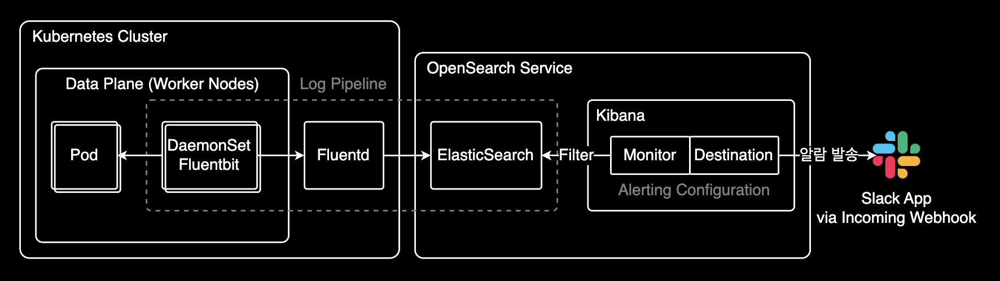
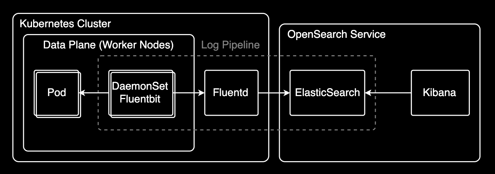
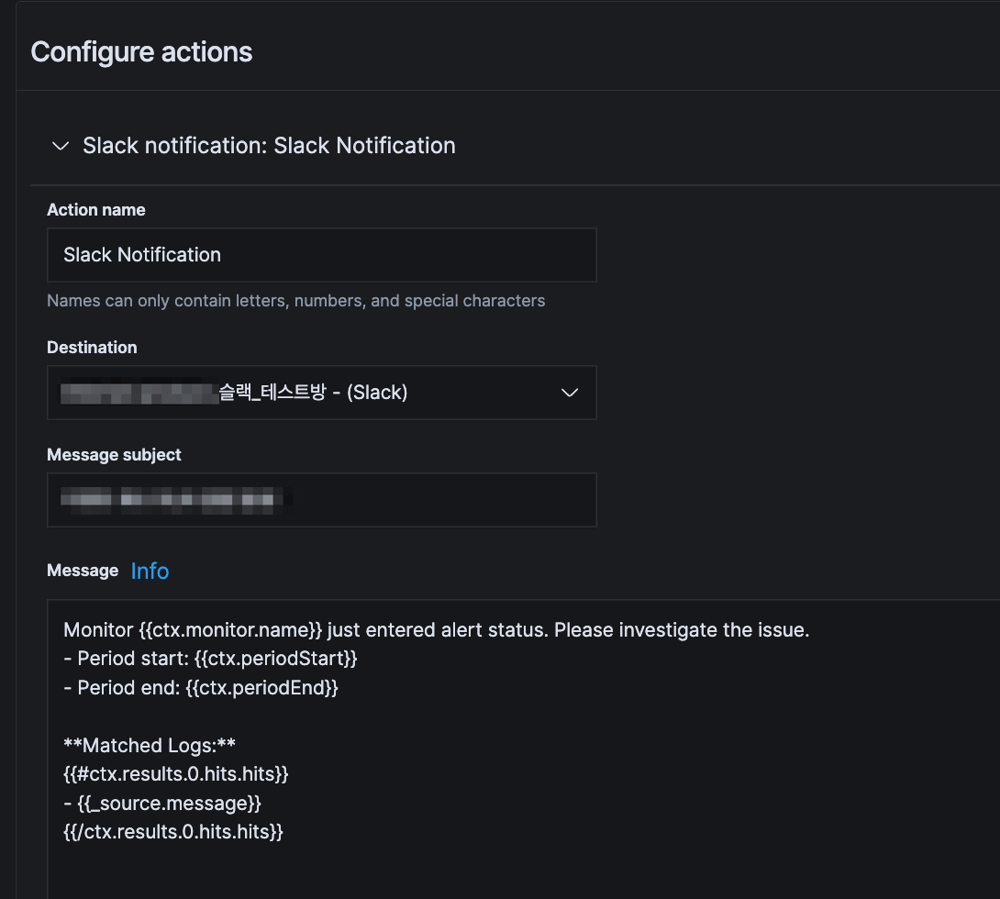

## 개요

OpenSearch 7.9 버전의 Kibana에서 Alerting을 설정하는 방법을 다룹니다. 특정 로그 패턴이 감지되면 자동으로 알림을 받을 수 있습니다.



## 배경

Kibana 7.11 버전(2021년 2월 출시)부터 Alerting 기능이 정식으로 GA(Generally Available)되었습니다. Kibana 7.2에서 베타로 처음 도입된 지 **9개월 만**에 이룬 성과입니다. 이로써 프로덕션 환경에서도 안정적으로 로그 기반 알림을 사용할 수 있게 되었습니다.

자세한 내용은 [What's new in Kibana 7.11.0: Alerting is now generally available](https://www.elastic.co/blog/whats-new-kibana-7-11-0-alerting-generally-available)에서 확인할 수 있습니다.

## 환경

- OpenSearch 7.9
- Kubernetes 클러스터
- Fluentd/Fluent Bit (로그 수집기)
- EFK 스택 (Elasticsearch, Fluentd, Kibana)

## EFK 스택이란?

EFK는 로그 수집, 저장, 분석을 위한 오픈소스 스택입니다:

- **Elasticsearch**: 로그 데이터를 저장하고 검색하는 분산 검색 엔진
- **Fluentd**: Kubernetes 클러스터에서 로그를 수집하여 Elasticsearch로 전송하는 로그 수집기
- **Kibana**: Elasticsearch에 저장된 로그를 시각화하고 분석하는 웹 UI

### 동작 방식



1. 각 노드의 Fluent Bit(DaemonSet)이 컨테이너 로그를 실시간 수집
2. 수집된 로그를 중앙의 Fluentd로 전송
3. Fluentd가 로그를 가공/필터링하여 Elasticsearch 클러스터에 인덱싱
4. Kibana를 통해 로그 검색, 시각화, 알림 설정

EFK 스택을 활용하면 분산 환경의 로그를 중앙에서 통합 관리할 수 있습니다.

## Alert 생성하기

### 1. Alert 기본 정보 설정

Kibana의 **Alerting > Monitors** 메뉴에서 새 모니터를 생성합니다.

- **Monitor name**: `backend-critical-exception-alert`
- **Monitor type**: Per query monitor
- **Schedule**: Every 5 minutes (필요에 따라 조정)

### 2. 데이터 소스 정의

검색할 인덱스 패턴을 지정합니다:

```text
logstash-*
```

### 3. 쿼리 조건 작성

아래 쿼리는 다음 조건을 모두 만족하는 로그를 찾습니다:

- 컨테이너 이름이 `my-backend`
- 메시지에 특정 문구 포함
- 최근 20분 이내 발생

```json
{
    "query": {
        "bool": {
            "must": [
                {
                    "match": {
                        "kubernetes.container_name": {
                            "query": "my-backend",
                            "operator": "OR",
                            "prefix_length": 0,
                            "max_expansions": 50,
                            "fuzzy_transpositions": true,
                            "lenient": false,
                            "zero_terms_query": "NONE",
                            "auto_generate_synonyms_phrase_query": true,
                            "boost": 1
                        }
                    }
                },
                {
                    "match_phrase": {
                        "message": {
                            "query": "[BACKEND] Critical Exception 알림",
                            "slop": 0,
                            "zero_terms_query": "NONE",
                            "boost": 1
                        }
                    }
                },
                {
                    "range": {
                        "@timestamp": {
                            "from": "now-20m",
                            "to": "now",
                            "include_lower": true,
                            "include_upper": true,
                            "boost": 1
                        }
                    }
                }
            ],
            "adjust_pure_negative": true,
            "boost": 1
        }
    }
}
```

#### 쿼리 구조 설명

**컨테이너 필터링**

```json
{
  "match": {
    "kubernetes.container_name": {
      "query": "my-backend"
    }
  }
}
```

특정 Kubernetes 컨테이너의 로그만 모니터링합니다.

**메시지 패턴 매칭**

```json
{
  "match_phrase": {
    "message": {
      "query": "[BACKEND] Critical Exception 알림"
    }
  }
}
```

`match_phrase`는 구문 일치 검색으로, 지정한 단어들이 정확히 같은 순서로 나타나는 로그만 매칭합니다. 예를 들어:

- `[BACKEND] Critical Exception 알림` → 매칭
- `Critical Exception [BACKEND] 알림` → 매칭 안됨 (단어 순서가 다름)
- `[BACKEND] Exception 알림` → 매칭 안됨 (단어 누락)

반면 `match`를 사용하면 단어 순서와 관계없이 포함 여부만 확인합니다. 정확한 로그 패턴을 감지하려면 `match_phrase`를 사용하는 것이 좋습니다.

**시간 범위 제한**

```json
{
  "range": {
    "@timestamp": {
      "from": "now-20m",
      "to": "now"
    }
  }
}
```

최근 20분 이내의 로그만 검색합니다.

> ⚠️ **주의**: `now-20m`으로 설정한 이유는 파드에서 발생한 로그가 Fluentd를 통해 Elasticsearch에 수집되기까지 지연이 발생하기 때문입니다. 시간 범위를 너무 짧게 설정하면 로그 수집 지연으로 인해 패턴을 놓쳐서 알림이 발송되지 않는 문제가 발생할 수 있습니다. 반대로 너무 길게 설정하면 중복 알림이 발생할 수 있으므로, 자신의 인프라 환경에서 로그 수집 지연 시간을 측정하여 최적값을 찾아야 합니다.

### 4. Trigger 조건 설정

쿼리 결과가 몇 건 이상일 때 알림을 보낼지 정의합니다:

```text
ctx.results[0].hits.total.value > 0
```

위 쿼리 조건(컨테이너명, 메시지 패턴, 시간 범위)을 모두 만족하는 로그가 1건이라도 발견되면 알림이 발송됩니다.

### 5. Action 설정

알림을 받을 방법을 설정합니다.

먼저 **Destination**을 생성해야 합니다. Destination은 알림을 받을 채널(Slack, 이메일, 웹훅 등)을 미리 등록해두는 곳입니다. Kibana의 **Alerting > Destinations** 메뉴에서 Slack Webhook URL을 등록한 후, Monitor 설정에서 해당 Destination을 선택할 수 있습니다.

알림 발송 템플릿인 Message는 Mustache 문법으로 작성합니다.

**Slack 예시**



**Slack 메시지 템플릿 (Mustache 문법)**

Action 설정 화면의 Message 필드에 다음 템플릿을 입력합니다:

```text
Monitor {{ctx.monitor.name}} just entered alert status. Please investigate the issue.
- Period start: {{ctx.periodStart}}
- Period end: {{ctx.periodEnd}}

**Matched Logs:**
{{#ctx.results.0.hits.hits}}
- {{_source.message}}
{{/ctx.results.0.hits.hits}}
```

## 실전 팁

### 알림 피로도 줄이기

빈번한 알림으로 인한 피로도를 줄이려면:

```json,hl_lines=4
{
  "range": {
    "@timestamp": {
      "from": "now-5m",
      "to": "now"
    }
  }
}
```

쿼리의 `@timestamp` 시간 범위를 모니터 실행 주기와 동일하게 설정하면 중복 알림을 줄일 수 있습니다. 예를 들어 모니터가 5분마다 실행된다면 `now-5m`으로 설정하는 방식입니다. 하지만 이 경우 로그 수집 지연으로 인해 알림을 놓칠 위험이 있으므로, 모니터 실행 주기보다 여유있게 설정하는 것을 권장합니다.

### 여러 조건 조합하기

OR 조건으로 여러 에러 패턴을 감지:

```json,hl_lines=15
{
  "bool": {
    "should": [
      {
        "match_phrase": {
          "message": "OutOfMemoryError"
        }
      },
      {
        "match_phrase": {
          "message": "Connection timeout"
        }
      }
    ],
    "minimum_should_match": 1
  }
}
```

### 심각도별 임계값 설정

로그 발생 건수에 따라 다른 액션 실행:

- 1~5건: 정보성 알림 (이메일)
- 6~10건: 경고 알림 (Slack)
- 11건 이상: 긴급 알림 (PagerDuty)

## 트러블슈팅

### 알림이 오지 않을 때

1. **쿼리 테스트**: Kibana Discover에서 직접 쿼리를 실행해 결과가 나오는지 확인
2. **시간 동기화**: Elasticsearch 노드의 시간이 동기화되어 있는지 확인
3. **인덱스 패턴**: 로그가 실제로 저장되는 인덱스 이름과 일치하는지 확인

### 너무 많은 알림이 올 때

1. **시간 범위 축소**: `now-20m`을 `now-5m`으로 변경
2. **임계값 상향**: `> 0`을 `> 10`으로 변경
3. **중복 제거**: 동일한 메시지를 그룹화하는 aggregation 쿼리 사용

## 관련 문서

- [OpenSearch Alerting Documentation](https://opensearch.org/docs/latest/monitoring-plugins/alerting/)
- [Elasticsearch Query DSL](https://www.elastic.co/guide/en/elasticsearch/reference/7.9/query-dsl.html)
