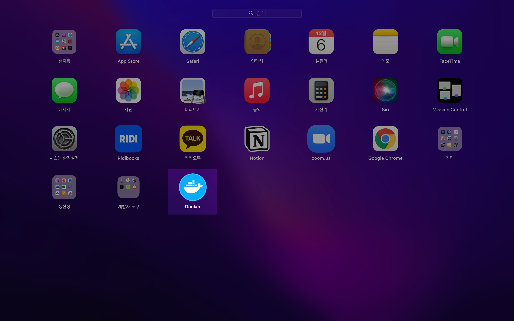
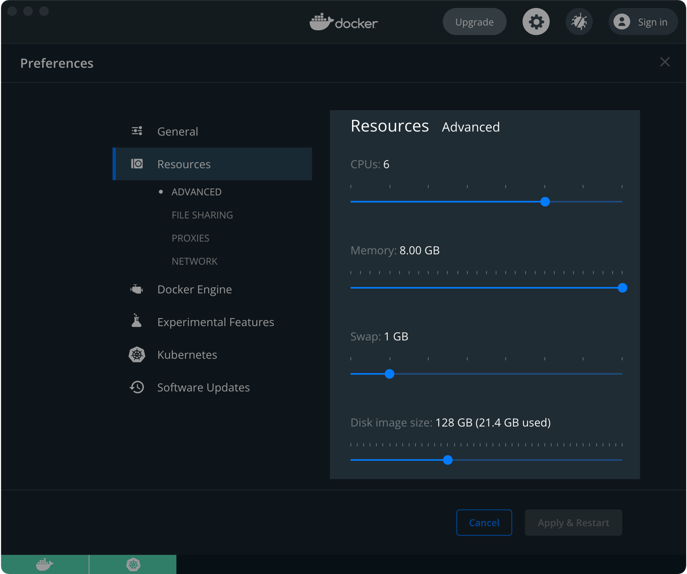

## 개요

macOS 환경에서 kind를 설치한 후 간편하게 로컬 쿠버네티스 환경을 구축할 수 있습니다.

&nbsp;

## 배경지식

### kind

[kind](https://kind.sigs.k8s.io/)는 Kubernetes IN Docker의 줄임말로 도커 컨테이너를 이용해 손쉽게 로컬 환경에서 kubernetes 클러스터를 구축할 수 있는 소프트웨어입니다.


`kind`와 유사한 오픈소스로는 [minikube](https://kubernetes.io/ko/docs/tutorials/hello-minikube/), [k3s](https://k3s.io/)가 있습니다. 로컬 환경에서 쿠버네티스 관련 개발하거나 쿠버네티스 클러스터 실습이 필요할 경우 kind를 이용하면 간편하고 빠르게 확인할 수 있습니다.

&nbsp;

### kind 아키텍쳐

[kind의 아키텍처](https://kind.sigs.k8s.io/docs/design/initial/)는 다음과 같습니다.


kind가 생성한 1대의 쿠버네티스 노드는 알고보면 1개의 도커 컨테이너입니다.

&nbsp;

## 환경

### 로컬 환경

- **Hardware** : MacBook Pro (13", M1, 2020)
- **OS** : macOS Monterey 12.0.1
- **패키지 관리자** : Homebrew 3.3.6
- **docker desktop** 4.3.0 (`Docker version 20.10.11, build dea9396`) : 쿠버네티스 기능 활성화, 패키지 관리자 Homebrew를 사용해서 설치
- **kind** v0.11.1 : 패키지 관리자 Homebrew를 사용해서 설치
- **kubectl** v1.22.4 : 패키지 관리자 Homebrew를 사용해서 설치

&nbsp;

## 준비사항

macOS용 패키지 관리자인 [brew](https://brew.sh)가 미리 설치되어 있어야 합니다.

&nbsp;

## single node 클러스터 구성

### 1. docker desktop 설치

kind로 쿠버네티스 클러스터를 생성하려면 먼저 docker desktop이 설치되어 있어야 합니다.

docker desktop을 brew로 설치합니다.

```bash
$ brew install --cask docker
Running `brew update --preinstall`...
==> Auto-updated Homebrew!
Updated 2 taps (homebrew/core and homebrew/cask).
==> Updated Formulae
Updated 48 formulae.
==> Updated Casks
Updated 21 casks.

==> Downloading https://desktop.docker.com/mac/main/arm64/71786/Docker.dmg
######################################################################## 100.0%
==> Installing Cask docker
==> Moving App 'Docker.app' to '/Applications/Docker.app'
==> Linking Binary 'docker-compose.bash-completion' to '/opt/homebrew/etc/bash_completion.d/docker-compose'
==> Linking Binary 'docker.zsh-completion' to '/opt/homebrew/share/zsh/site-functions/_docker'
==> Linking Binary 'docker.fish-completion' to '/opt/homebrew/share/fish/vendor_completions.d/docker.fish'
==> Linking Binary 'docker-compose.fish-completion' to '/opt/homebrew/share/fish/vendor_completions.d/docker-compose.f
==> Linking Binary 'docker-compose.zsh-completion' to '/opt/homebrew/share/zsh/site-functions/_docker_compose'
==> Linking Binary 'docker.bash-completion' to '/opt/homebrew/etc/bash_completion.d/docker'
🍺  docker was successfully installed!
```

패키지 관리자인 Homebrew로 도커를 설치할 때 `--cask` 옵션을 줘서 GUI 환경에서 docker desktop을 설치합니다.

&nbsp;

```bash
$ brew info docker
Warning: Treating docker as a formula. For the cask, use homebrew/cask/docker
docker: stable 20.10.11 (bottled), HEAD
Pack, ship and run any application as a lightweight container
https://www.docker.com/
Conflicts with:
  docker-completion (because docker already includes these completion scripts)
Not installed
From: https://github.com/Homebrew/homebrew-core/blob/HEAD/Formula/docker.rb
License: Apache-2.0
==> Dependencies
Build: go ✘, go-md2man ✘
==> Options
--HEAD
	Install HEAD version
==> Analytics
install: 52,619 (30 days), 154,260 (90 days), 509,552 (365 days)
install-on-request: 52,245 (30 days), 153,216 (90 days), 503,828 (365 days)
build-error: 4 (30 days)
```

docker 안정화 버전(`stable`) `20.10.11`이 설치된 상태입니다.

&nbsp;



런치패드에서 확인해보면 Docker가 새로 생성된 걸 알 수 있습니다.  

&nbsp;

### 2. kind 설치

#### 설치

kind도 docker desktop과 동일하게 brew를 이용해 최신버전을 설치합니다.

```bash
$ brew install kind
Running `brew update --preinstall`...
==> Auto-updated Homebrew!
Updated 1 tap (homebrew/core).
==> Updated Formulae
Updated 2 formulae.

==> Downloading https://ghcr.io/v2/homebrew/core/kind/manifests/0.11.1
######################################################################## 100.0%
==> Downloading https://ghcr.io/v2/homebrew/core/kind/blobs/sha256:836dda92f4ab17324edd3ebc8614fb84a55923388df87dc2be4
==> Downloading from https://pkg-containers.githubusercontent.com/ghcr1/blobs/sha256:836dda92f4ab17324edd3ebc8614fb84a
######################################################################## 100.0%
==> Pouring kind--0.11.1.arm64_monterey.bottle.tar.gz
==> Caveats
zsh completions have been installed to:
  /opt/homebrew/share/zsh/site-functions
==> Summary
🍺  /opt/homebrew/Cellar/kind/0.11.1: 8 files, 8.4MB
==> Running `brew cleanup kind`...
Disable this behaviour by setting HOMEBREW_NO_INSTALL_CLEANUP.
Hide these hints with HOMEBREW_NO_ENV_HINTS (see `man brew`)
```

&nbsp;

#### 버전 확인

설치된 kind의 버전을 확인합니다.

```bash
$ kind version
kind v0.11.1 go1.17.2 darwin/arm64
```

&nbsp;

### 3. kubectl 설치

```bash
$ brew install kubectl
```

homebrew 패키지 관리자를 이용해 kubectl을 설치합니다.

&nbsp;

```bash
$ kubectl version
Client Version: version.Info{Major:"1", Minor:"22", GitVersion:"v1.22.4", GitCommit:"b695d79d4f967c403a96986f1750a35eb75e75f1", GitTreeState:"clean", BuildDate:"2021-11-17T15:41:42Z", GoVersion:"go1.16.10", Compiler:"gc", Platform:"darwin/arm64"}
Server Version: version.Info{Major:"1", Minor:"21", GitVersion:"v1.21.1", GitCommit:"5e58841cce77d4bc13713ad2b91fa0d961e69192", GitTreeState:"clean", BuildDate:"2021-05-21T23:06:30Z", GoVersion:"go1.16.4", Compiler:"gc", Platform:"linux/arm64"}
```

`kubectl` 명령어의 동작 상태를 확인하기 위해 version을 체크합니다.

&nbsp;

### 4. cluster 생성

`kind`로 쿠버네티스 클러스터를 생성합니다.

```bash
$ kind create cluster
Creating cluster "kind" ...
 ✓ Ensuring node image (kindest/node:v1.21.1) 🖼
 ✓ Preparing nodes 📦
 ✓ Writing configuration 📜
 ✓ Starting control-plane 🕹️
 ✓ Installing CNI 🔌
 ✓ Installing StorageClass 💾
Set kubectl context to "kind-kind"
You can now use your cluster with:

kubectl cluster-info --context kind-kind

Have a question, bug, or feature request? Let us know! https://kind.sigs.k8s.io/#community 🙂
```

쿠버네티스 클러스터를 생성할 때 이름을 따로 지정해주지 않으면 기본값으로 `kind`라는 이름으로 생성됩니다.

&nbsp;

클러스터를 생성할 때 `--name` 옵션을 사용해서 클러스터 이름을 지정할 수 있습니다.

```bash
$ kind create cluster --name kind-2
Creating cluster "kind-2" ...
 ✓ Ensuring node image (kindest/node:v1.21.1) 🖼
 ✓ Preparing nodes 📦
 ✓ Writing configuration 📜
 ✓ Starting control-plane 🕹️
 ✓ Installing CNI 🔌
 ✓ Installing StorageClass 💾
Set kubectl context to "kind-kind-2"
You can now use your cluster with:

kubectl cluster-info --context kind-kind-2

Have a nice day! 👋
```

이번에는 `kind-2` 라는 이름으로 지정해서 클러스터를 생성합니다.

&nbsp;

### 5. cluster 목록 확인

`kind`로 생성한 클러스터 목록을 확인합니다.

``` bash
$ kind get clusters
kind
kind-2
```

처음에 생성한 `kind` 클러스터, 이후 생성한 `kind-2` 클러스터가 존재합니다.

&nbsp;

### 6. 조작할 cluster 변경

`kind-kind-2` 클러스터를 조작하기 위해서는 context를 `kind-kind-2`로 변경합니다.

``` bash
kubectl cluster-info --context kind-kind-2
```

```bash
Kubernetes control plane is running at https://127.0.0.1:61332
CoreDNS is running at https://127.0.0.1:61332/api/v1/namespaces/kube-system/services/kube-dns:dns/proxy

To further debug and diagnose cluster problems, use 'kubectl cluster-info dump'.
```

&nbsp;

이제 현재 context 상태를 확인합니다.

``` bash
$ kubectl config get-contexts
CURRENT   NAME             CLUSTER          AUTHINFO         NAMESPACE
          docker-desktop   docker-desktop   docker-desktop
          kind-kind        kind-kind        kind-kind
*         kind-kind-2      kind-kind-2      kind-kind-2
```

현재 context 값이 `kind-kind-2`로 변경되었습니다.

&nbsp;

### 7. 클러스터 상태 확인

#### node 상태 확인

```bash
$ kubectl get node
NAME                   STATUS   ROLES                  AGE   VERSION
kind-2-control-plane   Ready    control-plane,master   64s   v1.21.1
```

1대의 control-plane(`kind-2-control-plane`)이 생성되었습니다.

현재 이 노드의 상태는 정상 동작중(`Ready`)입니다.

&nbsp;

#### pod 상태 확인

현재 클러스터에서 전체 파드 목록을 확인합니다.

```bash
$ kubectl get pod -A
NAMESPACE            NAME                                           READY   STATUS    RESTARTS   AGE
kube-system          coredns-558bd4d5db-4v54r                       1/1     Running   0          76s
kube-system          coredns-558bd4d5db-6dsqk                       1/1     Running   0          76s
kube-system          etcd-kind-2-control-plane                      1/1     Running   0          88s
kube-system          kindnet-cwbkv                                  1/1     Running   0          77s
kube-system          kube-apiserver-kind-2-control-plane            1/1     Running   0          88s
kube-system          kube-controller-manager-kind-2-control-plane   1/1     Running   0          88s
kube-system          kube-proxy-6nkmp                               1/1     Running   0          77s
kube-system          kube-scheduler-kind-2-control-plane            1/1     Running   0          88s
local-path-storage   local-path-provisioner-547f784dff-266sv        1/1     Running   0          76s
```

`kube-system` 네임스페이스에 위치하는 파드들은 클러스터가 동작하는 데 필요한 필수 파드들입니다.

모든 Pod가 정상적으로 동작중(`Running`)인 상태입니다.

&nbsp;

### 8. 클러스터 삭제

```bash
$ kind delete cluster
Deleting cluster "kind" ...
```

클러스터 삭제시 `--name <클러스터 이름>` 옵션으로 클러스터 이름을 지정해주지 않으면, 기본 클러스터인 `kind`를 삭제하게 됩니다.

&nbsp;

```bash
$ kind get clusters
kind-2
```

`kind-2` 클러스터는 아직 남아있습니다.

&nbsp;

이제 `kind-2` 클러스터도 삭제합니다.

```bash
$ kind delete cluster --name kind-2
Deleting cluster "kind-2" ...
```

&nbsp;

`kind-2` 클러스터 삭제 후 다시 클러스터 목록을 확인합니다.

```bash
$ kind get clusters
No kind clusters found.
```

`kind`와 `kind-2` 클러스터를 모두 삭제했기 때문에 조회 결과는 없다.  

&nbsp;

## 더 나아가서

### multi node 클러스터 구성

#### 생성

멀티노드는 단일 노드가 아닌 여러 대의 노드가 구성된 클러스터 환경을 의미합니다.

&nbsp;

멀티노드 운영을 위해서는 호스트 환경의 리소스(CPU, Memory)가 많이 필요하기 때문에, 클러스터 생성 전에 미리 Docker deskop의 리소스 할당량(Resources)을 늘려야 합니다.

macOS 또는 Windows에서 Kubernetes를 빌드하는 경우 Docker 엔진을 실행하는 가상 머신(VM) 전용으로 최소 6GB의 RAM이 필요합니다. 메모리 권장 할당량은 8GB입니다.



자세한 사항은 [kind 공식문서](https://kind.sigs.k8s.io/docs/user/quick-start/#settings-for-docker-desktop)를 참고하세요.

&nbsp;

#### yaml 작성

쿠버네티스 클러스터 설정이 담긴 yaml 파일을 작성한다.

```bash
$ cat << EOF > kind-multi-node-clusters.yaml
---
# three node (two workers) cluster config
kind: Cluster
apiVersion: kind.x-k8s.io/v1alpha4
nodes:
- role: control-plane
- role: worker
- role: worker
EOF
```

클러스터 구성은 1대의 control-plane + 2대의 worker node 이다.

&nbsp;

#### 클러스터 생성

작성한 클러스터 yaml 파일을 적용하여 클러스터를 생성한다.

```bash
$ kind create cluster \
    --config kind-multi-node-clusters.yaml \
    --name multinode
```

미리 작성한 매니페스트 파일(`.yaml`)을 사용해서 클러스터를 생성할 때에는 `--config <설정파일 이름>` 옵션을 사용하면 된다.

&nbsp;

클러스터 생성이 완료되는 데에 약 1분 정도 소요된다.

```bash
$ kind create cluster \
    --config kind-multi-node-clusters.yaml \
    --name multinode
```

```bash
Creating cluster "multinode" ...
 ✓ Ensuring node image (kindest/node:v1.21.1) 🖼
 ✓ Preparing nodes 📦 📦 📦
 ✓ Writing configuration 📜
 ✓ Starting control-plane 🕹️
 ✓ Installing CNI 🔌
 ✓ Installing StorageClass 💾
 ✓ Joining worker nodes 🚜
Set kubectl context to "kind-multinode"
You can now use your cluster with:

kubectl cluster-info --context kind-multinode

Thanks for using kind! 😊
```

&nbsp;

`multinode` 클러스터 생성이 완료되면 자동적으로 context가 새로 생성된 클러스터로 변경된다.

```bash
$ kubectl config current-context
kind-multinode
```

현재 위치한 context는 `kind-multinode`이다.

&nbsp;

#### 노드 확인

```bash
$ kubectl get node
NAME                      STATUS   ROLES                  AGE     VERSION
multinode-control-plane   Ready    control-plane,master   4m32s   v1.21.1
multinode-worker          Ready    <none>                 4m2s    v1.21.1
multinode-worker2         Ready    <none>                 4m1s    v1.21.1
```

3대의 노드 상태가 모두 정상 동작중(`Ready`)이다.

- ROLES 값에 `control-plane,master`가 있으면 Master Node다.
- ROLES 값이 `<none>`이면 Worker Node다.
- 물론 `NAME`에 붙은 control-plane과 worker로도 구분 가능하다.

&nbsp;

### 리소스 정리

멀티노드 클러스터 실습이 끝났다면 클러스터 환경을 정리<sup>clean-up</sup>한다.  

kind 클러스터 전체 목록을 확인한다.

```bash
$ kind get clusters
kind
multinode
```

&nbsp;

`multinode` 클러스터를 삭제한다.

```bash
$ kind delete cluster --name multinode
Deleting cluster "multinode" ...
```

&nbsp;

`multinode` 클러스터가 삭제되었다.

```bash
$ kind get clusters
kind
```

&nbsp;

## 결론

멀티노드 실습을 마지막으로 kind의 설치 및 사용법에 대한 포스팅을 마치겠다.  

&nbsp;

## 주의사항

### M1 호환성 문제

2021년 12월 6일 기준으로 Apple Silicon<sup>M1</sup>이 탑재된 맥북은 아직 출시된 지 얼마 지나지 않아서 호환성이 박살난 상태로, Virtual Box 설치를 지원하지 않아 쿠버네티스 실습을 하는 데에 제한이 있다.

만약 macOS에서 docker 컨테이너가 아닌 virtualbox 환경과 같은 가상화 클러스터로 구성하고 싶다면 macOS 전용 하이퍼바이저인 hyperkit을 활용하도록 하자.  

나도 여러 방면에서 kubernetes 구축 방법을 찾아보고 있지만 버그와 아직 막막한 M1의 호환성에 막혀 절망하고 있는 중이다.  
M1 호환성 문제는 시간이 차차 해결해줄 거라고 예상한다.

&nbsp;

## 참고자료

[kind 공식 Quick Start 가이드 문서](https://kind.sigs.k8s.io/docs/user/quick-start/)
