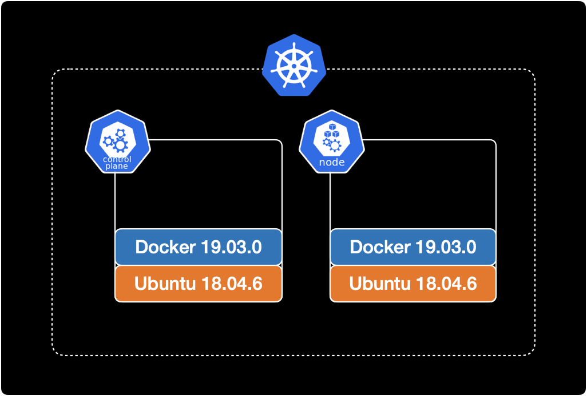
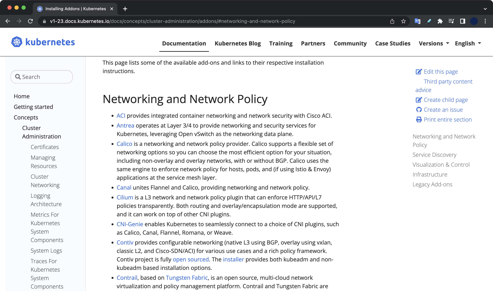
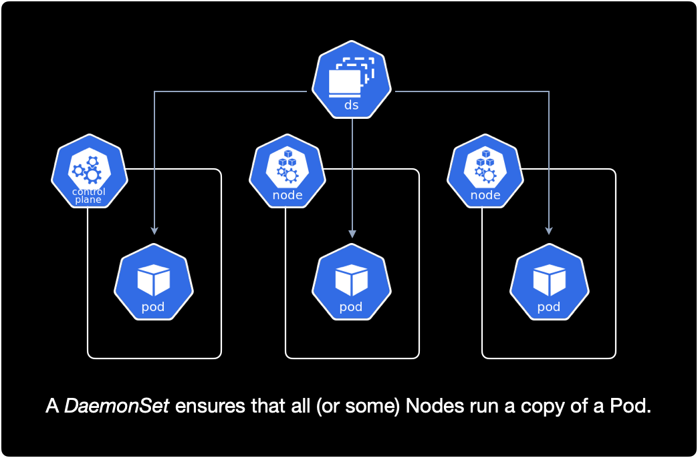

## 개요

온프레미스 환경에서 `kubeadm`을 사용해서 쿠버네티스 클러스터를 처음부터 구성하는 방법을 소개합니다.

`kubeadm`은 쿠버네티스에서 제공하는 기본적인 클러스터 구성 도구이며, kubernetes 클러스터를 가장 빨리 구축하기 위한 다양한 기능을 제공합니다.  
`kubeadm` 외에 다른 클러스터 구성 도구로 `kubespray`, `kops` 등이 있습니다.

&nbsp;

## 환경

### 클러스터 구성

v1.23 버전의 쿠버네티스 클러스터를 구성합니다.  
클러스터의 전체 노드는 총 2대이며 컨트롤 플레인 노드 1대, 워커 노드 1대 구성입니다.



&nbsp;

### 운영체제

모든 노드의 운영체제는 동일하게 `Ubuntu 18.04.6 LTS`을 사용합니다.

```bash
$ cat /etc/os-release
NAME="Ubuntu"
VERSION="18.04.6 LTS (Bionic Beaver)"
ID=ubuntu
ID_LIKE=debian
PRETTY_NAME="Ubuntu 18.04.6 LTS"
```

&nbsp;

### 도커

모든 노드에 도커 `19.03.0`가 미리 설치되어 있는 상태입니다.

```bash
$ docker version
Client: Docker Engine - Community
 Version:           19.03.0
 API version:       1.40
 Go version:        go1.12.5
 Git commit:        aeac949
 Built:             Wed Jul 17 18:15:07 2019
 OS/Arch:           linux/amd64
 Experimental:      false

Server: Docker Engine - Community
 Engine:
  Version:          19.03.0
  API version:      1.40 (minimum version 1.12)
  Go version:       go1.12.5
  Git commit:       aeac949
  Built:            Wed Jul 17 18:13:43 2019
  OS/Arch:          linux/amd64
  Experimental:     false
 containerd:
  Version:          1.4.4
  GitCommit:        05f951a3781f4f2c1911b05e61c160e9c30eaa8e
 runc:
  Version:          1.0.0-rc93
  GitCommit:        12644e614e25b05da6fd08a38ffa0cfe1903fdec
 docker-init:
  Version:          0.18.0
  GitCommit:        fec3683
```

만약 도커가 설치되어 있지 않다면 모든 노드에 미리 도커 설치가 필요합니다.

쿠버네티스 v1.23에서 지원하는 CRI 리스트와 설치방법은 [쿠버네티스 공식문서](https://v1-23.docs.kubernetes.io/docs/setup/production-environment/container-runtimes/)에서 확인할 수 있습니다.

&nbsp;

## 전제조건

- 가상머신(VM) 또는 온프레미스 데이터센터 기반 물리 서버 환경
- OS와 Docker Engine이 설치 완료된 2대 이상의 machine

이 글에서 CRI<sup>Container Runtime Interface</sup>로 사용하는 Docker Engine 설치 과정은 생략합니다.  
모든 노드에 Docker Engine이 미리 설치 완료된 상태여야 합니다.

&nbsp;

## 클러스터 생성하기

### 1. 노드 셋업

#### netfilter 설정

모든 컨트롤 플레인과 워커 노드의 커널에서 netfilter 기능을 활성화 합니다.  
Linux 운영체제의 방화벽인 iptables가 브릿지된 트래픽을 볼 수 있도록 해주는 설정입니다.

```bash
$ cat << EOF | sudo tee /etc/modules-load.d/k8s.conf
br_netfilter
EOF
```

```bash
$ cat << EOF | sudo tee /etc/sysctl.d/k8s.conf
net.bridge.bridge-nf-call-ip6tables = 1
net.bridge.bridge-nf-call-iptables = 1
EOF
```

&nbsp;

`sysctl --system`은 `.conf`로 끝나는 모든 시스템 설정 파일을 읽고 설정을 적용합니다.

```bash
$ sudo sysctl --system
```

위 명령어를 실행하면 netfilter 설정 과정에서 새로 생성했던 `k8s.conf` 설정을 읽고 커널에 적용합니다.

&nbsp;

실행 결과는 다음과 같이 나옵니다.

```bash
* Applying /etc/sysctl.d/10-console-messages.conf ...
kernel.printk = 4 4 1 7
* Applying /etc/sysctl.d/10-ipv6-privacy.conf ...
net.ipv6.conf.all.use_tempaddr = 2
net.ipv6.conf.default.use_tempaddr = 2
* Applying /etc/sysctl.d/10-kernel-hardening.conf ...
kernel.kptr_restrict = 1
* Applying /etc/sysctl.d/10-link-restrictions.conf ...
fs.protected_hardlinks = 1
fs.protected_symlinks = 1
* Applying /etc/sysctl.d/10-magic-sysrq.conf ...
kernel.sysrq = 176
* Applying /etc/sysctl.d/10-network-security.conf ...
net.ipv4.conf.default.rp_filter = 1
net.ipv4.conf.all.rp_filter = 1
net.ipv4.tcp_syncookies = 1
* Applying /etc/sysctl.d/10-ptrace.conf ...
kernel.yama.ptrace_scope = 1
* Applying /etc/sysctl.d/10-zeropage.conf ...
vm.mmap_min_addr = 65536
* Applying /usr/lib/sysctl.d/50-default.conf ...
net.ipv4.conf.all.promote_secondaries = 1
net.core.default_qdisc = fq_codel
* Applying /etc/sysctl.d/99-sysctl.conf ...
* Applying /etc/sysctl.d/k8s.conf ...
net.bridge.bridge-nf-call-ip6tables = 1
net.bridge.bridge-nf-call-iptables = 1
* Applying /etc/sysctl.conf ...
```

&nbsp;

마지막 라인 부근에서 `k8s.conf` 설정파일을 적용한 걸 확인할 수 있습니다.

```bash
* Applying /etc/sysctl.d/k8s.conf ...
net.bridge.bridge-nf-call-ip6tables = 1
net.bridge.bridge-nf-call-iptables = 1
```

&nbsp;

#### 쿠버네티스 패키지 설치

모든 머신에 다음 패키지들을 설치해야 합니다. 각 패키지의 역할은 다음과 같습니다.

- **kubeadm**: 클러스터를 초기 생성하고 부트스트랩하는 CLI 도구입니다.
- **kubelet**: 클러스터의 모든 머신에서 실행되는 파드와 컨테이너 생성과 같은 작업을 수행하는 컴포넌트입니다.
- **kubectl**: 클러스터와 통신하기 위한 CLI 도구입니다.

**Alert**  
쿠버네티스 클러스터 구성을 도와주는 도구인 `kubeadm`은 기본적으로 `kubelet`을 배포하지 않기 때문에 `kubelet` 설치가 추가로 필요합니다.

&nbsp;

**중요**  
클러스터를 구성할 모든 컨트롤 플레인과 워커노드에서 `kubelet`, `kubeadm`, `kubectl`을 설치해줍니다.  

```bash
# [1/4]
# Update the apt package index and
# install packages needed to use the Kubernetes apt repository.
$ sudo apt-get update
$ sudo apt-get install -y apt-transport-https ca-certificates curl

# [2/4]
# Download the Google Cloud public signing key.
$ sudo curl -fsSLo /usr/share/keyrings/kubernetes-archive-keyring.gpg https://packages.cloud.google.com/apt/doc/apt-key.gpg

# [3/4]
# Add the Kubernetes apt repository.
$ echo "deb [signed-by=/usr/share/keyrings/kubernetes-archive-keyring.gpg] https://apt.kubernetes.io/ kubernetes-xenial main" | sudo tee /etc/apt/sources.list.d/kubernetes.list

# [4/4]
# Update apt package index, install kubelet, kubeadm and kubectl, and pin their version.
$ sudo apt-get update
$ sudo apt-get install -y kubelet=1.23.0-00 kubeadm=1.23.0-00 kubectl=1.23.0-00
$ sudo apt-mark hold kubelet kubeadm kubectl
```

&nbsp;

모든 설치 과정이 끝난 후 컨트롤 플레인과 워커 노드에서 kubelet 버전을 확인합니다.

```bash
$ kubelet --version
Kubernetes v1.23.0
```

kubelet의 경우 `1.23.0-00` 버전으로 설치했습니다.

&nbsp;

### 2. 클러스터 생성 (kubeadm init)

컨트롤 플레인 노드에서 `kubeadm`을 사용해 클러스터 초기화를 실행합니다.

&nbsp;

먼저 컨트롤 플레인 노드의 메인 IP를 확인합니다.

```bash
$ ifconfig eth0
eth0: flags=4163<UP,BROADCAST,RUNNING,MULTICAST>  mtu 1450
        inet 10.24.126.9  netmask 255.255.255.0  broadcast 10.24.126.255
        ether 02:42:0a:18:7e:09  txqueuelen 0  (Ethernet)
        RX packets 3367  bytes 435041 (435.0 KB)
        RX errors 0  dropped 0  overruns 0  frame 0
        TX packets 2964  bytes 905989 (905.9 KB)
        TX errors 0  dropped 0 overruns 0  carrier 0  collisions 0
```

컨트롤 플레인의 eth0의 IP 주소는 `10.24.126.9`입니다.  
확인된 IP 주소를 `--apiserver-advertise-address` 옵션에 넣습니다.

&nbsp;

`kubeadm init` 명령어의 자세한 옵션 설명은 [Kubernetes 공식문서 v1.23](https://v1-23.docs.kubernetes.io/docs/setup/production-environment/tools/kubeadm/create-cluster-kubeadm/#initializing-your-control-plane-node)을 참고합니다.

여기서 `--apiserver-advertise-address`는 그대로 적용하면 안되고, 자신의 환경에 맞게 컨트롤 플레인의 IP 주소로 변경해서 실행해야 합니다.

```bash
$ kubeadm init \
    --apiserver-cert-extra-sans=controlplane \
    --apiserver-advertise-address 10.24.126.9 \
    --pod-network-cidr=10.244.0.0/16
```

컨트롤 플레인의 초기화 단계<sup>initializing</sup>는 5분 이상 걸리므로 진행중인 로그를 모니터링하면서 기다립니다.

&nbsp;

컨트롤 플레인의 초기화가 완료된 후 메세지입니다.

```bash
...
Your Kubernetes control-plane has initialized successfully!

To start using your cluster, you need to run the following as a regular user:

  mkdir -p $HOME/.kube
  sudo cp -i /etc/kubernetes/admin.conf $HOME/.kube/config
  sudo chown $(id -u):$(id -g) $HOME/.kube/config

Alternatively, if you are the root user, you can run:

  export KUBECONFIG=/etc/kubernetes/admin.conf

You should now deploy a pod network to the cluster.
Run "kubectl apply -f [podnetwork].yaml" with one of the options listed at:
  https://kubernetes.io/docs/concepts/cluster-administration/addons/

Then you can join any number of worker nodes by running the following on each as root:

kubeadm join 10.24.126.9:6443 --token xfory9.hvojv7qdubrd3nue \
        --discovery-token-ca-cert-hash sha256:96b45b1ddadab47d35c3a3a6f3d66fa6f262b96aca0545a2d3e7b82f1882c8f4 
```

위 결과값에서 중요한 정보 2개가 제공됩니다.

- **컨트롤 플레인에서 쿠버네티스 컨텍스트 등록하는 명령어** : `kubectl`을 사용하기 위해 필요합니다.
- `kubeadm join` **명령어** : 워커노드를 클러스터에 등록하기 위해 필요합니다. 토큰 값이 포함된 `kubeadm join ...` 명령어는 미리 복사해놓습니다.

&nbsp;

### 3. kubeconfig 등록

이후 `kubectl` 명령어를 사용하기 위해 kube config를 등록합니다.  
등록 방법은 터미널에 안내 출력되므로 그대로 복사해서 컨트롤 플레인에서 실행합니다.

```bash
  mkdir -p $HOME/.kube
  sudo cp -i /etc/kubernetes/admin.conf $HOME/.kube/config
  sudo chown $(id -u):$(id -g) $HOME/.kube/config
```

kubeconfig 등록이 완료되면 이제부터 `kubectl` 명령어를 사용할 수 있습니다.

&nbsp;

노드 리스트를 확인합니다.

```bash
$ kubectl get node
NAME           STATUS     ROLES                  AGE   VERSION
controlplane   NotReady   control-plane,master   10m   v1.23.0
```

노드 리스트가 조회됩니다.

- 현재 CNI가 완전히 구성된 상태가 아니기 때문에 `STATUS` 값이 NotReady인 것을 확인할 수 있습니다.
- 컨트롤 플레인의 쿠버네티스 버전이 `v1.23.0`입니다.
- 워커 노드를 클러스터에 추가해주는 작업이 추가로 필요합니다.

&nbsp;

### 4. 워커노드 join

이제 워커 노드를 클러스터에 추가해주는 작업이 필요합니다.  
워커 노드를 클러스터에 추가하려면 `kubeadm init`에 의해 자동 생성된 토큰을 이용해 등록해야 합니다.

컨트롤 플레인에서 토큰 목록을 확인합니다.

```bash
# On control plane node.
$ kubeadm token list
TOKEN                     TTL         EXPIRES                USAGES                   DESCRIPTION                                                EXTRA GROUPS
w9k6i4.9waxt6bdzne5kz32   23h         2022-08-19T09:56:41Z   authentication,signing   The default bootstrap token generated by 'kubeadm init'.   system:bootstrappers:kubeadm:default-node-token
xfory9.hvojv7qdubrd3nue   23h         2022-08-19T09:58:31Z   authentication,signing   The default bootstrap token generated by 'kubeadm init'.   system:bootstrappers:kubeadm:default-node-token
```

이전 과정에서 컨트롤 플레인을 초기화하면서 자동 생성된 bootstrap 토큰은 `xfory9.hvojv7qdubrd3nue` 입니다.  
토큰은 기본적으로 24시간의 유효기간을 갖습니다. 따라서 모든 워커 노드를 24시간 안에 모두 등록해야 합니다. (물론 `kubeadm init`을 통해 생성된 디폴트 토큰이 TTL 만료되었을 경우, 새 토큰을 생성해서 등록하면 됩니다.)

&nbsp;

워커 노드에 접속합니다.

```bash
# On worker node.
$ hostname
node01
```

&nbsp;

이전 과정에서 복사해놓은 클러스터 등록 명령어 `kubeadm join`를 그대로 실행합니다.

```bash
# On worker node.
$ kubeadm join 10.24.126.9:6443 --token xfory9.hvojv7qdubrd3nue \
          --discovery-token-ca-cert-hash sha256:96b45b1ddadab47d35c3a3a6f3d66fa6f262b96aca0545a2d3e7b82f1882c8f4
```

```bash
[preflight] Running pre-flight checks
[preflight] Reading configuration from the cluster...
[preflight] FYI: You can look at this config file with 'kubectl -n kube-system get cm kubeadm-config -o yaml'
W0818 10:12:17.061381   12710 utils.go:69] The recommended value for "resolvConf" in "KubeletConfiguration" is: /run/systemd/resolve/resolv.conf; the provided value is: /run/systemd/resolve/resolv.conf
[kubelet-start] Writing kubelet configuration to file "/var/lib/kubelet/config.yaml"
[kubelet-start] Writing kubelet environment file with flags to file "/var/lib/kubelet/kubeadm-flags.env"
[kubelet-start] Starting the kubelet
[kubelet-start] Waiting for the kubelet to perform the TLS Bootstrap...

This node has joined the cluster:
* Certificate signing request was sent to apiserver and a response was received.
* The Kubelet was informed of the new secure connection details.

Run 'kubectl get nodes' on the control-plane to see this node join the cluster.
```

&nbsp;

정상적으로 등록되었을 경우 마지막 메세지는 다음과 같습니다.

```bash
...
This node has joined the cluster:
* Certificate signing request was sent to apiserver and a response was received.
* The Kubelet was informed of the new secure connection details.

Run 'kubectl get nodes' on the control-plane to see this node join the cluster.
```

컨트롤 플레인으로 돌아가서 `kubectl get nodes` 명령어를 실행해서 결과를 확인하라고 안내해주고 있습니다.

&nbsp;

`exit` 명령어로 컨트롤 플레인으로 다시 돌아옵니다.

```bash
# On worker node.
$ exit
```

&nbsp;

컨트롤 플레인에서 노드 리스트를 다시 확인합니다.

```bash
$ kubectl get node
NAME           STATUS     ROLES                  AGE     VERSION
controlplane   NotReady   control-plane,master   20m     v1.23.0
node01         NotReady   <none>                 4m53s   v1.23.0
```

`node01`이 새로 추가된 걸 확인할 수 있습니다.  
아직 CNI를 설치하지 않아서 모든 노드가 `NotReady` 상태입니다.

&nbsp;

노드의 상태가 `NotReady`인 원인을 상세 분석해보겠습니다.  
컨트롤 플레인 노드의 상세 정보를 확인합니다.

```bash
$ kubectl describe node controlplane
...
Conditions:
  Type             Status  LastHeartbeatTime                 LastTransitionTime                Reason                       Message
  ----             ------  -----------------                 ------------------                ------                       -------
  MemoryPressure   False   Thu, 18 Aug 2022 10:15:04 +0000   Thu, 18 Aug 2022 09:56:39 +0000   KubeletHasSufficientMemory   kubelet has sufficient memory available
  DiskPressure     False   Thu, 18 Aug 2022 10:15:04 +0000   Thu, 18 Aug 2022 09:56:39 +0000   KubeletHasNoDiskPressure     kubelet has no disk pressure
  PIDPressure      False   Thu, 18 Aug 2022 10:15:04 +0000   Thu, 18 Aug 2022 09:56:39 +0000   KubeletHasSufficientPID      kubelet has sufficient PID available
  Ready            False   Thu, 18 Aug 2022 10:15:04 +0000   Thu, 18 Aug 2022 09:56:39 +0000   KubeletNotReady              container runtime network not ready: NetworkReady=false reason:NetworkPluginNotReady message:docker: network plugin is not ready: cni config uninitialized
```

정상적인 노드의 경우 `Ready` 값이 `True`입니다.  
그러나 현재 노드는 `Ready` 값이 `False`입니다. 원인은 `container runtime network not ready`라고 알려주고 있습니다.  
한마디로 모든 노드에 CNI 설치가 필요하다는 의미로 해석할 수 있습니다.

&nbsp;

### 5. CNI 설치

[쿠버네티스 공식문서 v1.23](https://v1-23.docs.kubernetes.io/docs/concepts/cluster-administration/addons/)에서 현재 쿠버네티스 버전 기준으로 사용할 수 있는 CNI 전체 리스트를 확인합니다.  



&nbsp;

모든 노드에서 사용할 수 있는 CNI 목록을 확인합니다.

```bash
$ ls /opt/cni/bin/
bandwidth  dhcp      flannel      host-local  loopback  portmap  sbr     tuning
bridge     firewall  host-device  ipvlan      macvlan   ptp      static  vlan
```

`flannel`이 존재합니다.

&nbsp;

이 시나리오에서는 CNI로 flannel을 설치해보겠습니다.  
CNI는 Daemonset을 사용해서 클러스터의 전체 노드에 Pod를 배포하는 원리입니다.



&nbsp;

컨트롤 플레인에서 데몬셋을 확인합니다.

```bash
$ kubectl get daemonset -A
NAMESPACE     NAME         DESIRED   CURRENT   READY   UP-TO-DATE   AVAILABLE   NODE SELECTOR            AGE
kube-system   kube-proxy   2         2         2       2            2           kubernetes.io/os=linux   32m
```

`kube-proxy` 외에는 데몬셋이 없습니다.

&nbsp;

CNI인 flannel을 설치합니다.

```bash
$ kubectl apply -f https://raw.githubusercontent.com/coreos/flannel/master/Documentation/kube-flannel.yml
```

설치 명령어는 [flannel 공식문서](https://github.com/flannel-io/flannel)를 참고했습니다.

&nbsp;

결과값은 다음과 같습니다.

```bash
namespace/kube-flannel created
clusterrole.rbac.authorization.k8s.io/flannel created
clusterrolebinding.rbac.authorization.k8s.io/flannel created
serviceaccount/flannel created
configmap/kube-flannel-cfg created
daemonset.apps/kube-flannel-ds created
```

`kube-flannel` 네임스페이스가 새로 생성되었습니다.  
해당 네임스페이스에 `kube-flannel-ds` 데몬셋이 배포되었습니다.

&nbsp;

컨트롤 플레인에서 전체 데몬셋 리스트를 확인합니다.

```bash
$ kubectl get daemonset -A
NAMESPACE      NAME              DESIRED   CURRENT   READY   UP-TO-DATE   AVAILABLE   NODE SELECTOR            AGE
kube-flannel   kube-flannel-ds   2         2         1       2            1           <none>                   11s
kube-system    kube-proxy        2         2         2       2            2           kubernetes.io/os=linux   33m
```

`kube-flannel-ds`가 `kube-flannel` 네임스페이스에 새롭게 추가된 걸 확인할 수 있습니다.

클러스터의 전체 노드 수량이 2개이기 때문에, 현재 데몬셋이 생성한 파드 수도 동일하게 2개로 맞춰진 것을 확인할 수 있습니다.  
만약 클러스터를 구성하는 전체 노드가 4개로 늘어나면 flannel pod도 동일하게 4개로 자동 증가합니다.

&nbsp;

CNI 설치 이후 클러스터의 모든 노드가 `NotReady`에서 `Ready` 상태로 변경된 걸 확인할 수 있습니다.

```bash
$ kubectl get node
NAME           STATUS   ROLES                  AGE   VERSION
controlplane   Ready    control-plane,master   37m   v1.23.0
node01         Ready    <none>                 21m   v1.23.0
```

&nbsp;

### 6. 테스트

클러스터가 정상적으로 동작하는지 테스트를 위해 `nginx` 파드를 생성해보겠습니다.

```bash
$ kubectl run nginx-test --image nginx
pod/nginx-test created
```

&nbsp;

컨트롤 플레인에서 파드 리스트를 조회합니다.

```bash
$ kubectl get pod -o wide
NAME         READY   STATUS    RESTARTS   AGE   IP           NODE     NOMINATED NODE   READINESS GATES
nginx-test   1/1     Running   0          77s   10.244.1.2   node01   <none>           <none>
```

파드 `IP`로 `10.244.1.2`가 부여되었으며, 정상적으로 생성된 후 `Running` 상태입니다.

&nbsp;

이것으로 온프레미스 환경 기반의 쿠버네티스 클러스터 구성이 완료되었습니다.

&nbsp;

## 참고자료

**쿠버네티스 클러스터 생성할 때 참고한 자료**  
쿠버네티스 클러스터 설정과 구성에 필요한 모든 정보는 공식문서에서 쉽게 찾을 수 있습니다.  
쿠버네티스는 공식문서가 정말 잘 정리되어 있어서 다른 자료 찾아볼 필요도 없이 공식문서만 보고도 작업을 완료할 수 있는 수준입니다.

[v1.23 기준 컨테이너 런타임 리스트와 설치방법](https://v1-23.docs.kubernetes.io/docs/setup/production-environment/container-runtimes/)  
[v1.23 기준 kubeadm 설치](https://v1-23.docs.kubernetes.io/docs/setup/production-environment/tools/kubeadm/install-kubeadm/)  
[v1.23 기준 클러스터 생성하기](https://v1-23.docs.kubernetes.io/docs/setup/production-environment/tools/kubeadm/create-cluster-kubeadm/)

&nbsp;

**CNI**  
Container Network Interface로 flannel을 사용했으며, 설치 방법을 참고했습니다.

[v1.23 기준 CNI 설치하기](https://v1-23.docs.kubernetes.io/docs/concepts/cluster-administration/addons/)  
[Deploying flannel manually](https://github.com/flannel-io/flannel#deploying-flannel-manually)
