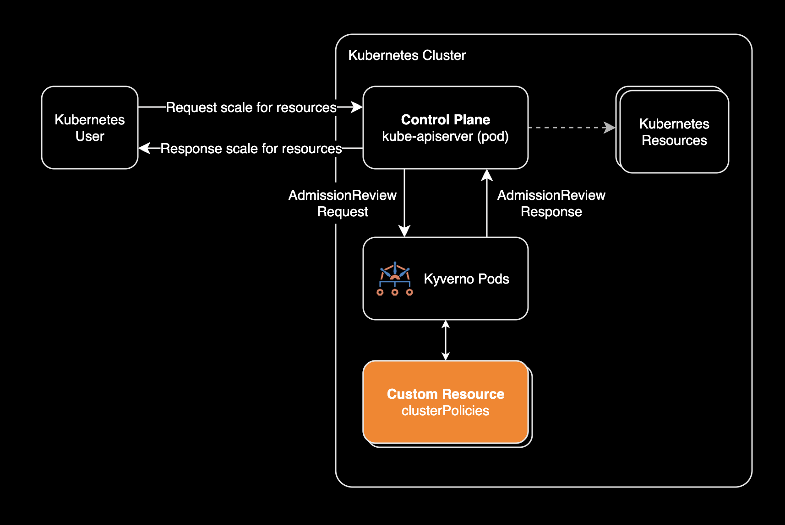
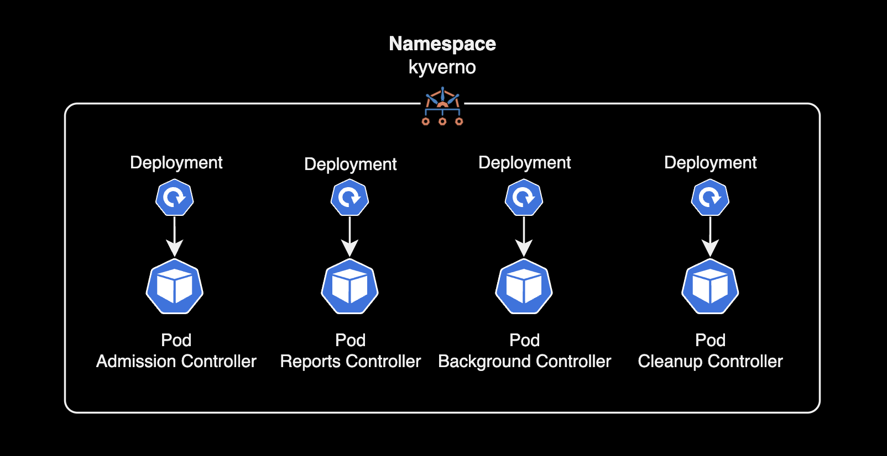
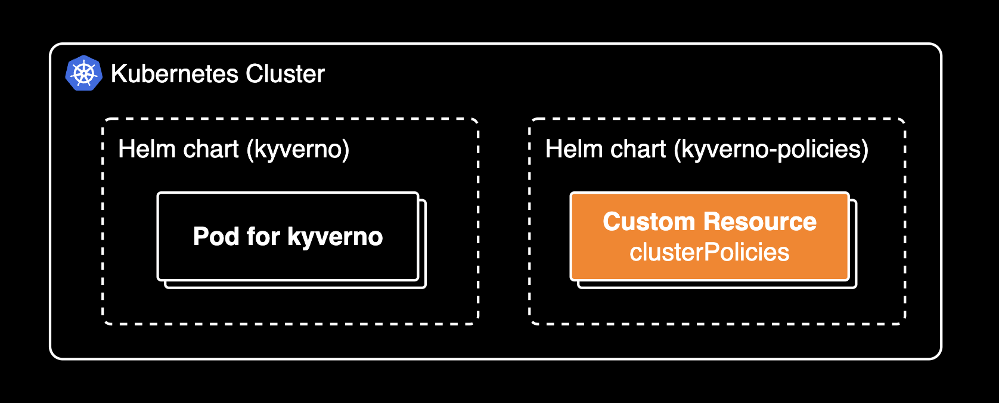
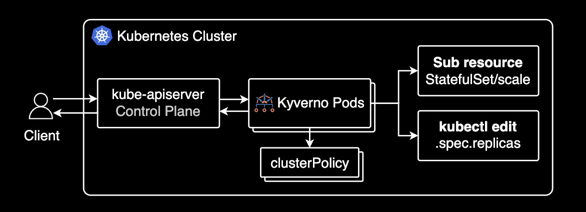

## 개요

쿠버네티스 네이티브 정책 엔진인 [Kyverno](https://kyverno.io/)를 이용해 Statefulset이나 Deployment 등의 리소스에 대해 스케일 개수를 제한하는 방법을 설명합니다.


&nbsp;

## 배경지식

### Kyverno

Kyverno는 Kubernetes 네이티브 정책 엔진입니다. Kyverno를 이용해 쿠버네티스 클러스터 상에서 이뤄지는 모든 요청(파드 개수 조정 등)에 대해 검증을 수행하고 정책 위반 시 사용자 요청을 거절할 수 있습니다.

&nbsp;

### Admission Controller 동작 방식

이 페이지에서는 특정 사용자가 특정 이름을 가진 Statefulset의 파드 개수를 2개를 초과할 수 없도록 제한하는 시나리오를 설명합니다.



Validate 정책을 검증하고 사용자 요청을 거절하는 흐름은 다음과 같습니다.

1. 사용자가 kubectl scale 명령어(혹은 k9s 등의 터미널 UI)로 my-logstash StatefulSet의 replicas를 3으로 증가시키려 시도합니다.
2. kubectl 요청이 Kubernetes API 서버로 전달되고, Kubernetes API 서버는 StatefulSet의 서브리소스인 StatefulSet/scale 리소스의 수정 요청을 받습니다.
3. Kubernetes API 서버는 Admission Webhook을 통해 Kyverno로 요청을 전달하고, Kyverno는 restrict-scale ClusterPolicy 정책(Validate 정책)에 따라 `spec.replicas` > 1 인 것을 확인하고 정책 위반으로 판단합니다.
4. Kyverno는 Kubernetes API 서버로 정책 위반 응답을 전송합니다.
5. Kubernetes API 서버는 사용자에게 admission webhook denied 에러 메시지를 반환합니다.
6. StatefulSet scale 변경이 거부되어 replicas는 기존 값을 유지합니다.

더 자세한 Admission Controller의 개념과 동작방식은 [Kyverno 공식문서의 Admission Controllers 101](https://kyverno.io/docs/introduction/admission-controllers/)을 참고해 주세요.

&nbsp;

## 환경

- Kyverno 1.13.1 (Official helm chart)

&nbsp;

## 정책 설정 가이드

이 시나리오에서는 쿠버네티스 클러스터에 Kyverno 1.13.1 버전 헬름차트가 설치된 상태입니다.

```bash
kubectl get pod -n kyverno
```

```bash
NAME                                            READY   STATUS    RESTARTS     AGE
kyverno-admission-controller-7755f8578-9tvkw    1/1     Running   1 (9d ago)   80d
kyverno-admission-controller-7755f8578-l6j62    1/1     Running   4 (9d ago)   80d
kyverno-admission-controller-7755f8578-rcdq6    1/1     Running   0            80d
kyverno-background-controller-65cf7b769-2kb6j   1/1     Running   3 (9d ago)   80d
kyverno-background-controller-65cf7b769-gkkvh   1/1     Running   4 (9d ago)   80d
kyverno-cleanup-controller-5b5f655bf6-k6sgv     1/1     Running   5 (9d ago)   80d
kyverno-cleanup-controller-5b5f655bf6-k75p9     1/1     Running   1 (9d ago)   80d
kyverno-reports-controller-86cfc65544-s4whs     1/1     Running   7 (9d ago)   80d
kyverno-reports-controller-86cfc65544-tcqz7     1/1     Running   5 (9d ago)   80d
```

&nbsp;

Kyverno는 Validate, Mutate, Generate, Verify Images 등 [다양한 정책 타입](https://kyverno.io/docs/kyverno-policies/)이 있지만 이 시나리오에서는 특정 행위를 검증하고 행위를 제한하는 Validate 정책을 이용합니다. 참고로 Validate 정책에 대한 검증은 Kyverno의 Admission Controller에서 이뤄집니다.



&nbsp;

이 시나리오에서는 YAML 파일을 이용해 정책을 적용합니다. 하지만 실제 기업(엔터프라이즈) 환경에서는 Kyverno 정책들을 모아놓은 [kyverno-policies](https://github.com/kyverno/kyverno/tree/main/charts/kyverno-policies) 헬름 차트를 이용해 모든 정책을 차트 기반으로 관리하는 것을 권장합니다.



&nbsp;

다음 명령어로 Validate 정책을 생성합니다.

```bash {hl_lines="26"}
cat << EOF | kubectl apply -f -
---
apiVersion: kyverno.io/v1
kind: ClusterPolicy
metadata:
  name: restrict-scale
  annotations:
    kyverno.io/kyverno-version: 1.13.1
spec:
  admission: true
  background: false
  emitWarning: false
  failurePolicy: Fail
  rules:
  - match:
      any:
      - resources:
          kinds:
          - StatefulSet/scale
          names:
          - my-logstash
    name: create-max-one
    skipBackgroundRequests: true
    validate:
      allowExistingViolations: false
      failureAction: Enforce
      message: The replica count for this StatefulSet may not exceed 1.
      pattern:
        spec:
          replicas: <2
  validationFailureAction: Enforce
EOF
```

`my-logstash`라는 이름의 Statefulset을 파드 개수를 1개를 초과할 수 없게 제한하는 Validate 정책입니다. `failureAction` 필드는 정책 위반 시 처리 방식을 결정하는 필드로 `Enforce`는 정책 위반 시 사용자 요청을 거절하고 `Audit`는 경고 메시지만 반환하고 요청을 허용합니다.

&nbsp;

### 정책 작성시 주의사항

저는 이 부분 때문에 정책 작성시에 많은 시간이 소요되었는데요, `StatefulSet/scale` 리소스는 원본 StatefulSet의 Label에 대한 정보를 포함하지 않고 있으므로 `matchLabels` 필드를 이용해 정책을 적용할 수 없습니다. 적용할 대상 리소스를 지정할 때 라벨 기반인 `matchLabels` 대신 리소스 이름에 대한 `names` 필드를 이용해 정책을 적용하는 것이 좋습니다.

아래는 검증이 제대로 동작하지 않는 Label selector 기반의 Validate 정책 예시입니다: (정상적으로 제한이 동작하지 않으므로 참고용으로만 남겨둡니다.)

```yaml
apiVersion: kyverno.io/v1
kind: ClusterPolicy
metadata:
  name: restrict-scale
spec:
  admission: true
  background: false
  emitWarning: false
  failurePolicy: Fail
  rules:
  - match:
      any:
      - resources:
          kinds:
          - StatefulSet/scale
    name: create-max-one
    skipBackgroundRequests: true
    validate:
      allowExistingViolations: false
      failureAction: Enforce
      message: The replica count for this StatefulSet may not exceed 1.
      pattern:
        (status):
          (selector): app=my-logstash
        spec:
          replicas: <2
  validationFailureAction: Enforce
```

관련해서 유사한 샘플 정책은 [Kyverno 정책 모음 페이지](https://kyverno.io/policies/other/restrict-scale/restrict-scale/)를 참고해 주세요.

&nbsp;

`ClusterPolicy` 리소스를 적용한 후 정책 상태를 확인합니다.

```bash
kubectl get cpol restrict-scale -o wide
```

```bash
NAME             ADMISSION   BACKGROUND   READY   AGE   FAILURE POLICY   VALIDATE   MUTATE   GENERATE   VERIFY IMAGES   MESSAGE
restrict-scale   true        false        True    19h   Fail             1          0        0          0               Ready
```

`restrict-scale` 정책에 1개의 Validate 정책이 적용되었습니다.

&nbsp;

Kyverno 정책을 적용한 후 스케일 개수를 초과하는 리소스를 생성하면 다음과 같은 경고 메시지를 받습니다.

```bash
kubectl scale --replicas 3 --namespace default statefulset/my-logstash
```

```bash
Error from server: admission webhook "validate.kyverno.svc-fail" denied the request:

resource Scale/default/my-logstash was blocked due to the following policies

restrict-scale:
  create-max-one: 'validation error: The replica count for this StatefulSet may not
    exceed 1. rule create-max-one failed at path /spec/replicas/'
```

`k9s`와 같은 `kubectl` 역할을 하는 터미널 UI 기반의 관리 도구에서도 동일한 결과를 확인할 수 있습니다.

&nbsp;

### 강화된 정책

주의할 점은 Scale 서브리소스를 사용하는 대신 `spec.replicas` 필드를 이용해 StatefulSet 리소스의 파드 개수를 수정하면 정책 위반 검증이 제대로 동작하지 않습니다.

따라서 이러한 허점까지 고려해 아래와 같이 두 가지 방식을 모두 검증하는 정책을 작성해야 합니다.

```yaml
# Reference: https://kyverno.io/policies/other/restrict-scale/restrict-scale/
---
apiVersion: kyverno.io/v1
kind: ClusterPolicy
metadata:
  name: restrict-scale
  annotations:
    kyverno.io/kyverno-version: 1.13.1
    younsl.github.io/battle-tested: "true"
    younsl.github.io/battle-tested-since: "2025-02-28T00:00:00+09:00"
spec:
  admission: true
  background: false
  emitWarning: false
  failurePolicy: Fail
  # validationFailureActions will be deprecated in the future.
  # Please use failureAction instead.
  validationFailureAction: Enforce
  rules:
    - name: create-max-one
      match:
        any:
          - resources:
              kinds:
                - StatefulSet/scale
                - StatefulSet
              names:
                - "logstash"
      skipBackgroundRequests: true
      validate:
        failureAction: Enforce
        allowExistingViolations: false
        message: "The replica count for this StatefulSet may not exceed 1."
        pattern:
          spec:
            replicas: "<2"
```

위 Validate 정책은 아래 두가지 방식을 모두 검증합니다.



1. `kubectl scale` 명령어를 이용해 Scale 서브리소스를 수정하는 경우
2. `kubectl edit` 명령어를 이용해 StatefulSet 리소스의 `spec.replicas` 필드를 수정하는 경우

&nbsp;

Deployment 리소스에 대해서도 동일한 정책을 적용할 수 있습니다.

```yaml
# Reference: https://kyverno.io/policies/other/restrict-scale/restrict-scale/
---
apiVersion: kyverno.io/v1
kind: ClusterPolicy
metadata:
  name: restrict-scale
  annotations:
    kyverno.io/kyverno-version: 1.13.1
    younsl.github.io/battle-tested: "true"
    younsl.github.io/battle-tested-since: "2025-02-28T00:00:00+09:00"
spec:
  admission: true
  background: false
  emitWarning: false
  failurePolicy: Fail
  # validationFailureActions will be deprecated in the future.
  # Please use failureAction instead.
  validationFailureAction: Enforce
  rules:
    - name: create-max-one
      match:
        any:
          - resources:
              kinds:
                - StatefulSet/scale
                - StatefulSet
              names:
                - "logstash"
      skipBackgroundRequests: true
      validate:
        failureAction: Enforce
        allowExistingViolations: false
        message: "The replica count for this StatefulSet may not exceed 1."
        pattern:
          spec:
            replicas: "<2"
    - name: create-max-twenty
      match:
        any:
          - resources:
              kinds:
                - Deployment/scale
                - Deployment
              names:
                - "example-distributed-job-pod-*"
      skipBackgroundRequests: true
      validate:
        failureAction: Enforce
        allowExistingViolations: false
        message: "The replica count for this Deployment may not exceed 20."
        pattern:
          spec:
            replicas: "<21"
```

&nbsp;

## 관련자료

- [Kyverno 공식문서](https://kyverno.io/docs/)
- [Kyverno 정책 모음 페이지](https://kyverno.io/policies/other/restrict-scale/restrict-scale/)
- [Kyverno](/blog/kyverno/): 제가 이 블로그에서 작성한 Kyverno 관련 포스트입니다.