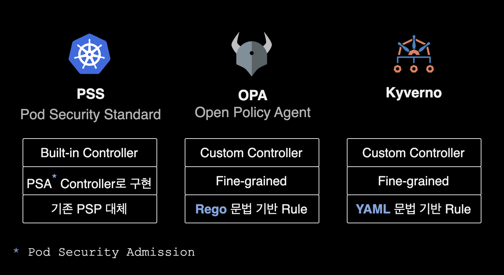
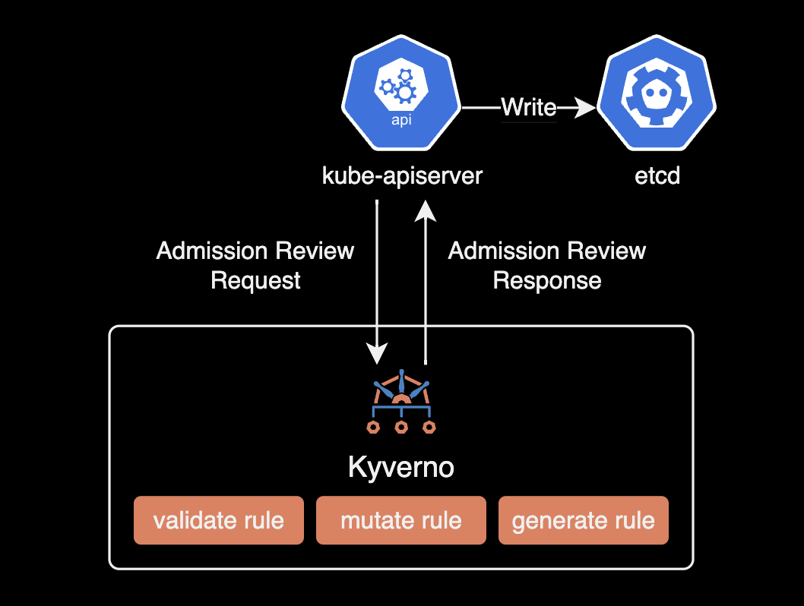
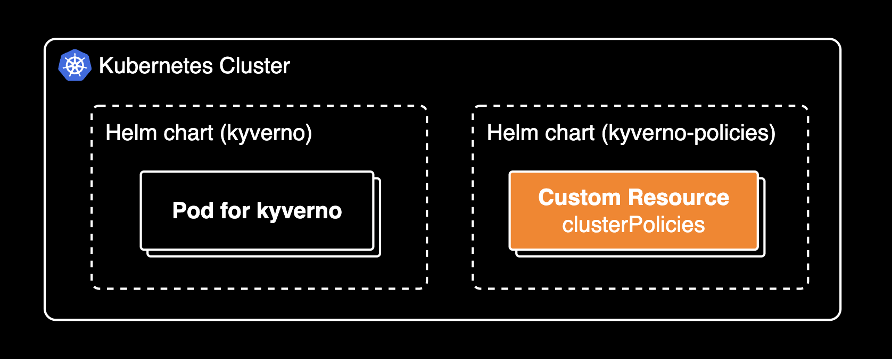
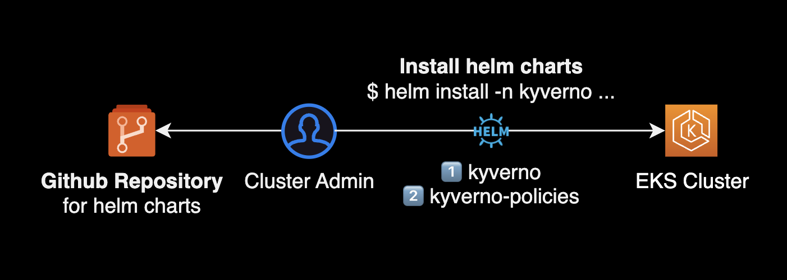
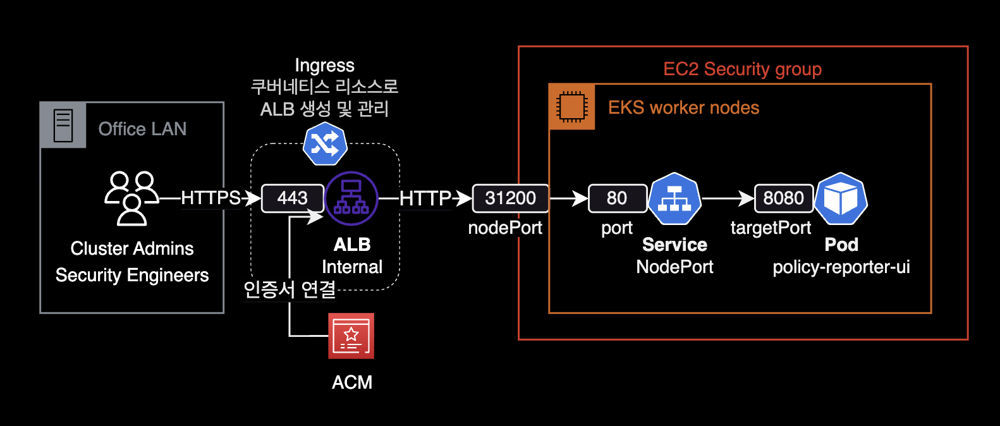
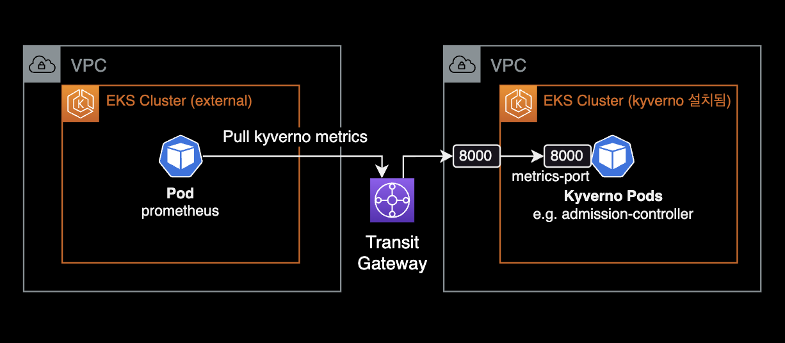
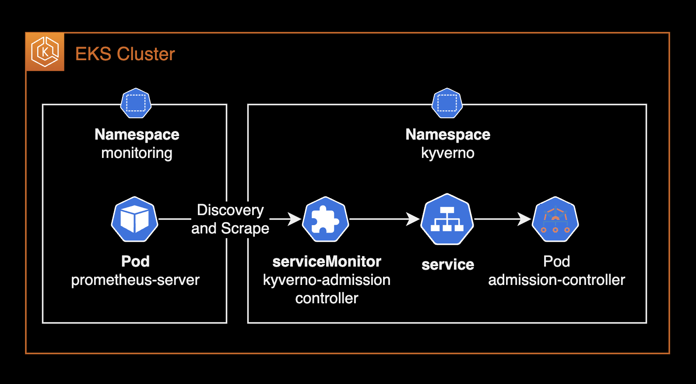

## 개요

Kyverno 운영 가이드입니다.

쿠버네티스 클러스터를 운영하고 보안을 관리하는 DevOps Engineer, SRE 그리고 클라우드 보안 엔지니어를 대상으로 작성된 문서입니다.

&nbsp;

## 배경지식

### Kyverno

[Kyverno](https://github.com/kyverno/kyverno)는 Kubernetes용으로 설계된 정책 엔진입니다.

Kyverno의 정책은 ClusterPolicy라고 하는 Kubernetes 리소스(CRD)로 관리됩니다. Kyverno는 [OPA](https://github.com/open-policy-agent/opa)에서 사용하는 Rego 언어를 사용하지 않고, 쿠버네티스 네이티브 언어인 YAML로 정책을 작성하므로 새로운 언어 학습이 필요 없다는 장점이 있습니다.

&nbsp;

### Admission Controllers

쿠버네티스에서 사용할 수 있는 대표적인 Admission Controllers 3가지



- **PSS**<sup>Pod Security Standard</sup> : PSS는 Kubernetes v1.21에서 deprecated된 PSP<sup>Pod Security Policy</sup>를 대체하는 쿠버네티스 기본 Admission Controller 입니다.
- **OPA**<sup>Open Policy Agent</sup> : Rego 문법 기반의 Rule 작성. 토스뱅크가 대표적으로 OPA를 잘 사용하는 회사입니다.
- **Kyverno** : YAML 문법 기반의 Rule 작성. OPA의 [Rego](https://www.openpolicyagent.org/docs/latest/policy-language/#what-is-rego)와 같은 언어 학습이 필요 없어서 운영이 쉽습니다.

OPA와 Kyverno 둘다 사용해본 AWS Solutions Architect의 경우, OPA 보다 정책 작성이 쉬운 Kyverno를 적극 추천했습니다.

&nbsp;

## 주의사항

### 쿠버네티스의 ValidatingAdmissionPolicy 지원

Kubernetes v1.30부터는 ValidatingAdmissionPolicy가 GA(General Availability) 상태가 되었습니다. 대신 MutatingAdmissionPolicy는 아직 쿠버네티스 네이티브하게 지원하지 않아, 이 경우 정책 엔진인 Kyverno를 사용해서 API 리소스를 확장해야 합니다.

```bash
# Check api-resources on kubernetes cluster v1.30
$ kubectl api-resources --api-group admissionregistration.k8s.io
NAME                                SHORTNAMES   APIVERSION                        NAMESPACED   KIND
mutatingwebhookconfigurations                    admissionregistration.k8s.io/v1   false        MutatingWebhookConfiguration
validatingadmissionpolicies                      admissionregistration.k8s.io/v1   false        ValidatingAdmissionPolicy
validatingadmissionpolicybindings                admissionregistration.k8s.io/v1   false        ValidatingAdmissionPolicyBinding
validatingwebhookconfigurations                  admissionregistration.k8s.io/v1   false        ValidatingWebhookConfiguration
```

Validating Admission Policies는 쿠버네티스 클러스터에서 리소스 생성 및 업데이트 시 정책을 적용하여 보안을 강화하는 데 유용합니다. 이 기능은 기존의 Validating Webhook과 비교하여 더 간단한 설정과 관리가 가능하며, 정책을 코드로 관리할 수 있는 장점이 있습니다. Mutating 정책은 아직 쿠버네티스가 네이티브하게 지원하지 않기 때문에, Kyverno와 같은 정책 엔진이 필요하며, [이는 Kyverno를 완벽하게 대체할 수 없다는 점을 의미](https://www.reddit.com/r/kubernetes/comments/1gpvk95/so_are_validating_admission_policies_a/)합니다. 자세한 사항은 Kubernetes 공식 블로그의 [Kubernetes 1.30: Validating Admission Policy Is Generally Available](https://kubernetes.io/blog/2024/04/24/validating-admission-policy-ga/) 페이지를 참고합니다.

&nbsp;

## Kyverno 운영 가이드

### 버전 호환성 표

쿠버네티스 클러스터 버전에 맞는 Kyverno 버전을 설치해야 합니다.

| Kyverno Version | Kubernetes Min | Kubernetes Max |
|-----------------|----------------|----------------|
| 1.6.x | 1.16 | 1.23 |
| 1.7.x | 1.21 | 1.23 |
| 1.8.x | 1.23 | 1.25 |
| 1.9.x | 1.24 | 1.26 |
| 1.10.x | 1.24 | 1.26 |
| 1.11.x | 1.25 | 1.28 |
| 1.12.x | 1.26 | 1.29 |

자세한 사항은 Kyverno 공식문서 [Compatibility Matrix](https://kyverno.io/docs/installation/#compatibility-matrix) 페이지를 참고합니다.

&nbsp;

### 정책 마켓플레이스

모든 Policy의 YAML을 처음부터 작성할 필요 없이 약 292개의 정책이 이미 올라와 있습니다.

[Kyverno Policies](https://kyverno.io/policies/)  
[Github: kyverno/policies](https://github.com/kyverno/policies)

&nbsp;

### 정책 타입

Kyverno는 쿠버네티스 리소스를 검증, 변경, 생성 및 정리하고 컨테이너 이미지 검증을 수행할 수 있는 정책을 생성합니다.



총 5개 타입의 룰을 사용할 수 있습니다.

- **validate** rule: 리소스의 설정을 검증하는 룰
- **mutate** rule: 리소스의 설정을 변경하는 룰
- **generate** rule: 조건에 따라 리소스를 생성하는 룰
- **verifyImage** rule: 컨테이너 이미지를 검증하는 룰
- **cleanup** rule: 리소스를 정리하는 룰

Kyverno 정책 작성 방법은 Kyverno 공식문서 [Writing Policies](https://kyverno.io/docs/writing-policies/)를 참고합니다.

&nbsp;

### 정책 모드

Validate Policy는 2개의 모드 중 하나로 동작합니다.

- **Enforce**: Enforce 모드는 위반한 리소스를 생성 거부합니다.
- **Audit**: Audit 모드는 정책에서 위반하더라도 해당 리소스 생성을 허용합니다. 대신 정책 위반사항을 PolicyReport에 기록합니다.

요약하자면, Enforce 모드는 실제로 정책을 리소스에 적용하여 적절한 변경을 강제화하는 반면, Audit 모드는 정책의 영향을 사전에 확인하고 분석하기 위해 사용되는 모드입니다.

&nbsp;

ClusterPolicy 리소스에서는 `spec.validationFailureAction`에서 설정할 수 있습니다.

```yaml
apiVersion: kyverno.io/v1
# The `ClusterPolicy` kind applies to the entire cluster.
kind: ClusterPolicy
metadata:
  name: require-ns-purpose-label
# The `spec` defines properties of the policy.
spec:
  # The `validationFailureAction` tells Kyverno if the resource being validated should be allowed but reported (`Audit`) or blocked (`Enforce`).
  validationFailureAction: Enforce # or `Audit`
```

&nbsp;

### Kyverno 컨트롤러

Kyverno는 4개의 컨트롤러 파드로 구성됩니다.  
각 컨트롤러 파드별 역할은 공식문서 [Controllers in kyverno](https://kyverno.io/docs/high-availability/#controllers-in-kyverno)를 참고합니다.


- **Admission Controller** : Kubernetes API 서버로부터 AdmissionReview 요청 수신을 담당합니다. `validate`, `mutate`, `verifyImage` rule 처리를 담당합니다.
- **Background Controller** : `generate` rule, 기존 리소스에 대한 `mutate` rule 처리를 담당합니다.
- **Cleanup Controller** : cleanup policy 처리
- **Reports Controller** : Validate Rule의 스캔 결과에 대한 보고서 생성

&nbsp;

### 고가용성

[kyverno 헬름 차트](https://github.com/kyverno/kyverno/blob/main/charts/kyverno/values.yaml)는 각 컨트롤러에 대해 여러 개의 파드를 구성하기 위한 설정값을 제공합니다. 공식문서에서 권장하는 고가용성 설정은 다음과 같습니다.

```bash
admissionController.replicas: 3
backgroundController.replicas: 2
cleanupController.replicas: 2
reportsController.replicas: 2
```

> **Note**  
> Kyverno 설치시 반드시 Admission Controller Pod가 포함되어 있어야 합니다. Admission Controller의 `replicas` 파드 개수는 2개를 지원하지 않습니다. 고가용성 구성으로 Kyverno를 설치해야하는 경우, Admission Controller가 지원하는 유일한 `replicas` 개수는 `3`개입니다.

자세한 사항은 Kyverno 공식문서 [High Availability](https://kyverno.io/docs/high-availability/)를 참고합니다.

&nbsp;

### 설치방식

#### 필요 helm chart

Kyverno를 운영하려면 2개의 helm chart 설치가 필요합니다. 일반적으로 쿠버네티스는 모든 리소스를 헬름 차트로 관리하는 것이 모범사례이기 때문에 정책 리소스 또한 kyverno-policies 차트로 관리하는 것이 좋습니다.

아래는 Kyverno 관련 헬름 차트 목록입니다.

- **kyverno** : (Required) Kyverno 정책 엔진 helm chart. kyverno 정책 엔진 관련 리소스는 모두 전용 네임스페이스인 `kyverno`에 위치하게 됩니다.
- **kyverno-policies** : (Required) Kyverno가 사용하는 정책 리소스 전용 차트.
- **policy-reporter** : (Optional) 클러스터 정책 현황을 시각화해주는 Web UI 컴포넌트입니다. 조직의 요구사항에 따라 설치하면 되며, `policy-reporter` 대신 Prometheus + Grafana 연동으로 대체할 수 있습니다.



Kyverno는 [설치 방식](https://kyverno.io/docs/installation/methods/)으로 [Kubernetes Operator](https://kubernetes.io/ko/docs/concepts/extend-kubernetes/operator/) 패턴을 지원하지 않으며, 헬름 차트와 YAML 직접 설치 방식만 지원하고 있습니다.

&nbsp;

#### 설치 순서

기본적으로 Kyverno 정책 엔진인 `kyverno` chart를 먼저 설치한 다음, 정책 리소스 모음인 `kyvenro-policies` chart를 설치합니다.

helm chart 레포 구조를 잡는 방법에는 명확한 정답이나 모범 사례는 없습니다. 제 경우는 `git clone`을 사용해서 `kyverno`와 `kyverno-policies` 공식 차트들을 다운로드 받고 `helm install`을 사용해 설치해 운영하는 걸 선호합니다.

아래는 `charts` 레포에 구성해놓은 디렉토리 트리 구조입니다.

```bash
charts
├── kyverno
│   ├── values_dev.yaml
│   ├── values_qa.yaml
│   ├── values_prd.yaml
│   ├── Chart.yaml
│   └── templates/
└── kyverno-policies
    ├── values_dev.yaml
    ├── values_qa.yaml
    ├── values_prd.yaml
    ├── Chart.yaml
    └── templates/
```

하나의 차트는 환경별로 `values` 파일이 분리되어 환경마다 자유롭게 차트 설정을 조정할 수 있습니다.

&nbsp;

헬름 차트 설치 과정을 그림으로 표현하면 다음과 같습니다.



&nbsp;

### 정책 운영 팁

Kyverno를 운영하면서 가장 높은 비중을 차지하는 정책 타입은 리소스 YAML로부터 설정을 검증하는 Validate Policy 입니다. Validate Policy를 작성하고 적용하는 과정에서 유용하게 쓸 수 있는 몇 가지 팁을 소개합니다.

#### Validate Rule

- 검증<sup>Validate</sup> 정책을 개발하는 상황에서 테스트할 때, 정책적용 보고서<sup>PolicyReport</sup>를 볼 필요 없이 즉시 결과를 확인할 수 있도록 `validationFailureAction: Enforce`을 설정하는 것이 간편합니다.
- 프로덕션 환경에 Validate 정책을 적용할 경우, `validationFailureAction: Audit`으로 되어 있는지 확인하여 정책이 의도하지 않은 결과를 초래하지 않도록 방지합니다. 이후 안정성이 검증되었고 정책을 강제해야한다고 판단이 들 때 `validationFailureAction: Force`로 전환하여 강제 적용합니다.
- Validate 정책은 다른 규칙<sup>Rule</sup>에 대응할 수 없습니다. 예를 들어 모든 이미지가 레지스트리 `reg.corp.com`에서 나오도록 작성된 규칙과, 해당 이미지가 `reg.corp.com`에서 나오지 않도록 작성된 또 다른 규칙<sup>Rule</sup>은 사실상 모든 이미지 가져오기를 불가능하게 만들고 아무것도 실행되지 않게 됩니다. 규칙<sup>Rule</sup>이 정의된 위치나 순서는 중요하지 않습니다.

자세한 사항은 Kyverno 공식문서 [Tips & Tricks](https://kyverno.io/docs/writing-policies/tips/)를 참고합니다.

&nbsp;

## Policy 작성 가이드

### Context

변수는 Kyverno Rule의 `context` 키워드에서 정의될 수 있습니다.

변수는 정적 값, 다른 변수 또는 중첩된 오브젝트 등으로 정의될 수 있습니다. 아래 정책에서는 값이 `foo`인 컨텍스트 변수를 설정합니다.

```yaml
    context:
    - name: foodata
      variable:
        value: "foo"
```

&nbsp;

이번 코드 조각은 컨텍스트 변수를 `request.object.metadata.name` 값으로 설정합니다. 값 필드가 정의되지 않은 경우 JMESPath의 내용은 전체 컨텍스트에 적용됩니다.

```bash
    context:
    - name: preStopSleepSeconds
      variable:
        jmesPath: request.object.metadata.labels.preStopSleepSeconds
        default: 30
```

&nbsp;

Context와 JMESPath의 여러 함수가 적용된 Mutate Policy 예시입니다.

```yaml
{{- $name := "mutate-pre-post-scripts-injection" }}
{{- if eq (include "kyverno-policies.customMutatePolicies" (merge (dict "name" $name) .)) "true" }}
apiVersion: kyverno.io/v1
kind: ClusterPolicy
metadata:
  name: {{ $name }}
  annotations:
    policies.kyverno.io/title: Mutate termination grace period seconds
    policies.kyverno.io/category: Other, EKS Best Practices
    policies.kyverno.io/subject: Pod
    kyverno.io/kyverno-version: 1.8.0-rc2
    kyverno.io/kubernetes-version: "1.24"
    policies.kyverno.io/minversion: 1.6.0
    policies.kyverno.io/description: >-
      Mutate policy for preStop script sleep.
spec:
  schemaValidation: false
  rules:
  - name: mutate-poststart-script-raptor-config-curl
    match:
      any:
      - resources:
          kinds:
          - Pod
          operations:
          - CREATE
          namespaceSelector:
            matchLabels:
              policies.kyverno.io/test-mutate-rules-injection: enabled
    exclude:
      any:
      - resources:
          kinds:
          - Pod
          namespaces:
          - default
          selector:
            matchLabels:
              role: spring-app
      - resources:
          kinds:
          - Pod
          namespaces:
          - default
          selector:
            matchLabels:
              policies.kyverno.io/test-mutate-rules-injection: disabled
    context:
    - name: postStartSleepSeconds
      variable:
        jmesPath: request.object.metadata.labels.postStartSleepSeconds
        default: 5
    mutate:
      patchesJson6902: |-
        - op: add
          path: "/spec/containers/0/lifecycle/postStart/exec/command"
          value:
          - "/bin/sh"
          - "-c"
          - "if ! curl -s http://raptor-config.default > /dev/null; then sleep {{ `{{ postStartSleepSeconds }}` }}; exit 1; fi"
          
  - name: mutate-prestop-script-sleep-test
    match:
      any:
      - resources:
          kinds:
          - Pod
          operations:
          - CREATE
          namespaceSelector:
            matchLabels:
              policies.kyverno.io/test-mutate-rules-injection: enabled
    exclude:
      any:
      - resources:
          kinds:
          - Pod
          namespaces:
          - default
          selector:
            matchLabels:
              role: spring-app
      - resources:
          kinds:
          - Pod
          namespaces:
          - default
          selector:
            matchLabels:
              policies.kyverno.io/test-mutate-rules-injection: disabled
    context:
    - name: preStopSleepSeconds
      variable:
        jmesPath: request.object.metadata.labels.preStopSleepSeconds
        default: 30
    mutate:
      patchesJson6902: |-
        - op: add
          path: "/spec/containers/0/lifecycle/preStop/exec/command"
          value:
          - "/bin/sh"
          - "-c"
          - "sleep {{ `{{ preStopSleepSeconds }}` }}"

  - name: mutate-termination-grace-period-seconds-test
    match:
      any:
      - resources:
          kinds:
          - Pod
          operations:
          - CREATE
          namespaceSelector:
            matchLabels:
              policies.kyverno.io/test-mutate-rules-injection: enabled
    exclude:
      any:
      - resources:
          kinds:
          - Pod
          namespaces:
          - default
          selector:
            matchLabels:
              role: spring-app
      - resources:
          kinds:
          - Pod
          namespaces:
          - default
          selector:
            matchLabels:
              policies.kyverno.io/test-mutate-rules-injection: disabled
    context:
    - name: preStopSleepSeconds
      variable:
        jmesPath: request.object.metadata.labels.preStopSleepSeconds
        default: 30
    mutate:
      patchStrategicMerge:
        spec:
          # JMESpath should be enclosed in " "
          terminationGracePeriodSeconds: "{{ `{{ add(to_number(preStopSleepSeconds), to_number('10')) }}` }}"
{{- end }}
```

&nbsp;

### JMESPath 활용

Kyverno에서는 [JMESPath](https://kyverno.io/docs/writing-policies/jmespath/)라는 언어를 지원합니다.

JMESPath를 사용하면 여러가지 문자열 변환 처리, 함수, 사칙연산 등의 수학 계산식 등을 Cluster Policy 안에서 실행할 수 있습니다.

아래는 예제 Cluster Policy YAML 코드 중 일부입니다.

```yaml
    context:
    - name: preStopSleepSeconds
      variable:
        jmesPath: request.object.metadata.labels.preStopSleepSeconds
        default: 30
    mutate:
      patchStrategicMerge:
        spec:
          # JMESpath should be enclosed in " "
          # Defining an integer as an argument in JMESPath requires enclosure in backticks.
          terminationGracePeriodSeconds: "{{ add(to_number(preStopSleepSeconds), `10`) }}"
```

위 Cluster Policy는 다음 순서대로 수행됩니다.

- 정책이 적용되는 Pod의 라벨 중 `preStopSleepSeconds`의 값을 읽습니다.
- 해당 값을 `preStopSleepSeconds` 변수에 넣습니다. 없으면 `30` 기본값으로 지정됩니다.
- `to_number` 함수에 의해 값이 문자열 타입에서 숫자 타입으로 변환되고 `add()` 함수에 의해 +10 하게 됩니다.
- 파드의 tGPS 값은 해당 값으로 변환<sup>Mutate</sup> 됩니다.

&nbsp;

Cluster Policy 작성시 팁입니다.

- 숫자를 2개 연산해야 하는 경우 [`sum()`](https://main.kyverno.io/docs/writing-policies/jmespath/#sum) 함수가 아닌 [`add()`](https://main.kyverno.io/docs/writing-policies/jmespath/#add) 함수를 써야 합니다.
- String 타입의 값을 Integer로 변경하려면 JMESPath의 `to_number()` 함수를 사용합니다. [정책 예시](https://kyverno.io/policies/cert-manager/limit-duration/limit-duration/)
- ClusterPolicy의 `spec.schemaValidation` 값을 `false`로 설정해야 다음 에러를 피할 수 있습니다. 기본값은 `true` 입니다. 더 자세한 내용은 공식문서 [Tips & Tricks](https://kyverno.io/docs/writing-policies/tips/#mutate)를 참고하세요.

```yaml
apiVersion: kyverno.io/v1
kind: ClusterPolicy
metadata:
  name: test-mutate-policy
  annotations:
    ...
spec:
  schemaValidation: false
```

```bash
error admission webhook "validate-policy.kyverno.svc" denied the request on ClusterPolicy resource.`
```

- Pod의 Label `metadata.labels.xxx`의 값엔 반드시 `"40"` 이런식으로 문자열 처리가 되어야 합니다. 따라서 해당 값을 `spec.terminationGracePeriodSeconds` 등의 숫자만 올 수 있는 설정에 넣고 싶을 경우, JMESpath의 `to_number()` 함수를 사용해서 타입 변환 처리를 해서 넣을 수 있습니다.
- JMESPath에서 Argument로 숫자 타입을 정의하려면 `10`과 같이 백틱으로 묶어야 합니다.

```bash
terminationGracePeriodSeconds: "{{ add(to_number(preStopSleepSeconds), `10`) }}"
```

[관련된 Github Issue](https://github.com/kyverno/policies/issues/792#issuecomment-1778910734)

&nbsp;

## 정책 모니터링

Kyverno 엔진을 설치하고 ClusterPolicy를 적용하는 이유는 결과적으로 모범사례를 위반된 쿠버네티스 리소스들을 인지하고 개선하기 위함입니다.

Kyverno의 정책을 모니터링 해야하는 이유는 크게 4가지가 있습니다.

- **문제 식별**: 메트릭 및 대시보드를 통해 정책 위반 및 클러스터 문제를 빠르게 식별할 수 있으며, 조치를 취하기 위해 더 빠른 대응이 가능합니다. 클러스터에 적용된 Kyverno 정책의 현황, 정책에 위반된 리소스들을 `kubectl`로 필터링해 볼 수 있습니다만, 방법이 복잡하고 명령어를 매번 치기 귀찮습니다. 전체적인 클러스터의 정책 상태를 한 눈에 보기 위한 목적이 가장 큽니다.
- **트렌드 및 통계 수집**: 장기적인 트렌드와 통계를 수집하여 인프라스트럭처 및 정책 변경에 따른 영향을 모니터링할 수 있습니다.
- **팀 협업**: 대시보드를 공유하고 팀 간 협업을 촉진하여 문제 해결 및 정책 관리를 향상시킬 수 있습니다. Cloud Security Engineer와 같이 쿠버네티스가 메인 업무가 아닌 다른 직군과 Kubernetes Policy에 대해 협업하는 건 현실적으로 어렵습니다. Kyverno 메트릭과 대시보드를 구성하면 이에 대한 간격을 좁힐 수 있습니다.
- **의사결정에 도움**: 정책 통과, 위반 관련 메트릭 데이터를 시각화하고 분석하여 미래 클러스터 조정 및 정책 수정에 대한 결정을 내릴 수 있습니다.

&nbsp;

### 시각화 방법

Helm 차트로 Kyverno를 설치하면 8000번 포트로 메트릭을 노출하는 추가 서비스가 생성됩니다.

Kyverno는 이 문제를 해결하기 위해 정책 운영결과 시각화 도구 2가지를 제공합니다.

1. [**Policy Reporter UI**](https://github.com/kyverno/policy-reporter) : Policy Reporter UI는 공식 [헬름차트](https://github.com/kyverno/policy-reporter/tree/main/charts/policy-reporter)로 간단하게 설치할 수 있습니다.
2. [**Prometheus + Grafana**](https://kyverno.io/docs/monitoring/) : Kyverno 전용 [Grafana 대시보드](https://kyverno.io/docs/monitoring/bonus-grafana-dashboard/)를 제공하고 있습니다.

&nbsp;

### Policy Reporter 설치

헬름 차트를 사용해서 Policy Reporter를 설치하는 방법입니다.

Github의 policy-reporter를 로컬에 다운로드 받습니다.

```bash
git clone https://github.com/kyverno/policy-reporter
cd policy-reporter/charts/policy-reporter/
```

&nbsp;

Policy Reporter `values.yaml` 파일에서 아래 3가지 값을 수정합니다.

```yaml
# values.yaml for policy-reporter
kyvernoPlugin:
  enabled: true  # [1] Set to true

...

# enable policy-report-ui
ui:
  enabled: true  # [2] Set to true

  plugins:         # [3] Add
    kyverno: true  # [3] Add

...
```

`ui`는 Policy Reporter 웹 컴포넌트를 의미하는데, Policy Reporter 웹에서 Kyverno 정책 대시보드를 보기 위해 kyverno plugin을 켜주는 설정입니다.

자세한 내용은 [Policy Reporter 아키텍처](https://kyverno.github.io/policy-reporter/guide/architecture) 공식문서를 참고하세요.

&nbsp;

기본 `values.yaml` 파일을 사용해서 Policy Reporter 차트를 배포합니다.

```bash
helm install \
  policy-reporter . \
  -n policy-reporter \
  --create-namespace \
  -f values.yaml \
  --wait
```

&nbsp;

사내망에서만 접근 가능한 Policy Reporter를 아래와 같이 구성할 수 있습니다. 클러스터 바깥의 사용자가 접근하기 때문에 NodePort로 서비스를 노출하거나, (nginx-ingress와 같은 컨트롤러를 사용하는 경우) Ingress를 통해 외부에서 접근할 수 있도록 구성합니다.



Policy Reporter 헬름 차트의 [Ingress](https://github.com/kyverno/policy-reporter/blob/main/charts/policy-reporter/values.yaml#L103)를 활성화해서 Internal 타입의 ALB를 만들었습니다.

&nbsp;

### Prometheus 방식

`kyverno` 헬름차트를 설치하면 기본적으로 8000번 포트로 각 컨트롤러마다 prometheus 수집을 위한 메트릭 서비스가 생성됩니다.

Kyverno 차트의 `values.yaml` 파일은 기본적으로 다음과 같이 설정되어 있습니다.

```bash
# values.yaml (helm chart for kyverno)

admissionController:
  ...
  metricsService:
    create: true
    port: 8000
    type: ClusterIP

backgroundController:
  ...
  metricsService:
    create: true
    port: 8000
    type: ClusterIP

cleanupController:
  ...
  metricsService:
    create: true
    port: 8000
    type: ClusterIP

reportsController:
  ...
  metricsService:
    create: true
    port: 8000
    type: ClusterIP
```

메트릭 수집 전용 서비스 타입이 TCP/8000에 `ClusterIP`로 생성되므로 기본적으로 같은 클러스터의 Prometheus 서버만 메트릭을 수집할 수 있다는 한계가 있습니다.

&nbsp;

다른 쿠버네티스 클러스터에 위치한 Prometheus 서버가 Kyverno 메트릭을 수집하려면, 다음과 같이 metrics용 서비스를 기본값 `ClusterIP`에서 `NodePort`로 변경해야 합니다.

```bash
# values.yaml (helm chart for kyverno)

admissionController:
  metricsService:
    create: true
    type: NodePort
    port: 8000
    nodePort: 8000
  # ...

backgroundController:
  metricsService:
    create: true
    type: NodePort
    port: 8000
    nodePort: 8000
  # ...

cleanupController:
  metricsService:
    create: true
    type: NodePort
    port: 8000
    nodePort: 8000
  # ...

reportsController:
  metricsService:
    create: true
    type: NodePort
    port: 8000
    nodePort: 8000
  # ...
```

기본값 `ClusterIP`를 `NodePort`로 변경해서 노출하게 되면, Kyverno Pod들이 위치한 클러스터 바깥에 Prometheus Server가 있더라도 Kyverno 메트릭을 수집해갈 수 있습니다.

Prometheus와 Kyverno가 다른 클러스터에 위치한 경우 다음과 같은 아키텍처로 메트릭을 수집하게 됩니다.



&nbsp;

### serviceMonitor 구성

만약 Prometheus Operator를 설치해서 사용하고 있을 경우 아래와 같이 service monitor 리소스를 생성해서 메트릭을 수집할 수 있습니다.



현재 클러스터에서 serviceMonitor 리소스를 사용할 수 있는지 확인하기 위해 먼저 API Resource 목록을 조회합니다.

```bash
$ kubectl api-resources --api-group monitoring.coreos.com
NAME                  SHORTNAMES   APIVERSION                       NAMESPACED   KIND
alertmanagerconfigs   amcfg        monitoring.coreos.com/v1alpha1   true         AlertmanagerConfig
alertmanagers         am           monitoring.coreos.com/v1         true         Alertmanager
podmonitors           pmon         monitoring.coreos.com/v1         true         PodMonitor
probes                prb          monitoring.coreos.com/v1         true         Probe
prometheusagents      promagent    monitoring.coreos.com/v1alpha1   true         PrometheusAgent
prometheuses          prom         monitoring.coreos.com/v1         true         Prometheus
prometheusrules       promrule     monitoring.coreos.com/v1         true         PrometheusRule
scrapeconfigs         scfg         monitoring.coreos.com/v1alpha1   true         ScrapeConfig
servicemonitors       smon         monitoring.coreos.com/v1         true         ServiceMonitor
thanosrulers          ruler        monitoring.coreos.com/v1         true         ThanosRuler
```

해당 클러스터에서 Prometheus Operator와 CRD가 이미 설치되어 있기 때문에 serviceMonitor가 존재하며 사용 가능한 상태입니다.

더 자세한 serviceMonitor 사용 예시는 제 다른 글 [Prometheus Operator](/blog/prom-operator/)를 참고합니다.

&nbsp;

ServiceMonitor는 Kyverno 헬름 차트 안에 이미 포함되어 있어서, `enabled: true`로만 설정해주면 알아서 생성해줍니다.

아래는 serviceMonitor 활성화 예시입니다.

```yaml
# values.yaml
admissionController:
  serviceMonitor:
    # -- Create a `ServiceMonitor` to collect Prometheus metrics.
    enabled: true

...

backgroundController:
  serviceMonitor:
    # -- Create a `ServiceMonitor` to collect Prometheus metrics.
    enabled: true

...

cleanupController:
  serviceMonitor:
    # -- Create a `ServiceMonitor` to collect Prometheus metrics.
    enabled: true

...

reportController:
  serviceMonitor:
    # -- Create a `ServiceMonitor` to collect Prometheus metrics.
    enabled: true
```

이후 `helm upgrade`로 Kyverno 변경사항을 반영합니다.

```bash
helm upgrade \
  kyverno . \
  -n kyverno \
  -f values.yaml \
  --wait
```

&nbsp;

`kyverno` 네임스페이스에 4개의 serviceMonitor가 새로 생성된 걸 확인할 수 있습니다.

```bash
$ kubectl get smon -n kyverno
NAME                            AGE
kyverno-admission-controller    12m
kyverno-background-controller   9m42s
kyverno-cleanup-controller      9m42s
kyverno-reports-controller      9m42s
```

&nbsp;

Kyverno의 4개 컨트롤러는 각각 메트릭 수집 전용 포트인 `8000/TCP`을 ClusterIP로 노출하게 됩니다.

```bash
$ kubectl get svc -n kyverno -o wide
NAME                                    TYPE        CLUSTER-IP       EXTERNAL-IP   PORT(S)    AGE    SELECTOR
kyverno-background-controller-metrics   ClusterIP   172.xx.xxx.xxx   <none>        8000/TCP   223d   app.kubernetes.io/component=background-controller,app.kubernetes.io/instance=kyverno,app.kubernetes.io/part-of=kyverno
kyverno-cleanup-controller              ClusterIP   172.xx.xxx.xxx   <none>        443/TCP    223d   app.kubernetes.io/component=cleanup-controller,app.kubernetes.io/instance=kyverno,app.kubernetes.io/part-of=kyverno
kyverno-cleanup-controller-metrics      ClusterIP   172.xx.xx.xx     <none>        8000/TCP   223d   app.kubernetes.io/component=cleanup-controller,app.kubernetes.io/instance=kyverno,app.kubernetes.io/part-of=kyverno
kyverno-reports-controller-metrics      ClusterIP   172.xx.xxx.xxx   <none>        8000/TCP   223d   app.kubernetes.io/component=reports-controller,app.kubernetes.io/instance=kyverno,app.kubernetes.io/part-of=kyverno
kyverno-svc                             ClusterIP   172.xx.xxx.xxx   <none>        443/TCP    223d   app.kubernetes.io/component=admission-controller,app.kubernetes.io/instance=kyverno,app.kubernetes.io/part-of=kyverno
kyverno-svc-metrics                     ClusterIP   172.xx.xx.xx     <none>        8000/TCP   223d   app.kubernetes.io/component=admission-controller,app.kubernetes.io/instance=kyverno,app.kubernetes.io/part-of=kyverno
```

&nbsp;

[kube-prometheus-stack](https://github.com/prometheus-community/helm-charts/tree/main/charts/kube-prometheus-stack) chart에 포함되어 있는 Prometheus Operator의 동작방식을 설명합니다.

1. 클러스터 관리자에 의해 `kyverno` 네임스페이스에 serviceMonitor 리소스가 새로 생성됩니다.
2. Prometheus Operator는 kyverno servicMonitor를 자동 감지합니다. 기본적으로 Prometheus Operator Pod는 ServiceMonitor 리소스의 생성 및 변경을 지속적으로 감시합니다.
3. 새로운 ServiceMonitor가 감지되거나 기존의 것이 업데이트되면, Prometheus Operator는 Prometheus Pod의 메트릭 수집<sup>Scrape</sup> 설정을 자동으로 업데이트합니다.
4. 업데이트된 메트릭 수집<sup>Scrape</sup> 설정에 따라 Prometheus는 지정된 서비스로부터 메트릭을 수집하기 시작합니다. 기본값으로 수집간격 `30s`로 설정되며 이는 serviceMonitor spec에 선언되어 있습니다.

&nbsp;

메트릭 제공용 서비스의 타입을 `NodePort` 말고 `LoadBalancer` 타입을 쓰는 방법도 있습니다.

공식문서 [Monitoring](https://kyverno.io/docs/monitoring/)에서는 크게 3가지 서비스 타입을 기준으로 각각 설정하는 방법을 설명합니다.

1. **ClusterIP** (Default) : 메트릭 제공을 위한 기본 포트로 TCP/8000을 사용합니다.
2. **NodePort**
3. **LoadBalancer**

&nbsp;

## 참고자료

**Charts**  
[kube-prometheus-stack](https://github.com/prometheus-community/helm-charts/tree/main/charts/kube-prometheus-stack)  
[kyverno](https://github.com/kyverno/kyverno/tree/main/charts/kyverno)  
[kyverno-policies](https://github.com/kyverno/kyverno/tree/main/charts/kyverno-policies)  
[policy-reporter](https://github.com/kyverno/policy-reporter/tree/main/charts/policy-reporter)

**Kyverno**  
[Kyverno 공식문서](https://kyverno.io/docs/)  
[Kyverno 설치 가이드](https://kyverno.io/docs/installation/)  
[Kyverno Policy 저장소](https://kyverno.io/policies/)
