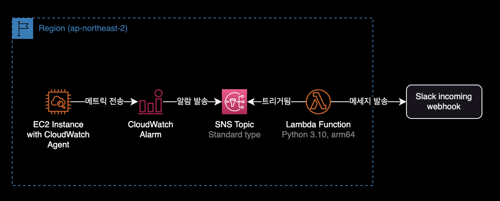
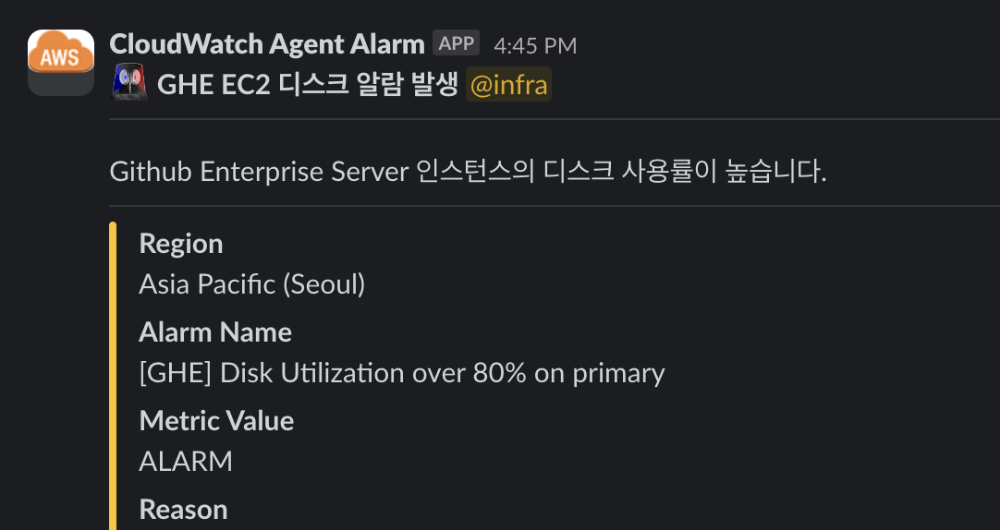

## 개요

Lambda Function에서 그룹 멘션 추가하기

&nbsp;

## 환경



- **서버리스 플랫폼** : Lambda Function
- **언어** : Python 3.10
- **CPU 아키텍처** : arm64

&nbsp;

## 그룹 멘션 적용방법

```python
'''
Follow these steps to configure the webhook in Slack:

  1. Navigate to https://<your-team-domain>.slack.com/services/new

  2. Search for and select "Incoming WebHooks".

  3. Choose the default channel where messages will be sent and click "Add Incoming WebHooks Integration".

  4. Copy the webhook URL from the setup instructions and use it in the next section.

To encrypt your secrets use the following steps:

  1. Create or use an existing KMS Key - http://docs.aws.amazon.com/kms/latest/developerguide/create-keys.html

  2. Expand "Encryption configuration" and click the "Enable helpers for encryption in transit" checkbox

  3. Paste <SLACK_CHANNEL> into the slackChannel environment variable

  Note: The Slack channel does not contain private info, so do NOT click encrypt

  4. Paste <SLACK_HOOK_URL> into the kmsEncryptedHookUrl environment variable and click "Encrypt"

  Note: You must exclude the protocol from the URL (e.g. "hooks.slack.com/services/abc123").

  5. Give your function's role permission for the `kms:Decrypt` action using the provided policy template
'''

import boto3
import json
import logging
import os

from base64 import b64decode
from urllib.request import Request, urlopen
from urllib.error import URLError, HTTPError


# The base-64 encoded, encrypted key (CiphertextBlob) stored in the kmsEncryptedHookUrl environment variable
ENCRYPTED_HOOK_URL = os.environ['kmsEncryptedHookUrl']
# The Slack channel to send a message to stored in the slackChannel environment variable
SLACK_CHANNEL = os.environ['slackChannel']

HOOK_URL = "https://" + boto3.client('kms').decrypt(
    CiphertextBlob=b64decode(ENCRYPTED_HOOK_URL),
    EncryptionContext={'LambdaFunctionName': os.environ['AWS_LAMBDA_FUNCTION_NAME']}
)['Plaintext'].decode('utf-8')

logger = logging.getLogger()
logger.setLevel(logging.INFO)


def lambda_handler(event, context):
    logger.info("Event: " + str(event))
    message = json.loads(event['Records'][0]['Sns']['Message'])
    logger.info("Message: " + str(message))

    region = message['Region']
    alarm_name = message['AlarmName']
    #old_state = message['OldStateValue']
    new_state = message['NewStateValue']
    reason = message['NewStateReason']

    slack_message = {
        "channel": SLACK_CHANNEL,
        "username": "CloudWatch Agent Alarm",
        "icon_url": "https://raw.githubusercontent.com/aendrew/aws-slack-emojipack/master/General_AWScloud.png",
        "blocks": [
            {
                "type": "section",
                "text": {
                    "type": "mrkdwn",
                    "text": f":alert: *GHE EC2 디스크 알람 발생*"
                }
            },
            {
                "type": "divider"
            },
            {
                "type": "section",
                "text": {
                    "type": "mrkdwn",
                    "text": "Github Enterprise Server 인스턴스의 디스크 사용률이 높습니다."
                }
            },
            {
                "type": "divider"
            }
        ],
        'attachments': [
            {
                "color": "#FFC300",
                "fields": [
                    {
                        "title": "Region",
                        "value": region,
                        "short": False
                    },
                    {
                        "title": "Alarm Name",
                        "value": alarm_name,
                        "short": False
                    },
                    {
                        "title": "Metric Value",
                        "value": new_state,
                        "short": False
                    },
                    {
                        "title": "Reason",
                        "value": reason,
                        "short": False
                    },
                ],
                "mrkdwn_in": ["text", "pretext"]
            }
        ]
    }

    req = Request(HOOK_URL, json.dumps(slack_message).encode('utf-8'))
    try:
        response = urlopen(req)
        response.read()
        logger.info("Message posted to %s", slack_message['channel'])
    except HTTPError as e:
        logger.error("Request failed: %d %s", e.code, e.reason)
    except URLError as e:
        logger.error("Server connection failed: %s", e.reason)
```

&nbsp;

위의 사용자 그룹 ID를 사용하면 메시지는 다음과 같습니다. 메시지는 `:smile: <!subteam^X99Y9Z3N2E5|@devops>`입니다.

Stack overflow에 따르면 전체 형식은 `<!subteam^ID|handle>`이지만 핸들은 선택 사항입니다. 핸들 없이 사용자 그룹 이름(즉, @dev-team)으로 올바르게 대체됩니다.

```bash
<!subteam^X99Y9Z3N2E5|@devops>
```

```diff
    slack_message = {
        "channel": SLACK_CHANNEL,
        "username": "CloudWatch Agent Alarm",
        "icon_url": "https://raw.githubusercontent.com/aendrew/aws-slack-emojipack/master/General_AWScloud.png",
        "blocks": [
            {
                "type": "section",
                "text": {
                    "type": "mrkdwn",
-                   "text": f":alert: *GHE EC2 디스크 알람 발생*"
+                   "text": f":alert: *GHE EC2 디스크 알람 발생* <!subteam^X99Y9Z3N2E5|@devops>"
                }
            },
```

&nbsp;

지정된 Group ID를 인식한 후 해당 그룹을 멘션하게 됩니다.

알람 메세지가 슬랙 채널로 발송되면서 지정한 그룹(Group ID)이 멘션됩니다.



&nbsp;

## 참고자료

**슬랙 공식문서**  
[Mentioning groups](https://api.slack.com/reference/surfaces/formatting#mentioning-groups)

**스택 오버플로우**  
[Mention Users Group via Slack API](https://stackoverflow.com/questions/54284389/mention-users-group-via-slack-api/65284937#65284937)
