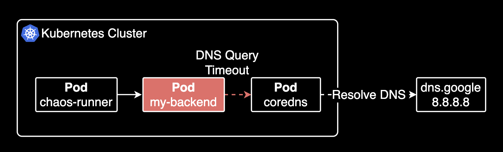
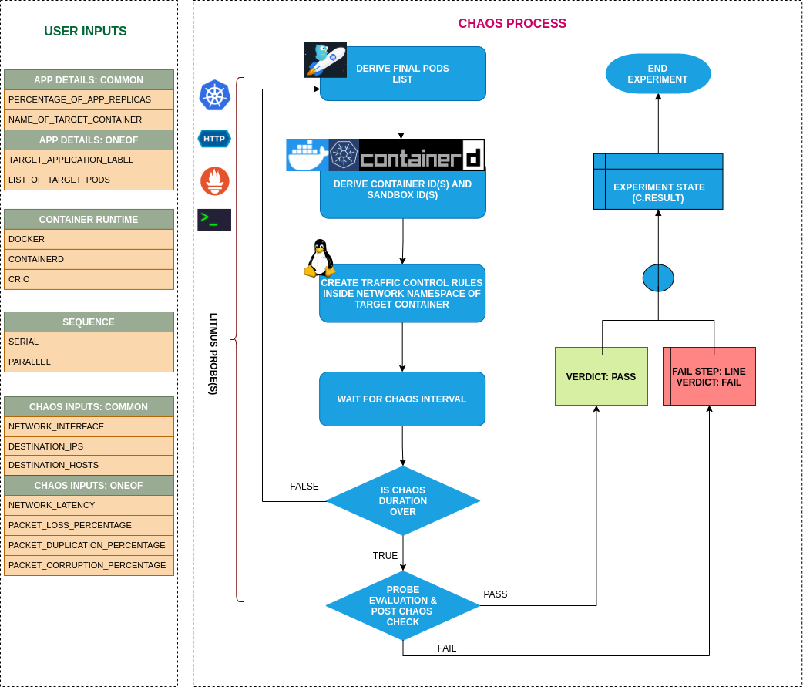

## 개요

CoreDNS I/O Timeout에 영향을 받았던 어플리케이션이 일전에 있었습니다. 그 일이 있고 몇 주 후, 증상을 개선하기 위해 개발자가 DNS timeout시 TCP fallback 관련하여 백엔드 API 파드에 Springboot 및 netty 버전업을 진행하여 DNS timeout 발생시 tcp fallbcak을 적용해주었습니다.

그러나 정말로 개선되었는지 정확하게 알 방법은 없었고, 프로덕션에 배포한 후에야 안다는 것은 위험천만했습니다. 그래서 개발환경에 인위적으로 DNS Timeout 발생이 나도록 장애를 만들어내야만 했습니다. 고민하던 중 Chaos Engineering 도구인 Litmus를 꺼내들었습니다.

&nbsp;

이 가이드는 Litmus를 사용해서 인위적으로 어플리케이션 파드에 UDP/53 포트로 나가는 DNS 쿼리 Timeout을 발생시키는 실험 기록입니다. DevOps 혹은 SRE를 대상으로 작성되었습니다.

&nbsp;

## 환경

- **쿠버네티스 클러스터**: EKS v1.30
- **헬름 차트**: [litmus-core](https://github.com/litmuschaos/litmus-helm/tree/master/charts/litmus-core) 3.18.0 (litmus 앱 버전 3.18.0)

&nbsp;

## 실험하기

### 실험 목적

어플리케이션 파드가 클러스터 내부 DNS(CoreDNS)에 접근할 수 없는 경우, 어플리케이션 코드에 구현된 DNS 폴백 기능이 동작하는지 확인하기 위함이었습니다.



실험 대상은 JVM 기반의 Java Backend Application 입니다.

&nbsp;

### Litmus 설치

Litmus 차트에는 여러 종류가 있는데 크게 litmus 차트와 litmus-core 차트가 있습니다. UI 환경이 필요하다면 litmus 차트를 설치하고, 그렇지 않고 실제 커스텀 리소스를 사용한 실험만 수행하고 싶은 간단한 용도의 경우 litmus-core 차트를 설치합니다.

두 차트의 가장 큰 차이점은 litmus-core 차트는 chaos-operator 컨트롤러만 설치하고 UI는 제공되지 않습니다. litmus 차트는 chaos-operator 컨트롤러와 함께 UI와 기본적인 ChaosEngine과 ChaosExperiment 커스텀 리소스를 설치합니다.


&nbsp;

이 시나리오에서는 litmus-core 차트를 설치합니다.

litmus-core 차트에서 operatorMode를 admin으로 설정하면 대부분의 클러스터 리소스에 대한 접근 권한을 부여합니다. 기본값은 standard 입니다.

```bash
helm repo add litmuschaos https://litmuschaos.github.io/litmus-helm/
helm repo list
```

&nbsp;

litmuschaos 차트 저장소에서 사용할 수 있는 헬름 차트들을 검색합니다.

```bash
helm search repo litmuschaos
```

```bash
NAME                            CHART VERSION   APP VERSION     DESCRIPTION
litmuschaos/kube-aws            3.18.0          3.18.0          A Helm chart to install litmus aws chaos experi...
litmuschaos/kube-azure          3.18.0          3.18.0          A Helm chart to install litmus Azure chaos expe...
litmuschaos/kube-gcp            3.18.0          3.18.0          A Helm chart to install litmus gcp chaos experi...
litmuschaos/kubernetes-chaos    3.18.0          3.18.0          A Helm chart to install litmus chaos experiment...
litmuschaos/litmus              3.16.0          3.16.0          A Helm chart to install ChaosCenter
litmuschaos/litmus-agent        3.16.0          3.16.0          A Helm chart to install litmus agent
litmuschaos/litmus-core         3.18.0          3.18.0          A Helm chart to install litmus infra components...
```

&nbsp;

litmus-core 차트를 litmus 네임스페이스에 설치합니다. `--create-namespace` 옵션을 주면 네임스페이스를 새롭게 생성함과 동시에 차트를 설치해주므로 편리합니다.

```bash
helm install litmus litmuschaos/litmus-core \
  --namespace litmus \
  --create-namespace \
  --set operatorMode=admin
```

헬름 차트의 value 값 중에서 operatorMode를 admin으로 설정하면 litmus operator 파드가 클러스터의 대부분 리소스에 접근이 가능합니다.

&nbsp;

헬름 차트 설치 상태를 확인합니다.

```bash
helm list -n litmus
```

```bash
NAME    NAMESPACE       REVISION        UPDATED                                 STATUS          CHART                   APP VERSION
litmus  litmus          2               2025-04-18 19:38:10.825811 +0900 KST    deployed        litmus-core-3.18.0      3.18.0
```

litmus-core 3.18.0이 litmus 네임스페이스에 설치되었습니다.

&nbsp;

chaos-operator 파드 상태를 확인합니다.

```bash
$ kubectl get pod -n litmus
NAME                      READY   STATUS    RESTARTS   AGE
litmus-6bf57bb645-mfnnf   1/1     Running   0          38m
```

Chaos operator는 litmus에서 가장 중요한 파드로 클러스터 관리자가 선언한 ChaosEngine과 ChaosExperiment 커스텀 리소스를 읽어 실제 시험을 수행할 Runner를 만들고 전체적으로 관리하는 컨트롤 타워 역할을 합니다.

&nbsp;

Litmus에서 사용하는 커스텀 리소스들의 목록을 다음 명령어로 조회할 수 있습니다.

```bash
$ kubectl api-resources --api-group litmuschaos.io
NAME               SHORTNAMES   APIVERSION                NAMESPACED   KIND
chaosengines                    litmuschaos.io/v1alpha1   true         ChaosEngine
chaosexperiments                litmuschaos.io/v1alpha1   true         ChaosExperiment
chaosresults                    litmuschaos.io/v1alpha1   true         ChaosResult
```

&nbsp;

### 파드 네트워크 장애 발생의 원리

대부분의 실험(Experiment), 특히 pod-network-loss는 실험 대상 Pod와 같은 노드에 Helper Pod를 생성합니다. 이 Helper Pod는 막강한 권한(Privileged)을 가진 상태에서, 같은 노드에 있는 대상 컨테이너의 network namespace에 진입해 tc(Traffic Control) 명령어를 실행합니다.


Helper Pod는 대상 파드와 같은 network namespace에 있으므로 대상 파드의 특정 인터페이스에 대해 마치 자신의 인터페이스인 것처럼 명령어를 실행할 수 있습니다.

여기서 tc는 Linux에서 네트워크 트래픽을 제어하기 위한 명령어로, 패킷 손실(loss), 지연(delay), 중복(duplication), 손상(corruption) 등 다양한 네트워크 장애를 시뮬레이션할 수 있습니다. 예를 들어 tc qdisc add dev eth0 root netem loss 100% 와 같이 실행하면, eth0 인터페이스에 대해 100% 패킷 손실을 주입합니다.

```bash
nsenter --net=/proc/<target-pid>/ns/net tc qdisc add dev eth0 root netem loss 100%
```

정리하자면 helper pod는 대상 Pod와 같은 컴퓨터에 임시로 파견되어, 특별(Privileged) 권한으로 대상 Pod의 네트워크 영역에 들어간 다음, tc(traffic control) 도구를 이용해 마치 대상 Pod 내부에서 네트워크 문제를 일으키는 것처럼 행동합니다. 이렇게 해서 대상 Pod가 네트워크 장애 상황에서도 잘 버티는지 안전하게 테스트할 수 있습니다.

&nbsp;

pod-network-loss 실험을 플로우차트로 표현하면 다음과 같습니다.


&nbsp;

### 실험 파일 생성

[pod-network-loss](https://litmuschaos.github.io/litmus/experiments/categories/pods/pod-network-loss/)는 대상 파드에 대해 네트워크 손실을 발생시키는 실험입니다.

> litmus 차트에서 기본적으로 제공되는 실험 중 하나입니다. 그러나 저희는 오퍼레이터만 제공하는 litmus-core 차트를 사용하므로 직접 실험 파일을 생성해야 합니다.

아래 실험을 수행하면 app.kubernetes.io/name=my-backend-pod 라벨을 가진 모든 파드에 UDP/53 포트로 나가는 통신에 대해 10초 동안 Network Loss를 발생시킵니다. 즉 Pod가 일정 시간동안 CoreDNS의 UDP/53 포트로 나가는 통신에 대해 네트워크 손실을 발생시킵니다. pod-network-loss 실험에서 사용 가능한 파라미터는 [Experiment tunables](https://litmuschaos.github.io/litmus/experiments/categories/pods/pod-network-loss/#experiment-tunables) 페이지를 참고합니다.

```yaml
# Set the application pod name to be used in the experiment
POD_NAME=my-backend-pod

# Create YAML file for the experiment
cat <<EOF > dns-fallback-test.yaml
---
apiVersion: litmuschaos.io/v1alpha1
kind: ChaosEngine
metadata:
  name: dns-fallback-test
  namespace: litmus
spec:
  appinfo:
    appns: default
    applabel: "app.kubernetes.io/name=$POD_NAME"
    appkind: deployment
  chaosServiceAccount: litmus-admin
  experiments:
    - name: pod-network-loss
      spec:
        components:
          env:
            - name: PODS_AFFECTED_PERC
              value: "100"
            - name: NETWORK_INTERFACE
              value: "eth0"
            - name: TARGET_CONTAINER
              value: ""
            - name: DESTINATION_PORTS
              value: "53"
            - name: DESTINATION_PROTOCOL
              value: "udp"
            - name: NETWORK_PACKET_LOSS_PERCENTAGE
              value: "100"
            - name: TOTAL_CHAOS_DURATION
              value: "10"
---
apiVersion: litmuschaos.io/v1alpha1
kind: ChaosExperiment
metadata:
  name: pod-network-loss
  namespace: litmus
spec:
  definition:
    scope: Namespaced
    permissions:
      - apiGroups: [""]
        resources: ["pods", "pods/log", "events"]
        verbs: ["get", "list", "create", "delete", "patch"]
    image: "litmuschaos/go-runner:latest"
    args:
      - -c
      - ./experiments -name pod-network-loss
    command:
      - /bin/bash
    env:
      - name: PODS_AFFECTED_PERC
        value: "100"
      - name: NETWORK_INTERFACE
        value: "eth0"
      - name: DESTINATION_PORTS
        value: "53"
      - name: DESTINATION_PROTOCOL
        value: "udp"
      - name: NETWORK_PACKET_LOSS_PERCENTAGE
        value: "100"
      - name: TOTAL_CHAOS_DURATION
        value: "10"
    labels:
      name: pod-network-loss
    configMaps: []
EOF
```

&nbsp;

위 실험이 생성된 후, Litmus Runner 파드가 생성되면서 대상 파드에 지정한 실험을 수행하게 됩니다.

```bash
kubectl apply -f dns-fallback-test.yaml
```

&nbsp;

쿠버네티스 내부 아키텍처로 표현하면 다음과 같이 실행됩니다.



&nbsp;

CoreDNS로 질의가 불가능한 상태이므로 파드에 들어가서 `nslookup` 명령어를 실행하면 실제로 10초동안 타임아웃이 발생하는 걸 확인할 수 있습니다.

```
;; connection timed out; no servers could be reached
```


&nbsp;

만약 다시 실험을 실행하고 싶은 경우, ChaosEngine 리소스의 .spec.engineState 값을 stop에서 active로 다시 바꿉니다.

```bash
apiVersion: litmuschaos.io/v1alpha1
kind: ChaosEngine
metadata:
  name: dns-fallback-test
  namespace: litmus
spec:
  engineState: stop
```

&nbsp;

kubectl patch 명령어로도 다음과 같이 spec.engineState를 다시 active로 바꾸는 것도 동일한 효과를 가집니다.

```bash
kubectl patch chaosengine dns-fallback-test -n litmus --type='merge' -p '{"spec": {"engineState": "active"}}'
```

```bash
chaosengine.litmuschaos.io/dns-fallback-test patched
```

ChaosEngine 리소스의 상태가 다시 active로 변경되면 다시 chaos-runner, helper pod 들이 생성되어 일련의 실험을 다시 수행합니다. 실험이 끝나면 다시 stop 됩니다.

&nbsp;

## 마치며

litmus를 사용하면 자유롭게 DNS Timeout에 대한 실험이 가능합니다. Litmus를 사용해서 파드를 실험하면 정확히 얼마만큼 개선되었는지 증상과 지표를 관측할 수 있습니다.

&nbsp;

## 관련자료

Litmus:

- [litmus github](https://github.com/litmuschaos/litmus)
- [litmus-helm github](https://github.com/litmuschaos/litmus-helm): litmus 차트 레포지터리
- [Experiments](https://litmuschaos.github.io/litmus/experiments/categories/contents/)
- [pod-network-loss](https://litmuschaos.github.io/litmus/experiments/categories/pods/pod-network-loss/): pod-network-loss 실험에 대한 상세 설명