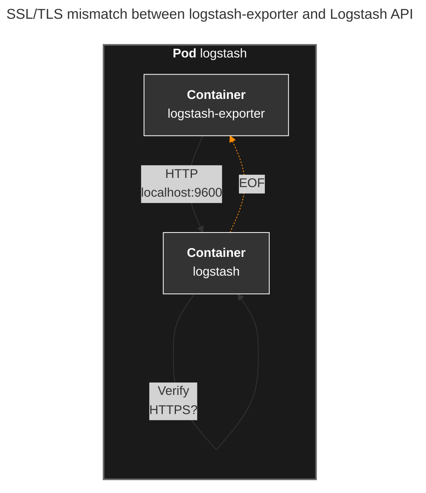

## Overview

When running Logstash on ECK (Elastic Cloud on Kubernetes), you can add [logstash-exporter](https://github.com/kuskoman/logstash-exporter) as a sidecar container to collect Prometheus metrics. This guide explains how to configure logstash-exporter with Logstash 8.17.0.

## Why ECK for Logstash

Elastic directs users to ECK for Kubernetes deployments. The official [Running Logstash on Kubernetes](https://www.elastic.co/docs/reference/logstash/running-logstash-kubernetes) documentation points to ECK rather than providing standalone Kubernetes deployment instructions.

## Environment

- ECK Operator
- Logstash 8.17.0
- logstash-exporter v1.9.1

## Symptom

When the Logstash pod starts, the logstash-exporter sidecar container logs the following errors:

```bash
time=2025-12-24T02:23:59.639Z level=ERROR msg="executor failed" name=nodestats duration=5.243073ms err="Get \"http://localhost:9600/_node/stats\": EOF"
time=2025-12-24T02:23:59.642Z level=ERROR msg="executor failed" name=nodeinfo duration=8.332297ms err="Get \"http://localhost:9600\": EOF"
```

## Cause

This error occurs due to an SSL/TLS mismatch. The exporter sends HTTP requests, but ECK enables SSL on the Logstash API by default.



## Solution

Add the following configuration to your Logstash resource to disable SSL on the API:

```yaml
spec:
  config:
    # Disable SSL for logstash-exporter to scrape metrics via HTTP
    api.ssl.enabled: false
    api.auth.type: none

  services:
  # Disable TLS for API service to match api.ssl.enabled: false
  - name: api
    tls:
      selfSignedCertificate:
        disabled: true
```

### Configuration Details

Key settings to disable SSL on the Logstash API:

- `api.ssl.enabled: false`: Disables SSL on the Logstash API endpoint, allowing HTTP connections.
- `api.auth.type: none`: Disables authentication for the API.
- `services[].tls.selfSignedCertificate.disabled: true`: Prevents ECK from generating and applying a self-signed certificate to the API service.

## Full Example

Below is a complete Logstash 8.17.0 resource with SSL settings configured for logstash-exporter.

> Running Logstash on ECK is compatible only with Logstash 8.7+. See [ECK Logstash documentation](https://www.elastic.co/guide/en/cloud-on-k8s/current/k8s-logstash.html) for details.

> **Note**: This example uses a custom Logstash image hosted on Amazon ECR. The custom image was built to include the [OpenSearch output plugin](https://github.com/opensearch-project/logstash-output-opensearch), which is not included in the official Logstash image by default.

```yaml
apiVersion: logstash.k8s.elastic.co/v1alpha1
kind: Logstash
metadata:
  annotations:
    eck.k8s.elastic.co/license: basic
  labels:
    app.kubernetes.io/instance: eck-stack
    app.kubernetes.io/managed-by: Helm
    app.kubernetes.io/name: eck-logstash
    helm.sh/chart: eck-logstash-0.17.0
  name: logstash-opensearch
  namespace: elastic-system
spec:
  config:
    # Disable SSL for logstash-exporter to scrape metrics via HTTP
    api.ssl.enabled: false
    api.auth.type: none
    api.http.host: 0.0.0.0
    log.level: info
    pipeline.batch.delay: 50
    pipeline.batch.size: 125
    pipeline.workers: 2
  count: 3
  elasticsearchRefs: []
  pipelines:
  - config.string: |
      # Your pipeline configuration here
  podTemplate:
    metadata:
      labels:
        app: logstash-opensearch
    spec:
      containers:
      - image: <ACCOUNT_ID>.dkr.ecr.ap-northeast-2.amazonaws.com/logstash:8.17.0-opensearch-plugin
        name: logstash
        resources:
          limits:
            memory: 2Gi
          requests:
            cpu: 300m
            memory: 1Gi
      - env:
        - name: LOGSTASH_URL
          value: http://localhost:9600
        image: ghcr.io/kuskoman/logstash-exporter:v1.9.1
        name: logstash-exporter
        ports:
        - containerPort: 9198
          name: metrics
          protocol: TCP
        resources:
          limits:
            memory: 64Mi
          requests:
            cpu: 10m
            memory: 32Mi
  revisionHistoryLimit: 2
  secureSettings: []
  services:
  # Disable TLS for API service to match api.ssl.enabled: false
  - name: api
    tls:
      selfSignedCertificate:
        disabled: true
  - name: metrics
    service:
      spec:
        ports:
        - name: metrics
          port: 9198
          protocol: TCP
          targetPort: 9198
        type: ClusterIP
  version: 8.17.0
  volumeClaimTemplates: []
```

## Verification

After applying the configuration, verify that logstash-exporter is working correctly:

```bash
kubectl logs -n elastic-system <LOGSTASH_POD_NAME> -c logstash-exporter
```

The error logs should disappear, and Prometheus should collect metrics normally.

## Dashboard

Once configured, you can use the [Logstash on Kubernetes Dashboard](https://grafana.com/grafana/dashboards/18628-logstash-on-kubernetes-dashboard/) for Grafana to monitor your Logstash metrics.

## Related Links

- [logstash-exporter](https://github.com/kuskoman/logstash-exporter)
- [ECK Logstash](https://www.elastic.co/guide/en/cloud-on-k8s/current/k8s-logstash.html)
- [Logstash on Kubernetes Dashboard](https://grafana.com/grafana/dashboards/18628-logstash-on-kubernetes-dashboard/)
