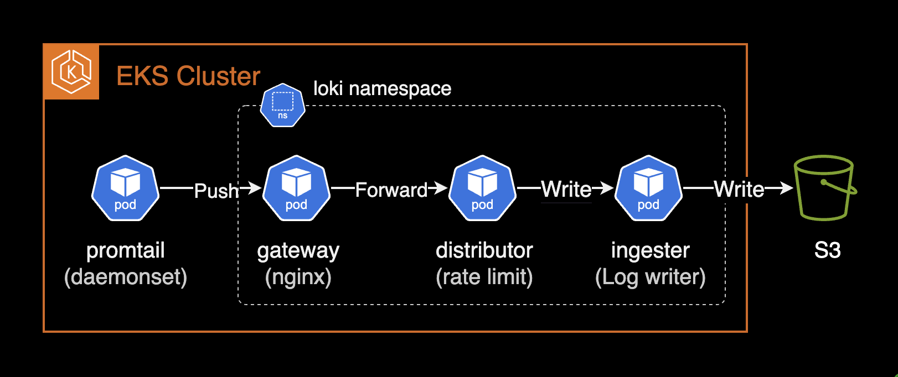

## 개요

loki 3.0.0+ 버전에서 튜닝 및 모범사례를 소개합니다.

&nbsp;

## 환경

- **클러스터**: EKS 1.30
- **loki**: 3.3.1 (helm chart)

&nbsp;

## 주의사항

### loki-distributed의 지원 중단(deprecated)

`loki-distributed` 차트는 2.9.x에서 업데이트가 중단되며, 사용을 권장하지 않습니다. 대신, Grafana Labs와 Loki 커뮤니티가 유지 관리하는 [공식 권장 `loki` 차트](https://github.com/grafana/loki/tree/main/production/helm/loki)를 사용하는 것이 좋습니다. `loki` 차트 권장사항은 [여기](https://github.com/grafana/helm-charts/tree/main/charts/loki)에서 확인할 수 있습니다. 분산 모드(마이크로서비스) 지원에 대한 릴리즈 노트는 [여기](https://github.com/grafana/loki/releases/tag/v3.0.0)에서 직접 확인할 수 있습니다.

아래는 [loki 3.0.0 릴리즈 노트](https://github.com/grafana/loki/releases/tag/v3.0.0)에서 언급된 내용 중 일부입니다.

> Helm charts: A major upgrade to the Loki helm chart introduces support for Distributed mode (microservices), includes memcached by default, and includes several updates to configurations to improve Loki operations.

`loki` 3.0.0 이상부터 분산(distributed) 모드로 `loki`를 운영하려면 `deploymentMode`를 `Distributed`로 설정합니다. 기본값은 `SimpleScalable` 입니다.

```yaml
# charts/loki/values.yaml (loki +3.0.0)
deploymentMode: Distributed
```

`loki-distributed` 차트의 지원중단에 대한 자세한 내용은 [#3086 이슈](https://github.com/grafana/helm-charts/issues/3086)에서 확인할 수 있습니다.

&nbsp;

## 설정 가이드

### 분산 모드 (loki)

loki 3.0.0 이전에는 분산 모드로 loki를 배포하려면 `loki-distributed` 차트를 사용해야 했습니다. 그러나 loki 3.0.0 이상부터는 `loki` 차트에서 분산 모드를 자체적으로 지원하므로 `loki-distributed` 차트를 사용하지 않아도 분산 모드로 loki를 배포할 수 있습니다. 자세한 내용은 [grafana/helm-charts #3086](https://github.com/grafana/helm-charts/issues/3086)에서 확인할 수 있습니다.

`loki`의 설치 모드를 설정하는 값은 `deploymentMode` 입니다. `deploymentMode` 값을 `Distributed`로 설정하면 분산 모드(microservice mode)로 설치됩니다. 안정적이고 확장 가능한 운영을 위해 분산 모드로 운영하는 것을 권장합니다.

```yaml
# charts/loki/values.yaml (loki v3.3.1)
deploymentMode: Distributed
```

더 높은 수준의 쿼리 성능을 얻으려면 Loki를 Simple Scalable 또는 마이크로서비스(Distributed) 모드로 실행해야 합니다.

분산 모드를 사용하게 되면 로그 쓰기 부하가 높을 경우 로그 저장을 담당하는 `ingester` 파드만 늘리는 등의 유연한 확장 및 운영이 가능합니다.

&nbsp;

### 오브젝트 스토리지 설정 (loki)

> 관련 문서: [Configure storage](https://grafana.com/docs/loki/latest/setup/install/helm/configure-storage/)

Loki의 설치 모드(`deploymentMode`)에 따라 사용할 수 있는 스토리지 유형이 다릅니다.

`SimpleScalable` 또는 `Distributed` 모드에서는 AWS S3 또는 Google Cloud Storage와 같은 관리형 개체 저장소나 Minio와 같은 자체 호스팅 저장소가 필요합니다.

`SingleBinary` 모드에서는 파일 시스템만 사용할 수 있습니다.

각 설치모드별 사용 가능한 스토리지 유형은 다음과 같습니다.

| 설치 모드 | 저장소 유형 |
|--|--|
| SingleBinary | 파일 시스템 |
| SimpleScalable | 오브젝트 스토리지 (AWS S3, GCS 등) |
| Distributed | 오브젝트 스토리지 (AWS S3, GCS 등) |

&nbsp;

[Storage](https://grafana.com/docs/loki/latest/configure/storage/#aws-deployment-s3-single-store) 문서를 참고하여 Loki에서 사용할 S3 버킷에 대한 접근 권한을 부여하는 IAM Policy를 생성하고 IAM Role에 연결합니다.

```json
{
    "Version": "2012-10-17",
    "Statement": [
        {
            "Sid": "LokiStorage",
            "Effect": "Allow",
            "Principal": {
                "AWS": [
                    "arn:aws:iam::<ACCOUNT_ID>"
                ]
            },
            "Action": [
                "s3:ListBucket",
                "s3:PutObject",
                "s3:GetObject",
                "s3:DeleteObject"
            ],
            "Resource": [
                "arn:aws:s3:::<BUCKET_NAME>",
                "arn:aws:s3:::<BUCKET_NAME>/*"
            ]
        }
    ]
}
```

Loki를 구성하는 파드들이 S3 버킷에 오브젝트를 쓰고, 읽고, 삭제할 수 있는 권한을 부여합니다.

&nbsp;

`loki` 파드들이 사용할 service account 계정에 S3 버킷 접근 권한을 부여합니다.

```yaml
# charts/loki/values.yaml (loki v3.3.1)
serviceAccount:
  create: true
  name: null
  imagePullSecrets: []
  annotations:
    eks.amazonaws.com/role-arn: arn:aws:iam::<ACCOUNT_ID>:role/<ROLE_NAME>
  labels: {}
  automountServiceAccountToken: true
```

&nbsp;

기본적으로 `serviceAccount.name` 값이 null인 경우, `loki` 차트 이름과 동일한 이름의 `serviceAccount` 리소스가 생성됩니다.

```bash
$ kubectl get serviceaccount -n loki
NAME   SECRETS   AGE
loki   0         2d19h
```

&nbsp;

`bucketNames` 값에 로그를 저장할 S3 버킷 이름을 설정합니다. `region` 값에 버킷이 위치한 리전을 설정합니다.

```yaml
# charts/loki/values.yaml (loki v3.3.1)
loki:
  storage:
    bucketNames:
      chunks: <BUCKET_NAME>
      ruler: <BUCKET_NAME>
      admin: <BUCKET_NAME>
    type: s3
    s3:
      s3: null
      endpoint: null
      region: ap-northeast-2
      secretAccessKey: null
      accessKeyId: null
      signatureVersion: null
      s3ForcePathStyle: false
      insecure: false
      http_config: {}
      backoff_config: {}
      disable_dualstack: false
```

&nbsp;

### 로그 보관주기 (compactor)

> 관련 문서: [Log retention](https://grafana.com/docs/loki/latest/operations/storage/retention/)

Loki에서 로그 보관주기(log retention)은 `compactor` 컴포넌트 또는 `table-manager` 컴포넌트를 통해 수행됩니다.

&nbsp;

#### table-manager (deprecated)

table-manager는 사용 중단(deprecated)되었으며 조만간 loki에서 삭제될 예정이므로 레거시 인덱스 타입에 의해 불가피한 경우가 아닌 이상 compactor를 사용해야만 합니다.

Loki v3.3.x 버전 기준으로 레거시 인덱스 목록은 [다음](https://grafana.com/docs/loki/v3.3.x/configure/storage/#index-storage) 문서에서 확인할 수 있습니다.

- Cassandra (Deprecated)
- BigTable (Deprecated)
- DynamoDB (Deprecated)
- BoltDB (Deprecated)

Loki가 위 목록의 인덱스 타입을 사용하는 경우, compactor는 레거시 인덱스 타입을 처리할 수 없기 때문에 table-manager를 사용해야 합니다.

&nbsp;

#### compactor

기본적으로, loki 3.3.1 차트에서 compactor 컴포넌트(파드)는 비활성화되어 있습니다. 이는 한 번 저장된 로그를 영구 보관(live forever)한다는 의미입니다.

```yaml
# charts/loki/values.yaml (loki v3.3.1)
compactor:
  replicas: 0
```

&nbsp;

로그의 보관주기를 `compactor` 컴포넌트(파드)가 처리할 수 있게 `compactor` 파드가 존재해야 합니다. `compactor` 파드의 레플리카 수를 1 이상으로 설정해야 합니다.

```yaml
# charts/loki/values.yaml (loki v3.3.1)
compactor:
  replicas: 1
```

주의 할 점은 `compactor` 파드는 싱글톤(단일 인스턴스)으로 운영되어야 하므로 레플리카를 반드시 1로 설정해야 합니다.

&nbsp;

`loki` 차트 설정 파일에 `compactor` 설정을 추가합니다. 기본적으로 `compactor` 블록에는 어떠한 추가 설정도 없습니다.

```yaml
# charts/loki/values.yaml (loki v3.3.1)
loki:
  compactor: {}
```

`limits_config.retention_period` 값을 설정하여 로그의 보관주기를 설정할 수 있습니다. (e.g. `168h`, `7d`)

```yaml
# charts/loki/values.yaml (loki v3.3.1)
loki:
  limits_config:
    retention_period: 7d

  compactor:
    working_directory: /var/loki/compactor
    compaction_interval: 10m
    retention_enabled: true
    retention_delete_delay: 2h
    retention_delete_worker_count: 150
    delete_request_store: s3
```

`retention_enabled`를 `true`로 설정합니다. 이 설정이 없는 경우 compactor는 테이블 압축만 `compaction_interval` 시간(위 설정의 경우는 10분)마다 수행합니다.

&nbsp;

로그 보관주기(retention) 기능은 인덱스 기간(`index.period`)이 24시간인 경우에만 가능합니다. 단일 저장소 TSDB와 단일 저장소 BoltDB는 24시간 인덱스 기간이 필요합니다.

```yaml {hl_lines=[11]}
# charts/loki/values.yaml (loki v3.3.1)
loki:
  schemaConfig:
    configs:
    - from: "2024-08-01"
      store: tsdb
      object_store: s3
      schema: v13
      index:
        prefix: loki_index_
        period: 24h
```

> 중요: Loki에서 로그 보관주기(log retention) 기능은 인덱스 기간(period)이 24h인 경우에만 사용할 수 있습니다.

&nbsp;

차트 설정을 업그레이드한 이후에는 `compactor` 파드 내의 Loki 설정 파일이 올바르게 적용되었는지 확인합니다.

```bash
kubectl exec -it loki-compactor-0 -n loki \
  -- cat /etc/loki/config/config.yaml
```

```yaml
compactor:
  compaction_interval: 10m
  delete_request_store: s3
  retention_delete_delay: 2h
  retention_delete_worker_count: 150
  retention_enabled: true
  working_directory: /var/loki/compactor

limits_config:
  # ... omitted for brevity ...
  retention_period: 7d
```

&nbsp;

### 인코딩 방식 (ingester)

`chunk_encoding`은 저장소에 있는 청크에 어떤 압축 알고리즘을 사용할지 결정합니다. loki 3.3.x는 인코딩 방식으로 아래 알고리즘을 지원합니다.

- none
- gzip (기본값)
- lz4-64k
- **snappy** (권장)
- lz4-256k
- lz4-1M
- lz4
- flate
- zstd

&nbsp;

`chunk_encoding`의 기본값은 `gzip` 입니다.

```yaml
# The algorithm to use for compressing chunk. (none, gzip, lz4-64k, snappy,
# lz4-256k, lz4-1M, lz4, flate, zstd)
# CLI flag: -ingester.chunk-encoding
[chunk_encoding: <string> | default = "gzip"]
```

압축 비율은 `gzip`이 좋지만 `snappy`가 더 빠른 압축 해제 속도로 인해 쿼리 속도가 더 빠르므로 `snappy` 사용을 권장합니다.

&nbsp;

기본적으로 ingester에 추가 설정은 `ingester` 블록에 추가할 수 있습니다.

```yaml
# charts/loki/values.yaml (loki v3.3.1)
loki:
  ingester: {}
```

&nbsp;

`chunk_encoding`을 `snappy`로 설정합니다.

```yaml
# charts/loki/values.yaml (loki v3.3.1)
loki:
  ingester:
    chunk_encoding: snappy
```

&nbsp;

`ingester` 파드가 정상적으로 배포된 이후에는 `chunk_encoding` 설정을 확인합니다. 파드의 `loki` 설정 파일은 `/etc/loki/config/config.yaml` 경로에 위치합니다.

```bash
kubectl exec -it loki-ingester-0 -n loki \
  -- cat /etc/loki/config/config.yaml
```

```yaml
ingester:
  autoforget_unhealthy: true
  chunk_encoding: snappy
```

&nbsp;

### Ring 문제 (ingester)

`found an existing instance(s) with a problem in the ring, this instance cannot become ready until this problem is resolved` 에러가 발생하며 `ingester` 컴포넌트(파드)가 정상적으로 Ready 상태가 되지 않는 경우가 있습니다.

이 경우 `ingester` 파드의 로그를 확인하여 문제를 파악할 수 있습니다.

```bash
kubectl logs -f -l app.kubernetes.io/component=ingester -n loki
```

```bash
ingester level=warn ts=2024-12-11T04:40:53.584292755Z caller=lifecycler.go:295 component=ingester msg="found an existing instance(s) with a problem in the ring, this instance cannot become ready until this problem is resolved. The /ring http endpoint on the distributor (or single binary) provides visibility into the ring." ring=ingester err="instance 10.xxx.xx.xx:9095 past heartbeat timeout"
ingester level=info ts=2024-12-11T04:40:54.4740062Z caller=recalculate_owned_streams.go:49 msg="starting recalculate owned streams job"
ingester level=info ts=2024-12-11T04:40:54.474045121Z caller=recalculate_owned_streams.go:52 msg="completed recalculate owned streams job"
ingester level=warn ts=2024-12-11T04:41:03.583340445Z caller=lifecycler.go:295 component=ingester msg="found an existing instance(s) with a problem in the ring, this instance cannot become ready until this problem is resolved. The /ring http endpoint on the distributor (or single binary) provides visibility into the ring." ring=ingester err="instance 10.xxx.xx.xxx:9095 past heartbeat timeout"
```

`ingester`의 `autoforget_unhealthy` 값을 활성화(`true`)하면 첫 번째 인제스터가 세트의 다른 인제스터와 연락할 수 없어서 준비 상태를 보고하지 못하고, 다른 인제스터는 첫 번째 인스턴스가 준비 상태를 보고할 때까지 시작하도록 예약되지 않습니다.

아래는 `loki` 공식문서에 언급된 `autoforget_unhealthy` 설정 예시입니다.

```yaml
# Forget about ingesters having heartbeat timestamps older than
# `ring.kvstore.heartbeat_timeout`. This is equivalent to clicking on the
# `/ring` `forget` button in the UI: the ingester is removed from the ring. This
# is a useful setting when you are sure that an unhealthy node won't return. An
# example is when not using stateful sets or the equivalent. Use
# `memberlist.rejoin_interval` > 0 to handle network partition cases when using
# a memberlist.
# CLI flag: -ingester.autoforget-unhealthy
[autoforget_unhealthy: <boolean> | default = false]
```

&nbsp;

`ingester` 설정에 `autoforget_unhealthy` 값을 `true`로 설정하여 `ingester` 컴포넌트(파드)가 정상적으로 동작하도록 할 수 있습니다. `loki` 차트 설정 파일에 다음과 같이 추가합니다.

```bash
# charts/loki/values.yaml (loki v3.3.1)
loki:
  ingester:
    autoforget_unhealthy: true
```

설정 변경 후 `ingester` 파드가 정상적으로 동작하는 것을 확인합니다.

```bash
kubectl logs -f -l app.kubernetes.io/component=ingester -n loki
```

`autoforget`이 활성화되어 문제가 있는 `ingester` 파드가 링에서 제거되는 것을 로그에서 확인할 수 있습니다.

```bash
ingester level=info ts=2024-12-11T04:53:52.685236391Z caller=lifecycler.go:702 component=ingester msg="instance not found in ring, adding with no tokens" ring=ingester
ingester level=info ts=2024-12-11T04:53:52.685280922Z caller=lifecycler.go:544 component=ingester msg="auto-joining cluster after timeout" ring=ingester
ingester level=info ts=2024-12-11T04:53:52.685301674Z caller=wal.go:156 msg=started component=wal
ingester level=info ts=2024-12-11T04:53:52.68534822Z caller=ingester.go:759 component=ingester msg="sleeping for initial delay before starting periodic flushing" delay=22.885119205s
ingester level=info ts=2024-12-11T04:53:52.685367155Z caller=ingester.go:454 component=ingester msg="autoforget is enabled and will remove unhealthy instances from the ring after 1m0s with no heartbeat"
ingester level=info ts=2024-12-11T04:53:52.685380651Z caller=loki.go:542 msg="Loki started" startup_time=85.227413ms
ingester level=info ts=2024-12-11T04:53:52.707801515Z caller=memberlist_client.go:588 phase=startup msg="joining memberlist cluster succeeded" reached_nodes=4 elapsed_time=23.116219ms
ingester level=info ts=2024-12-11T04:54:22.686182698Z caller=recalculate_owned_streams.go:49 msg="starting recalculate owned streams job"
ingester level=info ts=2024-12-11T04:54:22.68622013Z caller=recalculate_owned_streams.go:63 msg="detected ring changes, re-evaluating streams ownership"
ingester level=info ts=2024-12-11T04:54:22.686225439Z caller=recalculate_owned_streams.go:52 msg="completed recalculate owned streams job"
ingester level=info ts=2024-12-11T04:54:52.61427673Z caller=table_manager.go:136 index-store=tsdb-2024-08-01 msg="uploading tables"
```

&nbsp;

### 필수 세팅 (ingester)

> 관련 문서: [The essential config settings you should use so you won’t drop logs in Loki](https://grafana.com/blog/2021/02/16/the-essential-config-settings-you-should-use-so-you-wont-drop-logs-in-loki/)

다음은 Loki의 가동 시간과 고가용성 보장을 유지하는 데 중요한 ingester의 몇 가지 구성 설정입니다.

&nbsp;

#### `heartbeat_timeout` (ingester)

`heartbeat_timeout` 설정은 ingester(로그 데이터를 처리하는 노드)가 일정 시간 동안 응답하지 않을 때, 더 이상 해당 노드로 로그 데이터를 보내지 않고 건너뛰는 시간을 의미합니다. 이 설정이 중요한 이유는, 링(ring)이라는 구조에서 모든 ingester가 일정 시간 동안 응답하지 않으면, 그 시간 이후에는 모든 노드가 건너뛰어져서 클러스터 전체에서 로그 데이터를 받을 수 없게 되어 데이터 수집이 중단될 수 있기 때문입니다.

따라서, heartbeat timeout을 너무 짧게 설정하면 잠깐의 네트워크 지연이나 일시적인 문제로 인해 로그 수집이 중단될 위험이 있습니다. 반대로, 너무 길게 설정하면 실제로 문제가 있는 ingester가 너무 오랜 시간 동안 데이터를 받으려 시도하다가 문제가 확산될 수 있습니다. heartbeat_timeout을 10분(`10m`)으로 설정할 것을 권장하며, 이는 링이 비정상적으로 응답하지 않을 경우(예: Consul이 중지되었다가 다시 시작되는 경우)에도 충분히 복구될 수 있는 시간을 확보하기 위함입니다.

`loki` 차트에서 `heartbeat_timeout`을 10분으로 설정한 예시입니다.

```yaml
# charts/loki/values.yaml (loki v3.3.1)
loki:
  ingester:
    lifecycler:
      ring:
        heartbeat_timeout: 10m
```

&nbsp;

별도로 `heartbeat_timeout`을 선언하지 않은 경우, heartbeat_timeout은 기본값 1분(`1m`)으로 설정됩니다.

```yaml
# The heartbeat timeout after which ingesters are skipped for reads/writes.
# 0 = never (timeout disabled).
# CLI flag: -ring.heartbeat-timeout
[heartbeat_timeout: <duration> | default = 1m]
```

&nbsp;

#### `replication_factor` (ingester)

`ingester`의 RF(Replication Factor)는 기본값인 `3`을 권장합니다. 기본값이 이미 3이라 별도로 설정할 필요는 없지만, 명시적으로 선언하고 싶으면 아래와 같이 `ingester` 블록에 추가하세요.

```yaml
# charts/loki/values.yaml (loki v3.3.1)
loki:
  ingester:
    lifecycler:
      ring:
        replication_factor: 3
```

&nbsp;

### Rate Limit (distributor)

> 관련 문서: [Rate-Limit Errors](https://grafana.com/docs/loki/latest/operations/request-validation-rate-limits/#rate-limit-errors)

Loki에서 테넌트가 설정된 로그 수집 속도 제한을 초과하면 `rate_limited` 에러가 발생합니다. `loki` 차트에서 `distributor` 파드(컴포넌트)는 테넌트당 최대 데이터 수집 속도를 기준으로 들어오는 로그의 속도를 제한할 수도 있습니다.



이 문제를 해결하기 위한 한 가지 방법은 Loki 클러스터의 속도 제한 설정을 증가시키는 것입니다. 이러한 제한은 `limits_config` 블록에서 전역적으로 수정하거나, runtime overrides 파일에서 테넌트별로 조정할 수 있습니다. 사용할 수 있는 설정 옵션은 `ingestion_rate_mb`와 `ingestion_burst_size_mb` 입니다.

이와 함께 Loki 클러스터가 이러한 높은 한도를 처리할 수 있도록 충분한 리소스가 프로비저닝되어 있는지 확인해야 합니다. 그렇지 않으면, 더 많은 로그 라인을 처리하려다 클러스터의 성능 저하가 발생할 수 있습니다.

&nbsp;

로그를 수집하는 promtail에서 아래와 같은 Rate Limit에 의한 거부 에러가 발생할 수 있습니다.

```bash
server returned HTTP status 429 Too Many Requests (429): Maximum active stream limit exceeded, reduce the number of active streams (reduce labels or reduce label values), or contact your Loki administrator to see if the limit can be increased
```

&nbsp;

loki의 rate limit 기본 설정은 다음과 같습니다.

```yaml
# charts/loki/values.yaml
loki:
  limits_config:
    ingestion_rate_mb: 4
    ingestion_burst_size_mb: 6
```

&nbsp;

기본값으로 운영하면 promtail이 로그를 보낼 때 간헐적으로 loki 서버에 의해 스로틀링이 걸릴 수 있습니다. 이 때 promtail에서 `429 Too Many Requests` 에러가 발생합니다. 다음과 같이 기본 20MB, burst size 30MB로 늘려서 운영하는 걸 권장합니다.

```yaml
# charts/loki/values.yaml
loki:
  limits_config:
    ingestion_rate_mb: 20
    ingestion_burst_size_mb: 30
```

&nbsp;

설정 변경 후에는 항상 `gateway` 파드로 정상적인 로그 쓰기(push) 요청이 들어오는지, 상태는 정상인지 관측하게 중요합니다.

```bahs
kubectl logs -n loki -l app.kubernetes.io/component=gateway -f \
  | grep '/loki/api/v1/push'
```

```bash
10.xx.xxx.xxx - - [14/Dec/2024:03:35:13 +0000]  204 "POST /loki/api/v1/push HTTP/1.1" 0 "-" "promtail/2.9.8" "10.xx.xxx.xxx"
10.xx.xxx.xxx - - [14/Dec/2024:03:35:23 +0000]  204 "POST /loki/api/v1/push HTTP/1.1" 0 "-" "promtail/2.9.8" "10.xx.xxx.xxx"
10.xx.xxx.xx - - [14/Dec/2024:03:35:33 +0000]  204 "POST /loki/api/v1/push HTTP/1.1" 0 "-" "promtail/2.9.8" "10.xx.xxx.xxx"
```

&nbsp;

Rate Limit 관련한 자세한 사항은 아래 2개 Loki 공식문서를 참고합니다.

- [Distributor](https://grafana.com/docs/loki/latest/get-started/components/#distributor)
- [Rate-Limit Errors](https://grafana.com/docs/loki/latest/operations/request-validation-rate-limits/#rate-limit-errors)

&nbsp;

## 관련자료

**Loki 공식 모범사례 가이드 글**

- [Configuration best practices](https://grafana.com/docs/loki/latest/configure/bp-configure/)
- [The essential config settings you should use so you won’t drop logs in Loki](https://grafana.com/blog/2021/02/16/the-essential-config-settings-you-should-use-so-you-wont-drop-logs-in-loki/)

**Loki**

- [설정 파라미터 가이드](https://grafana.com/docs/loki/latest/configure/#grafana-loki-configuration-parameters)
- [Recommendation for loki helm chart](https://github.com/grafana/loki/tree/main/production/helm/loki)
- [Rate-Limit Errors](https://grafana.com/docs/loki/latest/operations/request-validation-rate-limits/#rate-limit-errors)
