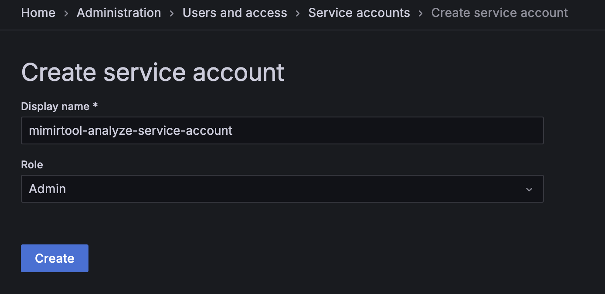
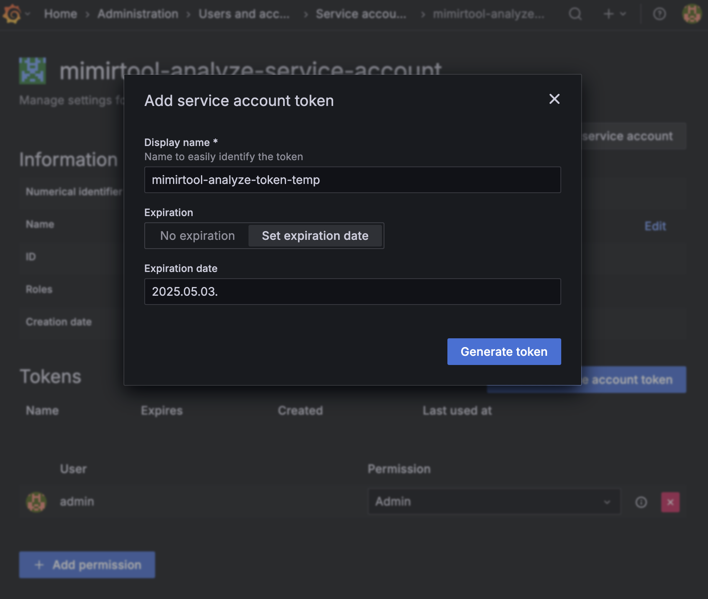
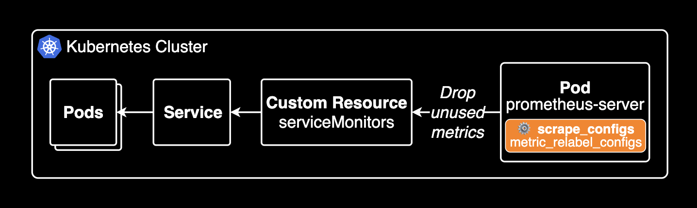
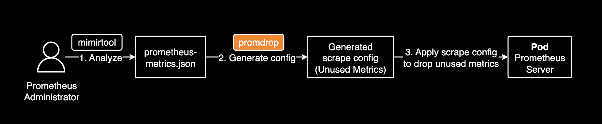
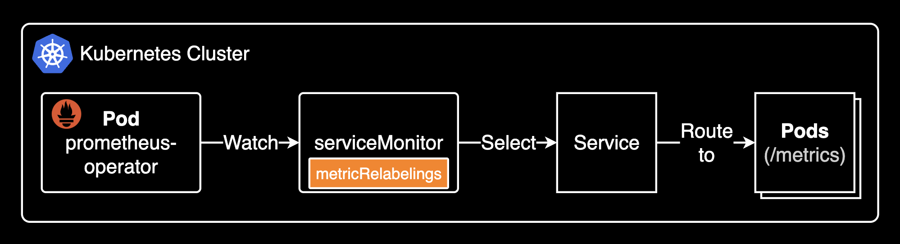
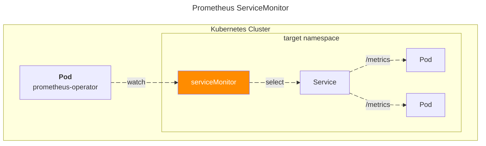

## 개요

Prometheus는 강력한 모니터링 시스템이지만, 시간이 지남에 따라 Grafana 대시보드나 Alertmanager 규칙에서 실제로 사용되지 않는 메트릭이 많이 쌓일 수 있습니다. 이렇게 사용되지 않는 메트릭은 저장 공간을 낭비하고 쿼리 성능을 저하시키며, 전반적인 시스템 복잡도를 높입니다. 또한 메트릭 수집 비용과 데이터 전송 비용도 증가합니다.

&nbsp;

이 문서는 Grafana Labs에서 제공하는 `mimirtool`을 사용하여 사용하지 않는 Prometheus 메트릭을 식별하는 과정을 안내합니다. `mimirtool`은 Grafana 대시보드와 Prometheus 규칙(Recording/Alerting)을 분석하여 실제로 어떤 메트릭이 사용 중인지 파악하고, 이를 Prometheus 인스턴스의 전체 메트릭과 비교하여 미사용 메트릭 목록을 생성합니다. 이 정보를 바탕으로 불필요한 메트릭 수집을 중단하여 Prometheus 환경을 최적화할 수 있습니다.

&nbsp;

## 환경

이 문서에서 사용된 쿠버네티스 및 Prometheus 환경은 다음과 같습니다.

- [**mimirtool**](https://grafana.com/docs/mimir/latest/manage/tools/mimirtool/): v2.16.0
- [**kube-prometheus-stack**](https://github.com/prometheus-community/helm-charts/tree/main/charts/kube-prometheus-stack): 공식 Helm 차트로 설치 (Prometheus v3.2.1 포함)
- **Kubernetes**: v1.32

&nbsp;

## TLDR

- **대상 독자:**
  - 쿠버네티스 환경에서 프로메테우스 모니터링 시스템을 관리하는 DevOps, SRE, 플랫폼 엔지니어
  - 프로메테우스 성능, 저장 공간, 비용을 최적화하려는 분
  - Grafana Labs의 `mimirtool` 사용법이 궁금하신 분
- **얻을 수 있는 이점:**
  - `mimirtool`을 사용하여 Grafana 대시보드 및 프로메테우스 규칙에서 실제로 사용되지 않는 메트릭을 식별하는 방법을 배웁니다.
  - 사용 중인 메트릭과 미사용 메트릭 목록을 생성하는 전체 과정을 이해합니다.
  - `promdrop` 같은 도구를 활용하여 프로메테우스 설정에서 미사용 메트릭 수집을 중단하는 방법을 알아봅니다.
  - 프로메테우스 리소스 사용량(저장 공간, 쿼리 성능)을 최적화하고 비용을 절감할 수 있습니다.

&nbsp;

## 설정 가이드

### mimirtool 설치

Mimirtool로 사용하지 않는 메트릭을 정리하기 위해서는 다음 도구가 필요합니다.

- kubectl
- [mimirtool](https://grafana.com/docs/mimir/latest/manage/tools/mimirtool/): 메트릭 분석 도구로 Grafana와 Prometheus의 메트릭을 비교해 사용중인 메트릭과 사용하지 않는 메트릭을 찾아낼 수 있습니다.
- jq: JSON 파일 처리 도구

&nbsp;

로컬 환경에 mimirtool을 설치하려면 다음 명령을 실행합니다.

```bash
brew install mimirtool
```

```bash
$ mimirtool version
Mimirtool, version 2.16.0 (branch: HEAD, revision: b4f36dac3a)
  go version:       go1.24.1
  platform:         darwin/arm64
checking latest version... You are on the latest version
```

&nbsp;

### Grafana 메트릭 분석

`kubectl` 명령어에서 Grafana 및 Prometheus 파드 이름을 쉽게 참조하기 위해 환경 변수를 설정합니다. 이 환경 변수들은 잠시 후 포트 포워딩을 위해 사용됩니다.

```bash
# kubectl get po -n monitoring | grep -E 'prometheus|grafana'
export GRAFANA_POD="kube-prometheus-stack-grafana-0"
export PROMETHEUS_POD="prometheus-kube-prometheus-stack-prometheus-0"
```

&nbsp;

Grafana에서 사용하는 메트릭 목록을 분석하려면 Admin 권한을 가진 서비스 계정을 생성해야 합니다. 이 계정은 Grafana에서 사용되는 메트릭을 수집하는 데 사용됩니다.

&nbsp;

Grafana에 접근이 가능한 경우, https://your-grafana.domain.com/org/serviceaccounts 에서 Admin 권한을 가진 서비스 계정을 생성합니다.

만약 Grafana 파드에 접근이 불가능한 경우, 다음 명령을 실행하여 Grafana 파드에 대한 포트 포워딩을 시작합니다.

```bash
# Run port-forward grafana pod in a separate terminal
kubectl port-forward ${GRAFANA_POD} -n monitoring 3000:3000
```

&nbsp;

아래 URL에서 Service Account를 생성한 후, Service Account Token을 발급합니다.

```bash
open http://localhost:3000/org/serviceaccounts
```

&nbsp;

`/org/serviceaccounts`에 접속해서 Service Account를 생성합니다. 역할(Role)은 Admin으로 설정합니다.



참고로 Grafana에서 API 키는 더 이상 지원되지 않습니다. 이제 HTTP API 인증 및 Grafana와의 상호 작용을 위해 서비스 계정(service account)이 API 키를 대체합니다.



mimirtool은 미사용 메트릭을 찾아내기 위해 일시적으로 Service Account Token을 사용하기 때문에 토큰의 유효기간을 3일 미만으로 설정하는 걸 권장합니다.

&nbsp;

Service Account Token을 GRAFANA_SA_TOKEN 환경 변수에 저장합니다. Service Account Token은 생성한 직후 한번만 표시되므로 반드시 저장해야 합니다.

```bash
GRAFANA_SA_TOKEN="glsa_<YOUR_SERVICE_ACCOUNT_TOKEN>"
```

&nbsp;

Grafana 대시보드에서 사용되는 메트릭 목록을 분석하려면 다음 명령을 실행합니다.

```bash
mimirtool analyze grafana --address=http://localhost:3000 --key="${GRAFANA_SA_TOKEN}"
```

&nbsp;

완료되면 현재 디렉토리에 Grafana에서 사용되는 메트릭 목록이 JSON 형식으로 포함된 metrics-in-grafana.json 파일이 생성되어야 합니다.

```bash
$ ls -lh metrics-in-grafana.json
-rw-r--r--@ 1 younsung.lee  staff    37K Apr 30 11:42 metrics-in-grafana.json
```

&nbsp;

### Prometheus에서 사용하는 메트릭 분석

Prometheus 규칙에서 사용하는 메트릭 목록을 분석하기 위해 동일한 작업을 수행합니다.

[kube-prometheus-stack 헬름 차트](https://github.com/prometheus-community/helm-charts/tree/main/charts/kube-prometheus-stack)를 사용하면, prometheus operator를 사용하기 때문에 규칙은 다양한 위치와 형식, 주로 erviceMonitors에서 가져오지만, 꼭 그런 것은 아닙니다. 결국 모든 규칙은 Prometheus 파드에 포함된 설정 파일에서 로드되므로 Prometheus Pod에 접속하여 규칙 파일을 확인해야 합니다. 기본적으로 /etc/prometheus/rules/ 디렉토리에 각 잡 단위로 규칙 파일이 저장되어 있습니다.

&nbsp;

모든 규칙은 Prometheus 파드의 `/etc/prometheus/rules/`에 있습니다. 여러분의 규칙도 확인하고 필요한 경우 수정하세요.

```bash
# Print your Prometheus rules files
kubectl exec -it ${PROMETHEUS_POD} -n monitoring \
  -- sh -c 'for i in `find /etc/prometheus/rules/ -type f` ; do cat $i ; done'
```

&nbsp;

만약 로컬 경로에 prometheus의 모든 규칙 파일을 저장해야 한다면 다음과 같이 합니다.

```bash
# Print your Prometheus rules files and save rules to prometheus-rules.yaml file
kubectl exec -it ${PROMETHEUS_POD} -n monitoring \
  -- sh -c 'for i in `find /etc/prometheus/rules/ -type f` ; do cat $i ; done' > prometheus-rules.yaml
```

&nbsp;

여러 개의 규칙 파일이 있는 경우, 계속 진행하기 전에 YAML 스키마를 수정해야 할 수도 있습니다.

아래는 prometheus 전체 규칙을 하나의 파일로 결합하고 YAML 스키마를 수정하는 예제입니다.

```bash
# Fix the combined rules YAML schema for mimirtool
sed -i '' -e 's/groups://g' -e '1s/^/groups:/' prometheus-rules.yaml
```

이 명령어는 여러 Prometheus 규칙 파일을 하나로 합칠 때 발생할 수 있는 YAML 형식 오류를 수정합니다. 각 규칙 파일은 보통 `groups:` 키로 시작하는데, 파일을 단순히 합치면 이 키가 여러 번 나타나게 됩니다. `mimirtool`은 단일 `groups:` 키 아래에 모든 규칙 그룹이 정의된 형식을 기대합니다.

- `-e 's/groups://g'`: 파일 전체에서 `groups:` 문자열을 찾아 모두 제거합니다.
- `-e '1s/^/groups:/'`: 파일의 첫 번째 줄 시작 부분(`^`)에 `groups:` 문자열을 다시 추가합니다.

결과적으로, `prometheus-rules.yaml` 파일은 `mimirtool`이 처리할 수 있는 올바른 형식의 단일 YAML 문서가 됩니다.

&nbsp;

Grafana의 경우와 마찬가지로, Prometheus 규칙에서 사용되는 메트릭 목록이 JSON 형식으로 포함된 metrics-in-ruler.json 파일이 생성되어야 합니다.

```bash
ls -lh
total 416
-rw-r--r--@ 1 younsung.lee  staff    37K Apr 30 11:43 metrics-in-grafana.json
-rw-r--r--@ 1 younsung.lee  staff    24K Apr 30 11:54 metrics-in-ruler.json
-rw-r--r--@ 1 younsung.lee  staff   140K Apr 30 11:51 prometheus-rules.yaml
```

&nbsp;

### Prometheus와 비교하기

메트릭 분석을 위해 Prometheus 파드를 포트 포워딩 합니다. 포트 포워딩이 수행중인 터미널은 별도 탭으로 열어두어 계속 실행되도록 합니다.

```bash
kubectl port-forward ${PROMETHEUS_POD} -n monitoring 9090:9090
```

&nbsp;

이전에 생성한 파일들을 자동으로 불러와서 Prometheus 인스턴스에 저장된 메트릭과 비교하는 mimirtool 명령어를 실행합니다.

```bash
mimirtool analyze prometheus --address=http://localhost:9090
```

&nbsp;

출력 예시:

```bash
$ mimirtool analyze prometheus --address=http://localhost:9090
INFO[0000] 36343 active series are being used in dashboards
INFO[0000] Found 1943 metric names
INFO[0004] 176732 active series are NOT being used in dashboards
INFO[0004] 171 in use active series metric count
INFO[0004] 1768 not in use active series metric count
```

분석 결과로 prometheus-metrics.json 파일이 생성되어야 합니다. 해당 파일에는 사용되는 메트릭과 사용되지 않는 메트릭의 목록이 포함되어 있습니다.

위 경우, 전체 메트릭 1943개 중 171개가 사용되고 1768개는 사용되지 않습니다. 즉 전체 수집된 메트릭의 8.8%만 Grafana Dashboard에서 사용되는 걸 의미합니다.

수집된 메트릭 중 사용되는 메트릭의 비율은 다음과 같이 계산할 수 있습니다.

```bash
$ awk 'BEGIN { used=171; total=1943; printf "%.1f%%\n", used/total*100 }'
8.8%
```

&nbsp;

prometheus-metrics.json 파일에서 사용되는 메트릭과 사용되지 않는 메트릭의 목록을 추출합니다.

```bash
jq -r ".in_use_metric_counts[].metric" prometheus-metrics.json | sort > used_metrics.txt
jq -r ".additional_metric_counts[].metric" prometheus-metrics.json | sort > unused_metrics.txt
```

현재까지 저장된 파일은 다음과 같습니다.

- used_metrics.txt: 사용하는 메트릭 이름이 나열된 리스트
- unused_metrics.txt: 미사용하는 메트릭 이름이 나열된 리스트

미사용 메트릭 목록은 unused_metrics.txt 파일에 저장되어 있습니다. 이 파일에 선언된 메트릭 이름을 통해 대시보드와 알림에서 활용할 수 있는 유용한 지표를 파악할 수 있을 뿐만 아니라, 가능하면 내보내기에서 비활성화하거나 레이블 변경 규칙을 사용하여 삭제해야 할 쓸모없는 미사용 메트릭을 파악할 수 있습니다. 제 경우 실행중인 어플리케이션이 15개 남짓한 클러스터 환경이었는데, 전체 1943개의 메트릭 중 1768개가 사용되지 않는 것을 확인할 수 있었습니다. 애플리케이션과 메트릭이 많을수록 이 미사용 메트릭 개수는 더 많아질 것입니다.

&nbsp;

### 미사용 메트릭 제외 설정

미사용 메트릭을 제외하는 방법에는 크게 두 가지가 있습니다.



1. 메트릭을 수집하는 주체인 Prometheus 파드 설정에서 metrics_relabel_configs 설정을 추가하여 미사용 메트릭을 제외(drop)합니다. serviceMonitor 커스텀 리소스를 사용해서 메트릭을 수집하는 경우, 해당 리소스에서 metrics_relabel_configs 설정을 추가하여 미사용 메트릭을 제외하는 선택지도 있습니다.
2. 메트릭을 노출하는 주체인 Exporter에서 미사용 메트릭을 제외하는 설정을 추가합니다.

이 시나리오에서는 1번 방법에 대해서 설명합니다.

&nbsp;

[promdrop](https://github.com/younsl/promdrop) CLI 도구는 Prometheus 설정파일에서 미사용 메트릭을 제외하는 설정을 자동으로 생성해줍니다. promdrop을 사용하면 미사용 메트릭을 제외하도록 하는 메트릭 수집(scrape) 설정을 생성할 수 있습니다. 이전에 mimirtool을 사용해 프로메테우스 서버가 어떤 메트릭을 수집하고 있는지 확인한 결과를 활용하여 미사용 메트릭을 제외하는 설정을 자동으로 생성합니다.

&nbsp;

mimirtool과 promdrop을 조합한 미사용 메트릭 제외 설정 작업 흐름은 다음과 같습니다.



mimirtool은 미사용 메트릭을 찾아내고 promdrop은 그 결과를 활용하여 미사용 메트릭을 제외하는 설정을 자동으로 생성합니다.

&nbsp;

promdrop 프로젝트를 설치하고 빌드합니다.

```bash
git clone https://github.com/younsl/promdrop.git
cd promdrop
make build
```

명령어를 실행하면 현재 디렉토리에 promdrop 명령어가 생성됩니다.

```bash
./promdrop --help
```

&nbsp;

prometheus-metrics.json 파일은 이전에 mimirtool을 사용해 프로메테우스 서버가 어떤 메트릭을 수집하고 있는지 확인한 결과입니다.

prometheus-metrics.json 파일을 열어 내부 구조를 확인해보면 `in_use_metric_counts` 필드에 사용되는 메트릭 목록이 나열되어 있고, `additional_metric_counts` 필드에 사용되지 않는 메트릭 목록이 나열되어 있습니다.

```json
{
  "total_active_series": 213075,
  "in_use_active_series": 36343,
  "additional_active_series": 176732,
  "in_use_metric_counts": [
    // ... used metrics ...
  ],
  "additional_metric_counts": [
    // ... unused metrics ...
  ]
}
```

&nbsp;

promdrop 명령어로 prometheus-metrics.json 파일을 분석하고 미사용 메트릭을 제외한 scrape 설정을 생성합니다.

```bash
./promdrop --file prometheus-metrics.json
```

&nbsp;

생성된 메트릭 제외(drop) 설정을 포함한 scrape 설정을 확인한 후, 해당 설정을 적용하면 미사용 메트릭을 제외한 Grafana Dashboard에서 사용하고 있는 메트릭만 수집됩니다.

> 주의할 점은 promdrop CLI는 relabel_configs 설정과 kubernetes_sd_configs 설정까지는 자동 생성해주지 않습니다. (이 값은 각 모니터링 시스템 환경에 따라 천차만별인 경우가 많습니다.) 따라서 Prometheus 설정파일에서 메트릭 예외처리(Drop)를 완벽하게 적용하기 위해서는 kubernetes_sd_configs와 relabel_configs 설정을 자신의 환경에 맞게 추가 후 적용해야 합니다.

&nbsp;

메트릭 제외 방법은 제외할 대상 메트릭이 수집된 방식에 따라 다릅니다.

- serviceMonitor 리소스를 통해 수집된 메트릭인 경우, 반드시 해당 ServiceMonitor 리소스 내에 metricRelabelings를 명시해야 수집에서 제외됩니다. 여기서 serviceMonitor 리소스는 Prometheus Operator에서 사용하는 커스텀 리소스(Custom Resource)로, Kubernetes 내의 특정 Service에 대해 Prometheus가 메트릭을 수집하도록 정의하는 리소스입니다.
- serviceMonitor를 사용하지 않고 Prometheus의 additionalScrapeConfigs로 직접 정의된 잡(job_name)에서 수집되는 메트릭의 경우에는, metric_relabel_configs 필드를 통해 메트릭을 제외해야 합니다.

&nbsp;

#### not serviceMonitor

serviceMonitor 리소스를 사용하지 않고 수집된 메트릭을 제외하는 경우, 다음과 같이 prometheusSpec 설정에서 additionalScrapeConfigs 설정을 추가합니다.

Prometheus에서 메트릭 제외(drop) 설정시 주의할 점은 job_name 값이 중복되지 않도록 해야 합니다. job_name 값이 중복 선언되면 메트릭 수집 설정이 중복되어 [found multiple scrape configs with job name <DUPLICATED_JOB_NAME> 오류](https://github.com/voxpupuli/puppet-prometheus/issues/573)가 발생하고 prometheus 파드가 Ready 상태가 되지 않습니다.

```yaml
# charts/kube-prometheus-stack/values_my_dev.yaml
prometheus:
  prometheusSpec:
    additionalScrapeConfigs:
      # Add auto-generated scrape configs from promdrop
      # Summary: 75 of 1234 unused metrics / 5 prefix groups / 6 rules generated
      - job_name: coredns
        kubernetes_sd_configs:
          - role: service
        relabel_configs:
          - source_labels: [__meta_kubernetes_namespace]
            regex: kube-system
            action: keep
          - source_labels: [__meta_kubernetes_service_name]
            regex: 'kube-dns|kube-prometheus-stack-coredns'
            action: keep
        metric_relabel_configs:
          - source_labels: [__name__]
            regex: 'coredns_build_info|coredns_cache_requests_total|coredns_dns_request_duration_seconds_count|coredns_dns_request_duration_seconds_sum|coredns_dns_request_size_bytes_count|coredns_dns_request_size_bytes_sum|coredns_dns_response_size_bytes_count|coredns_dns_response_size_bytes_sum|coredns_forward_healthcheck_broken_total|coredns_forward_max_concurrent_rejects_total|coredns_health_request_duration_seconds_bucket|coredns_health_request_duration_seconds_count|coredns_health_request_duration_seconds_sum|coredns_health_request_failures_total|coredns_hosts_reload_timestamp_seconds|coredns_kubernetes_dns_programming_duration_seconds_bucket|coredns_kubernetes_dns_programming_duration_seconds_count|coredns_kubernetes_dns_programming_duration_seconds_sum|coredns_kubernetes_rest_client_rate_limiter_duration_seconds_bucket|coredns_kubernetes_rest_client_rate_limiter_duration_seconds_count|coredns_kubernetes_rest_client_rate_limiter_duration_seconds_sum'
            action: drop
          - source_labels: [__name__]
            regex: 'coredns_kubernetes_rest_client_request_duration_seconds_bucket|coredns_kubernetes_rest_client_request_duration_seconds_count|coredns_kubernetes_rest_client_request_duration_seconds_sum|coredns_kubernetes_rest_client_requests_total|coredns_local_localhost_requests_total|coredns_panics_total|coredns_plugin_enabled|coredns_proxy_conn_cache_hits_total|coredns_proxy_conn_cache_misses_total|coredns_proxy_request_duration_seconds_bucket|coredns_proxy_request_duration_seconds_count|coredns_proxy_request_duration_seconds_sum|coredns_reload_failed_total'
            action: drop
          - source_labels: [__name__]
            regex: 'go_gc_duration_seconds|go_gc_duration_seconds_count|go_gc_duration_seconds_sum|go_gc_gogc_percent|go_gc_gomemlimit_bytes|go_info|go_memstats_alloc_bytes|go_memstats_alloc_bytes_total|go_memstats_buck_hash_sys_bytes|go_memstats_frees_total|go_memstats_gc_sys_bytes|go_memstats_heap_alloc_bytes|go_memstats_heap_idle_bytes|go_memstats_heap_inuse_bytes|go_memstats_heap_objects|go_memstats_heap_released_bytes|go_memstats_heap_sys_bytes|go_memstats_last_gc_time_seconds|go_memstats_mallocs_total|go_memstats_mcache_inuse_bytes|go_memstats_mcache_sys_bytes|go_memstats_mspan_inuse_bytes|go_memstats_mspan_sys_bytes|go_memstats_next_gc_bytes|go_memstats_other_sys_bytes|go_memstats_stack_inuse_bytes|go_memstats_stack_sys_bytes|go_memstats_sys_bytes|go_sched_gomaxprocs_threads|go_threads'
            action: drop
          - source_labels: [__name__]
            regex: 'count:up1'
            action: drop
          - source_labels: [__name__]
            regex: 'process_max_fds|process_network_receive_bytes_total|process_network_transmit_bytes_total|process_open_fds|process_virtual_memory_bytes|process_virtual_memory_max_bytes'
            action: drop
          - source_labels: [__name__]
            regex: 'scrape_duration_seconds|scrape_samples_post_metric_relabeling|scrape_samples_scraped|scrape_series_added'
            action: drop
```

&nbsp;

#### serviceMonitor

[serviceMonitor](https://prometheus-operator.dev/docs/api-reference/api/#monitoring.coreos.com/v1.ServiceMonitor)는 Prometheus Operator에서 사용하는 **커스텀 리소스**(Custom Resource)입니다. 쉽게 말해, Kubernetes 안에서 Prometheus가 어떤 서비스(Service)로부터 메트릭을 수집할지 정의하는 설정 파일이라고 생각하면 됩니다. 기존에는 Prometheus의 설정 파일(prometheus.yml)에 직접 수집 대상을 하나하나 적어야 했지만, ServiceMonitor를 사용하면 Kubernetes 리소스 형태로 scrape(수집) 대상을 선언적으로 설정할 수 있습니다.



즉, Prometheus가 Kubernetes 환경에서 자동으로 메트릭을 수집하도록 만들기 위해 ServiceMonitor를 사용하며, 이를 통해 Prometheus 설정을 훨씬 더 유연하고 Kubernetes 친화적으로 관리할 수 있게 됩니다. 실제 메트릭 수집은 Prometheus 파드가 Prometheus Operator가 관리하는 설정을 통해 수행됩니다.

&nbsp;

아래는 coredns의 serviceMonitor 리소스에서 미사용 메트릭을 제외하는 metricRelabelings 필드에 정의된 설정입니다.

> serviceMonitor 리소스에서는 source_labels 필드가 아닌 sourceLabels 라는 이름으로 정의되어 있다는 점을 주의해야 합니다.

```yaml
apiVersion: monitoring.coreos.com/v1
kind: ServiceMonitor
metadata:
  name: kube-prometheus-stack-coredns
  namespace: monitoring
spec:
  endpoints:
    metricRelabelings:
    - action: drop
      regex: coredns_build_info|coredns_cache_requests_total|coredns_dns_request_duration_seconds_count|coredns_dns_request_duration_seconds_sum|coredns_dns_request_size_bytes_count|coredns_dns_request_size_bytes_sum|coredns_dns_response_size_bytes_count|coredns_dns_response_size_bytes_sum|coredns_forward_healthcheck_broken_total|coredns_forward_max_concurrent_rejects_total|coredns_health_request_duration_seconds_bucket|coredns_health_request_duration_seconds_count|coredns_health_request_duration_seconds_sum|coredns_health_request_failures_total|coredns_hosts_reload_timestamp_seconds|coredns_kubernetes_dns_programming_duration_seconds_bucket|coredns_kubernetes_dns_programming_duration_seconds_count|coredns_kubernetes_dns_programming_duration_seconds_sum|coredns_kubernetes_rest_client_rate_limiter_duration_seconds_bucket|coredns_kubernetes_rest_client_rate_limiter_duration_seconds_count|coredns_kubernetes_rest_client_rate_limiter_duration_seconds_sum
      sourceLabels:
      - __name__
    - action: drop
      regex: coredns_kubernetes_rest_client_request_duration_seconds_bucket|coredns_kubernetes_rest_client_request_duration_seconds_count|coredns_kubernetes_rest_client_request_duration_seconds_sum|coredns_kubernetes_rest_client_requests_total|coredns_local_localhost_requests_total|coredns_panics_total|coredns_plugin_enabled|coredns_proxy_conn_cache_hits_total|coredns_proxy_conn_cache_misses_total|coredns_proxy_request_duration_seconds_bucket|coredns_proxy_request_duration_seconds_count|coredns_proxy_request_duration_seconds_sum|coredns_reload_failed_total
      sourceLabels:
      - __name__
    # ... omitted for brevity ...
```

이처럼 메트릭 수집 방식에 따라 수집 제외 설정이 적용되는 위치도 달라지므로, 운영 환경에 어떤 방식으로 Prometheus가 메트릭을 수집하고 있는지 먼저 확인한 뒤, 적절한 필드에 설정을 적용하는 것이 중요합니다.

&nbsp;

이제 미사용 메트릭을 제외한 설정을 Prometheus에 적용하면 Grafana Dashboard에서 실제로 사용되는 메트릭만 수집됩니다.



이처럼 Prometheus에서 미사용 메트릭을 수집하지 않도록 drop 설정을 추가하면 미사용 메트릭을 제외한 중요한 메트릭만 수집되어 모니터링 시스템의 부하를 줄이고 비용을 절감할 수 있습니다. 약 91%의 메트릭을 제외하고 수집하는 것으로 비용 및 저장 공간을 절감할 수 있었습니다.

&nbsp;

## 관련자료

Drop Unused Metrics in Prometheus:

- [Optimizing Prometheus- Drop Unused metrics- Part 7](https://medium.com/@Nitish_Mane/optimizing-prometheus-drop-unused-metrics-part-7-7e8bf9a3aa8d)
- [How to find unused Prometheus metrics using mimirtool](https://0xdc.me/blog/how-to-find-unused-prometheus-metrics-using-mimirtool/)
- [Grafana Mimirtool](https://grafana.com/docs/mimir/latest/manage/tools/mimirtool/)

Prometheus Error:

- [found multiple scrape configs with job name x #573](https://github.com/voxpupuli/puppet-prometheus/issues/573)

prometheus-operator:

- [metricRelabelings in ServiceMonitor #1604](https://github.com/prometheus-operator/prometheus-operator/issues/1604)
- [serviceMonitor API reference](https://prometheus-operator.dev/docs/api-reference/api/#monitoring.coreos.com/v1.ServiceMonitor)