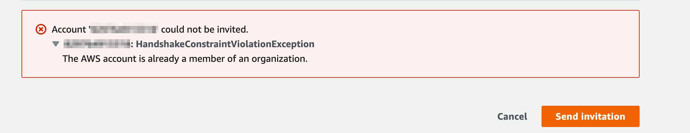

## 개요

A Organization에 속한 AWS 계정을 B Organization으로 옮기는 방법을 소개합니다.

다른 회사에서 관리해온 AWS 계정을 이어 받아서 관리하는 상황이 필요하는 경우에 이러한 특정 AWS 계정의 Organization 소속 변경이 필요할 수 있습니다.

&nbsp;

## 환경


AWS 계정 하나를 A Organization에서 B Organization으로 옮기는 상황입니다.

&nbsp;

## 설정 방법

### 기존 Org 탈퇴

기존 A Organization의 Management Account로 로그인합니다.

이후 AWS 콘솔 → AWS Organizations → Actions → 해당 AWS 계정(Member Account)을 Remove from organization 합니다.


&nbsp;

해당 계정은 이제 Organization에 속하지 않은 독립적인 AWS 계정이 됩니다.


&nbsp;

### 계정 직접 로그인

root 로그인 (해당 계정의 root user)

&nbsp;

### 계정 정보 변경

이메일 주소 및 Account Alias 변경 (해당 계정의 root user)

&nbsp;

### 새 Org 초대

B Organization에서 계정 초대 (B Org의 Management Account)

만약 해당 AWS 계정이 아직 AWS Organization에 속해 있는 경우 AWS 콘솔에서 다음과 같은 에러를 반환합니다.



&nbsp;

### Org 초대 수락

해당 AWS 계정의 root user로 로그인합니다.

AWS 콘솔 → AWS Organizations → 좌측의 Invitiations → 초대 수락 버튼을 클릭합니다.


&nbsp;

## 참고자료

[AWS Organizations의 조직 간에 계정을 이동하려면 어떻게 해야 하나요?](https://aws.amazon.com/ko/premiumsupport/knowledge-center/organizations-move-accounts/)

&nbsp;

## 트러블슈팅 가이드

### 탈퇴 불가 ConstraintViolationException

#### 증상

AWS Organizations에서 특정 AWS 계정을 탈퇴 실행시 `ConstraintViolationException` 에러가 발생하며 실패합니다.


`You cannot remove a delegated administrator from the organization without de-registering the account.`  
위임된 관리자는 등록 해제 없이 Organization에서 탈퇴할 수 없다는 에러 메세지입니다.

&nbsp;

#### 원인

AWS Organization에는 서비스마다 관리자 권한 위임<sup>Delegation</sup>을 할 수 있는 기능이 있습니다.  
해당 AWS 계정에 서비스 권한 위임이 되어 있는 상태라 Organization에서 삭제할 수 없습니다.

&nbsp;

AWS Organization에서 서비스 관리자 권한 위임할 수 있는 AWS 서비스 목록을 확인하고 싶으시면 아래 문서를 확인하세요.  
[AWS Organizations와 함께 사용할 수 있는​ AWS 서비스](https://docs.aws.amazon.com/ko_kr/organizations/latest/userguide/orgs_integrate_services_list.html)

&nbsp;

#### 해결방안

해당 AWS 계정에 위임했던 서비스 권한을 해제합니다.

&nbsp;

#### 상세 조치방법

##### 서비스 권한 위임 확인

Management Account에서 아래 명령어를 실행합니다.  
특정 계정에 위임한 서비스 정보를 확인하는 명령어입니다.

```bash
$ aws organizations list-delegated-services-for-account \
    --account-id <탈퇴가_안되는_ACCOUNT_ID>
```

&nbsp;

명령어 결과를 확인해보니 Firewall Manager `fms.amazonaws.com` 서비스를 햬당 계정에 권한 위임한 상태입니다.

```bash
{
    "DelegatedServices": [
        {
            "ServicePrincipal": "fms.amazonaws.com",
            "DelegationEnabledDate": "2023-01-18T16:28:51.155000+09:00"
        }
    ]
}
```

Firewall Manager 위임을 해제하기 전까지는 해당 AWS 계정을 Organization에서 탈퇴시킬 수 없습니다.

&nbsp;

##### 서비스 권한 위임 해제

```bash
# 명령어 형식
$ aws organizations deregister-delegated-administrator \
    --account-id <탈퇴가_안되는_ACCOUNT_ID> \
    --service-principal <서비스_이름>
```

```bash
# 명령어 예시
$ aws organizations deregister-delegated-administrator \
    --account-id 111122223333 \
    --service-principal fms.amazonaws.com
```

**참고**  
[deregister-delegated-administrator 명령어 공식 문서](https://docs.aws.amazon.com/cli/latest/reference/organizations/deregister-delegated-administrator.html)

&nbsp;

##### 결과 재확인

```bash
$ aws organizations list-delegated-services-for-account \
    --account-id <탈퇴가_안되는_ACCOUNT_ID>
```

&nbsp;

이제 해당 계정에서 권한을 위임한 AWS 서비스 목록이 조회되지 않습니다.

```bash
An error occurred (AccountNotRegisteredException) when calling the ListDelegatedServicesForAccount operation: The provided account is not a registered delegated administrator for your organization.
```

이제 Management Account에서 다시 탈퇴를 진행하면 문제없이 완료됩니다.
