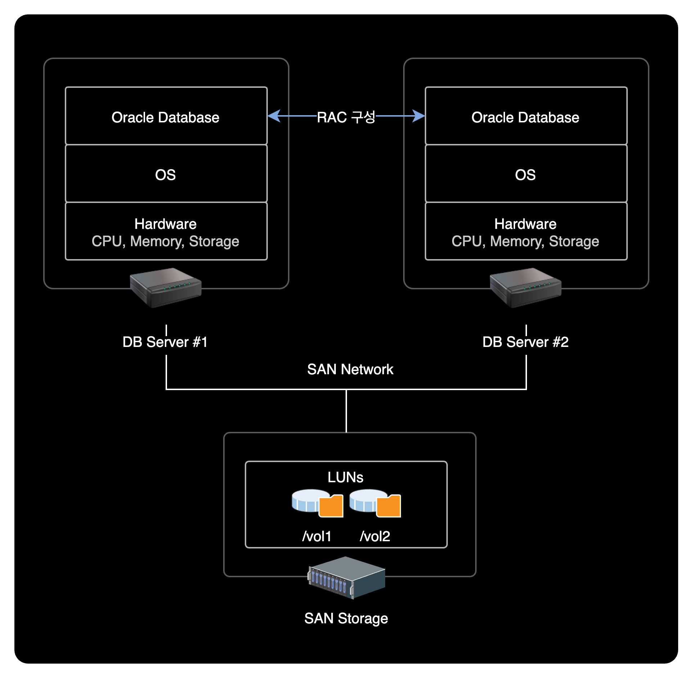

## 개요

파일시스템 용량이 부족한 상황을 해결하기 위해 테이블스페이스의 데이터 파일을 다른 파일시스템 경로로 이동시켜 Filesystem Full로 인한 서비스 장애를 방지할 수 있다.

&nbsp;

## 문제점

- `/vol1` 파일시스템의 사용률이 90% 초과
- Filesystem Full로 인한 서비스 장애 발생 가능성이 존재함

```bash
$ df -h
Filesystem            Size  Used Avail Use% Mounted on
/dev/sda5              63G   30G   30G  50% /
/dev/sda2              39G   14G   23G  38% /oracle
/dev/sda1              99M   12M   82M  13% /boot
tmpfs                  32G     0   32G   0% /dev/shm
/dev/emcpowera        600G  538G   63G  90% /vol1
/dev/emcpowerb        600G   12G  589G   4% /vol2
```

&nbsp;

## 해결방안

테이블스페이스의 데이터 파일을 여유공간이 있는 파일시스템으로 이동시킨 후 데이터 파일의 경로 설정을 변경한다.

&nbsp;

## 환경

온프레미스 데이터센터 환경이며 시스템 구성은 다음과 같습니다.



- **OS** : Red Hat Enterprise Linux Server release 5.3 (Tikanga)
- **Kernel** : 2.6.18-128.el5
- **ID** : oracle
- **Shell** : bash
- **Database**
  - **Engine Version** : Oracle Database 10g Enterprise Edition Release 10.2.0.4.0 - 64bit Production
  - **DB 이중화** : Oracle RAC(Real Application Clusters) 사용중
  - **DB 인스턴스** : DEV1, DEV2 총 2개 사용중

&nbsp;

## 조치방법

### 1. DB 접속

`oracle` 계정으로 변경한 후, `sqlplus` 명령어를 실행해서 Oracle DB에 접속합니다.

```bash
# su - oracle
$ sqlplus / as sysdba
```

```bash
SQL*Plus: Release 10.2.0.4.0 - Production on Tue Sep 7 11:00:04 2021

Copyright (c) 1982, 2007, Oracle.  All Rights Reserved.


Connected to:
Oracle Database 10g Enterprise Edition Release 10.2.0.4.0 - 64bit Production
With the Partitioning, Real Application Clusters, Data Mining and Real Application Testing options
```

&nbsp;

### 2. 데이터파일 정보 확인

**SQL 출력결과 사이즈 최적화**

```sql
SQL> SET LINESIZE 200;
SQL> SET PAGESIZE 200;
SQL> COL FILE_NAME FOR A40;
SQL> COL TABLESPACE_NAME FOR A20;
```

&nbsp;

**테이블스페이스 데이터 파일 조회**  
DBA_DATA_FILES 데이터 사전에서 테이블스페이스의 데이터 파일 크기와 테이블스페이스 사이즈를 확인할 수 있습니다.

```sql
SQL> SELECT TABLESPACE_NAME, ROUND(BYTES/1024/1024/1024) AS GB, FILE_NAME FROM DBA_DATA_FILES WHERE FILE_NAME LIKE '%/vol1/DBF/%';
```

```sql
TABLESPACE_NAME              GB FILE_NAME
-------------------- ---------- ----------------------------------------
TEST_TS                      32 /vol1/DBF/TESTINFO3.DBF
TEST_TS                      32 /vol1/DBF/TESTINFO4.DBF
TEST_TS                      32 /vol1/DBF/TESTINFO5.DBF
TEST_TS                      32 /vol1/DBF/TESTINFO6.DBF
```

&nbsp;

데이터 파일 정보를 확인 후 `exit` 명령어로 sqlplus에서 빠져나온다.

```sql
SQL> exit
Disconnected from Oracle Database 10g Enterprise Edition Release 10.2.0.4.0 - 64bit Production
With the Partitioning, Real Application Clusters, Data Mining and Real Application Testing options
```

&nbsp;

#### DBA_DATA_FILE 테이블

Oracle DB에서 `DBA_DATA_FILES` 테이블은 데이터 파일에 대한 정보를 제공하는 시스템 카탈로그 뷰입니다.

이 뷰는 데이터베이스에 존재하는 모든 데이터 파일에 대한 정보를 제공합니다. 이 정보에는 데이터 파일의 이름, 경로, 크기, 생성 일자, 상태 등이 포함됩니다. 또한 이 뷰를 사용하여 각 데이터 파일이 속한 테이블 스페이스 및 테이블 스페이스의 소유자도 확인할 수 있습니다.

`DBA_DATA_FILES` 뷰는 시스템 관리자 또는 데이터베이스 관리자(DBA)와 같은 권한을 가진 사용자만이 액세스할 수 있습니다. 이 뷰를 사용하면 데이터베이스의 저장 용량을 모니터링하고 데이터 파일의 생성, 확장, 축소 및 이동 등의 작업을 수행할 수 있습니다.

&nbsp;

### 3. 데이터 파일 실제경로 확인

파일시스템 경로에 데이터 파일이 실제로 존재하는 지 확인한다.

```bash
$ ls -lh /vol1/DBF/
```

```bash
total 128G
-rw-r----- 1 oracle dba 32G Aug  9  2010 TESTINFO3.DBF
-rw-r----- 1 oracle dba 32G Aug  9  2010 TESTINFO4.DBF
-rw-r----- 1 oracle dba 32G Aug  9  2010 TESTINFO5.DBF
-rw-r----- 1 oracle dba 32G Aug  9  2010 TESTINFO6.DBF
```

32GB 용량의 데이터 파일 4개가 존재한다. `/vol1` 에 있는 4개의 데이터 파일을 `/vol2` 로 이동시키자.

&nbsp;

### 4. 서비스 중지

데이터 파일을 이동시키기 전에 데이터베이스 서비스를 종료한다.

- **`srvctl`** : Cluster의 자원(Resource)인 Listener, Instance, Disk Group, Network 등과 같은 오라클을 구성하는 오브젝트를 관리할 때 사용하는 명령어.

**명령어 형식**

```bash
$ srvctl stop database -d <db_unique_name>
```

**실행 명령어**

```bash
$ srvctl stop database -d DEV
```

&nbsp;

만약 위 명령어가 실행되지 않을 경우 각 DB Instance 개별로 종료한다.

**명령어 형식**

```bash
$ srvctl stop instance -d <db_unique_name> -i <instance_name>
```

**실행 명령어**

```bash
$ srvctl stop instance -d DEV -i DEV1
$ srvctl stop instance -d DEV -i DEV2
```

&nbsp;

### 5. 데이터파일 복사

`/vol1`에 있는 데이터 파일을 `/vol2`로 이동시킨다.

```bash
$ cp -rp /vol1/DBF/TESTINFO3.DBF /vol2/DBF/
$ cp -rp /vol1/DBF/TESTINFO4.DBF /vol2/DBF/
$ cp -rp /vol1/DBF/TESTINFO5.DBF /vol2/DBF/
$ cp -rp /vol1/DBF/TESTINFO6.DBF /vol2/DBF/
```

**`cp` 명령어 옵션 설명**

- `-r` (`--recursive`) : 하위 디렉토리 및 파일까지 모두 복사
- `-p` (`--preserve`) : 원본파일의 소유주, 그룹, 권한, 시간정보를 보존하여 복사

&nbsp;

### 6. 서비스 시작

**DB 접속**  
sysdba 권한으로 DB에 접속한다.

```bash
$ sqlplus / as sysdba
```

&nbsp;

**DB 파일시스템 기동**

```sql
SQL> startup mount
```

&nbsp;

**데이터 파일 경로 변경설정(Rename)**

```sql
SQL> alter database rename file '/vol1/DBF/TESTINFO3.DBF' to '/vol2/DBF/TESTINFO3.DBF';
SQL> alter database rename file '/vol1/DBF/TESTINFO4.DBF' to '/vol2/DBF/TESTINFO4.DBF';
SQL> alter database rename file '/vol1/DBF/TESTINFO5.DBF' to '/vol2/DBF/TESTINFO5.DBF';
SQL> alter database rename file '/vol1/DBF/TESTINFO6.DBF' to '/vol2/DBF/TESTINFO6.DBF';
```

&nbsp;

**테이블스페이스 데이터 파일 조회**

```sql
SQL> SELECT TABLESPACE_NAME, ROUND(BYTES/1024/1024/1024) AS GB, FILE_NAME FROM DBA_DATA_FILES WHERE FILE_NAME LIKE '%/vol2/DBF/%';
```

```sql
TABLESPACE_NAME              GB FILE_NAME
-------------------- ---------- ----------------------------------------
TEST_TS                      32 /vol2/DBF/TESTINFO3.DBF
TEST_TS                      32 /vol2/DBF/TESTINFO4.DBF
TEST_TS                      32 /vol2/DBF/TESTINFO5.DBF
TEST_TS                      32 /vol2/DBF/TESTINFO6.DBF
```

데이터 파일의 경로<sup>`FILE_NAME`</sup>가 `/vol1`에서 `/vol2`로 정상 변경된 걸 확인할 수 있다.

&nbsp;

**DB 서비스 시작**

```sql
SQL> alter database open;
```

**`open`의 의미**  
온라인 데이터 파일과 온라인 Redo 로그 파일의 존재 및 정합성을 확인한 후, 해당 파일들을 열어 실제 데이터베이스를 사용할 수 있는 상태로 만든다.

&nbsp;

### 7. 데이터 파일 사용여부 확인

```bash
$ fuser /vol1/DBF/TESTINFO3.DBF /vol1/DBF/TESTINFO4.DBF /vol1/DBF/TESTINFO5.DBF /vol1/DBF/TESTINFO6.DBF
$
```

`fuser`로 이전 데이터 파일을 확인시 PID 값이 출력되지 않아야 정상이다.  

PID 값이 출력되지 않는다는 의미는 해당 데이터 파일에 접근하는 프로세스가 없다는 뜻이다.

&nbsp;

### 8. 기존 데이터 파일 삭제

삭제 작업은 인적 실수<sup>Human Fault</sup>를 유발할 수 있는 위험한 작업이다.  

기존 데이터 파일을 삭제하기 전에 현재 내가 작업하려는 데이터 파일의 번호, 절대경로를 잘 확인하고 삭제하도록 한다.

```bash
$ rm -f /vol1/DBF/TESTINFO3.DBF
$ rm -f /vol1/DBF/TESTINFO4.DBF
$ rm -f /vol1/DBF/TESTINFO5.DBF
$ rm -f /vol1/DBF/TESTINFO6.DBF
```

&nbsp;

### 9. DB 서비스 종료

기존 데이터 파일을 삭제한 후 이상 여부를 확인하기 위해 DB를 다시 재기동해준다.

```sql
SQL> shutdown immediate
```

&nbsp;

### 10. DB 서비스 시작

**명령어 형식**

```bash
$ srvctl start database -d <db_unique_name>
```

**실행 명령어**

```bash
$ srvctl start database -d DEV
```

&nbsp;

### 11. 사용률 확인

쉘 환경으로 빠져나온 다음, 파일시스템 사용률을 확인한다.  

```bash
$ df -h
Filesystem            Size  Used Avail Use% Mounted on
/dev/sda5              63G   30G   30G  50% /
/dev/sda2              39G   16G   22G  41% /oracle
/dev/sda1              99M   12M   82M  13% /boot
tmpfs                  32G     0   32G   0% /dev/shm
/dev/emcpowera        600G  408G  193G  68% /vol1
/dev/emcpowerb        600G  143G  458G  24% /vol2
```

`/vol1` 파일시스템의 사용률이 90%에서 68%로 감소된 걸 확인할 수 있다.

&nbsp;

**작업결과**

- `/vol1` : 작업 전 사용률 90% → 작업 후 사용률 68%
- `/vol2` : 작업 전 사용률 4% → 작업 후 사용률 24%

&nbsp;

## 결론

테이블스페이스의 데이터 파일을 옮기는 작업을 통해 파일시스템 Full로 인한 서비스 장애를 예방할 수 있다.  
인적 실수<sup>Human Fault</sup>가 발생하기 쉬운 작업이기 때문에 데이터 파일 이동, 삭제 과정에서는 재차 확인 후 명령어를 실행해야한다.
