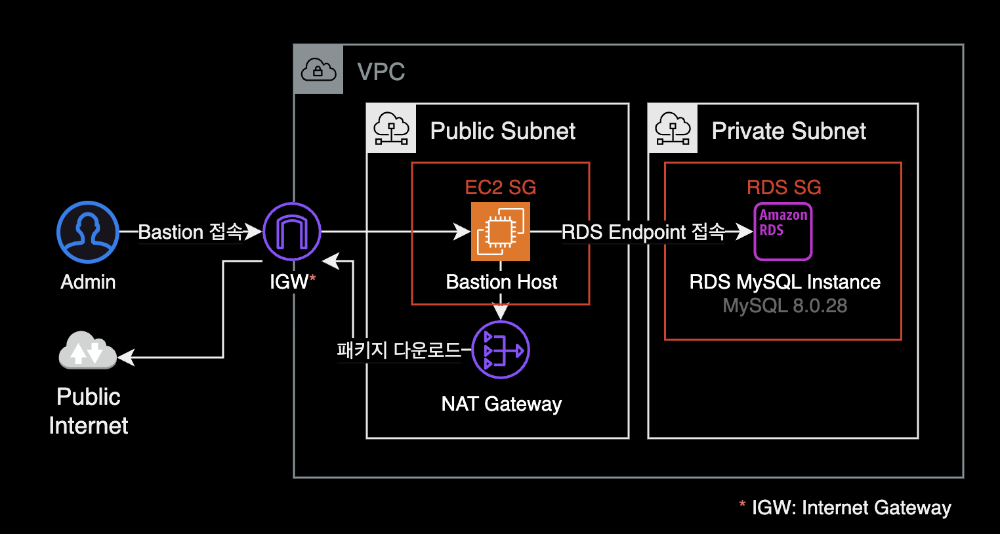

## 개요

MySQL 초기 셋업을 위한 치트시트.  
DB 생길 때마다 같은 작업이 반복되어서 나중에 참고하려고 작성한 가이드.

이 가이드에서는 다음 2가지 방식을 설명하고 있습니다.

1. MySQL 엔진 기반의 RDS에 세팅하기
2. EC2 on MySQL 세팅하기

&nbsp;

## 환경



### Bastion host (EC2)

베스천 호스트는 데이터베이스에 사용할 랜덤 패스워드를 생성하고, RDS에 원격 접속해서 쿼리를 실행하는 역할을 합니다.

- **EC2**
- **AMI** : Amazon Linux 2022 (arm64)
- **Instance Type** : t4g.micro
- **Subnet** : Public Subnet
  - NAT Gateway 또는 Internet Gateway를 통해 인터넷에 연결할 수 있는 퍼블릭 서브넷에 위치해야 합니다.

&nbsp;

### RDS 환경

- **DB Engine** : MySQL 8.0.28
- **Subnet** : Private Subnet

&nbsp;

## 1. RDS 설정 가이드

### 베스천 호스트 설정

#### gpg 패키지

랜덤 패스워드를 생성하는 베스천 호스트에 `gpg` 명령어 또는 `openssl` 명령어가 미리 설치되어 있어야 합니다.

Amazon Linux 2와 Amazon Linux 2022에는 기본적으로 `gpg` 명령어가 설치되어 있습니다.

```bash
which gpg openssl
```

맥북의 경우 `brew install gpg` 명령어로 설치 가능합니다.

&nbsp;

#### 랜덤 패스워드 생성

GPG<sup>GNU Privacy Guard</sup>를 사용하여 길이가 14자인 임의의 강력한 비밀번호를 생성합니다.

```bash
gpg --gen-random --armor 1 14
```

`gpg` 명령어 옵션 설명:

- `--gen-random`: GPG에서 난수를 생성하는 옵션입니다. 이 옵션을 사용하여 안전한 랜덤 값을 생성할 수 있습니다.
- `--armor`: 생성된 난수를 ASCII로 인코딩하여 사람이 읽을 수 있는 형태로 출력합니다. 이 옵션을 사용하지 않으면 바이너리 형식으로 출력되며, 일반 텍스트로 사용하기 어렵습니다.
- `1`: 생성할 난수의 강도(level)를 지정하는 옵션입니다. 0은 약한 난수, 1은 강한 난수를 생성합니다.
- `14`: 생성할 난수의 길이를 바이트 단위로 지정합니다. 이 경우, 14바이트 길이의 난수를 생성하므로 최종 결과는 대략 14자 이상의 문자열이 됩니다.

&nbsp;

`gpg` 명령어가 없다면, `openssl`을 사용해서 안전한 랜덤 패스워드를 방법도 있습니다.

```bash
openssl rand -base64 14
```

두 방법 모두 안전한 랜덤 문자열을 생성할 수 있으며, 암호학적 강도에서 차이는 크지 않습니다.

&nbsp;

명령어 실행 결과, 다음과 같은 비밀번호가 생성됩니다.

```bash
ryTtS60vWxk5CmiS9jA=
```

생성한 패스워드는 이후 데이터베이스 사용자 생성 과정에서 사용할 예정이므로, 메모장에 따로 기록해 놓습니다.

&nbsp;

#### DB 클라이언트 설치

Amazon Linux 2022부터 기본 패키지 관리자로 `dnf`를 사용합니다.  
`dnf`를 사용해 Amazon Linux 2022에 `mariadb-server` 패키지를 설치합니다.

```bash
sudo dnf install mariadb-server -y
```

&nbsp;

`mariadb-server` 패키지 설치를 완료한 다음에는 터미널에서 `mysql` 명령어를 사용할 수 있습니다.  
베스천 호스트에서 RDS로 접속합니다.

```bash
mysql \
  -u <YOUR_RDS_USER_NAME> \
  -h <YOUR_RDS_ENDPOINT> \
  -p
```

&nbsp;

### RDS 설정

#### MySQL 버전 확인

```sql
SELECT VERSION();
```

```sql
+-----------+
| VERSION() |
+-----------+
| 8.0.28    |
+-----------+
```

접속한 RDS의 DB 엔진은 `MySQL 8.0.28`입니다.

&nbsp;

#### 데이터베이스 생성

하나의 MySQL DB는 내부적으로 여러 개의 데이터베이스로 구성될 수 있습니다.

새 데이터베이스를 생성합니다.

```sql
CREATE DATABASE gatsby_db_core;
--              ~~~~~~~~~~~~~~
--               DATABASE NAME
```

&nbsp;

#### 계정 생성

DB 유저를 생성하고 패스워드를 세팅합니다.

```sql
CREATE USER gatsby_db_user_core@'%' IDENTIFIED BY 'ryTtS60vWxk5CmiS9jA=';
--          ~~~~~~~~~~~~~~~~~~~  ~                 ~~~~~~~~~~~~~~~~~~~~
--             DATABASE USER     From Any             USER PASSWORD
```

- `%` 는 어떤 클라이언트에서든 접근이 가능하다는 의미입니다.  
- `IDENTIFIED BY` 다음에 오는 패스워드에는 이전에 미리 생성해둔 안전한 랜덤 패스워드를 입력합니다.

&nbsp;

#### 권한 부여

```sql
GRANT ALL PRIVILEGES ON gatsby_db_core.* TO 'gatsby_db_user_core'@'%';
--                      ~~~~~~~~~~~~~~ ~     ~~~~~~~~~~~~~~~~~~~   ~
--                       DATABASE NAME |       DATABASE USER       From Any
--                                     |
--                             Allow all actions
```

&nbsp;

#### 유저 리스트 확인

유저 정보는 Admin 권한을 가진 DB 계정에서 확인 가능합니다.  
유저 정보는 mysql이라는 이름의 데이터베이스에 저장되어 있습니다.

```sql
-- mysql 데이터베이스 접속
USE mysql;

-- 유저 리스트 조회
SELECT user, host, password_last_changed, account_locked
  FROM user;
```

&nbsp;

#### 설정 적용

```bash
FLUSH PRIVILEGES;
```

`flush privileges` 명령어는 데이터베이스에 설정을 적용하라는 의미입니다.  
권한 설정 후에는 반드시 해당 명령어를 실행해야 합니다.

&nbsp;

## 2. EC2에 MySQL 설정 가이드

RDS를 사용하는 대신, EC2 인스턴스를 생성한 후 직접 MySQL 8.0.31을 설치 + 세팅하는 가이드

&nbsp;

### 설치 환경

대상 EC2 환경은 다음과 같습니다.

- **OS** : Amazon Linux 2
- **CPU Arch** : aarch64 (Graviton 타입)
- **DB** : MySQL 8.0.31
- **네트워크** : Internet Gateway를 통해 퍼블릭 인터넷이 연결된 환경

&nbsp;

### 설치 가이드

#### MySQL 8.0.31 설치

Bastion EC2에 SSH 또는 SSM Session Manager를 통해 원격 접속한 후, 다음 명령어를 실행합니다.

외부에서 MySQL 패키지를 받아오기 때문에 해당 인스턴스는 (NAT Gateway 또는 Internet Gateway를 통해) 퍼블릭 인터넷으로 나갈 수 있는 서브넷 영역에 위치해야 합니다.

```bash
# Step 1: Install wget
sudo yum install wget

# Step 2: Use wget to download the MySQL Yum repository.
wget https://dev.mysql.com/get/mysql80-community-release-el7-3.noarch.rpm

# Step 3: Now, install the mysql locally
sudo yum localinstall mysql80-community-release-el7-3.noarch.rpm

# Step 4: Install MySQL community server
sudo yum install mysql-community-server

# Step 5: Confirm your MySQL service status
sudo systemctl status mysqld
```

MySQL 설치 과정에서 [How to install MySQL 5.7 on Amazon ec2](https://intellipaat.com/community/9231/how-to-install-mysql-5-7-on-amazon-ec2) 문서가 많은 도움이 되었습니다.

&nbsp;

설치 후 MySQL 버전을 확인합니다.

```bash
$ mysql --version
mysql  Ver 8.0.31 for Linux on aarch64 (MySQL Community Server - GPL)
```

EC2 인스턴스에 MySQL 8.0.31이 설치된 걸 확인할 수 있습니다.

&nbsp;

#### 패스워드 세팅

MySQL을 설치하게 되면 기본적으로 root 계정에 자동 생성된 초기 패스워드를 통해 접속할 수 있습니다.  
초기 root 패스워드 확인은 MySQL 로그에서 확인할 수 있습니다.

```bash
$ sudo grep 'temporary password' /var/log/mysqld.log
2022-12-13T05:47:41.193141Z 6 [Note] [MY-010454] [Server] A temporary password is generated for root@localhost: <RANDOM_STRING>
```

&nbsp;

초기 root 패스워드를 확인한 이후 로컬에서 MySQL DB에 접근합니다.

```bash
$ mysql -u root -p
Enter password: <RANDOM_STRING_HERE>
```

&nbsp;

#### 패스워드 변경

root 계정의 초기 패스워드를 변경합니다.

```bash
ALTER USER 'root'@'localhost' IDENTIFIED BY '<YOUR_NEW_PASSWORD_HERE>';
```

&nbsp;

#### 데이터베이스 및 유저 생성

**주의**  
root 패스워드를 초기 비밀번호 그대로 유지하고 아래 명령어를 실행할 경우, 명령어를 실행할 수 없습니다. 반드시 root 계정의 초기 비밀번호를 변경해주어야 합니다.

```sql
-- Database 생성
CREATE DATABASE my_test_db;

-- User 생성
CREATE USER my_test_poweruser IDENTIFIED BY '<USER_PASSWORD_HERE>';

-- User에 Database 관련 모든 권한 부여
GRANT ALL PRIVILEGES ON my_test_db.*
                     TO 'my_test_poweruser'@'%';
```

- `%`는 어떤 클라이언트에서든 접근이 가능하다는 의미입니다.

&nbsp;

유저 리스트를 조회해서 새로 생성한 유저가 보이는지, 최근 패스워드가 업데이트된 시간 정보를 확인합니다.

```sql
-- mysql 데이터베이스 접속
USE mysql;

-- 유저 리스트 조회
SELECT user, host, password_last_changed, account_locked
  FROM user;
```

&nbsp;

마지막으로 권한 변경사항을 데이터베이스에 적용합니다.

```sql
-- 권한 변경사항 적용
FLUSH PRIVILEGES;
```

&nbsp;

이것으로 MySQL에 접근해서 사용할 수 있는 기본 세팅이 완료되었습니다.

&nbsp;

## 참고자료

**AWS**  
[Amazon Linux 2022 - Package management tool](https://docs.aws.amazon.com/linux/al2022/ug/package-management.html)  
패키지 관리자 설명 및 사용법을 설명하는 AWS 공식문서