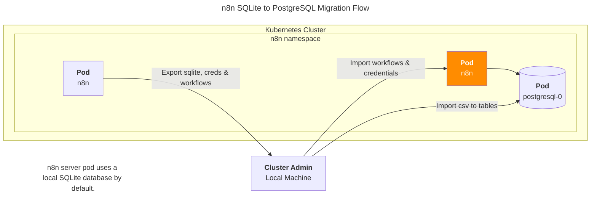

## 개요

이 가이드는 기존 SQLite 기반 n8n 서버의 **User, Credentials, Workflows 데이터**를 PostgreSQL 서버로 그대로 복구하는 절차를 설명합니다. n8n은 기본적으로 SQLite를 사용하므로, 프로덕션 환경에서 PostgreSQL로 마이그레이션이 필요한 DevOps Engineer를 위한 실무 중심의 가이드입니다.

이 가이드는 워크플로우와 자격증명만이 아닌 전체 설정을 다시 구성하지 않고도 마이그레이션을 수행하는 방법에 대한 정보가 부족한 상황에서 도움이 되고자 공유합니다.

여러 사용자가 있는 환경에서 특히 유용하며, 사용자들이 가지고 있던 워크플로우와 자격증명을 유지할 수 있습니다.

## 배경지식

전사적 차원에서 업무 자동화 툴로 n8n을 사용하고 있으며, Kubernetes 환경에서 운영되고 있습니다.

## 환경

- EKS: 1.32

### Helm charts

- **n8n 버전**: 1.107.4 ([chart version: 1.0.12](https://github.com/8gears/n8n-helm-chart/blob/1.0.12/charts/n8n/Chart.yaml))
- **PostgreSQL 버전**: postgresql 17.5.0 

## 마이그레이션 절차

기존에 sqlite를 로컬 DB로 사용하는 n8n 차트가 있고, 새로운 n8n 차트와 postgresql DB 서버가 이미 배포되어 있는 상태라고 가정하고 설명을 진행합니다. PostgreSQL DB는 서브차트 형태로 n8n 메인차트에 포함되어 있습니다.



### 1. CLI 명령어로 워크플로우와 자격증명 내보내기

```bash
# n8n 파드에서 workflows와 credentials export
kubectl exec -n n8n n8n-5cc786cb4-4rsjn -- sh -c "cd /tmp && n8n export:workflow --all --output=all_workflows.json"
kubectl exec -n n8n n8n-5cc786cb4-4rsjn -- sh -c "cd /tmp && n8n export:credentials --all --output=all_credentials.json"

# export된 파일을 로컬로 복사
kubectl cp n8n/n8n-5cc786cb4-4rsjn:/tmp/all_workflows.json ./all_workflows.json
kubectl cp n8n/n8n-5cc786cb4-4rsjn:/tmp/all_credentials.json ./all_credentials.json
```

자세한 n8n 명령어 사용법은 [공식문서](https://docs.n8n.io/hosting/cli-commands/)를 참고합니다.

### 2. SQLite 데이터베이스 파일 가져오기

데이터베이스 파일(database.sqlite)을 다운로드 받은 후, sqlite3 CLI를 사용하여 SQLite 파일을 열어보세요. macOS에서는 `brew install sqlite`로 설치할 수 있습니다.

```bash
# n8n 파드의 SQLite 데이터베이스 파일 확인
kubectl exec -n n8n n8n-5cc786cb4-4rsjn -- ls -alh /home/node/.n8n/

# SQLite 데이터베이스 파일을 tar.gz로 압축하여 로컬로 가져오기
kubectl exec -n n8n n8n-5cc786cb4-4rsjn -- tar czf - -C /home/node/.n8n database.sqlite > n8n-database.tar.gz

# 압축 해제
tar xzf n8n-database.tar.gz
```

sqlite3로 전체 테이블 목록을 확인합니다.

```
$ sqlite3 database.sqlite ".tables"
annotation_tag_entity       migrations
auth_identity               processed_data
auth_provider_sync_history  project
credentials_entity          project_relation
event_destinations          settings
execution_annotation_tags   shared_credentials
execution_annotations       shared_workflow
execution_data              tag_entity
execution_entity            test_case_execution
execution_metadata          test_run
folder                      user
folder_tag                  user_api_keys
insights_by_period          variables
insights_metadata           webhook_entity
insights_raw                workflow_entity
installed_nodes             workflow_history
installed_packages          workflow_statistics
invalid_auth_token          workflows_tags
```

sqlite 4.5GB의 경우 .tar.gz로 압축해서 추출하면 715MB로 용량이 줄어들어 파일 이동 작업시에 편리합니다.

### 3. 테이블을 CSV로 내보내기

sqlite 명령어를 사용해서 sqlite 데이터베이스 파일에 들어있는 테이블을 .csv 파일로 변환할 수 있습니다.

다음 주요 테이블들을 CSV로 내보냅니다:

1. **credentials_entity**: 워크플로우에서 사용하는 자격증명(API 키, 토큰 등) 정보
2. **folder**: 워크플로우를 구조화하기 위한 폴더 정보
3. **project**: n8n 프로젝트 정보 (엔터프라이즈 기능)
4. **project_relation**: 프로젝트와 사용자/워크플로우 간의 관계 정보
5. **shared_credentials**: 사용자 간 자격증명 공유 권한 정보
6. **shared_workflow**: 사용자 간 워크플로우 공유 권한 정보
7. **user**: 사용자 계정 정보 (아이디, 비밀번호, 이메일 등)
8. **webhook_entity**: 워크플로우에서 사용하는 웹훅 정보
9. **workflow_entity**: 워크플로우 정의 및 메타데이터

```bash
cat << EOF > export_tables_to_csv.sh
#!/bin/bash

# CSV export directory
EXPORT_DIR="csv_export"
DB_FILE="database.sqlite"

# Create export directory if it doesn't exist
mkdir -p "$EXPORT_DIR"

# List of tables to export
TABLES=(
    "credentials_entity"
    "folder"
    "project"
    "project_relation"
    "shared_credentials"
    "shared_workflow"
    "user"
    "webhook_entity"
    "workflow_entity"
)

# Get total number of tables
TOTAL_TABLES=${#TABLES[@]}

echo "=========================================="
echo "SQLite to CSV Export Script"
echo "=========================================="
echo "Database: $DB_FILE"
echo "Export directory: $EXPORT_DIR"
echo "Total tables to export: $TOTAL_TABLES"
echo "=========================================="
echo ""

# Counter for successful exports
SUCCESS_COUNT=0
FAILED_COUNT=0

# Export each table to CSV
for i in "${!TABLES[@]}"; do
    TABLE="${TABLES[$i]}"
    CURRENT_NUM=$((i + 1))

    echo "[$CURRENT_NUM/$TOTAL_TABLES] Exporting $TABLE..."

    # Get row count before export
    ROW_COUNT=$(sqlite3 "$DB_FILE" "SELECT COUNT(*) FROM $TABLE;" 2>/dev/null)

    # Export to CSV
    sqlite3 -header -csv "$DB_FILE" "SELECT * FROM $TABLE;" > "$EXPORT_DIR/$TABLE.csv" 2>/dev/null

    if [ $? -eq 0 ]; then
        # Get file size
        FILE_SIZE=$(ls -lh "$EXPORT_DIR/$TABLE.csv" | awk '{print $5}')
        echo "       ✓ SUCCESS: $TABLE exported ($ROW_COUNT rows, $FILE_SIZE)"
        ((SUCCESS_COUNT++))
    else
        echo "       ✗ FAILED: Could not export $TABLE"
        ((FAILED_COUNT++))
    fi
    echo ""
done

echo "=========================================="
echo "Export Summary"
echo "=========================================="
echo "✓ Successful: $SUCCESS_COUNT/$TOTAL_TABLES tables"
echo "✗ Failed: $FAILED_COUNT/$TOTAL_TABLES tables"
echo ""
echo "Exported files:"
echo "------------------------------------------"
ls -lh "$EXPORT_DIR"/*.csv 2>/dev/null
echo "=========================================="
EOF
```

로컬에 다운로드 받은 database.sqlite 파일로부터 스크립트를 사용하여 모든 테이블을 CSV로 export 합니다.

```bash
chmod +x export_tables_to_csv.sh
./export_tables_to_csv.sh

# 또는 sqlite 명령어로 개별 테이블을 수동으로 export
sqlite3 -header -csv database.sqlite "SELECT * FROM credentials_entity;" > csv_export/credentials_entity.csv
sqlite3 -header -csv database.sqlite "SELECT * FROM user;" > csv_export/user.csv
# ... 각 테이블에 대해 반복
```

필요한 경우 워크플로우 히스토리 등도 가져올 수 있습니다.

### 4. N8N을 PostgreSQL 사용하도록 재구성

PostgreSQL 사용을 위해 N8N을 재구성합니다.

```bash
DB_TYPE=postgresdb
DB_POSTGRESDB_DATABASE=postgres
DB_POSTGRESDB_HOST=n8n-dbmig-test-postgresql.n8n.svc.cluster.local
DB_POSTGRESDB_PORT=5432
DB_POSTGRESDB_USER=n8n
DB_POSTGRESDB_PASSWORD=Z7a#W
```

`/home/node/.n8n/config` 파일에서 encryptionKey도 기존 n8n 파드의 키 값과 동일하게 셋업되었는지 확인합니다.

```yaml
# /hone/node/.n8n/config
{
        "encryptionKey": "................................l8C"
}
```

### 5. N8N 시작하여 데이터베이스 테이블 생성

N8N을 시작하여 모든 데이터베이스 테이블을 생성하도록 합니다.

> **자동 마이그레이션 동작:** n8n 파드가 `DB_TYPE=postgresdb`로 설정된 후 재시작되면, n8n은 자동으로 SQLite의 모든 테이블 스키마를 감지하여 PostgreSQL에 동일한 구조의 테이블들을 생성합니다. 이때 테이블 구조(스키마)만 생성되며, 실제 데이터는 마이그레이션되지 않습니다. 즉, 빈 테이블들이 생성되므로 이후 단계에서 데이터를 별도로 가져와야 합니다.

### 6. CLI 명령어로 워크플로우와 자격증명 가져오기

PostgreSQL 데이터베이스 테이블이 생성된 새로운 n8n 파드에서 1단계에서 export한 워크플로우와 자격증명 파일들을 import합니다.

```bash
# n8n 파드에 import 디렉토리 생성
kubectl exec -n n8n n8n-dbmig-test-85d46d75d9-l4hbq -- mkdir -p /tmp/import

# export된 파일들을 n8n 파드로 복사
kubectl cp ./all_credentials.json n8n/n8n-dbmig-test-85d46d75d9-l4hbq:/tmp/import/
kubectl cp ./all_workflows.json n8n/n8n-dbmig-test-85d46d75d9-l4hbq:/tmp/import/

# credentials import 실행
kubectl exec -n n8n n8n-dbmig-test-85d46d75d9-l4hbq -- sh -c "cd /tmp/import && n8n import:credentials --input=all_credentials.json"

# workflows import 실행  
kubectl exec -n n8n n8n-dbmig-test-85d46d75d9-l4hbq -- sh -c "cd /tmp/import && n8n import:workflow --input=all_workflows.json"
```

SQL 조회문으로 credentials와 workflow 객체의 import 결과를 조회합니다.

```bash
kubectl exec -n n8n n8n-dbmig-test-postgresql-0 -- sh -c "PGPASSWORD=postgres psql -U postgres -d n8n -c 'SELECT COUNT(*) FROM credentials_entity; SELECT COUNT(*) FROM workflow_entity;'"
```

```bash
 count
-------
   147
(1 row)

 count
-------
    95
(1 row)
```

### 7. CSV 파일을 PostgreSQL 테이블로 가져오기

CSV 파일들을 해당 PostgreSQL 테이블로 가져옵니다. project를 folder보다 먼저 가져와야 합니다.

SQL import 스크립트를 생성합니다:

```bash
cat << EOF > import_csv_to_postgres.sql
-- Import CSV files to PostgreSQL tables
-- Note: project와 folder를 먼저 import

-- 1. Import project table first
COPY project(id,name,type,"createdAt","updatedAt",icon,description)
FROM '/tmp/csv_import/csv_export/project.csv'
WITH (FORMAT csv, HEADER true, DELIMITER ',');

-- 2. Import folder table (if not empty)
-- COPY folder(...)
-- FROM '/tmp/csv_import/csv_export/folder.csv'
-- WITH (FORMAT csv, HEADER true, DELIMITER ',');

-- 3. Import user table (including lastActiveAt column)
COPY "user"(id,email,"firstName","lastName",password,"personalizationAnswers","createdAt","updatedAt",settings,disabled,"mfaEnabled","mfaSecret","mfaRecoveryCodes",role,"lastActiveAt")
FROM '/tmp/csv_import/csv_export/user.csv'
WITH (FORMAT csv, HEADER true, DELIMITER ',');

-- 4. Import project_relation table
COPY project_relation("projectId","userId",role,"createdAt","updatedAt")
FROM '/tmp/csv_import/csv_export/project_relation.csv'
WITH (FORMAT csv, HEADER true, DELIMITER ',');

-- 5. Import webhook_entity table
COPY webhook_entity("workflowId","webhookPath",method,node,"webhookId","pathLength")
FROM '/tmp/csv_import/csv_export/webhook_entity.csv'
WITH (FORMAT csv, HEADER true, DELIMITER ',');

-- 6. Import shared_credentials table
COPY shared_credentials("credentialsId","projectId",role,"createdAt","updatedAt")
FROM '/tmp/csv_import/csv_export/shared_credentials.csv'
WITH (FORMAT csv, HEADER true, DELIMITER ',');

-- 7. Import shared_workflow table
COPY shared_workflow("workflowId","projectId",role,"createdAt","updatedAt")
FROM '/tmp/csv_import/csv_export/shared_workflow.csv'
WITH (FORMAT csv, HEADER true, DELIMITER ',');

-- 8. Verify import results
SELECT 'Import Results:' as info;
SELECT '===============' as separator;
SELECT 'project' as table_name, COUNT(*) as count FROM project
UNION ALL SELECT 'user', COUNT(*) FROM "user"
UNION ALL SELECT 'project_relation', COUNT(*) FROM project_relation
UNION ALL SELECT 'webhook_entity', COUNT(*) FROM webhook_entity
UNION ALL SELECT 'shared_credentials', COUNT(*) FROM shared_credentials
UNION ALL SELECT 'shared_workflow', COUNT(*) FROM shared_workflow
UNION ALL SELECT 'credentials_entity', COUNT(*) FROM credentials_entity
UNION ALL SELECT 'workflow_entity', COUNT(*) FROM workflow_entity
ORDER BY table_name;
EOF
```

```sql
     table_name     | count
--------------------+-------
 credentials_entity |   147
 project            |    16
 project_relation   |    15
 shared_credentials |   293
 shared_workflow    |   186
 user               |    15
 webhook_entity     |     6
 workflow_entity    |    95
(8 rows)
```

이제 CSV 파일들과 SQL 스크립트를 PostgreSQL 파드로 복사하여 데이터를 import합니다:

```bash
# CSV 파일들을 PostgreSQL 파드로 복사
kubectl exec -n n8n n8n-dbmig-test-postgresql-0 -- mkdir -p /tmp/csv_import
kubectl cp ./csv_export n8n/n8n-dbmig-test-postgresql-0:/tmp/csv_import/

# SQL import 파일을 파드로 복사
kubectl cp ./import_csv_to_postgres.sql n8n/n8n-dbmig-test-postgresql-0:/tmp/

# CSV 데이터를 PostgreSQL 테이블로 import
kubectl exec -n n8n n8n-dbmig-test-postgresql-0 -- sh -c "PGPASSWORD=postgres psql -U postgres -d n8n -f /tmp/import_csv_to_postgres.sql"
```

> **중요:** n8n DB에서 shared_workflow와 shared_credentials 테이블은 **권한 관리용 테이블**입니다. 이를 삭제하면 테이블을 성공적으로 마이그레이션 했을지라도 사용자 UI에서 워크플로우와 자격증명이 보이지 않습니다. 이 테이블들을 그대로 두어야 합니다.

### 8. 기본 사용자 삭제

user 테이블에서 생성된 global:owner 권한을 가진 기본 사용자를 삭제합니다.

```bash
# PostgreSQL에서 빈 이메일을 가진 기본 사용자 삭제
kubectl exec -n n8n n8n-dbmig-test-postgresql-0 -- sh -c "PGPASSWORD=postgres psql -U postgres -d n8n -c \"DELETE FROM \\\"user\\\" WHERE email IS NULL OR email = '';\""

# 삭제 후 사용자 목록 확인
kubectl exec -n n8n n8n-dbmig-test-postgresql-0 -- sh -c "PGPASSWORD=postgres psql -U postgres -d n8n -c \"SELECT id, email, role FROM \\\"user\\\" ORDER BY \\\"createdAt\\\";\""
```

> **참고:** 이 단계는 7단계에서 실제 사용자 데이터를 import한 후에 실행해야 합니다. 기본 사용자는 email이 NULL이거나 빈 문자열인 global:owner 계정입니다.

### 9. N8N 설정에서 userManagement.isInstanceOwnerSetUp 확인

PostgreSQL 초기 연결 시 자동 생성되는 기본 사용자를 삭제하고, 기존 n8n의 global:owner 계정 데이터를 그대로 마이그레이션합니다.

**주의:** `isInstanceOwnerSetup` 설정값은 환경변수(env)가 아닌 데이터베이스의 `settings` 테이블에서 관리되는 값입니다. 이 설정은 n8n 인스턴스에 관리자(owner) 계정이 이미 설정되었는지를 나타내는 플래그로, `true`일 때 n8n이 초기 설정 화면을 건너뛰고 기존 사용자 계정으로 바로 로그인할 수 있게 합니다.

```bash
# PostgreSQL settings 테이블에서 확인
kubectl exec -n n8n n8n-dbmig-test-postgresql-0 -- sh -c "PGPASSWORD=postgres psql -U postgres -d n8n -c \"SELECT key, value FROM settings WHERE key = 'userManagement.isInstanceOwnerSetUp';\""
```

`userManagement.isInstanceOwnerSetUp = true`는 관리자 계정이 이미 설정되어 있음을 n8n에 알려줍니다. 이 값은 기본값이 `false`이므로 마이그레이션 후 반드시 `true`로 설정해야 합니다:

```bash
kubectl exec -n n8n n8n-dbmig-test-postgresql-0 -- sh -c "PGPASSWORD=postgres psql -U postgres -d n8n -c \"UPDATE settings SET value = 'true' WHERE key = 'userManagement.isInstanceOwnerSetUp';\""
```

### 10. n8n 파드 재시작

n8n 파드를 재시작하면 원래 사용자/비밀번호로 로그인할 수 있고 모든 워크플로우가 있어야 합니다.

`userManagement.isInstanceOwnerSetUp` 설정이 제대로 적용된 경우, global:owner 권한의 어드민 계정 세팅 페이지가 표시되지 않고 바로 n8n 로그인 창이 나타납니다.

### 11. 라이센스 키 입력 (선택사항)

n8n 엔터프라이즈 버전을 사용하는 경우 라이선스 키를 입력합니다. 

```yaml
# charts/n8n/values_example.yaml
main:
  # See https://docs.n8n.io/hosting/configuration/environment-variables/ for all values.
  config:
    n8n:
      license:
        activation:
          key: <N8N_LICENSE_ACTIVATION_KEY>
```

커뮤니티 버전은 오픈소스(Apache 2.0)로 제공되어 라이선스 키 없이 무료로 사용 가능합니다. 라이선스 키는 엔터프라이즈 전용 기능(SSO, 감사 로그, RBAC 등)을 활성화하는 용도로만 필요합니다.

## 관련자료

- [CLI commands | n8n Docs](https://docs.n8n.io/hosting/cli-commands/)
- [n8n helm chart 1.0.12](https://github.com/8gears/n8n-helm-chart/blob/1.0.12/charts/n8n/Chart.yaml)

n8n community forum:

- [How to migrate from SQLite to Postgres](https://community.n8n.io/t/how-to-migrate-from-sqlite-to-postgres/97414)
- [I can’t start n8n on a fresh database](https://community.n8n.io/t/i-cant-start-n8n-on-a-fresh-database/17964)
