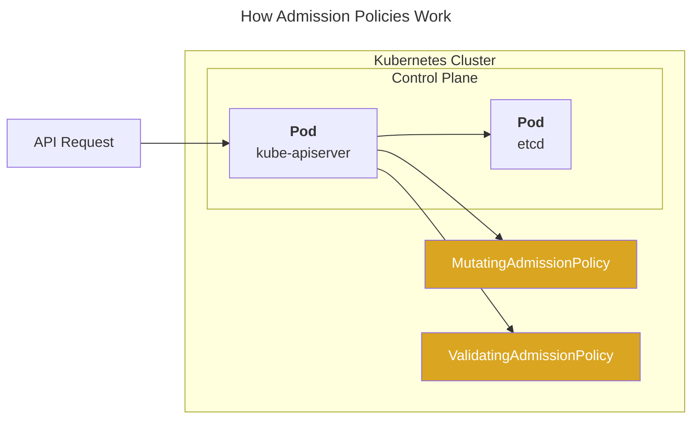

## Overview

A guide to Kubernetes native admission policies.

Starting from Kubernetes 1.30, ValidatingAdmissionPolicy became GA (Generally Available), enabling native resource validation policies without external policy engines like Kyverno or OPA.

## CEL-based Admission Policy

Kubernetes uses [CEL (Common Expression Language)][cel] to write ValidatingAdmissionPolicy (VAP) and MutatingAdmissionPolicy (MAP).

### Available Policy Types

Two types of native admission policies are available:

- **ValidatingAdmissionPolicy (VAP)**: Became stable in Kubernetes 1.30. Allows you to validate resources using CEL expressions.
- **MutatingAdmissionPolicy (MAP)**: Reached beta in Kubernetes 1.34. Enables resource mutation through CEL-based rules.

> ⚠️ **Managed Kubernetes Limitation**: MutatingAdmissionPolicy was alpha in Kubernetes 1.32 and became beta in Kubernetes 1.34. In managed Kubernetes services like EKS, GKE, or AKS, users do not have control over control plane feature gates, making alpha features practically unavailable until they reach beta or stable status.

## Comparison with Kyverno

With ValidatingAdmissionPolicy becoming GA and MutatingAdmissionPolicy reaching beta, many ask whether they can fully replace Kyverno.

- **[ValidatingAdmissionPolicy](https://kubernetes.io/docs/reference/access-authn-authz/validating-admission-policy/)**: Supports resource validation (GA)
- **[MutatingAdmissionPolicy](https://kubernetes.io/docs/reference/access-authn-authz/mutating-admission-policy/)**: Supports resource mutation (Beta in 1.34+)
- **Kyverno**: Supports [Validate](https://kyverno.io/docs/writing-policies/validate/), [Mutate](https://kyverno.io/docs/writing-policies/mutate/), [Generate](https://kyverno.io/docs/writing-policies/generate/), [VerifyImage](https://kyverno.io/docs/writing-policies/verify-images/), and [Cleanup](https://kyverno.io/docs/writing-policies/cleanup/) policies

While Kubernetes native admission policies now cover both validation and mutation, Kyverno still offers additional features like Generate, VerifyImage, and Cleanup policies that are not available natively.

For more details, see the [related discussion on Reddit](https://www.reddit.com/r/kubernetes/comments/1gpvk95/so_are_validating_admission_policies_a/).

## Helm Chart

Policy manifests are managed as a Helm chart in a separate charts repository:

**[younsl/charts - admission-policies](https://github.com/younsl/charts/tree/main/charts/admission-policies)**

## Best Practices

### Policy Management

Managing all resources through Helm charts rather than directly applying YAML manifests with kubectl is a fundamental best practice for Kubernetes resource management. This practice provides significant advantages in versioning, rollback capabilities, templating, and maintaining configuration consistency across multiple clusters.

For production environments, consider adopting GitOps workflows using tools like ArgoCD or Flux. GitOps ensures that cluster state is declaratively defined in Git, enabling audit trails, peer reviews through pull requests, and automated synchronization between desired and actual cluster state.

## Conclusion

For simple policies, use Kubernetes native admission policies instead of Kyverno or OPA. Native policies run inside kube-apiserver, so you don't need to install extra pods, keep them running, or worry about slow webhooks. Less stuff to manage, less stuff to break.

## References

**Kubernetes Documentation**
- [ValidatingAdmissionPolicy](https://kubernetes.io/docs/reference/access-authn-authz/validating-admission-policy/)
- [MutatingAdmissionPolicy](https://kubernetes.io/docs/reference/access-authn-authz/mutating-admission-policy/)
- [Kubernetes 1.30: Validating Admission Policy Is Generally Available](https://kubernetes.io/blog/2024/04/24/validating-admission-policy-ga/)

**Related Posts**
- [Kyverno](/blog/kyverno/)

[cel]: https://kubernetes.io/docs/reference/using-api/cel/
