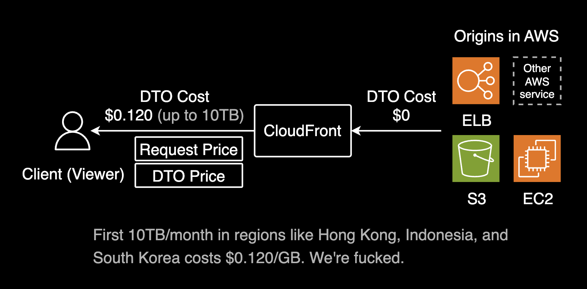

## 개요

S3에 저장된 JSON 파일들을 CloudFront를 통해 캐싱 없이 서빙하는 구성을 다룹니다. 백엔드는 S3에 Write 권한을, 클라이언트는 GET 메서드로 실시간 데이터를 조회할 수 있도록 설정하는 방법을 설명합니다.

## 설정 방법

### 실시간 데이터 서빙 구현

요구사항은 S3에 json 확장자로 된 파일을 S3에 업로드 하고, 클라이언트에게 캐싱 없이 서빙해야 하는 것이었습니다.


결론부터 말하자면 CloudFront는 캐싱 정책을 통해 필요시 캐싱을 비활성화할 수 있습니다.

디테일하게는 뒷단의 백엔드 파드는 S3로 정적 데이터에 대해 Write 할 수 있어야 하고, 클라이언트는 GET 메서드로 조회만 가능해야 했습니다.


위 아키텍처에서는 백엔드 파드가 IRSA를 통해 IAM 역할을 부여받아 AWS S3 API를 호출하여 정적 데이터에 대한 쓰기 작업을 수행합니다. 클라이언트는 GET 메서드를 사용해 데이터를 조회만 할 수 있으며, 쓰기 작업은 백엔드에서만 처리됩니다.

클라이언트와 백엔드의 역할을 분리함으로써, 클라이언트 측에서의 비정상적인 데이터 수정이나 접근을 방지하고, 백엔드에서만 중요한 쓰기 작업을 처리할 수 있습니다. CloudFront를 조합하면, 보안을 유지하면서 안전하게 정적 파일을 서빙할 수 있으며, 쓰기 작업과 조회 작업을 분리하여 효율적으로 처리할 수 있습니다.

### CORS Preflight 허용

Frontend Application에서 CloudFront를 통한 S3 접근시, GET, HEAD 메소드에 OPTIONS 메소드 추가 허용이 필요합니다. 제 경우 CORS Preflight를 허용하기 위해 CloudFront의 응답 헤더 정책(Response Header Policy)에 [Managed-CORS-With-Preflight](https://docs.aws.amazon.com/AmazonCloudFront/latest/DeveloperGuide/using-managed-response-headers-policies.html#managed-response-headers-policies-cors-preflight)를 추가해야 했습니다.


S3를 퍼블릭 공개 없이 보호하면서 정적 파일을 서빙하려면 CloudFront와 WAF를 S3 버킷 앞에 배치하는 것이 좋습니다.


**중요**: 개발환경 CloudFront의 경우는 퍼블릭하게 노출되면 안되기 때문에 WAF를 사용해서 오피스 IP 대역, 쿠버네티스 클러스터 대역 범위에서만 접근할 수 있게 IP ACL을 걸어서 보호해야 합니다.


더 자세한 사항은 AWS WAF 모범사례를 설명한 [WAF Prerequisites](https://aws.github.io/aws-security-services-best-practices/guides/waf/prerequisites/docs/) 페이지에서 확인할 수 있습니다.

CloudFront Distribution에는 기본적으로 캐싱 정책과 요청 정책이 설정되지 않으며, 필요에 따라 적용할 수 있습니다.

1. **캐싱 정책 (Cache Policy)**: 응답을 캐싱할지 여부를 정의하며, 기본적으로 설정되지 않습니다.
2. **요청 정책 (Request Policy)**: 원본 서버로 전달할 요청 데이터를 설정하며, 기본적으로 설정되지 않습니다.

두 정책 모두 AWS에서 기본 제공하는 관리형 정책과 사용자가 설정하는 커스텀 정책 두 가지 유형이 있으며, 관리형 정책은 이름 앞에 Managed- 프리픽스가 붙습니다. 예를 들어, 캐싱 정책 중 하나인 [Managed-CachingDisabled](https://docs.aws.amazon.com/ko_kr/AmazonCloudFront/latest/DeveloperGuide/using-managed-cache-policies.html#managed-cache-policy-caching-disabled)를 적용하면 모든 엣지 로케이션에서 캐싱이 비활성화되어 항상 S3 등 원본 서버에서 실시간 데이터를 가져오도록 CloudFront가 동작합니다.

이러한 정책을 적절히 조합하면 CloudFront를 활용해 정적 파일을 안전하고 효율적으로 서빙할 수 있습니다.

실제로 클라이언트가 요청할 때 캐시 데이터가 없음을 확인할 수 있습니다.

```bash
x-amz-cf-pop: ICN57-P3
x-cache: Miss from cloudfront
```

### Edge Location 호출 테스트

`curl`을 통해 CloudFront 호출시 반환되는 헤더를 보면 생각보다 자세한 정보를 확인할 수 있습니다.

아래는 제가 CloudFront의 캐싱 비활성화 여부를 확인하기 위해 작성한 호출 테스트용 스크립트입니다. 당연히 URL과 같은 민감한 정보는 제거한 버전입니다.

```bash
export CDN_URL="https://<REDACTED>/<REDACTED>.json"
```

스크립트를 생성함과 동시에 실행 권한을 부여하고 실행합니다.
```bash
cat << 'EOF' > check-cache.sh && chmod +x check-cache.sh && ./check-cache.sh
#!/bin/bash
[[ -z "${CDN_URL}" ]] && echo "CDN_URL is required" && exit 1
COUNT=5

for i in $(seq 1 $COUNT); do 
    echo "=== [${i}/${COUNT}] $(date '+%Y-%m-%d %H:%M:%S') ==="
    curl -s -I "${CDN_URL}" | egrep '^x-cache|^x-amz-cf-pop'
    [ $i -lt $COUNT ] && sleep 2
done
EOF
```

```bash
=== [1/5] 2025-03-18 21:56:35 ===
x-cache: Miss from cloudfront
x-amz-cf-pop: ICN57-P3
=== [2/5] 2025-03-18 21:56:37 ===
x-cache: Miss from cloudfront
x-amz-cf-pop: ICN57-P3
=== [3/5] 2025-03-18 21:56:39 ===
x-cache: Miss from cloudfront
x-amz-cf-pop: ICN57-P3
=== [4/5] 2025-03-18 21:56:41 ===
x-cache: Miss from cloudfront
x-amz-cf-pop: ICN57-P3
=== [5/5] 2025-03-18 21:56:44 ===
x-cache: Miss from cloudfront
x-amz-cf-pop: ICN57-P3
```

1. `x-amz-cf-pop` 헤더를 통해 클라이언트는 엣지 로케이션(ICN57-P3)를 처음에 도달합니다. 엣지 로케이션의 물리적인 위치가 인천국제공항 근처인 것을 확인할 수 있습니다.

> `x-amz-cf-pop` 헤더의 ICN 코드는 IATA Code로 IATA(국제 항공 운송 협회)를 의미하고 해당 IATA 값으로 조회해보면 CloudFront로 어느 지역에서 서비스를 제공하는지 알 수 있는데요. (3자로 된 IATA 코드는 일반적으로 엣지 로케이션 근처의 공항 이름을 나타냅니다.)

2. `x-cache` 헤더에 `Miss from cloudfront` 메시지가 포함되어 있으므로 ICN57-P3 엣지 로케이션에 캐싱된 데이터가 없음을 확인합니다.
3. 엣지 로케이션에 데이터가 존재하지 않으므로 CloudFront에서 원본 S3에서 정적 파일을 가져옵니다.
4. 클라이언트가 텀을 두고 여러번 시도해도 모두 동일하게 원본 Origin S3에서 가져오고 있습니다. 결과적으로 실시간 데이터를 서빙할 수 있습니다.

### 데이터 전송 비용(DTO)의 이점

CloudFront를 S3 버킷 앞에 배치하면 버킷을 비공개로 보호할 수 있고(보안 측면), 비용 면에서도 이점이 있습니다. CloudFront와 오리진(S3)간 데이터 전송(DTO) 비용은 무료이므로, CloudFront가 S3에서 데이터를 가져오는 데는 비용이 발생하지 않습니다. 대신, CloudFront에서 사용자에게 데이터를 전송할 때 발생하는 데이터 전송(DTO) 비용이 주요한 비용 요소입니다.



CloudFront에 캐싱이 비활성화된 경우에도 CloudFront가 S3에서 데이터를 가져오는 데 드는 비용은 없고, 사용자에게 전달되는 데이터 전송에 대해서만 비용이 발생하므로, 직접 S3에서 데이터를 가져오는 것보다 비용이 더 효율적일 수 있습니다.

CloudFront 비용 모델은 [Amazon CloudFront pricing](https://aws.amazon.com/cloudfront/pricing/?nc1=h_ls)에서 확인할 수 있습니다. 참고로 월 최초 10TB까지는 서울이 전세계에서 가장 데이터 전송(DTO) 비용이 비쌉니다. 이것마저도 [2021년 5월에 한국의 데이터 전송(DTO) 요금을 최대 26% 할인](https://aws.amazon.com/ko/blogs/korea/cloudfront-price-cut-data-transfer-out-to-internet-in-korea/)한 가격입니다.

CloudFront 비용 모델에서 크게 2가지 포인트를 활용하면 비용 절감에 도움이 될 듯 합니다.

- 월 첫 1TB 까지는 데이터 전송(DTO) 비용이 무료
- CloudFront와 S3간 데이터 전송(DTO) 비용이 무료

## 결론

CloudFront에 캐싱 정책을 비활성화하면 정적 데이터를 실시간으로 더 안전하게 서빙할 수 있습니다. S3 버킷을 퍼블릭하게 공개할 필요 없다는 장점도 있습니다.

## 관련자료

CloudFront:

- [관리형 캐시 정책 사용](https://docs.aws.amazon.com/ko_kr/AmazonCloudFront/latest/DeveloperGuide/using-managed-cache-policies.html)
- [CloudFront 엣지 서버의 위치 및 IP 주소 범위](https://docs.aws.amazon.com/ko_kr/AmazonCloudFront/latest/DeveloperGuide/LocationsOfEdgeServers.html)

CloudFront Security with WAF:

- [Amazon CloudFront distributions that point to Amazon S3 buckets](https://aws.github.io/aws-security-services-best-practices/guides/waf/prerequisites/docs/)

CloudFront FinOps:

- [Amazon CloudFront pricing](https://aws.amazon.com/cloudfront/pricing/?nc1=h_ls)
- [Amazon CloudFront, 한국에서 최대 26% 데이터 전송 요금 할인](https://aws.amazon.com/ko/blogs/korea/cloudfront-price-cut-data-transfer-out-to-internet-in-korea/)
- [Amazon CloudFront Pricing](https://aws.amazon.com/ko/cloudfront/pricing/?nc1=h_ls)
