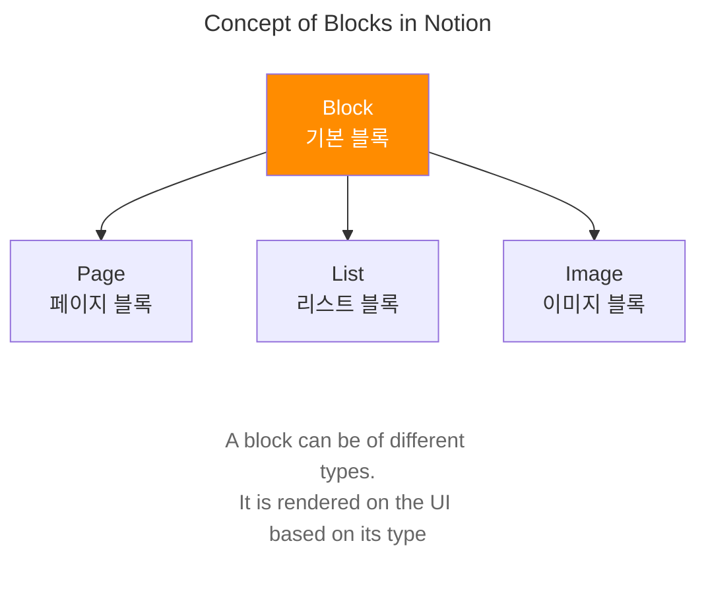
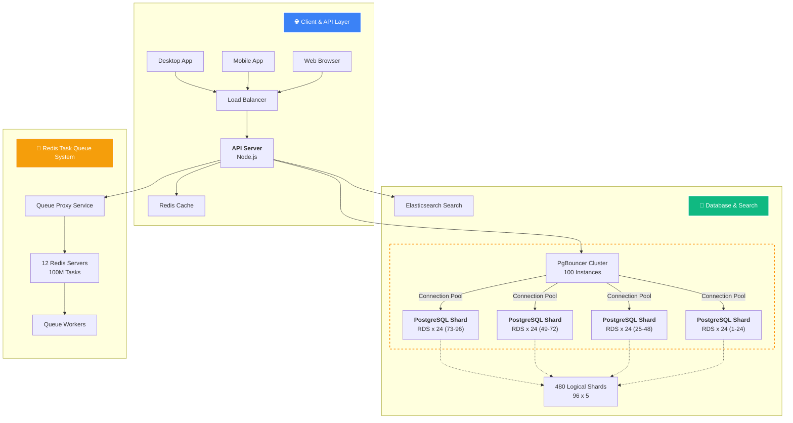

# Notion이 2000억 개 노트를 처리하는 방법 (크래시 없이)

*이 글은 위의 Notion 엔지니어링 팀 공식 블로그 포스트와 기술 커뮤니티 분석 자료를 바탕으로 작성되었습니다.*

## 들어가며

Notion은 단순한 노트 앱이 아니다. 실시간 협업 데이터베이스가 미니멀한 UI로 포장된 것이다. 2021년 200억 개의 블록에서 시작해 2024년 현재 **2000억 개 이상의 블록**을 처리한다. 압축된 상태에서도 수백 테라바이트에 달하는 데이터다.

어떻게 이런 규모의 데이터를 크래시 없이 처리할 수 있을까? 답은 블록 기반 아키텍처, 데이터베이스 샤딩, 그리고 데이터 레이크에 있다.

## 블록(Block) 기반 아키텍처

### 모든 것이 블록이다

Notion에서 보이는 모든 것은 블록이다:
- 텍스트 한 줄
- 체크박스 
- 이미지
- 표
- 페이지 자체

각 블록은 PostgreSQL에 다음과 같은 구조로 저장된다:

```sql
CREATE TABLE blocks (
    id UUID PRIMARY KEY,
    type VARCHAR(50), -- 'paragraph', 'checkbox', 'image' 등
    parent_id UUID,   -- 부모 블록 (중첩 구조)
    workspace_id UUID, -- 샤딩 키
    properties JSONB  -- 유연한 콘텐츠 저장
);
```

### 블록의 특징

- **상호작용성**: 방향키 ↑↓를 누르면 커서가 움직이는 게 아니라 데이터베이스 행 간 이동
- **실시간 동기화**: 모든 변경사항이 실시간으로 동기화
- **계층 구조**: 블록들이 트리 구조로 연결되어 권한 계산 가능



## 데이터베이스 샤딩 전략

### 초기 문제점

2020년 중반까지 Notion은 단일 PostgreSQL 인스턴스를 사용했다. 5년간 **[10,000배 성장](https://www.notion.com/blog/sharding-postgres-at-notion)**(4 orders of magnitude)을 견뎌냈지만 한계가 보였다:

- 데이터베이스 CPU 스파이크 빈발
- 단순한 스키마 마이그레이션도 위험
- **VACUUM 프로세스 정지로 인한 성능 저하**
  - PostgreSQL의 VACUUM은 삭제된 데이터 공간을 정리하는 필수 작업
  - 대용량 테이블에서 VACUUM이 정지되면 디스크 공간 부족과 성능 급격한 저하 발생
  - 트랜잭션 ID 고갈로 인한 데이터베이스 정지 위험
  - 업데이트 중심 워크로드에서 특히 심각 (Notion 블록 데이터의 90%가 업데이트)

### 샤딩 설계

**워크스페이스 ID를 샤딩 키로 선택**
- 대부분의 쿼리가 단일 워크스페이스 내에서 발생
- 크로스 샤드 쿼리 최소화
- 관련 데이터를 동일한 샤드에 배치

**샤딩 구성**
- 2021년: 32개 물리적 데이터베이스, 480개 논리적 샤드 (15개/DB), 200억 블록
- 2023년: 96개 물리적 데이터베이스, 480개 논리적 샤드 (5개/DB), 2000억+ 블록

480이라는 숫자를 선택한 이유:
- 많은 수로 나누어떨어짐 (8, 10, 12, 16, 20, 24, 32, 40, 48...)
- 스케일 업/다운 시 유연성 확보

### 마이그레이션 전략

**3단계 마이그레이션 프로세스**

1. **더블 라이트 (Double Write)**
   - 모든 새 쓰기 작업을 기존 DB와 새 샤드에 동시 적용
   - 직접 쓰기 대신 감사 로그 사용으로 일관성 보장

2. **백필 (Backfill)**
   - 96 CPU 머신으로 기존 데이터 마이그레이션
   - 3일간 지속적인 데이터 이전 작업

3. **검증 및 전환**
   - 검증 스크립트: 랜덤 UUID 샘플링으로 데이터 무결성 확인
   - 다크 리드: 구 DB와 신 DB 동시 쿼리 후 결과 비교
   - 최종 전환: 5분 다운타임으로 완전 전환

### Redis 태스크 큐 시스템

**대규모 비동기 처리 인프라**

Notion은 12개의 Redis 서버로 구성된 클러스터를 운영하며, 상시 약 1억 개의 태스크를 관리하고 있다. 초당 최대 10,000개의 태스크를 큐에 추가하는 처리 능력을 보유한다.

**주요 활용 사례**
- 대용량 파일 임포트/엑스포트 작업
- 백그라운드 비즈니스 로직 처리
- 크론잡 스케줄링
- 비동기 데이터 처리 작업

**아키텍처 개선**
2024년 큐 프록시 서비스 도입으로 관찰 가능성과 확장성을 크게 향상시켰다:
- 태스크 ID 해시 기반 라우팅
- 로드 밸런서를 통한 트래픽 분산
- 100% 트래픽 관찰 가능성 달성

## 성능 최적화 기술

### 연결 풀링 최적화

**[PgBouncer](https://www.pgbouncer.org/) 클러스터링**
- 100개의 PgBouncer 인스턴스
- 각 샤드당 6개 연결 제한 (100 × 6 = 600개 연결/샤드)
- 리샤딩 시 연결 수 3배 증가 문제 해결

**해결책**
- PgBouncer 클러스터를 샤드 그룹별로 분할
- 4개 그룹으로 나누어 장애 영향 25%로 제한

### 실시간 데이터 처리

**Apache Kafka 활용**
- 피크 시간대 400만+ 메시지/초 처리
- 480개 샤드에서 단일 토픽으로 집계
- Debezium CDC 커넥터로 변경 데이터 캡처

## 전체 인프라 아키텍처

아래 다이어그램은 Notion 사용자 요청을 실시간으로 처리하는 핵심 서비스들을 보여줍니다:



### 핵심 컴포넌트 설명

**1. API 계층**
- Node.js 기반 API 서버
- Redis 캐시로 빈번한 요청 처리
- 연결 풀링으로 DB 부하 분산

**2. 데이터베이스 계층**
- 96개 물리적 PostgreSQL 인스턴스
- 480개 논리적 샤드 (워크스페이스 ID 기반)
- PgBouncer 클러스터로 DB 연결 풀링 및 부하 분산

**3. 실시간 파이프라인**
- Debezium CDC로 변경 데이터 캡처
- Kafka 토픽당 480개 샤드 집계
- Apache Hudi로 S3 데이터 레이크 구축

## 데이터 레이크 아키텍처

### 기존 시스템의 한계

**Snowflake 기반 ETL 문제점**
- 480개 Fivetran 커넥터 관리 부담
- 업데이트 중심 워크로드 (전체 업서트의 90%가 업데이트)
- 트리 순회 계산 비용 증가

### 새로운 데이터 레이크 설계

```
PostgreSQL → Kafka → Apache Hudi → S3 → Snowflake
```

**핵심 컴포넌트**
- **Debezium**: PostgreSQL에서 Kafka로 CDC
- **Apache Hudi**: Kafka에서 S3로 데이터 작성
- **COPY_ON_WRITE**: 업데이트 중심 워크로드 최적화
- **PySpark**: 대부분의 데이터 처리
- **Scala Spark**: 트리 순회 및 비정규화 작업

### 성능 최적화

**파티셔닝 전략**
- PostgreSQL 샤드 스키마 기반 파티셔닝 (480개)
- 마지막 업데이트 시간 기준 정렬
- 블룸 필터 인덱스 활용

**데이터 신선도**
- 대부분 테이블: 몇 분 지연
- 블록 테이블: 최대 2시간 지연

## 권한 시스템의 복잡성

### 트리 기반 권한 계산

블록의 권한은 워크스페이스 루트까지 트리를 순회하여 계산된다:

```
workspace_a
└── page_1
    └── page_2
        └── page_3
            ├── block_1
            ├── block_2
            └── block_3
```

각 블록은 부모와 조상으로부터 권한을 상속받는다. 수백억 개의 블록과 수십 단계의 깊이를 가진 트리에서 이런 계산은 매우 비용이 크다.

### 해결책: 비정규화된 뷰

- 복잡한 트리 순회 로직을 미리 계산
- AI 및 검색 기능을 위한 비정규화된 데이터 구조
- Scala Spark를 활용한 병렬 처리

## 결과와 성과

### 성능 개선

- **CPU 사용률**: 90% → 20%로 감소
- **IOPS 사용률**: 현저한 감소
- **사용자 체감 성능**: 즉각적인 개선

### 확장성 확보

- 6-12개월마다 데이터 2배 증가에 대응
- 물리적 데이터베이스 서버 3배 증가 (32개 → 96개)
- 논리적 샤드 유지 (480개)

## 핵심 교훈

### 1. 조기 샤딩 계획

성능 문제가 심각해지기 전에 샤딩을 시작하라. 위기 상황에서의 마이그레이션은 복잡도와 스트레스를 증가시킨다. Notion은 데이터베이스 과부하 상태에서 이상적인 마이그레이션 도구(논리적 복제, 스트리밍 복제 등) 사용이 불가능했고, 트랜잭션 ID 고갈이라는 시스템 전체 정지 위험 하에서 3일간 백필 작업을 수행해야 했다.

### 2. 워크스페이스 ID 샤딩 키

- 관련 데이터를 함께 배치
- 크로스 샤드 쿼리 최소화
- 검색은 Elasticsearch로 별도 처리

### 3. 보링 테크 선택

- PostgreSQL > MongoDB
- Kafka > 독점 큐
- **오픈소스 우선 정책으로 벤더 락인 방지**

**Notion의 벤더 락인 방지 전략:**
- **Apache Kafka**: 독점 메시지 큐 대신 오픈소스 선택
- **Apache Hudi**: Delta Lake(상용) 대신 오픈소스 데이터 레이크
- **Apache Spark**: ["오픈소스 특성이 비용 효율성 이점 제공"](https://www.notion.com/blog/building-and-scaling-notions-data-lake)
- **PostgreSQL**: 오픈소스 데이터베이스 (AWS RDS 기반이지만 표준 PostgreSQL)
- **React & Redux**: 오픈소스 프론트엔드 스택
- **Kubernetes**: 오픈소스 컨테이너 오케스트레이션

이로 인해 Notion은 특정 벤더에 종속되지 않고 필요시 다른 클라우드 제공업체로 마이그레이션할 수 있는 유연성을 확보했다.

### 4. 단계적 마이그레이션

- 더블 라이트 + 백필 + 검증 + 전환
- 감사 로그를 통한 일관성 보장
- 롤백 계획 필수

## 미래 전망

### 예상 확장 포인트

- **엣지 캐싱**: 글로벌 사용자 지연 시간 감소
- **컬럼형 스토리지**: 분석 성능 향상 (Apache Parquet)
- **벡터 데이터베이스**: AI 기능 강화 (시맨틱 검색)

### 아키텍처 원칙

1. **샤딩**: 명확한 키로 조기 계획
2. **데이터 레이크**: OLTP와 분석 분리
3. **오픈소스**: 벤더 락인 방지

## 마무리

Notion의 성공 비결은 단순한 기술 스택이 아니라 **점진적이고 신중한 확장 전략**에 있다. 블록 기반 아키텍처, 워크스페이스 중심 샤딩, 그리고 업데이트 중심 워크로드에 최적화된 데이터 레이크가 핵심이다.

가장 중요한 것은 **문제가 심각해지기 전에 미리 준비**하는 것이다. Notion은 이를 통해 200억 개에서 2000억 개로 10배 성장하면서도 안정적인 서비스를 제공할 수 있었다.

## 참고 자료

### Notion 공식 블로그

- [Herding elephants: lessons learned from sharding Postgres at Notion](https://www.notion.com/blog/sharding-postgres-at-notion) - 2021년 PostgreSQL 샤딩 마이그레이션 상세 과정
- [The Great Re-shard: adding Postgres capacity (again) with zero downtime](https://www.notion.com/blog/the-great-re-shard) - 2023년 32개→96개 물리적 DB 확장 과정  
- [How Notion build and grew our data lake to keep up with rapid growth](https://www.notion.com/blog/building-and-scaling-notions-data-lake) - 데이터 레이크 구축 및 확장 전략

### 기술 분석 아티클

- [Storing 200 Billion Entities: Notion's Data Lake Project - ByteByteGo](https://blog.bytebytego.com/p/storing-200-billion-entities-notions) - 아키텍처 종합 분석
- [How Notion Handles 200 Billion Notes Without Crashing - DEV Community](https://dev.to/aadarsh-nagrath/how-notion-handles-200-billion-notes-without-crashing-a-technical-deep-dive-5deh) - 기술적 심층 분석
- [Database Sharding with PostgreSQL: A Case Study of Notion's Implementation](https://talent500.com/blog/notion-postgresql-database-sharding/) - 샤딩 구현 케이스 스터디

### 커뮤니티 토론

- [Lessons learned from sharding Postgres at Notion - Hacker News](https://news.ycombinator.com/item?id=28776786) - 개발자 커뮤니티 토론
- [How Notion Sharded Their Postgres Database - Quastor](https://blog.quastor.org/p/notion-sharded-postgres-database-8af4) - 엔지니어링 뉴스레터 분석
