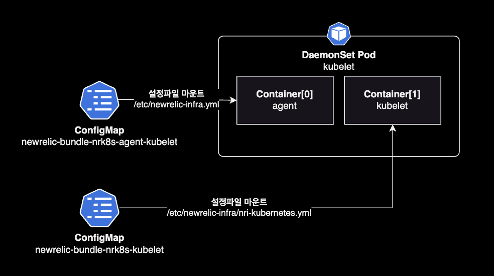

## 개요

Newrelic 통합 차트를 사용해서 쿠버네티스 클러스터에 모니터링 수집 플랫폼 구축하는 방법을 소개합니다.

이 가이드 문서에서 언급되는 Newrelic 헬름 차트는 통합 차트인 nri-bundle을 사용합니다.

&nbsp;

## 배경지식

### nri-bundle

여러 개의 뉴렐릭 모니터링 구성요소를 쉽게 배포하기 위해 New Relic Kubernetes 솔루션의 개별 차트를 그룹화한 통합 차트입니다.

nri-bundle 차트에는 아래와 같이 [Sub chart](https://github.com/newrelic/helm-charts/tree/master/charts/nri-bundle#bundled-charts)들이 포함되어 있습니다.

```bash
# -- main chart
nri-bundle                            5.0.18   https://newrelic.github.io/nri-bundle
└── charts/
    |   # -- sub charts
    ├── newrelic-infrastructure       3.19.0   https://newrelic.github.io/nri-kubernetes
    ├── nri-prometheus                2.1.16   https://newrelic.github.io/nri-prometheus
    ├── newrelic-prometheus-agent     1.2.1    https://newrelic.github.io/newrelic-prometheus-configurator
    ├── nri-metadata-injection        4.3.1    https://newrelic.github.io/k8s-metadata-injection
    ├── newrelic-k8s-metrics-adapter  1.2.0    https://newrelic.github.io/newrelic-k8s-metrics-adapter
    ├── kube-state-metrics            4.23.0   https://prometheus-community.github.io/helm-charts
    ├── nri-kube-events               3.1.0    https://newrelic.github.io/nri-kube-events
    ├── newrelic-logging              1.14.2   https://newrelic.github.io/helm-charts
    ├── newrelic-pixie                2.1.1    https://newrelic.github.io/helm-charts
    ├── pixie-operator-chart          0.1.1    https://pixie-operator-charts.storage.googleapis.com
    └── newrelic-infra-operator       2.2.1    https://newrelic.github.io/newrelic-infra-operator
```

&nbsp;

Newrelic Infrastructure agent의 [릴리즈 노트](https://docs.newrelic.com/docs/release-notes/infrastructure-release-notes/infrastructure-agent-release-notes/2/)에 따르면 3개월마다 업데이트하는 것을 권장하고 있습니다.

> We recommend you upgrade the agent regularly and at a minimum every 3 months.

&nbsp;

#### nri-bundle로 배포시 장점

nri-bundle 통합 차트를 사용하는 것에는 여러 가지 장점이 있습니다.

- **관리의 간소화**: 각 구성 요소를 개별적으로 관리하는 대신에, 'nri-bundle'을 사용하면 여러 개의 New Relic 통합 및 관련 도구를 한 번에 배포하고 관리할 수 있습니다.
- **일관성**: 번들 내의 모든 구성 요소는 함께 잘 작동하는 것이 검증되어 있습니다. 이는 일관된 경험을 제공합니다.
- **상호 운용성**: 번들 내의 구성 요소들은 서로 매끄럽게 통합되도록 설계되어 있습니다. 이는 호환성 문제를 줄이고 업무 흐름을 간소화합니다.
- **배포의 용이성**: 전체 번들을 배포하는 것은 한 번의 명령어 또는 구성 단계만으로 가능합니다. 이는 각 구성 요소를 별도로 배포하는 것과 비교하여 시간과 노력을 절약해줍니다.
- **최적화된 성능**: 번들 내의 구성 요소들은 함께 효율적으로 작동하도록 최적화되어 있습니다. 이는 서로 다른 솔루션을 사용하는 것보다 더 나은 성능을 제공할 수 있습니다.
- **중앙 집중식 지원**: 단일 번들을 사용하면 New Relic 또는 커뮤니티로부터 중앙 집중식 지원을 받을 수 있어요. 이는 문제를 해결하고 해결하는 데 더욱 편리합니다.

결론적으로, nri-bundle 헬름 차트를 사용해서 뉴렐릭 모니터링 인프라를 구성할 경우, Kubernetes 환경에 대한 더 일관되고 효율적인 모니터링 솔루션을 제공함으로써 New Relic 통합 및 관련 도구의 배포 및 관리가 단순화됩니다.

&nbsp;

## 설치

헬름 차트 레포지터리를 로컬에 다운로드 받습니다.

```bash
git clone https://github.com/newrelic/helm-charts.git
cd helm-charts/charts/nri-bundle
```

&nbsp;

하위 차트들을 로컬에 다운로드 받습니다.

```bash
helm dependency update
```

&nbsp;

현재 디렉토리에 구성된 하위 차트 목록을 확인합니다.

```bash
$ helm dependency list
NAME                          VERSION  REPOSITORY                                                   STATUS
newrelic-infrastructure       3.19.0   https://newrelic.github.io/nri-kubernetes                    ok
nri-prometheus                2.1.16   https://newrelic.github.io/nri-prometheus                    ok
newrelic-prometheus-agent     1.2.1    https://newrelic.github.io/newrelic-prometheus-configurator  ok
nri-metadata-injection        4.3.1    https://newrelic.github.io/k8s-metadata-injection            ok
newrelic-k8s-metrics-adapter  1.2.0    https://newrelic.github.io/newrelic-k8s-metrics-adapter      ok
kube-state-metrics            4.23.0   https://prometheus-community.github.io/helm-charts           ok
nri-kube-events               3.1.0    https://newrelic.github.io/nri-kube-events                   ok
newrelic-logging              1.14.2   https://newrelic.github.io/helm-charts                       ok
newrelic-pixie                2.1.1    https://newrelic.github.io/helm-charts                       ok
pixie-operator-chart          0.1.1    https://pixie-operator-charts.storage.googleapis.com         ok
newrelic-infra-operator       2.2.1    https://newrelic.github.io/newrelic-infra-operator           ok
```

&nbsp;

`nri-bundle` 메인 차트를 클러스터의 `newrelic` 네임스페이스에 설치합니다.

```bash
helm upgrade \
  --install \
  --create-namespace \
  --namespace newrelic \
  nri-bundle . \
  --values values.yaml \
  --wait
```

&nbsp;

## 설정 가이드

### kubelet 설정

newrelic-infrasturcture 메트릭 수집을 위한 kubelet 데몬셋이 배포됩니다.



kubelet 데몬셋에는 kubelet과 뉴렐릭 에이전트가 하나의 파드로 포함되어 있습니다.

```bash
$ kubectl get ds -n newrelic
NAME                            DESIRED   CURRENT   READY   UP-TO-DATE   AVAILABLE   NODE SELECTOR   AGE
newrelic-bundle-nrk8s-kubelet   91        91        91      91           91          <none>          19d
```

&nbsp;

뉴렐릭 에이전트의 설정을 확인하려면 뉴렐릭 네임스페이스의 ConfigMap을 조회합니다.

```bash
kubectl get configmap newrelic-bundle-nrk8s-agent-kubelet \
  -n newrelic \
  -o yaml
```

```yaml
apiVersion: v1
data:
  newrelic-infra.yml: |-
    # This is the configuration file for the infrastructure agent. See:
    # https://docs.newrelic.com/docs/infrastructure/install-infrastructure-agent/configuration/infrastructure-agent-configuration-settings/
    custom_attributes:
      clusterName: TEST-CLUSTER
    features:
      docker_enabled: false
    http_server_enabled: true
    http_server_port: 8003
    metrics_network_sample_rate: 300
    metrics_nfs_sample_rate: 300
    metrics_process_sample_rate: -1
    metrics_storage_sample_rate: 300
    metrics_system_sample_rate: 300
kind: ConfigMap
metadata:
  ...
```

`nri-bundle` 차트에서 newrelic-infrasturcture 관련 설정들은 ConfigMap에 추가되고, ConfigMap은 파드에 설정파일 `/etc/newrelic-infra.yml`로 마운트됩니다.

&nbsp;

### 비용 최적화 기법

#### Low data mode 켜기

**연관된 차트 이름**: `nri-bundle` (메인 차트)

`lowDataMode` 토글은 Newrelic으로 전송되는 데이터를 줄이는 가장 간단한 방법입니다.

nri-bundle 차트에서 `global.lowDataMode` 값을 `true`로 설정하면 기본 스크레이핑 간격이 `15s`<sup>기본값</sup> → `30s`로 변경됩니다.

```yaml
# nri-bundle/values.yaml
# nri-bundle chart version v5.0.18
global:
  # -- (bool) Reduces number of metrics sent in order to reduce costs
  # @default -- false
  lowDataMode: true
```

lowDataMode가 활성화되면 기본 스크레이핑 간격이 `15s`에서 `30s`로 변경됩니다. 그리고 아래 4개 차트에 미리 세팅된 비용 최적화 세팅들이 자동 적용됩니다.

- Newrelic Infrastructure
- Prometheus Agent Integration
- Newrelic Logging
- Newrelic Pixie Integration

&nbsp;

어떤 이유로 인해 초 수를 미세 조정해야 하는 경우 `newrelic-infrastructure` 차트에서 `common.config.interval` 설정에 직접 선언해서 적용할 수 있습니다.

```yaml
# nri-bundle/values.yaml
# nri-bundle chart version v5.0.18
...
newrelic-infrastructure:
  common:
    config:
      interval: 40s

global:
  lowDataMode: false
...
```

`interval` 값은 `40s`보다 큰 값으로 설정은 지원되지 않으며 이로 인해 NR UI가 제대로 작동하지 않게 됩니다.

&nbsp;

#### 메트릭 샘플링 주기 변경

**연관된 차트 이름**: `newrelic-infrastructure` (하위 차트)

메트릭 샘플링 주기를 좀 더 길게 변경합니다.

```yaml
# nri-bundle/values.yaml
# nri-bundle chart version v5.0.18
...
newrelic-infrasturcture:
  common:
    agentConfig:
      disable_all_plugin: true
      metrics_network_sample_rate: -1
      metrics_process_sample_rate: 300
      metrics_storage_sample_rate: 300
      metrics_system_sample_rate: 300
      metrics_nfs_sample_rate: 300
...
```

**관련문서**  
[newrelic-infrasturcture 에이전트 설정 (disable_all_plugin)](https://docs.newrelic.com/kr/docs/infrastructure/install-infrastructure-agent/configuration/infrastructure-agent-configuration-settings/#%ED%94%8C%EB%9F%AC%EA%B7%B8%EC%9D%B8-%EB%B3%80%EC%88%98)  
[newrelic-infrasturcture 에이전트 설정 (sample_rate)](https://docs.newrelic.com/kr/docs/infrastructure/install-infrastructure-agent/configuration/infrastructure-agent-configuration-settings/#%EC%83%98%ED%94%8C-%EB%B3%80%EC%88%98)

&nbsp;

#### 네임스페이스 필터링

**연관된 차트 이름**: `newrelic-infrastructure` (하위 차트)

지정된 네임스페이스에서만 ksm<sup>kube-state-metrics</sup> 및 kubelet 메트릭을 필터링합니다.

&nbsp;

간단한 필터링 설정은 `namespaceSelector.matchLabels`를 사용합니다.

```yaml
# nri-bundle/values.yaml
# nri-bundle chart version v5.0.18
...
newrelic-infrastructure:
  common:
    config:
      namespaceSelector:
        matchLabels:
          newrelic.com/scrape: true
...
```

위 설정의 경우 `newrelic.com/scrape` 라벨이 붙은 네임스페이스만 수집하게 됩니다.

&nbsp;

더 복잡한 조건의 필터링 설정은 `namespaceSelector.matchExpressions`를 사용합니다.

```yaml
# nri-bundle/values.yaml
# nri-bundle chart version v5.0.18
...
newrelic-infrastructure:
  common:
    config:
      namespaceSelector:
        matchExpressions:
          - {key: newrelic.com/scrape, operator: NotIn, values: ["false"]}
```

실제 서비스와 연관된 Namespace만 모니터링하도록 하면 비용을 절감할 수 있습니다.

**관련문서**  
[newrelic-infrastructure values](https://github.com/newrelic/nri-kubernetes/tree/main/charts/newrelic-infrastructure#values)

&nbsp;

#### 쿠버네티스 리소스 필터링

불필요한 쿠버네티스 리소스를 메트릭 수집에서 제외합니다.

```yaml
# nri-bundle/values.yaml
# nri-bundle chart version v5.0.18
newrelic-infrastructure:
  ...

kube-state-metrics:
  # kube-state-metrics.enabled -- Install the [`kube-state-metrics` chart](https://github.com/prometheus-community/helm-charts/tree/main/charts/kube-state-metrics) from the stable helm charts repository.
  # This is mandatory if `infrastructure.enabled` is set to `true` and the user does not provide its own instance of KSM version >=1.8 and <=2.0. Note, kube-state-metrics v2+ disables labels/annotations
  # metrics by default. You can enable the target labels/annotations metrics to be monitored by using the metricLabelsAllowlist/metricAnnotationsAllowList options described [here](https://github.com/prometheus-community/helm-charts/blob/159cd8e4fb89b8b107dcc100287504bb91bf30e0/charts/kube-state-metrics/values.yaml#L274) in
  # your Kubernetes clusters.
  enabled: true

  collectors:
  # - certificatesigningrequests
  # - configmaps
  # - cronjobs
  # - daemonsets
  - deployments
  # - endpoints
  # - horizontalpodautoscalers
  - ingresses
  # - jobs
  # - leases
  # - limitranges
  # - mutatingwebhookconfigurations
  - namespaces
  # - networkpolicies
  - nodes
  # - persistentvolumeclaims
  # - persistentvolumes
  # - poddisruptionbudgets
  - pods
  # - replicasets
  # - replicationcontrollers
  # - resourcequotas
  # - secrets
  # - services
  - statefulsets
  # - storageclasses
  # - validatingwebhookconfigurations
  # - volumeattachments
```

&nbsp;

#### Deployment 히스토리 보관 수 조정

Deployment `spec` 설정 중 하나인 `revisionHistoryLimit`는 Kubernetes에서 Deployment의 롤아웃 기록을 보관할 최대 개수를 설정하는 속성입니다. 기본적으로 `10`개의 이전 버전이 보관되며, 이 제한을 초과하면 가장 오래된 배포 기록부터 삭제됩니다.

```yaml
apiVersion: apps/v1
kind: Deployment
metadata:
  # ...
spec:
  revisionHistoryLimit: 10
```

이는 시스템의 리소스를 효율적으로 사용하고 필요시 이전 버전으로 롤백할 수 있는 기능을 제공합니다.

&nbsp;

`revisionHistoryLimit`을 기본값 `10` → `0`으로 줄이는 경우, **20%의 데이터를 절감**할 수 있습니다. 대신 Deployment의 롤백이 필요없는 경우에만 `revisionHistoryLimit`을 `0`으로 지정하도록 합니다.

```yaml
apiVersion: apps/v1
kind: Deployment
metadata:
  # ...
spec:
  revisionHistoryLimit: 0
```

&nbsp;

### 비용절감 효과

적용한 nri-bundle 상세설정

- Low data mode 켜기 (global)
- 메트릭 샘플링 주기 변경 (newrelic-infrastructure 차트)
- 쿠버네티스 리소스 필터링 (kube-state-metrics 차트)
- Deployment 히스토리 보관 수 조정 (쿠버네티스 네이티브한 설정)

&nbsp;

위 기법 적용시 다음과 같이 수집된 데이터 비용이 절감되었습니다.

| Source | 적용 전 한달 | 적용 후 한달 | 절감율 |
|--------|-----------|-----------|-------|
| Infrastructure integrations | 18,260 GB | 6,387 GB | 약 64% 절감 |
| Infrastructure processes | 257 GB | 443 GB | - |
| Metrics | 9,039 GB | 7,902 GB | 약 10% 절감 |
