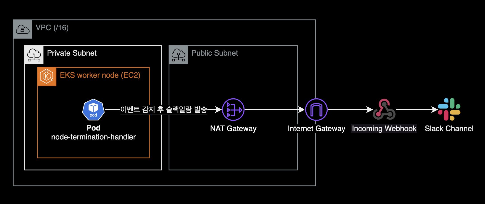

## 개요

이 글은 다음 주제들을 다룹니다.

- Node Termination Handler(이하 NTH)의 동작방식과 주요 기능을 설명합니다.
- 헬름 차트를 사용해서 Node Termination Handler를 설치하고 운영하는 방법을 소개합니다.

쿠버네티스 클러스터와 AWS 인프라를 운영하는 SRE 또는 DevOps Engineer를 대상으로 작성되었습니다.

&nbsp;

## 배경지식

### EKS 스팟 워커노드 사용시 주의사항

스팟 인스턴스를 EKS에 적용하면 비용 절감과 확장성을 향상시킬 수 있지만, 언제든 종료될 수 있다는 점을 명심해야 합니다.

&nbsp;

EKS 워커 노드에 스팟 인스턴스를 적용하기 위해서는 몇 가지 고려해야 할 사항들이 있습니다. 먼저 스팟 인스턴스가 종료된다는 스팟 인스턴스 인터럽션 안내<sup>ITN</sup>을 처리할 수 있어야 합니다.
AWS EC2는 스팟 인스턴스 **종료 2분 전**에 해당 인스턴스에 대한 [인터럽션 안내 이벤트](https://docs.aws.amazon.com/AWSEC2/latest/UserGuide/spot-instance-termination-notices.html)를 발생합니다.

&nbsp;

EKS 환경에서 스팟 인스턴스 인터럽션을 처리할 때 필요한 대응 조치는 다음과 같습니다.


- **cordon** : 해당 워커 노드에 더 이상 파드들이 스케쥴링되지 않도록 막는 설정해야 합니다. 어차피 2분 후 해당 스팟 인스턴스는 Terminate 될 예정이기 때문입니다.
- **drain** : 동작 중인 파드들을 다른 워커노드로 옮겨서 재배치 해야합니다.

&nbsp;

스팟 인스턴스 인터럽션 안내<sup>ITN</sup>에 대응하지 않으면 애플리케이션 코드가 정상적으로 중지되지 않거나, 이미 중단 예정인 워커노드에 새 파드를 실수로 스케줄링 할 수 있습니다. 그렇다고 이 스팟 인스턴스 인터럽션 안내<sup>ITN</sup>에 대한 대응 작업을 EKS 클러스터 관리자가 일일히 매번 진행하는 건 현실적으로 불가능합니다.

그래서 만들어진 쿠버네티스 컨트롤러가 Node Termination Handler 입니다.


NTH는 스팟 인스턴스 인터럽션 안내 이벤트를 감지한 후 자동으로 해당 스팟 노드를 스케줄링 제외한 후, 올라가있는 노드를 다른 노드로 재배치(drain)합니다.

&nbsp;

NTH를 사용하면 스팟 인스턴스로 비용을 절약하면서 동시에 (온디맨드 만큼은 아니지만) 스팟의 치명적 단점인 언제든 종료될 수 있다는 불안정성을 낮출 수 있습니다.

&nbsp;

### Node Termination Handler의 동작방식

aws-node-termination-handler(NTH)는 2가지 모드 중 하나로 동작합니다. 두 모드(IMDS 및 대기열 프로세서) 모두 EC2 인스턴스에 영향을 미치는 이벤트를 모니터링하지만 각각 다른 유형의 이벤트를 지원합니다.

|                    Feature                    | IMDS Processor | Queue Processor  |
| :-------------------------------------------: | :------------: | :--------------: |
| Spot Instance Termination Notifications (ITN) |       ✅        |        ✅        |
|               Scheduled Events                |       ✅        |        ✅        |
|       Instance Rebalance Recommendation       |       ✅        |        ✅        |
|        AZ Rebalance Recommendation            |       ❌        |        ✅        |
|        ASG Termination Lifecycle Hooks        |       ❌        |        ✅        |
|         Instance State Change Events          |       ❌        |        ✅        |

좀 더 다양한 노드 관련 이벤트를 자동 대응하고 싶다면, Queue Processor 모드로 NTH를 구성하는 걸 추천합니다. 대신 IMDS 모드보다 Queue Processor 모드의 설치 과정이 복잡합니다.

&nbsp;

### Node Termination Handler의 설치방식

IMDS 모드와 Queue Processor 모드는 NTH 파드가 배포되는 방식과 구성이 다릅니다.

&nbsp;

#### IMDS (Instance Metadata Service) 모드


- Daemonset 형태로 NTH Pod가 배포됩니다.
- NTH Pod는 EC2 내부에서 IMDS와 통신하며 `spot/`, `events/`와 같은 [인스턴스 메타데이터](https://docs.aws.amazon.com/AWSEC2/latest/UserGuide/instancedata-data-categories.html)를 상시 모니터링합니다.
- 헬름 차트만 배포하면 바로 NTH가 모든 스팟 워커노드에서 동작하므로 Queue Processor 모드에 비해 설치가 쉽습니다.
  - NTH 파드에 IAM Role([IRSA](https://docs.aws.amazon.com/eks/latest/userguide/iam-roles-for-service-accounts.html)) 연결 작업이 필요 없으므로 구성이 단순합니다.

&nbsp;

#### Queue Processor 모드


- NTH Pod는 Deployment 형태로 배포됩니다.
- Queue Processor 모드로 동작하기 위해 IAM Role (IRSA), EventBridge Rule, SQS 등의 추가 인프라가 필요하며, 이는 이벤트 감지와 안전한 처리를 위한 권한과 큐잉 기능을 제공합니다.
- 설치 방식은 IMDS 모드에 비해 다소 복잡합니다.

&nbsp;

## 환경

### 로컬 환경

- helm v3.12.0
- kubectl v1.27.2

&nbsp;

### 쿠버네티스 환경

- EKS v1.25
- Node Termination Handler v1.19.0 (차트 버전 v0.21.0)

&nbsp;

## 설치하기

헬름 차트를 사용해서 NTH를 IMDS 모드로 설치하는 게 목표입니다.

&nbsp;

### 차트 다운로드

[AWS NTH 공식 깃허브 저장소](https://github.com/aws/aws-node-termination-handler)를 다운로드 받습니다.

```bash
$ git clone https://github.com/aws/aws-node-termination-handler.git
```

참고로 NTH 공식 깃허브 레포지터리 안에 [헬름 차트](https://github.com/aws/aws-node-termination-handler/tree/main/config/helm/aws-node-termination-handler)도 포함되어 있습니다.

&nbsp;

NTH 레포지터리 내부에 위치한 헬름 차트 경로로 이동합니다.

```bash
$ cd aws-node-termination-handler/config/helm/aws-node-termination-handler
$ pwd
/Users/younsung.lee/github/aws-node-termination-handler/config/helm/aws-node-termination-handler
```

&nbsp;

차트 디렉토리 `config/helm/aws-node-termination-handler`의 내부 구조는 다음과 같습니다.

```bash
$ tree .
.
├── Chart.yaml
├── README.md
├── example-values-imds-linux.yaml
├── example-values-imds-windows.yaml
├── example-values-queue.yaml
├── templates
│   ├── NOTES.txt
│   ├── _helpers.tpl
│   ├── clusterrole.yaml
│   ├── clusterrolebinding.yaml
│   ├── daemonset.linux.yaml
│   ├── daemonset.windows.yaml
│   ├── deployment.yaml
│   ├── pdb.yaml
│   ├── podmonitor.yaml
│   ├── psp.yaml
│   ├── service.yaml
│   ├── serviceaccount.yaml
│   └── servicemonitor.yaml
└── values.yaml

2 directories, 19 files
```

&nbsp;

### 차트 수정

헬름차트의 `values.yaml`을 수정합니다.

저희는 `values.yaml` 파일에서 크게 3가지 설정을 수정할 예정입니다.

1. **배포대상 지정** : nodeSelector 또는 nodeAffinity를 사용해서 NTH를 특정 노드그룹에만 배포하여 클러스터의 전체 리소스를 절약합니다.
2. **리소스 제한** : NTH 데몬셋 파드의 리소스의 요청값, 제한값을 설정하여 클러스터 전체 리소스를 절약합니다.
3. **webhookURL** : NTH가 이벤트 처리후 알림 메세지를 발송할 Slack incoming webhook의 URL 주소

&nbsp;

#### daemonsetNodeSelector

스팟 인스턴스 타입을 사용하는 워커노드에만 NTH 파드를 배포하도록 `daemonsetNodeSelector`를 지정합니다.

```yaml
# values.yaml
daemonsetNodeSelector:
  # 데몬셋이 NTH 파드를 배포할 기준 설정
  eks.amazonaws.com/capacityType: SPOT
```

데몬셋의 배포 대상을 제한하지 않을 경우 On-demand를 포함한 모든 워커노드에 NTH 파드가 배포되어 불필요한 리소스를 차지하게 됩니다.

&nbsp;

#### nodeAffinity

더 복잡한 노드 선택 조건을 지정하려면 [nodeSelector](https://kubernetes.io/docs/concepts/scheduling-eviction/assign-pod-node/#nodeselector) 보다는 [nodeAffinity](https://kubernetes.io/docs/concepts/scheduling-eviction/assign-pod-node/#node-affinity) 방식을 사용해야 합니다.


특정 노드그룹에만 NTH 데몬셋 파드를 배포하고 싶은 경우, 노드그룹 이름을 기준으로 nodeAffinity를 설정합니다.

`values.yaml`에 nodeAffinity를 적용한 예시는 다음과 같습니다.

```yaml
# values.yaml
daemonsetAffinity:
  nodeAffinity:
    requiredDuringSchedulingIgnoredDuringExecution:
      nodeSelectorTerms:
        - matchExpressions:
            - key: "eks.amazonaws.com/compute-type"
              operator: NotIn
              values:
                - fargate
            - key: node.kubernetes.io/name
              operator: In
              values:
              - hpc-spot
              - data-batch-spot
```

`matchExpressions`에 2가지 조건이 있는 경우 AND 조건으로 동작합니다. 따라서 위 설정의 경우 2가지 조건을 모두 충족한 노드에만 NTH 데몬셋 파드가 배포됩니다.

1. Fargate 타입이 아닌 On-demand 또는 Spot 인스턴스인 경우
2. 노드그룹 이름이 `hpc-spot` 또는 `data-batch-spot`에 속해있는 워커노드인 경우

&nbsp;

#### 파드 리소스 제한

[Node Termination Handler 공식 헬름차트](https://github.com/aws/aws-node-termination-handler/blob/main/config/helm/aws-node-termination-handler/templates/daemonset.linux.yaml#L177-L179)에는 리소스 요청값 제한값이 기본적으로 걸려있지 않습니다.

데몬셋에 의해 각 노드마다 배치되는 데몬셋 파드의 리소스 초기 요청량(requests)과 최대 제한값(limits)을 지정합니다.

기본적으로 데몬셋 파드는 백엔드나 프론트엔드 어플리케이션 파드와 달리 큰 리소스가 필요 없습니다. 제 경우는 아래와 같이 적은 리소스를 할당해도 전혀 동작에 문제가 없었습니다.

`values.yaml` 파일에 다음과 같은 리소스 요청량 제한량 설정을 추가합니다.

```yaml
# values.yaml
resources:
  requests:
    cpu: 10m
    memory: 40Mi
  limits:
    cpu: 100m
    memory: 100Mi
```

&nbsp;

#### PSP 사용여부

Kubernetes v1.25 부터는 PSP<sup>Pod Security Policy</sup>가 지원되지 않습니다. 따라서 EKS v1.25 이상인 경우는 `rbac.pspEnabled`를 `false` 처리합니다.

NTH 차트에서 설정 예시입니다.

```diff
# aws-node-termination-handle/values_ENV.yaml
...
  rbac:
    create: true
+     pspEnabled: true
-     pspEnabled: false
```

&nbsp;

`rbac.pspEnabled` 값이 `false`인 경우 아래 쿠버네티스 리소스들을 생성되지 않게 명시적으로 지정합니다. 이는 NTH 차트의 일부인 [psp.yaml](https://github.com/aws/aws-node-termination-handler/blob/main/config/helm/aws-node-termination-handler/templates/psp.yaml#L1) 헬름 템플릿에 포함되어 있는 로직입니다.

- PSP용 Role
- PSP용 RoleBinding
- PSP

&nbsp;

NTH 파드가 PSP를 사용하던 쿠버네티스 리소스 관계도는 다음과 같습니다.


&nbsp;

#### webhookURL (선택사항)

NTH 파드가 cordon & drain 조치를 할 때마다 슬랙 채널로 알람이 갈 수 있게 슬랙의 Incoming webhook URL을 입력합니다.

> Slack의 Incoming webhook 설정 방법은 이 글의 주제를 벗어나므로 설명은 생략하겠습니다.

```yaml
# values.yaml
# webhookURL if specified, posts event data to URL upon instance interruption action.
webhookURL: "https://hooks.slack.com/services/XXXXXXXXX/XXXXXXXXXXX/XXXXXXXXXXXXXXXXYYYZZZZZ"
```

&nbsp;

만약 NTH의 이벤트 핸들링에 대한 슬랙 알람을 받을 필요 없다면 `webhookURL`은 기본값으로 비워두도록 합니다.

```yaml
# values.yaml
# webhookURL if specified, posts event data to URL upon instance interruption action.
webhookURL: ""
```

&nbsp;

#### webhookTemplate (선택사항)

헬름차트의 `webhookTemplates` 값을 수정하면 Node Termination Handler 파드가 보내는 슬랙 알람 메세지 템플릿을 커스터마이징 할 수 있습니다.

&nbsp;

`webhookTemplate` 설정을 보기 편하게 줄바꿈을 적용해야할 경우, `YAML`에서 지원하는 [Folded Scalar](https://yaml.org/spec/1.2-old/spec.html#style/block/folded)<sup>`>`</sup>를 사용해서 아래와 같이 설정합니다.

```yaml
# values.yaml
# webhookTemplate if specified, replaces the default webhook message template.
webhookTemplate: >
  {
    "text": ":rotating_light: *EC2 스팟 인스턴스가 중단될 예정입니다.* :rotating_light:\n
    *_Account:_* `{{ .AccountId }}`\n
    *_Instance ID:_* `{{ .InstanceID }}`\n
    *_Node Name:_* `{{ .NodeName }}`\n
    *_Instance Type:_* `{{ .InstanceType }}`\n
    *_Start Time:_* `{{ .StartTime }}`\n
    *_Description:_* {{ .Description }}\n
    *_Affected Pod(s):_* `{{ .Pods }}`"
  }
```

Folded scalar는 YAML에서 긴 문자열을 여러 줄로 작성할 때 사용하는 기능으로, > 기호를 사용하며 줄바꿈을 공백으로 대체합니다. 긴 설명이나 메시지를 가독성 있게 표현할 때 유용합니다.

&nbsp;


`webhookTemplate` 설정 외에도 별도의 ConfigMap(또는 Secret) 리소스에 슬랙 템플릿 정보를 저장한 후, 불러오는 방법도 있습니다.

&nbsp;

기본값으로 아무것도 선언하지 않은 webhookTemplate은 다음과 같습니다.

```yaml
# values.yaml
webhookTemplate: "\{\"Content\":\"[NTH][Instance Interruption] InstanceId: \{\{ \.InstanceID \}\} - InstanceType: \{\{ \.InstanceType \}\} - Kind: \{\{ \.Kind \}\} - Start Time: \{\{ \.StartTime \}\}\"\}"
```


자세한 사항은 NTH 깃허브에서 [End to End 테스트 코드](https://github.com/aws/aws-node-termination-handler/blob/b6477836cc81f6c2e82ca9840adf170472bbd0fc/test/e2e/webhook-test#L30)를 확인하도록 합니다.

&nbsp;

일반적인 네트워크 구성의 경우, Slack 알람을 받으려면 NTH Pod가 위치한 노드가 NAT Gateway를 경유해 Internet의 슬랙에 도달 가능한 네트워크 구성이어야 합니다.



슬랙 채널로 이벤트 핸들링 알람을 보내는 주체는 NTH Pod입니다.

&nbsp;

### 헬름으로 NTH 설치

로컬에 받은 헬름차트를 사용해서 NTH를 설치합니다.

NTH는 시스템 기본 네임스페이스인 `kube-system`에 설치하는 걸 권장합니다.

```bash
CHART_VERSION=0.21.0
helm upgrade \
  --install \
  --namespace kube-system \
  aws-node-termination-handler ./aws-node-termination-handler \
  --version $CHART_VERSION \
  --wait
```

NTH는 기본적으로 IMDS<sup>Instance Metadata Service</sup> 모드로 설치됩니다.

&nbsp;

SQS Queue를 사용하는 Queue Processor 모드로 설치하려면 다음과 같이 `values.yaml`의 `enableSqsTerminationDraining` 값을 `false`에서 `true`로 변경해야 합니다.

```yaml
# values.yaml
# enableSqsTerminationDraining If true, this turns on queue-processor mode which drains nodes when an SQS termination event is received
enableSqsTerminationDraining: true
```

이 외에도 SQS Queue와 IAM 권한 설정 등 부수적인 작업이 필요합니다. 해당 글에서는 IMDS 모드로 설치하는 방법만 다룹니다. 더 자세한 사항은 [NTH 공식문서](https://github.com/aws/aws-node-termination-handler?tab=readme-ov-file#infrastructure-setup)를 참고하세요.

&nbsp;

```bash
Release "aws-node-termination-handler" has been upgraded. Happy Helming!
NAME: aws-node-termination-handler
LAST DEPLOYED: Sun Jun 11 17:40:56 2023
NAMESPACE: kube-system
STATUS: deployed
REVISION: 5
TEST SUITE: None
NOTES:
***********************************************************************
* AWS Node Termination Handler                                        *
***********************************************************************
  Chart version: 0.21.0
  App version:   1.19.0
  Image tag:     public.ecr.aws/aws-ec2/aws-node-termination-handler:v1.19.0
  Mode :         IMDS
***********************************************************************
```

Node Termination Handler 버전이 1.19.0이고 (차트 버전은 0.21.0), IMDS 모드로 설치된 걸 확인할 수 있습니다.

&nbsp;

이미 Node Termination Handler가 설치된 상황에서 재설치가 필요한 경우 `--recreate-pods`와 `--force` 옵션을 사용하면 됩니다.

```bash
$ helm upgrade \
    --install \
    --namespace kube-system \
    aws-node-termination-handler ./aws-node-termination-handler \
    --version $CHART_VERSION \
    --recreate-pods \
    --force
```

```bash
Flag --recreate-pods has been deprecated, functionality will no longer be updated. Consult the documentation for other methods to recreate pods
```

명령어 실행시 나타나는 위 경고문은 `--recreate-pods` 옵션이 deprecated 되었다고 알려주는 내용입니다. NTH 재설치 자체는 문제없이 진행되므로 넘어가도 됩니다.

&nbsp;

NTH 릴리즈의 설치 상태를 확인합니다.

```bash
$ helm list -n kube-system
```

```bash
NAME                           NAMESPACE     REVISION   UPDATED                                STATUS     CHART                                 APP VERSION
aws-node-termination-handler   kube-system   5          2023-06-11 17:40:56.273914 +0900 KST   deployed   aws-node-termination-handler-0.21.0   1.19.0
```

&nbsp;

NTH 릴리즈에 적용된 `values.yaml` 상태를 확인합니다.

```bash
$ helm get values aws-node-termination-handler -n kube-system
```

저희가 `values.yaml` 파일에서 변경한 노드 선택, 파드의 리소스 제한, 슬랙 웹훅 주소 설정 값 3개가 잘 적용되어 있는지 확인합니다.

&nbsp;

### NTH 파드 상태 확인

NTH 데몬셋 상태를 확인합니다.

```bash
$ kubectl get daemonset -n kube-system aws-node-termination-handler
```

```bash
NAME                           DESIRED   CURRENT   READY   UP-TO-DATE   AVAILABLE   NODE SELECTOR                                                AGE
aws-node-termination-handler   2         2         2       2            2           eks.amazonaws.com/capacityType=SPOT,kubernetes.io/os=linux   3h56m
```

크게 2가지 확인이 필요합니다.

- 데몬셋에 NODE SELECTOR가 제대로 설정되어 있는지 여부
- NTH 파드가 Spot 인스턴스에만 배포되어 있는지 확인합니다.

IMDS<sup>Instance Metadata Service</sup> 모드로 NTH를 설치한 이유는 (주로) 스팟 인스턴스의 인터럽션 이벤트를 핸들링하기 위한 목적이 큽니다. 스팟 인스턴스 중단 안내 외에 특별하게 핸들링할 이벤트가 없다면 리소스 절약을 위해 온디맨드 노드에 배치될 필요가 없습니다.

&nbsp;

만약 스팟 워커노드가 Kubernetes Autoscaler(혹은 Karpenter)에 의해 자동으로 스케일 아웃되는 경우 NTH 데몬셋은 다음과 같이 동작합니다.

```bash
NAME                           DESIRED   CURRENT   READY   UP-TO-DATE   AVAILABLE   NODE SELECTOR                                                AGE
aws-node-termination-handler   2         2         2       2            2           eks.amazonaws.com/capacityType=SPOT,kubernetes.io/os=linux   3h56m
```

&nbsp;

EKS 클러스터에 스팟 인스턴스가 1대 더 늘어나서 워커노드가 총 3대가 된 상황입니다.

```bash
NAME                           DESIRED   CURRENT   READY   UP-TO-DATE   AVAILABLE   NODE SELECTOR                                                AGE
aws-node-termination-handler   3         3         3       3            3           eks.amazonaws.com/capacityType=SPOT,kubernetes.io/os=linux   3h57m
```

IMDS 모드는 aws-node-termination-handler 파드를 데몬셋을 통해 배포하기 때문에, 스팟 워커노드가 스케일 아웃되어 대수가 늘어나면 그에 맞춰서 NTH 파드도 자동 생성된 걸 확인할 수 있습니다.

&nbsp;

### 파드의 우아한 종료

쿠버네티스에서 파드의 우아한 종료(Graceful Shutdown)는 애플리케이션을 안전하게 종료하도록 보장하는 중요한 과정입니다. 이를 위해 tGPS<sup>terminationGracePeriodSeconds</sup>와 preStop 후크를 조합하여 사용할 수 있습니다.

#### 관련 파드 spec

1. **`spec.terminationGracePeriodSeconds`** : 줄여서 tGPS라고도 합니다. `spec.terminationGracePeriodSeconds`는 파드가 종료 신호를 받은 후 실제로 종료되기 전까지 기다리는 시간을 설정합니다. 이 시간 동안 파드는 마지막 작업을 처리하고 리소스를 안전하게 해제할 수 있습니다. 기본값은 `30`초이며, 이를 조정하여 필요한 만큼의 시간을 설정할 수 있습니다.
2. **`preStop` 훅의 역할** : `preStop` 후크는 파드가 종료 신호를 받은 직후, 실제 종료 프로세스가 시작되기 전에 실행되는 커맨드나 HTTP 요청입니다. 이를 통해 파드는 종료에 필요한 사전 작업을 실행할 수 있습니다(예: 세션 저장, 로그 백업 등).

&nbsp;

#### 종료 신호가 발생하는 상황

쿠버네티스에서 파드에 종료 신호가 보내지는 여러 가지 상황이 있습니다:

- **파드 스케일링**: 파드를 스케일 다운할 때, 쿠버네티스는 초과된 파드 인스턴스를 종료합니다.
- **배포 업데이트**: 새 버전의 컨테이너 이미지로 업데이트하거나 구성 변경이 있을 때, 기존 파드가 종료되고 새로운 파드가 생성됩니다.
- **자원 부족**: 노드에서 자원 부족이 발생하면, 스케줄러가 파드를 다른 노드로 이동시키기 위해 종료할 수 있습니다.
- **수동 삭제**: 사용자가 명령어나 API를 통해 파드를 직접 삭제하는 경우.
- **노드 유지보수**: 노드가 유지보수 모드로 들어가거나 재시작되어야 할 때, 해당 노드의 파드들이 종료됩니다.

&nbsp;

#### 파드의 우아한 종료 설정 예시

아래는 `terminationGracePeriodSeconds`와 `preStop` 훅을 조합해서 쿠버네티스 파드의 우아한 종료<sup>Graceful Shutdown</sup>를 설정한 예시입니다.

```yaml
---
apiVersion: v1
kind: Pod
metadata:
  name: example-pod
spec:
  # [1] 파드 종료 대기 시간을 60초로 설정
  terminationGracePeriodSeconds: 60
  containers:
  - name: example-container
    image: nginx
    lifecycle:
      preStop:
        exec:
          # [2] 종료 전 55초 동안 대기
          command: ["sh", "-c", "sleep 55"]
```

이 예시에서 `terminationGracePeriodSeconds` 값은 `60`초로 설정되어 있습니다. 컨테이너는 종료 신호 수신 후 preStop 후크로 지정된 `sleep 55` 커맨드가 실행되며, 이 커맨드는 종료 전 `55`초 동안 파드를 대기 상태로 유지합니다. 이 시간 동안 파드는 마지막 데이터 처리, DB 커넥션 해제, 리소스 할당 해제 등 필요한 작업을 완료할 수 있습니다.

&nbsp;

terminationGracePeriodSeconds와 preStop이 적용된 파드 라이프사이클을 타임라인으로 표현하면 다음과 같습니다.


이 방법을 통해 파드의 우아한 종료가 보장되며, 애플리케이션의 안정성을 높이고 데이터 손실 위험을 줄일 수 있습니다.

> 우아한 종료를 보장하기 위해서는 `preStop` 지속시간과 애플리케이션 정상 종료시간의 합이 `spec.terminationGracePeriodSeconds` 값보다 작아야 합니다.

```bash
terminationGracePeriodSeconds > preStop duration + application shutdown time
```

&nbsp;

Spring Framework로 개발된 어플리케이션의 경우 다음 설정들이 정상 종료시간<sup>Application Shutdown Time</sup>에 영향을 줍니다:

- `spring.cloud.gateway.httpclient.pool.max-life-time`: 커넥션 풀의 채널이 닫히기까지의 최대 수명 시간입니다. 기본값은 `NULL`이며, `NULL`인 경우 수명 제한이 없습니다. 이 값을 설정하면 오래된 커넥션들이 강제로 종료되므로, 파드 종료시 정리해야 할 커넥션의 수가 줄어 정상 종료 시간이 단축됩니다. 자세한 설정값은 [Spring Cloud Gateway 공식문서](https://docs.spring.io/spring-cloud-gateway/reference/appendix.html)를 참고하세요.
- `spring.lifecycle.timeout-per-shutdown-phase`: 종료 단계별 타임아웃. 이 값을 줄이면 종료 단계별 소모되는 시간이 줄어듭니다.

&nbsp;

아래는 잘못된 설정의 예시입니다 (preStop duration + application shutdown time이 terminationGracePeriodSeconds를 초과):


&nbsp;

## 세부 설정

### NTH 메트릭

Node Termination Handler는 9092 포트의 `/metrics` 엔드포인트로 Prometheus 메트릭 수집을 제공합니다.

아래와 같이 Prometheus 메트릭 엔드포인트를 활성화할 수 있습니다.

```bash
# aws-node-termination-handler/values.yaml
enablePrometheusServer: true
prometheusServerPort: 9092
```

사용 가능한 메트릭은 총 3개이며 다음과 같습니다.

- **actions_total**: 액션의 수
- **actions_node_total**: 노드당 액션의 수 (사용 중단됨: 대신 `actions_total` 메트릭을 사용하세요)
- **events_error_total**: 이벤트 처리 중 오류의 수

&nbsp;

Prometheus 메트릭 수집 방식은 NTH(Node Termination Handler)가 IMDS 모드로 실행되는지, Queue 모드로 실행되는지에 따라 달라집니다.

> `serviceMonitor`와 `podMonitor`는 [Prometheus Operator](https://github.com/prometheus-operator/prometheus-operator)가 Kubernetes 서비스 및 파드와의 통합을 원활하게 하기 위해 제공하는 커스텀 리소스입니다. 더 자세한 내용은 [Prometheus Operator의 API 참조](https://prometheus-operator.dev/docs/api-reference/api/) 문서를 참고하세요.

&nbsp;

Queue 모드에서는 메트릭을 다음 두 가지 방법으로 수집할 수 있습니다:

- Prometheus Operator와 함께 serviceMonitor 커스텀 리소스를 사용하여 메트릭을 수집합니다.
- 또는 Prometheus scrape_configs에 aws-node-termination-handler 서비스 주소를 정적으로 추가합니다.

Prometheus Helm 차트에서의 `scrape_configs` 추가 예시:

```yaml
# charts/prometheus/values.yaml
# 참조: https://github.com/prometheus-community/helm-charts/blob/main/charts/prometheus/values.yaml
extraScrapeConfigs: |
  - job_name: 'aws-node-termination-handler'
    static_configs:
      - targets:
          - 'aws-node-termination-handler.kube-system.svc.cluster.local:9092'
```

&nbsp;

IMDS 모드에서는 `ClusterIP` 타입의 서비스가 제공되지 않기 때문에, `podMonitor` 커스텀 리소스를 사용하여 Prometheus Operator와 함께 파드로부터 직접 메트릭을 수집합니다.


&nbsp;

Prometheus Operator가 없는 경우에는 위와 같은 어노테이션을 모든 NTH Pod에 추가해야 합니다. 이는 NTH Helm 차트의 IMDS 모드에서 ClusterIP 타입의 서비스를 제공하지 않기 때문에, Prometheus Server가 NTH Pod를 자동으로 발견할 수 있는 방법이 필요하기 때문입니다.

```yaml
# charts/aws-node-termination-handler/values.yaml
podAnnotations:
  prometheus.io/scrape: "true"
  prometheus.io/port: "9092"
  prometheus.io/path: "/metrics"

enablePrometheusServer: true
prometheusServerPort: 9092
```

이 설정으로 Prometheus가 NTH Pod의 메트릭을 스크랩할 수 있게 됩니다.

&nbsp;

## 정리

- NTH<sup>Node Termination Handler</sup>는 쿠버네티스 클러스터에 설치되는 데몬셋 노드 컨트롤러입니다. NTH를 사용하면 스팟 인스턴스 및 메인터넌스 스케줄과 같은 EC2 인스턴스 관련 이벤트들을 자동으로 처리할 수 있습니다.
- NTH의 동작 방식은 크게 IMDS 모드와 Queue 모드 두 가지가 있습니다.
- IMDS 모드는 [EC2 인스턴스의 메타데이터 서비스](https://docs.aws.amazon.com/ko_kr/AWSEC2/latest/UserGuide/ec2-instance-metadata.html)<sup>Instance Metadata Service, IMDS</sup>를 통해 이벤트를 감지하고, Queue 모드는 Amazon EventBridge(이전의 CloudWatch Events)를 사용하여 더 넓은 범위의 이벤트를 처리합니다. NTH는 Queue Mode에서 아래와 같이 동작합니다.

  

- 각 모드에 따라 자동으로 처리할 수 있는 인스턴스 이벤트 타입의 범위가 다르며, Queue 모드가 더 넓은 이벤트 처리 범위를 제공합니다.
NTH에 의해 노드가 drain 처리될 때, 그 위에서 구동되는 파드들이 우아하게 종료되도록 하기 위해 파드 설정에 `preStop`과 `spec.terminationGracePeriodSeconds`를 조합하여 추가해야 합니다.
- 이 노드 컨트롤러는 특히 스팟 인스턴스를 활용하는 환경에서 유용하며, 비용 효율성을 높이면서도 안정적인 클러스터 운영을 가능하게 합니다.
- NTH는 노드 종료 이벤트를 감지하여 노드가 종료되기 전에 파드를 안전하게 다른 노드로 이동시키도록 도와줍니다. 이를 통해 데이터 유실을 최소화하고, 서비스의 지속성을 유지할 수 있습니다.

&nbsp;

## 참고자료

[Karpenter와 Spot으로 저렴하고 유연하게 노드 프로비저닝하기](https://tech.scatterlab.co.kr/spot-karpenter/): 스캐터랩에서 쓴 NTH 도입기입니다. 국내에서는 가장 깔끔하게 정리된 문서가 아닐까 싶습니다.

[NTH 설치방법](https://github.com/aws/aws-node-termination-handler#installation-and-configuration): NTH 공식 깃허브 README

[NTH 차트](https://github.com/aws/aws-node-termination-handler/tree/main/config/helm/aws-node-termination-handler): NTH 공식 깃허브에 업로드된 Helm Chart. 혹은 [ArtifactHUB](https://artifacthub.io/packages/helm/aws/aws-node-termination-handler)를 참고해서 설치하셔도 괜찮습니다.

[Reduce Kubernetes Infrastructure cost with EC2 Spot Instances — Part 2](https://medium.com/upday-devs/reduce-kubernetes-infrastructure-cost-with-ec2-spot-instances-part-2-6e311ef56b84): (영문) Non-production 환경을 100% Spot 인스턴스로 운영한 대단한 사례입니다.

[Spot Instance Advisor](https://aws.amazon.com/ko/ec2/spot/instance-advisor/): 각 리전과 인스턴스 타입별로 스팟 인스턴스 중단 빈도[%]를 확인할 수 있습니다.

[인스턴스 메타데이터 및 사용자 데이터](https://docs.aws.amazon.com/ko_kr/AWSEC2/latest/UserGuide/ec2-instance-metadata.html): AWS EC2 공식문서
