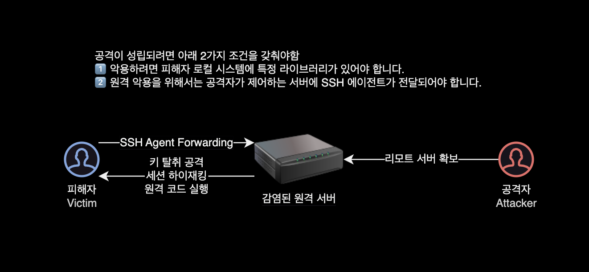

## 개요

로컬 개발환경의 OpenSSH 취약점을 개선하는 방법을 소개하는 가이드입니다.

이 문서에서는 Homebrew를 사용하여 로컬 시스템에 OpenSSH 버전을 업그레이드하고 SSH 취약점을 조치하는 방법을 설명합니다.

&nbsp;

## 배경

2023년 7월 19일에 OpenSSH 관련 새 취약점이 공개되었습니다.  

**CVE-2023-38408**  
Remote Code Execution in OpenSSH’s forwarded ssh-agent

사용자가 (해커에게 공격받아) 감염된 SSH 서버에 특별한 방법으로 (`-A` 옵션을 사용) 접속할 경우, 공격자가 피해자의 PC에서 임의의 라이브러리를 로드 가능.  
특정 조건에서는, 라이브러리 로드를 통해 피해자의 PC에서 원격 코드 실행(RCE<sup>Remote Code Execution</sup>)이 가능할 수 있습니다.



&nbsp;

## 취약점 타임라인

2023-07-06: [Qualys, Inc가 발견한 SSH 취약점 초안](https://www.qualys.com/2023/07/19/cve-2023-38408/rce-openssh-forwarded-ssh-agent.txt) 권고 및 초기 패치가 OpenSSH로 전송되었습니다.

2023-07-07: OpenSSH가 개선된 패치를 보냈습니다.

2023-07-09: OpenSSH에 전송된 패치에 대한 피드백.

2023-07-11: OpenSSH에서 최종 패치를 받았습니다. Qualys, Inc에서 OpenSSH 팀에게 피드백을 보냈습니다.

2023-07-14: OpenSSH는 7월 19일에 보안 전용 릴리스 출시 계획 발표

2023-07-19: 해당 취약점이 해결된 정식 릴리스 [OpenSSH 9.3p2](https://www.openssh.com/txt/release-9.3p2) 공개

&nbsp;

## 대응 방안

### OpenSSH 패치

CVE-2023-38408 취약점이 패치된 [OpenSSH 9.3p2](https://www.openssh.com/txt/release-9.3p2) 이상으로 버전 업그레이드합니다.

macOS의 경우 패키지 관리자인 [brew](https://brew.sh)를 사용하여 버전 업그레이드가 가능합니다.

```bash
# Homebrew 패키지 매니저를 최신 상태로 업데이트합니다.
brew update

# openssh 패키지를 Homebrew를 통해 설치합니다.
# OpenSSH는 SSH(보안 셸) 클라이언트 및 서버를 제공하는 오픈 소스 프로젝트입니다.
brew install openssh

# 설치된 OpenSSH 버전을 확인합니다.
ssh -V
```

&nbsp;

### -A 옵션 사용금지

신뢰할 수 없는 서버에 SSH 연결 시 `-A` 옵션 사용을 금지합니다.

ssh 명령어의 `-A` 옵션은 "에이전트 포워딩(Agent Forwarding)"을 활성화하는 옵션으로, 보안 측면에서 주의해야 할 점이 있습니다. 에이전트 포워딩은 SSH 세션을 통해 사용자의 로컬 컴퓨터에 있는 SSH 에이전트를 원격 서버로 전달하는 기능을 의미합니다.

이러한 기능을 사용하면 로컬 컴퓨터에서 SSH 키를 관리하는 에이전트가 원격 서버에서 사용되어, 원격 서버에 접속할 때마다 키를 입력하지 않고도 편리하게 인증할 수 있습니다. 하지만 이러한 편리함은 동시에 보안상의 위험성을 야기할 수 있습니다.

&nbsp;

SSH Agent 포워딩 사용시 발생할 수 있는 공격 시나리오는 다음과 같습니다:

#### 1. 키 유출

`-A` 옵션을 사용하면 로컬 컴퓨터에 있는 SSH 에이전트의 권한이 원격 서버로 전달됩니다. 이는 만약 원격 서버가 해킹되면 악의적인 사용자가 로컬 컴퓨터에 있는 키에 접근하여 키를 빼내는 데 사용될 수 있습니다.

#### 2. 리모트 서버의 커맨드 인젝션

원격 서버에서 실행되는 악의적인 코드가 로컬 에이전트로부터 권한을 얻으면, 해당 권한으로 로컬 컴퓨터에서 다양한 작업을 수행할 수 있습니다. 이로 인해 커맨드 인젝션 등의 공격이 가능해집니다.

#### 3. 세션 가로채기

중간에 SSH 세션이 가로채질 수 있으며, 이를 통해 로컬 컴퓨터에 있는 에이전트로부터 권한을 탈취하는 공격이 가능합니다.

&nbsp;

크게 위의 3가지 위험성으로 인해 보안 상의 이유로 `-A` 옵션을 사용하는 것은 권장되지 않습니다.

대신에 원격 서버에서 필요한 키를 직접 사용하여 접속하거나, SSH 에이전트를 사용하지 않는 방법을 고려하는 것이 좋습니다.  
더 안전한 대안으로는 원격 서버에서 작업을 수행하지 않고, 원격 서버로부터 로컬로 파일을 복사하는 등의 방식을 고려할 수 있습니다.

&nbsp;

## 해결 예시

이 시나리오에서 로컬 환경은 다음과 같습니다.

- **OS** : macOS Ventura 13.4.1 (c)
- **CPU** : M1 Max (ARM64 아키텍처)
- **Shell** : zsh
- **SSH** : `OpenSSH_9.0p1` (macOS의 기본 설치)
  - 취약점 조치를 위해 새로 설치할 버전은 `OpenSSH_9.3p2` ([brew](https://brew.sh)로 설치)

&nbsp;

로컬에 설치된 OpenSSH 버전을 확인합니다.

```bash
$ which ssh
/usr/bin/ssh
```

```bash
$ ssh -V
OpenSSH_9.0p1, LibreSSL 3.3.6
```

`OpenSSH_9.3p2` 버전 미만은 모두 취약하다고 판단할 수 있습니다.

&nbsp;

brew를 사용해서 최신 버전의 OpenSSH를 설치합니다.

```bash
$ brew install openssh
$ brew info openssh
==> openssh: stable 9.3p2 (bottled)
OpenBSD freely-licensed SSH connectivity tools
https://www.openssh.com/
/opt/homebrew/Cellar/openssh/9.3p2 (45 files, 6.1MB) *
  Poured from bottle using the formulae.brew.sh API on 2023-07-20 at 21:58:25
From: https://github.com/Homebrew/homebrew-core/blob/HEAD/Formula/openssh.rb
License: SSH-OpenSSH
==> Dependencies
Build: pkg-config ✘
Required: ldns ✔, libfido2 ✔, openssl@3 ✔
==> Analytics
install: 8,334 (30 days), 17,850 (90 days), 23,796 (365 days)
install-on-request: 8,322 (30 days), 17,844 (90 days), 23,785 (365 days)
build-error: 20 (30 days)
```

이제 Homebrew를 사용하여 OpenSSH를 설치했으므로 이것이 기본 SSH 클라이언트로 사용중인지 확인해야 합니다.  
기본적으로 시스템 SSH 클라이언트는 `/usr/bin/ssh`에 설치됩니다.

세팅 과정에서 많은 사람들이 직면할 가능성이 있는 문제로는 새 SSH 클라이언트가 설치될 `PATH` 환경변수에서 `/usr/bin`이 `/usr/local/bin`보다 앞에 오는 것입니다.

&nbsp;

예를 들어 제 로컬 환경의 `PATH` 환경변수를 확인해보겠습니다.

```bash
$ echo $PATH | tr ':' '\n'
/usr/local/bin
/opt/local/bin
/opt/local/sbin
/usr/local/bin
/System/Cryptexes/App/usr/bin
/usr/bin
/bin
/usr/sbin
/sbin
/opt/homebrew/bin
/opt/homebrew/sbin
/var/run/com.apple.security.cryptexd/codex.system/bootstrap/usr/local/bin
/var/run/com.apple.security.cryptexd/codex.system/bootstrap/usr/bin
/var/run/com.apple.security.cryptexd/codex.system/bootstrap/usr/appleinternal/bin
```

&nbsp;

SSH 명령어가 위치한 경로를 확인해봅니다.

```bash
$ which ssh
/usr/bin/ssh
```

Homebrew로 설치한 SSH가 아닌 기본 macOS에 설치된 SSH 명령어를 사용중인 걸로 확인됩니다.

| 구분      | SSH 설치 경로       |
|----------|-------------------|
| Homebrew | /opt/homebrew/bin |
| macOS 기본 | /usr/bin/ssh     |

&nbsp;

이 기존 명령어만 가져오는 문제를 해결하는 방법에는 크게 2가지가 있습니다.

&nbsp;

### 기존 명령어 삭제

첫 번째이자 가장 쉬운 방법은 `/usr/bin`에서 SSH 명령어 자체를 삭제하는 것입니다.

```bash
$ rm /usr/bin/ssh
```

이 방법은 SSH의 brew 버전이 기본값이 되도록 하는 데 확실하고 간단하다는 장점이 있지만, macOS 업데이트로 인해 실수로 시스템 SSH 클라이언트가 복원되어 다시 취약점이 노출될 수 있으므로 권장하지 않습니다.

&nbsp;

### PATH 우선순위 재정렬

두 번째로 선호되는 방법은 `/usr/local/bin`이 `/usr/bin`보다 앞에 올 수 있도록 `PATH` 환경변수의 위치를 ​​재정렬하는 방법입니다.

```bash
$ echo $PATH | tr ':' '\n'
/usr/local/bin
/opt/local/bin
/opt/local/sbin
/usr/local/bin
/System/Cryptexes/App/usr/bin
/usr/bin
/bin
/usr/sbin
/sbin
/opt/homebrew/bin
/opt/homebrew/sbin
/var/run/com.apple.security.cryptexd/codex.system/bootstrap/usr/local/bin
/var/run/com.apple.security.cryptexd/codex.system/bootstrap/usr/bin
/var/run/com.apple.security.cryptexd/codex.system/bootstrap/usr/appleinternal/bin
```

&nbsp;

다음 zsh 설정파일의 변경을 통해서 `PATH` 환경변수가 읽어들이는 명령어 경로 우선순위를 변경할 수 있습니다.

```bash
# -- .zshrc 설정파일에 명령어 디렉토리 우선순위 재조정 설정 추가
$ cat << EOF >> ~/.zshrc
# Increase the priority of Homebrew bin directory
export PATH=/opt/homebrew/bin/:$PATH
EOF
```

이제 `PATH` 환경변수에 실제로 변경 사항이 포함되어 있는지 확인하겠습니다.

터미널을 재시작해서 zsh을 다시 시작하거나 `~/.zshrc` 파일을 다시 읽어들여 이 작업을 수행할 수 있습니다.

```bash
$ source ~/.zshrc
$ echo $PATH | tr ':' '\n'
/opt/homebrew/bin
...
/usr/bin
...
```

brew로 설치한 SSH 경로인 `/opt/homebrew/bin`가 `/usr/bin`보다 더 우선순위가 높아진 걸 확인할 수 있습니다.

PATH를 수정할 때 명시적으로 설정하지 않은 이유는 PATH가 다른 곳에서 수정되었을 수 있고 이러한 변경 사항을 유지하기를 원하기 때문입니다.

&nbsp;

이제 우리는 PATH를 수정하여 SSH 클라이언트가 우리가 기대하는 SSH 명령어로 바뀌었는지 확인할 수 있습니다.

```bash
$ which ssh
/opt/homebrew/bin/ssh
```

```bash
$ ssh -V
OpenSSH_9.3p2, OpenSSL 3.1.1 30 May 2023
```

`OpenSSH_9.0p1`에서 `OpenSSH_9.3p2`로 SSH 버전이 업그레이드되었습니다.

`OpenSSH 9.3p2`는 OpenSSH 클라이언트 취약점에 대해 패치된 버전입니다. 해당 버전은 2023년 7월 19일에 출시되었습니다.  
이제 이 시스템은 해당 SSH Agent 포워딩 취약점으로부터 안전한 상태입니다.

&nbsp;

## 결론

> **SSH Agent Forwarding 기능은 주의하여 활성화해야 합니다.**  
> ([SSH 명령어 문서](https://man.openbsd.org/ssh#A)에도 나와있는) 이 경고에도 불구하고 ssh-agent 포워딩은 오늘날에도 여전히 널리 사용되고 있습니다.

SSH Agent의 단점에서 알 수 있듯이 강력하고 안전한 프로토콜과 시스템에도 숨겨진 취약점이 있을 수 있습니다.

패치 구현과 같은 조치를 통해 이러한 보안 취약점을 악용하기 전에 미리 수정하는 것은 디지털 자산 보호와 시스템 무결성을 유지하는 데 매우 중요한 활동이라고 볼 수 있겠습니다.

&nbsp;

## 참고 자료

[OpenSSH 9.3p2 릴리즈 노트](https://www.openssh.com/txt/release-9.3p2)  
OpenSSH에서 발행

[CVE-2023-38408 에 대한 간략한 분석 내용](https://blog.qualys.com/vulnerabilities-threat-research/2023/07/19/cve-2023-38408-remote-code-execution-in-opensshs-forwarded-ssh-agent)  
Qualys, Inc에서 발행

[CVE-2023-38408 에 대한 상세한 기술적 세부 사항](https://www.qualys.com/2023/07/19/cve-2023-38408/rce-openssh-forwarded-ssh-agent.txt)  
Qualys, Inc에서 발행

[ssh -A 옵션 문서](https://man.openbsd.org/ssh#A)  
SSH 명령어 공식문서. SSH Agent Forwarding<sup>`-A`</sup> 옵션 사용에 주의하라는 내용을 언급하고 있습니다.

[Upgrading OpenSSH Client on Mac OSX using Homebrew](https://timhilliard.com/blog/upgrading-openssh-client-mac-osx-using-homebrew/)  
이 글에 나온 SSH Agent forwarding 취약점과 직접 연관된 취약점은 아니지만, brew로 SSH 설치 후 전환하는 방법만 참고했습니다.
