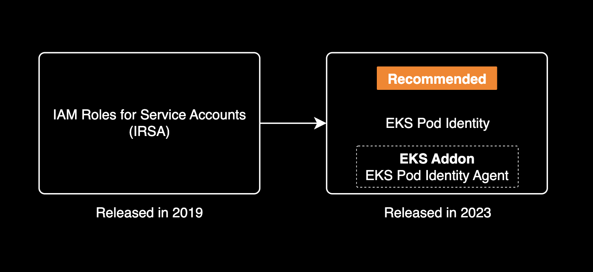
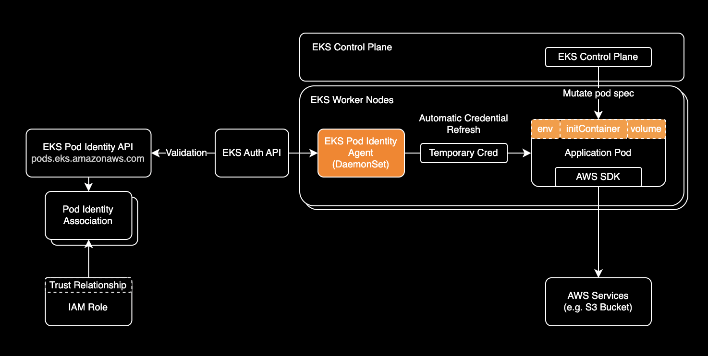
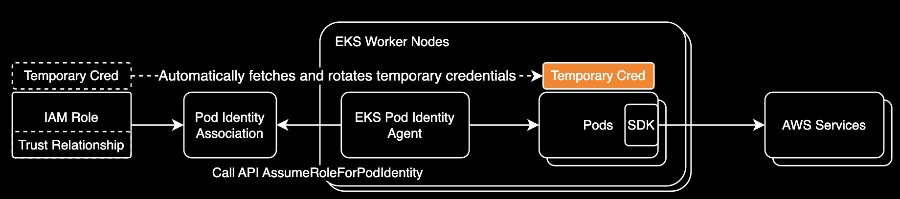

## 개요

[IRSA(IAM Role for Service Account)][IRSA]는 쿠버네티스 서비스 어카운트에 권한을 부여하는 기능입니다.



EKS Addon의 권한 획득 방식을 [IRSA][IRSA]에서 EKS Pod Identity로 전환하는 과정에서 발생한 문제점과 해결 방법을 정리합니다.

&nbsp;

## 환경

EKS Addon의 권한 획득 방식을 [IRSA][IRSA]에서 EKS Pod Identity로 전환하는 환경은 아래와 같습니다.
- **EKS 모듈명**: [terraform-aws-modules/eks/aws](https://github.com/terraform-aws-modules/terraform-aws-eks) (AWS 공식 EKS 테라폼 모듈)
- **테라폼 모듈 버전**: 20.33.1

&nbsp;

## 배경지식

### EKS Pod Identity



[EKS Pod Identity](https://aws.amazon.com/ko/blogs/korea/amazon-eks-pod-identity-simplifies-iam-permissions-for-applications-on-amazon-eks-clusters/)는 2023년 12월에 신규 출시된 EKS Addon 입니다. 최소 권한 부여 원칙을 준수한다는 점에서 2019년에 출시된 [IRSA(IAM Role for Service Account)][IRSA]와 유사하지만, OIDC 자격 증명 공급자를 사용하지 않으므로 IRSA 보다 구성이 쉽다는 장점이 있고, 같은 Account 내 여러 EKS 클러스터에 적용할 수도 있습니다. 하지만, 비교적 최근 출시된 기능이며 AWS SDK의 버전 요구사항이 높아 애플리케이션 파드를 [IRSA][IRSA]에서 EKS Pod Identity로 전환할 경우 개발 환경부터 천천히 호환성 확인 후 적용해야 합니다.



&nbsp;

EKS Pod Identity는 다음과 같은 환경에서 사용할 수 없습니다.

- Linux Amazon EC2 인스턴스를 제외한 모든 곳에서 실행되는 Pod
- AWS Fargate(Fargate)에서 실행되는 Linux 및 Windows Pod는 지원되지 않습니다. Windows Amazon EC2 인스턴스에서 실행되는 Pod는 지원되지 않습니다.

자세한 사항은 AWS 공식문서 [EKS Pod Identity restrictions](https://docs.aws.amazon.com/eks/latest/userguide/pod-identities.html#pod-id-cluster-versions)를 참고해주세요.

&nbsp;

## 주의사항

### EKS 테라폼 모듈 버전 요구사항

Terraform EKS 모듈의 EKS Addon에서 `pod_identity_association` 값을 선언할 수 있는 버전은 [v20.29.0](https://github.com/terraform-aws-modules/terraform-aws-eks/releases/tag/v20.29.0) 이상에서만 가능합니다.

```hcl
# main.tf
module "eks" {
  source  = "terraform-aws-modules/eks/aws"
  version = "20.29.0" # or higher
}
```

자세한 EKS Addon 리소스 코드는 [v20.29.0의 변경사항](https://github.com/terraform-aws-modules/terraform-aws-eks/pull/3203/files#diff-dc46acf24afd63ef8c556b77c126ccc6e578bc87e3aa09a931f33d9bf2532fbbR502-R510)을 참고해주세요.

&nbsp;

## 문제점

### EKS Addon

EKS 클러스터 하나를 구성하는 테라폼 코드는 `my-eks-cluster` 디렉토리에 아래와 같은 구조로 이루어져 있습니다. 여기서 `main.tf` 파일에는 EKS 클러스터와 EKS Addon을 구성하는 코드가 작성되어 있습니다.

```bash
.
└── my-eks-cluster
    ├── backend.tf
    ├── main.tf
    ├── outputs.tf
    ├── variables.tf
    └── versions.tf

2 directories, 5 files
```

&nbsp;

`main.tf`는 20.33.1 버전의 EKS 모듈을 사용하고 있습니다. 이 모듈에서는 아래와 같이 `cluster_addons` 값을 통해 EKS Pod Identity Agent나 EBS CSI 드라이버 등의 EKS Addon을 설치할 수 있습니다.

```hcl
module "eks" {
  source  = "terraform-aws-modules/eks/aws"
  version = "20.33.1"

  cluster_addons = {
    coredns = {
      most_recent = true
    }
    eks-pod-identity-agent = {
      most_recent = true
    }
    kube-proxy = {
      most_recent = true
    }
    vpc-cni = {
      most_recent = true
    }
  }
}
```

&nbsp;

EBS CSI 드라이버는 EBS 볼륨 관리를 위한 IAM Role이 필요합니다. AWS 공식 Terraform EKS 모듈에서는 `module.eks.cluster_addons`에 EKS Addon과 IAM Role ARN을 선언하여 [IRSA][IRSA] 모드로 설정할 수 있습니다.

```hcl
# main.tf
module "eks" {
  source  = "terraform-aws-modules/eks/aws"
  version = "20.33.1"

  cluster_addons = {
    # Configure addon to use pod identity association
    aws-ebs-csi-driver = {
      most_recent              = true
      service_account_role_arn = "arn:aws:iam::<REDACTED>:role/${module.eks.cluster_name}-ebs-csi-driver-irsa-role"
    }
  }
}
```

&nbsp;

저는 멀티 클러스터 도입을 위한 목적으로 EBS CSI 드라이버를 [IRSA][IRSA]에서 EKS Pod Identity로 전환하려고 했습니다. 아래와 같이 `cluster_addons`에 `pod_identity_association`을 선언합니다.

> ⚠️ **EKS 모듈 버전 요구사항**: [EKS 모듈 v20.29.0](https://github.com/terraform-aws-modules/terraform-aws-eks/releases/tag/v20.29.0)부터 `cluster_addons`에 `pod_identity_association`을 선언할 수 있습니다.

```hcl
# main.tf
module "eks" {
  source  = "terraform-aws-modules/eks/aws"
  version = "20.33.1"

  cluster_addons = {
    # Configure addon to use pod identity association
    aws-ebs-csi-driver = {
      most_recent              = true
      # `pod_identity_association` parameter is only available
      # in terraform module v20.29.0 or higher
      pod_identity_association = [
        {
          role_arn        = "arn:aws:iam::<REDACTED>:role/${module.eks.cluster_name}-ebs-csi-driver-irsa-role"
          service_account = "ebs-csi-controller-sa"
        }
      ]
    }
  }
}
```

&nbsp;

당연한 이야기이지만 `eks-pod-identity-agent` 에드온도 같이 설치되어 있어야 합니다.

```hcl
# main.tf
module "eks" {
  source  = "terraform-aws-modules/eks/aws"
  version = "20.33.1"

  cluster_addons = {
    # Configure addon to use pod identity association
    aws-ebs-csi-driver = {
      most_recent              = true
      # `pod_identity_association` parameter is only available
      # in terraform module v20.29.0 or higher
      pod_identity_association = [
        {
          role_arn        = "arn:aws:iam::<REDACTED>:role/${module.eks.cluster_name}-ebs-csi-driver-irsa-role"
          service_account = "ebs-csi-controller-sa"
        }
      ]
    }

    eks-pod-identity-agent = {
      most_recent = true
    }
  }
}
```

&nbsp;

EKS Addon의 IAM 권한 획득 방식을 IRSA에서 EKS Pod Identity로 전환하려면 `terraform apply`로 변경사항을 적용합니다.

```bash
terraform apply
```

&nbsp;

여기서 우리는 결정적인 문제를 마주하게 됩니다.

대부분의 사용자는 IRSA에서 EKS Pod Identity로 마이그레이션 하는 과정에서 `Cross-account pass role is not allowed` 403 에러를 마주하게 됩니다. 이 에러의 원인은 선언한 IAM Role이 **실제로 존재하지 않거나** 혹은 **올바르게 설정되지 않아** 발생합니다.

```bash
╷
│ Error: updating EKS Add-On (reliability-dev:aws-ebs-csi-driver): operation error EKS: UpdateAddon, https response error StatusCode: 403, RequestID: 5bfc50dc-8c8d-47f2-818d-77ac95da2045, api error AccessDeniedException: Cross-account pass role is not allowed.
│ 
│   with module.terraform_aws_eks_module.module.eks.aws_eks_addon.this["aws-ebs-csi-driver"],
│   on .terraform/modules/terraform_aws_eks_module.eks/main.tf line 484, in resource "aws_eks_addon" "this":
│  484: resource "aws_eks_addon" "this" {
│ 
╵
```

분명 EKS Addon 테라폼 코드에서 EKS Pod Identity로 설정하고 있습니다. 왜 이런 IRSA 관련 에러가 발생하는지 이해하기 어렵습니다.

&nbsp;

이유는 간단합니다. 테라폼 모듈 자체가 문제입니다. [EKS 모듈의 EKS Addon](https://github.com/terraform-aws-modules/terraform-aws-eks/blob/v20.33.1/main.tf#L761) 리소스에서 `service_account_role_arn`을 선언하지 않으면 기본값으로 `null`이 설정됩니다.

실제로 문제를 유발하는 `aws_eks_addon` 리소스는 아래와 같습니다:

```hcl
# terraform-aws-eks v20.33.1
resource "aws_eks_addon" "this" {
  # ...
  service_account_role_arn    = try(each.value.service_account_role_arn, null)
  # ...
}
```

&nbsp;

이 때 테라폼 모듈에서 제공하는 `service_account_role_arn`의 기본 값은 `null`이므로 오류가 발생합니다. EKS API 요청 구조상 최소 `service_account_role_arn` 매개변수는 최소 길이 1, 최대 길이 255의 길이 제약(Length Constraint)을 갖고 있으므로 이것이 이 문제의 가장 가능성 있는 원인입니다. 일종의 버그라고 볼 수 있습니다.

아래는 Amazon EKS API에서 [UpdateAddon](https://docs.aws.amazon.com/eks/latest/APIReference/API_UpdateAddon.html#API_UpdateAddon_RequestSyntax)에 대한 요청 본문 구조입니다.

```json
POST /clusters/name/addons/addonName/update HTTP/1.1
Content-type: application/json

{
   "addonVersion": "string",
   "clientRequestToken": "string",
   "configurationValues": "string",
   "podIdentityAssociations": [ 
      { 
         "roleArn": "string",
         "serviceAccount": "string"
      }
   ],
   "resolveConflicts": "string",
   "serviceAccountRoleArn": "string"
}
```

테라폼 모듈에서 처리하는 `service_account_role_arn`의 기본값이 `null`이므로 길이 제약(Length Constraint) 문제로 `Cross-account pass role is not allowed` 오류가 발생합니다. 

해당 테라폼 모듈 문제는 아래 2개 이슈와 연관되어 있습니다.

- [[Bug]: aws_eks_addon cannot remove value for service_account_role_arn #30645](https://github.com/hashicorp/terraform-provider-aws/issues/30645)
- [feat: allow eks addons to use pod identity associations #244](https://github.com/cloudposse/terraform-aws-eks-cluster/pull/244)

&nbsp;

## 해결방법

파괴적인 방법이지만 명확한 해결방법이 있습니다. EKS 모듈을 받아와서 `service_account_role_arn` 값을 수정하는 방법도 있겠지만 저는 테라폼 모듈의 소스코드를 수정하는 것을 되도록이면 피하고 싶었기 때문에 아래 방법을 선택했습니다.

이 해결방법은 Pod Identity로 에드온이 사용할 IAM Role이 이미 존재하며 Trust Relationship이 정상적으로 설정되어 있는 경우에만 적용할 수 있습니다.

1. EKS Addon(여기서는 EBS CSI 드라이버)을 삭제합니다. 에드온을 주석처리한 후 `terraform apply`로 에드온을 삭제하거나 EKS 콘솔에서 수동으로 삭제합니다. 당연한 이야기이지만 EKS Pod Identity Agent는 삭제하지 않고 설치된 상태로 둡니다.

```hcl
# main.tf
module "eks" {
  source  = "terraform-aws-modules/eks/aws"
  version = "20.33.1"

  cluster_addons = {
    # aws-ebs-csi-driver = {
    #   most_recent              = true
    #   pod_identity_association = [
    #     {
    #       role_arn        = "arn:aws:iam::<REDACTED>:role/${module.eks.cluster_name}-ebs-csi-driver-irsa-role"
    #       service_account = "ebs-csi-controller-sa"
    #     }
    #   ]
    # }

    eks-pod-identity-agent = {
      most_recent = true
    }
  }
}
```

2. (해당되는 경우) 대상 EKS Addon에 등록된 Pod Identity Association을 Terraform 또는 AWS EKS 콘솔을 통해 삭제합니다. Pod Identity Association 리소스를 삭제하지 않으면 다음 단계에서 `Association already exists` 오류를 마주합니다.
3. 대상 EKS Addon을 `cluster_addons`에 추가하고 IRSA 설정 `service_account_role_arn` 대신 `pod_identity_association`을 선언합니다.

```hcl
# main.tf
module "eks" {
  source  = "terraform-aws-modules/eks/aws"
  version = "20.33.1"

  cluster_addons = {
    # Configure addon to use pod identity association
    aws-ebs-csi-driver = {
      most_recent              = true
      pod_identity_association = [
        {
          role_arn        = "arn:aws:iam::<REDACTED>:role/${module.eks.cluster_name}-ebs-csi-driver-irsa-role"
          service_account = "ebs-csi-controller-sa"
        }
      ]
    }

    eks-pod-identity-agent = {
      most_recent = true
    }
  }
}
```

4. `terraform apply`로 대상 EKS Addon을 재설치합니다.

```bash
terraform apply
```

```bash
...
Do you want to perform these actions?
  Terraform will perform the actions described above.
  Only 'yes' will be accepted to approve.

  Enter a value: yes

module.eks.aws_eks_addon.this["aws-ebs-csi-driver"]: Creating...
module.eks.aws_eks_addon.this["aws-ebs-csi-driver"]: Still creating... [10s elapsed]
module.eks.aws_eks_addon.this["aws-ebs-csi-driver"]: Still creating... [20s elapsed]
module.eks.aws_eks_addon.this["aws-ebs-csi-driver"]: Still creating... [30s elapsed]
module.eks.aws_eks_addon.this["aws-ebs-csi-driver"]: Still creating... [40s elapsed]
module.eks.aws_eks_addon.this["aws-ebs-csi-driver"]: Still creating... [50s elapsed]
module.eks.aws_eks_addon.this["aws-ebs-csi-driver"]: Creation complete after 56s [id=<REDACTED>:aws-ebs-csi-driver]

Apply complete! Resources: 1 added, 0 changed, 0 destroyed.
```

`Cross-account pass role is not allowed` 오류 없이 EBS CSI 드라이버 에드온이 EKS Pod Identity 모드로 정상적으로 설치되었습니다.

&nbsp;

EBS CSI Driver 파드가 [IRSA][IRSA]와 Pod Identity 중 어떤 방식으로 권한을 획득하는지 확인합니다. 이 과정에서 [mkat][mkat] 명령어를 사용합니다. [mkat][mkat]는 Managed Kubernetes Auditing Toolkit의 줄임말로, EKS 클러스터에서 사용하는 모든 권한 관계를 한눈에 확인할 수 있는 툴입니다.

[mkat][mkat]를 설치하려면 패키지 관리자인 `brew`를 통해 설치합니다.
```bash
brew tap datadog/mkat https://github.com/datadog/managed-kubernetes-auditing-toolkit
brew install datadog/mkat/managed-kubernetes-auditing-toolkit
```

[mkat] 명령어를 실행하면 EKS 클러스터의 모든 파드에 대한 권한 관계를 확인할 수 있습니다. 이를 통해 EBS CSI Driver 파드가 [IRSA(IAM Role for Service Account)][IRSA]와 Pod Identity 중 어떤 방식으로 권한을 획득하는지 확인할 수 있습니다.

```bash
export AWS_PROFILE=<YOUR_PROFILE_EXISTING_YOUR_CLUSTER>
mkat eks find-role-relationships
```

&nbsp;

## 관련자료

EKS 테라폼 모듈:

- [EKS Addon](https://github.com/terraform-aws-modules/terraform-aws-eks/blob/v20.33.1/main.tf#L761): 이 이슈의 원인이 되는 코드 라인

AWS EKS API 공식 문서:

- [UpdateAddon](https://docs.aws.amazon.com/eks/latest/APIReference/API_UpdateAddon.html#API_UpdateAddon_RequestSyntax)

테라폼 관련 이슈:

- [[Bug]: aws_eks_addon cannot remove value for service_account_role_arn #30645](https://github.com/hashicorp/terraform-provider-aws/issues/30645)
- [feat: allow eks addons to use pod identity associations #244](https://github.com/cloudposse/terraform-aws-eks-cluster/pull/244)

[mkat]: https://github.com/datadog/managed-kubernetes-auditing-toolkit
[IRSA]: https://docs.aws.amazon.com/eks/latest/userguide/iam-roles-for-service-accounts.html