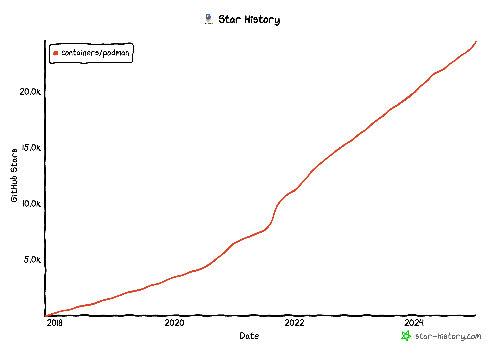
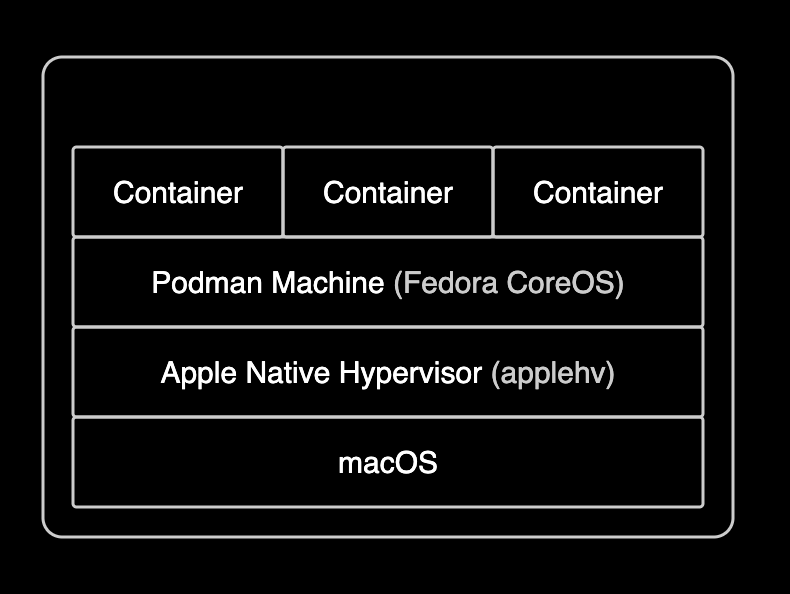

## 개요

macOS 환경에서 docker desktop을 대체할 수 있는 대표적인 대안인 [podman](https://github.com/containers/podman)을 설치하고 사용하는 방법을 설명합니다.

저처럼 GUI 기반의 무거운 Docker Desktop에 반감이 있는 분들이 많을 것 같습니다. 저도 그랬고, 그래서 오늘은 이런 분들을 위해 podman을 설치하고 사용하는 방법을 설명해보려 합니다.

&nbsp;

사용자 시장 뿐만 아니라 엔터프라이즈의 컨테이너 런타임 환경에서도 dockershim이 지원 중단되며 containerd 기반의 컨테이너 런타임이 대세가 되고 있습니다. 이런 추세에 따라 사용자 수준의 컨테이너 런타임 환경도 되도록이면 Docker Desktop을 사용하지 않는 것이 좋습니다. 무엇보다도 Podman은 오픈소스이며 리소스가 적게 소모되며 빠르게 실행되는 것이 장점입니다.

[아래 그래프](https://star-history.com/#containers/podman&Date)는 [podman 레포지터리](https://github.com/containers/podman)의 인기도(star)를 나타낸 것입니다.



굉장히 짧은 시간 동안에 많은 사용자가 podman에 관심을 가지고 있음을 알 수 있습니다.

&nbsp;

## 배경지식

### Docker Desktop의 라이선스 정책 변경

Docker Desktop의 라이선스 정책 변경으로 인해 많은 기업가 사용자들이 보다 유연하고 비용 효율적인 대안을 모색하게 되었습니다. 특히나 기업 환경의 머신에서 Docker Desktop을 사용하고 실행하는 경우 사용자가 모르는 사이에 라이센스 위반 위험이 있으므로 각별한 주의가 필요합니다.

아래 2개 문구는 [Docker Desktop의 라이센스 계약 내용](https://docs.docker.com/subscription/desktop-license/) 중 일부입니다.

- Docker Desktop은 소규모 기업(직원 250명 미만, 연 매출 1,000만 달러 미만), 개인 사용, 교육 및 비상업적 오픈 소스 프로젝트에 무료로 제공됩니다.
- 그렇지 않은 경우 전문적인 용도로 사용하려면 유료 구독이 필요합니다.

macOS 환경에서 Docker Desktop을 대체하기 위한 대안으로는 OrbStack, Colima, Rancher Desktop, Podman 등 여러 대안이 있기 때문에 자신의 상황에 맞는 최적의 대체제(Alternative)를 선택하는 것이 좋습니다.

제 환경에서는 Podman이 정답이었습니다. 저는 반 커뮤니티적인 라이센스 정책을 원하지 않기 때문에 Docker Desktop을 영원히 사용하지 않을 것 같습니다.

&nbsp;

## 환경

Podman을 설치할 환경은 다음과 같습니다.

- **OS** : macOS Sequoia 15.2 (M1)
- **Podman** : 5.3.1 (installed via brew)

&nbsp;

## 준비사항

macOS 패키지 관리자인 [brew](https://brew.sh)가 설치되어 있어야 합니다.

&nbsp;

## Podman 설치

Podman 설치 방식에는 크게 2가지가 있습니다.

1. [Podman Installer](https://podman.io/)를 다운로드하여 설치하는 방법 **(권장)**
2. macOS 패키지 관리자인 [brew](https://brew.sh)를 사용하여 podman을 설치하는 방법

Podman에서 공식적으로 권장하는 방식은 1번 방식입니다. 하지만 저는 모든 로컬 환경을 `brew`로 관리하는 것을 선호하기 때문에 2번 방식을 사용하여 podman을 설치해보려 합니다.

&nbsp;

macOS 패키지 관리자인 [brew](https://brew.sh)를 사용하여 podman을 설치합니다.

```bash
brew install podman
```

&nbsp;

`podman` 명령어를 실행하여 설치가 완료되었는지 확인합니다.

```bash
which podman
podman --version
```

```bash
podman version 5.3.1
```

Podman `5.3.1` 버전을 설치했습니다.

&nbsp;

podman 명령어를 사용하기 위해서는 기본적으로 가상머신을 생성해야 합니다. Podman Machine을 생성하기 위해 [podman machine init](https://docs.podman.io/en/latest/markdown/podman-machine-init.1.html) 명령어를 실행합니다.

> MacOS 및 Windows 운영체제에서 Podman을 사용하려면 가상 머신이 필요합니다. 컨테이너는 Linux이기 때문입니다. 컨테이너는 다른 OS에서 실행되지 않습니다. 컨테이너를 구현하는 핵심 기능들인 Cgroup, Namespace, UFS(Union File System)는 Linux 커널에 의존하기 때문입니다.

```bash
podman machine init \
  --cpus 4 \
  --memory 2048
```

`--cpus` 옵션은 가상머신에 할당할 CPU 수를 설정하는 옵션이며, `--memory` 옵션은 가상머신의 메모리 크기(MB)를 설정하는 옵션입니다. 자세한 옵션은 `podman machine init --help` 명령어를 통해 확인할 수 있습니다.

&nbsp;

가상머신 구성이 완료되면 다음과 같은 메시지가 출력됩니다.

```bash
Looking up Podman Machine image at quay.io/podman/machine-os:5.3 to create VM
Extracting compressed file: podman-machine-default-arm64.raw: done
Machine init complete
To start your machine run:

        podman machine start

```

&nbsp;

`podman machine init` 명령어를 실행하면 Podman은 최신 버전의 FCOS(Fedora CoreOS)를 확인하고, 해당 버전이 로컬에 없으면 다운로드합니다.



Podman Machine이 생성되면 `podman machine ssh` 명령어를 실행하여 SSH에 접속하고 명령어를 실행할 수 있습니다. 다음 명령어는 FCOS 버전을 확인하는 명령어입니다.

```bash
podman machine ssh cat /etc/os-release | grep PRETTY_NAME
```

```bash
PRETTY_NAME="Fedora CoreOS 40.20241019.3.0"
```

&nbsp;

가상머신이 생성되었는지 확인하기 위해 `podman machine list` 명령어를 실행합니다.

```bash
$ podman machine list
NAME                     VM TYPE     CREATED         LAST UP     CPUS        MEMORY      DISK SIZE
podman-machine-default*  applehv     38 seconds ago  Never       4           2GiB        100GiB
```

[Podman 5.0.0 버전](https://blog.podman.io/2024/03/podman-5-0-has-been-released/)부터는 Apple에서 네이티브하게 지원하는 하이퍼바이저인 [Apple Hypervisor Framework](https://developer.apple.com/documentation/hypervisor)를 지원하므로 가상머신 구현을 위해 QEMU를 사용할 필요가 없습니다. Podman Machine의 `VM TYPE`이 `applehv`인 것은 Apple Hypervisor Framework를 사용하여 가상머신이 실행되는 것을 의미합니다.

&nbsp;

가상머신이 생성되었으면 `podman machine start` 명령어를 실행하여 가상머신을 시작합니다.

```bash
podman machine start
```

&nbsp;

가상머신이 시작되면 다음과 같은 메시지가 출력됩니다. 여기서 인상적인 점은 podman이 `rootless mode`로 실행되고 있다는 점입니다. 이는 컨테이너가 루트 권한을 필요로 하지 않는다는 것을 의미합니다. 만약 컨테이너가 루트 권한을 필요로 한다면 `podman machine set --rootful` 명령어를 실행하여 루트 모드로 전환할 수 있습니다.

```bash
Starting machine "podman-machine-default"

This machine is currently configured in rootless mode. If your containers
require root permissions (e.g. ports < 1024), or if you run into compatibility
issues with non-podman clients, you can switch using the following command:

        podman machine set --rootful

API forwarding listening on: /var/folders/6c/wglxkxkd5vqgn319s185kwjr0000gn/T/podman/podman-machine-default-api.sock

The system helper service is not installed; the default Docker API socket
address can't be used by podman. If you would like to install it, run the following commands:

        sudo /opt/homebrew/Cellar/podman/5.3.1_1/bin/podman-mac-helper install
        podman machine stop; podman machine start

You can still connect Docker API clients by setting DOCKER_HOST using the
following command in your terminal session:

        export DOCKER_HOST='unix:///var/folders/6c/wglxkxkd5vqgn319s185kwjr0000gn/T/podman/podman-machine-default-api.sock'

Machine "podman-machine-default" started successfully
```

&nbsp;

Podman Machine이 VM 형태로 실행되면 호스트 운영 체제의 Podman 클라이언트(CLI)를 사용할 준비가 됩니다. Podman 클라이언트는 SSH 및 머신 init 중에 생성된 SSH 키를 사용하여 호스트 VM의 소켓 활성화 서비스(socket-activated services)와 상호 작용합니다.

&nbsp;

`podman`의 명령어 체계는 `docker` 명령어와 동일하기 때문에 `docker` 명령어를 `podman`으로 대체할 수 있습니다. 이를 위해 쉘 프로파일에 다음 `alias` 설정을 추가합니다.

아래는 zsh 프로파일에 추가하는 예시입니다.

```bash
echo "alias docker=podman" >> ~/.zshrc
```

&nbsp;

### 컨테이너 실행

이제 Podman을 사용해 컨테이너를 실행해보려 합니다.

`nginx:latest` 이미지를 다운로드하고 컨테이너를 실행하는 명령어입니다. `docker` 명령어를 사용하기 위해 `alias` 설정을 추가했기 때문에 실제로는 `podman` 명령어가 실행됩니다.

```bash
docker pull nginx:latest
docker run -d --name nginx -p 8080:80 nginx:latest
```

&nbsp;

`podman`을 사용해 nginx 컨테이너가 정상적으로 실행되었는지 확인합니다.

```bash
$ docker ps
CONTAINER ID  IMAGE                           COMMAND               CREATED        STATUS        PORTS                 NAMES
966382b42501  docker.io/library/nginx:latest  nginx -g daemon o...  6 seconds ago  Up 7 seconds  0.0.0.0:8080->80/tcp  nginx
```

&nbsp;

`podman run` 명령어를 사용하여 컨테이너를 일회성으로 실행해보려 합니다. `podman/hello` 이미지는 podman 공식 이미지로 컨테이너를 실행하고 테스트하는 데 사용됩니다.

```bash
podman run quay.io/podman/hello
```

&nbsp;

`podman run` 명령어를 실행하면 다음과 같은 메시지가 출력됩니다.

```bash
Trying to pull quay.io/podman/hello:latest...
Getting image source signatures
Copying blob sha256:1ff9adeff4443b503b304e7aa4c37bb90762947125f4a522b370162a7492ff47
Copying config sha256:83fc7ce1224f5ed3885f6aaec0bb001c0bbb2a308e3250d7408804a720c72a32
Writing manifest to image destination
!... Hello Podman World ...!

         .--"--.
       / -     - \
      / (O)   (O) \
   ~~~| -=(,Y,)=- |
    .---. /`  \   |~~
 ~/  o  o \~~~~.----. ~~
  | =(X)= |~  / (O (O) \
   ~~~~~~~  ~| =(Y_)=-  |
  ~~~~    ~~~|   U      |~~

Project:   https://github.com/containers/podman
Website:   https://podman.io
Desktop:   https://podman-desktop.io
Documents: https://docs.podman.io
YouTube:   https://youtube.com/@Podman
X/Twitter: @Podman_io
Mastodon:  @Podman_io@fosstodon.org
```

&nbsp;

사용한 이후 리소스를 회수하려면 `podman machine stop` 명령어를 실행해 가상머신을 종료합니다. 언제든지 `podman machine start` 명령어를 실행하여 가상머신을 다시 시작할 수 있습니다.

```bash
podman machine stop
```

&nbsp;

Docker Desktop을 삭제하기 위해 `brew`로 설치한 패키지를 삭제합니다.

```bash
brew uninstall docker
```

만약 brew가 아닌 다른 패키지 관리자를 사용해 Docker Desktop을 설치한 경우는 해당 패키지 관리자에 맞는 명령어를 사용하여 Docker Desktop을 삭제해야 합니다.

&nbsp;

### minikube 사용시

minikube에서는 다양한 드라이버를 사용할 수 있습니다. 이 중에서도 `podman` 드라이버를 사용하면 Docker Desktop 없이 Podman 만으로 minikube를 사용할 수 있습니다.

> minikube에서 podman은 실험(Experimental) 상태의 드라이버입니다. 성숙해질 때까지 실험적인 이유로만 사용하는 걸 권장합니다. 더 안정적인 minikube 경험을 원하신다면, Docker와 같은 비실험적인 드라이버를 사용하세요. 자세한 사항은 [minikube podman 드라이버 문서](https://minikube.sigs.k8s.io/docs/drivers/podman/)를 참고하세요.

&nbsp;

Podman 머신이 구동중인 상태를 확인합니다.

```bash
$ podman machine ls
NAME                     VM TYPE     CREATED       LAST UP            CPUS        MEMORY      DISK SIZE
podman-machine-default*  applehv     40 hours ago  Currently running  4           2GiB        100GiB
```

&nbsp;

`minikube start` 명령어를 실행해 로컬 환경에 minikube 클러스터를 구성합니다.

```bash
minikube start \
  --driver='podman' \
  --container-runtime='containerd' \
  --kubernetes-version='stable' \
  --nodes=2
```

&nbsp;

드라이버로 Docker Desktop 대신 `podman`을 사용해 로컬 클러스터를 구성했습니다.

```bash
$ kubectl get node
NAME           STATUS   ROLES           AGE   VERSION
minikube       Ready    control-plane   31s   v1.31.0
minikube-m02   Ready    <none>          2s    v1.31.0
```

&nbsp;

## 마치며

쿠버네티스 클러스터 환경과 클러스터 운영자의 로컬 환경 런타임을 완전 똑같이 맞추기는 어렵겠지만, 최대한 비슷하게 맞추는 것이 좋습니다.

클러스터 관리자는 일관된 환경에서의 개발과 테스트가 가능해지며, 문제 발생 시 원인 분석이 용이해지기 때문입니다. 또한, 운영 환경과 유사한 설정을 통해 배포 시 발생할 수 있는 예기치 않은 오류를 줄일 수 있습니다.

&nbsp;

## 관련자료

- [Podman Installation Instructions](https://podman.io/docs/installation)
- [Podman official page](https://podman.io/)
- [Docker Desktop Alternatives for M1 Mac](https://alex-moss.medium.com/docker-desktop-alternatives-for-m1-mac-918a2dcda10)
- [How Podman runs on Macs and other container FAQs](https://www.redhat.com/en/blog/podman-mac-machine-architecture)