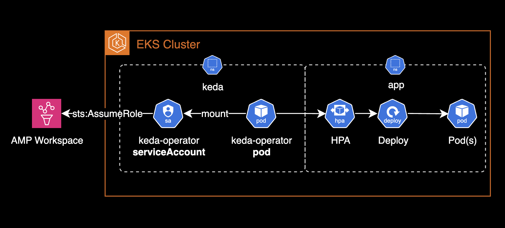
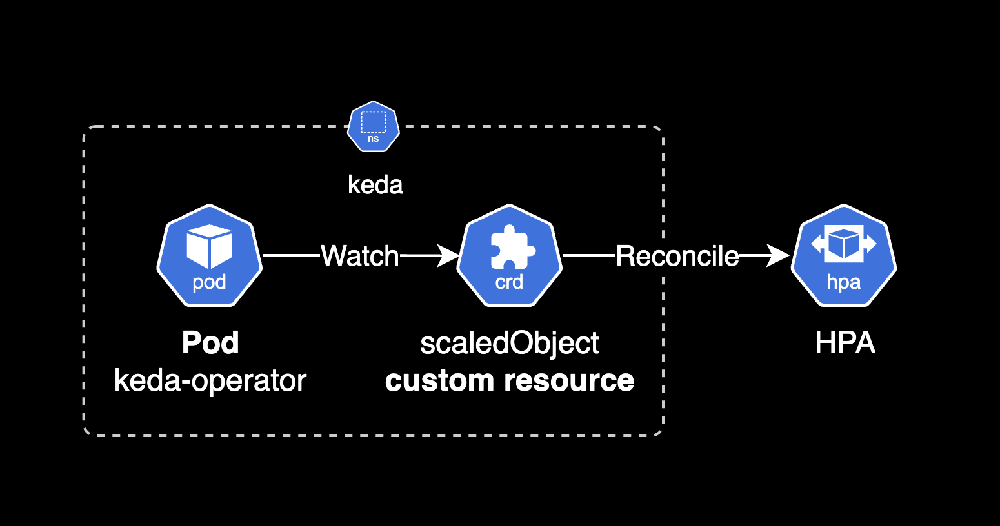

## 개요

KEDA에서 AMP(Amazon Managed Prometheus)에 저장된 메트릭 기반으로 오토스케일링을 하는 방법을 소개합니다.

쿠버네티스 클러스터 관리와 파드 오토스케일링을 담당하는 DevOps Engineer를 위한 가이드입니다.

&nbsp;

## 환경

- KEDA 2.16.1
- AMP (Amazon Managed Prometheus)

&nbsp;

## 준비사항

이 글에서는 AMP의 구성 및 생성 방법을 설명하지 않습니다. AMP가 이미 생성되어 있는 것을 가정합니다.

&nbsp;

## 구성

AMP 스케일러를 사용한 KEDA의 파드 오토스케일링 구성도입니다.



AMP(Amazon Managed Prometheus)는 관리형 프로메테우스 서비스로, 해당 프로메테우스 저장소에 저장된 메트릭을 쿼리하려면 [AMP에 대한 IAM 권한](https://docs.aws.amazon.com/ko_kr/prometheus/latest/userguide/AMP-and-IAM.html)이 필요합니다.

- `aps:GetLabels`
- `aps:GetMetricMetadata`
- `aps:GetSeries`
- `aps:QueryMetrics`

&nbsp;

`keda-operator` 파드는 `keda-operator` 서비스 어카운트를 사용합니다. IAM Role for Service Account(IRSA) 방식을 사용하여 클러스터 내부에 위치한 파드가 외부 AWS 서비스인 AMP에 접근할 수 있도록 구성합니다.

&nbsp;

먼저 IAM Role을 생성합니다.

IAM Role의 신뢰관계(Trust Relationship)을 다음과 같이 설정합니다.

```json
{
    "Version": "2012-10-17",
    "Statement": [
        {
            "Sid": "KedaOperatorPodAssumeRole",
            "Effect": "Allow",
            "Principal": {
                "Federated": "arn:aws:iam::<ACCOUNT_ID>:oidc-provider/oidc.eks.ap-northeast-2.amazonaws.com/id/<OIDC_ID>"
            },
            "Action": "sts:AssumeRoleWithWebIdentity",
            "Condition": {
                "StringEquals": {
                    "oidc.eks.ap-northeast-2.amazonaws.com/id/<OIDC_ID>:sub": "system:serviceaccount:keda:keda-operator"
                }
            }
        }
    ]
}
```

KEDA v2.16.x의 기본값인 `keda` 네임스페이스의 `keda-operator` 서비스 어카운트에 대한 신뢰관계(Trust Relationship)를 설정했습니다.

&nbsp;

해당 IAM Role에는 AWS 관리형 정책인 `AmazonPrometheusQueryAccess`가 연결(Attached)되어 있어야 합니다.

&nbsp;

`keda` 차트에서 IRSA에 대한 설정을 추가합니다.

아래는 `keda` 차트 `values.yaml` 파일의 예시입니다. `roleArn` 값은 앞서 생성한 IAM Role의 ARN으로 대체합니다.

```yaml
# charts/keda/values.yaml
podIdentity:
  # ... omitted for brevity ...
  aws:
    irsa:
      # -- Specifies whether [AWS IAM Roles for Service Accounts (IRSA)](https://docs.aws.amazon.com/eks/latest/userguide/iam-roles-for-service-accounts.html) is to be enabled or not.
      enabled: true
      # -- Sets the token audience for IRSA.
      # This will be set as an annotation on the KEDA service account.
      audience: "sts.amazonaws.com"
      # -- Set to the value of the ARN of an IAM role with a web identity provider.
      # This will be set as an annotation on the KEDA service account.
      roleArn: "arn:aws:iam::111122223333:role/<ROLE_NAME_FOR_KEDA_OPERATOR>"
      # -- Sets the use of an STS regional endpoint instead of global.
      # Recommended to use regional endpoint in almost all cases.
      # This will be set as an annotation on the KEDA service account.
      stsRegionalEndpoints: "true"
      # -- Set to the value of the service account token expiration duration.
      # This will be set as an annotation on the KEDA service account.
      tokenExpiration: 86400
```

&nbsp;

`keda` 차트의 헬름을 업그레이드해서 변경사항을 반영합니다.

어플리케이션 차트에 `keda`의 커스텀 리소스인 `scaledobject`와 `hpa`를 포함해 작성하고, 이 또한 헬름 업그레이드 혹은 ArgoCD 등을 통해 변경사항을 반영합니다.

&nbsp;

아래는 권장하는 어플리케이션 헬름 차트의 디렉토리 구조 예시입니다. `keda` 차트의 커스텀 리소스인 `scaledobject`와 `hpa`가 `templates/keda` 디렉토리에 포함되어 있는 것을 확인할 수 있습니다.

```bash
tree
.
├── Chart.yaml
├── templates
│   ├── NOTES.txt
│   ├── _helpers.tpl
│   ├── configmap.yaml
│   ├── deployment.yaml
│   ├── keda
│   │   ├── scaledobject.yaml
│   │   └── triggerauthentication.yaml
│   └── service.yaml
└── values.yaml

3 directories, 12 files
```

어플리케이션이 헬름 차트로 배포될 때 `keda` 차트의 커스텀 리소스인 `scaledobject`와 `hpa`도 한 세트로 같이 배포되도록 구성하는 것을 권장하는 이유는 다음과 같습니다:

1. 클러스터 운영자 관점에서 배포와 롤백이 더 안전하고 예측 가능해집니다.
2. 어플리케이션과 오토스케일링 설정이 항상 동기화됩니다.
3. 변경 이력 추적과 감사가 용이합니다.

&nbsp;

KEDA는 `scaledObject` 리소스의 설정 정보를 기반으로 `hpa` 리소스를 생성(Reconcile)합니다.



&nbsp;

`scaledobject`와 `hpa` 리소스의 상태를 확인합니다.

```bash
$ kubectl get so,hpa -n default
NAME                                                SCALETARGETKIND      SCALETARGETNAME    MIN   MAX   READY   ACTIVE   FALLBACK   PAUSED    TRIGGERS   AUTHENTICATIONS   AGE
scaledobject.keda.sh/sample-app-prometheus-scaler   apps/v1.Deployment   sample-app         1     5     True    True     False      Unknown                                11d

NAME                                                                        REFERENCE               TARGETS       MINPODS   MAXPODS   REPLICAS   AGE
horizontalpodautoscaler.autoscaling/keda-hpa-sample-app-prometheus-scaler   Deployment/sample-app   11/50 (avg)   1         5         1          11d
```

&nbsp;

`scaledObject` 리소스의 `READY`가 `True`이고 `hpa` 리소스의 `ACTIVE`가 `True`이면 정상적으로 오토스케일링이 동작하고 있는 것입니다.

```bash
kubectl get so -n default sample-app-prometheus-scaler
```

```bash
NAME                           SCALETARGETKIND      SCALETARGETNAME      MIN   MAX   READY   ACTIVE   FALLBACK   PAUSED    TRIGGERS   AUTHENTICATIONS   AGE
sample-app-prometheus-scaler   apps/v1.Deployment   sample-app           1     5     True    True     False      Unknown                                11d
```

`ACTIVE`가 `True`로 전환되는 기준은 `cooldownPeriod` 설정 값에 지정된 시간 초가 지난 후 첫 번째 트리거가 발생한 시점입니다. 즉 KEDA 리소스를 배포한 직후에는 `ACTIVE`가 `False`이며 첫 번째 트리거가 발생한 시점부터 `ACTIVE`가 `True`로 전환됩니다.

`cooldownPeriod` 설정 값은 기본값이 300초(5분)입니다.

&nbsp;

KEDA에서 사용하는 `scaledobject` 리소스의 설정 정보를 확인합니다.

```yaml
kubectl get scaledobject \
  -n default sample-app-prometheus-scaler \
  -o yaml
```

```yaml
apiVersion: keda.sh/v1alpha1
kind: ScaledObject
metadata:
  finalizers:
  - finalizer.keda.sh
  generation: 4
  labels:
    app.kubernetes.io/instance: sample-app
    app.kubernetes.io/managed-by: Helm
    app.kubernetes.io/name: sample-app
    app.kubernetes.io/version: "1.0"
    argocd.argoproj.io/instance: sample-app
    helm.sh/chart: sample-app-1.0.0
    scaledobject.keda.sh/name: sample-app-prometheus-scaler
  name: sample-app-prometheus-scaler
  namespace: default
spec:
  advanced:
    horizontalPodAutoscalerConfig:
      behavior:
        scaleDown:
          stabilizationWindowSeconds: 600
    restoreToOriginalReplicaCount: false
    scalingModifiers: {}
  cooldownPeriod: 300
  fallback:
    failureThreshold: 2
    replicas: 1
  initialCooldownPeriod: 0
  maxReplicaCount: 5
  minReplicaCount: 1
  pollingInterval: 60
  scaleTargetRef:
    apiVersion: apps/v1
    kind: Deployment
    name: sample-app
  triggers:
  - authenticationRef:
      name: sample-app-ta
    metadata:
      activationThreshold: "0"
      awsRegion: ap-northeast-2
      identityOwner: operator
      query: sum(avg_over_time(websocket_active_connection_count{app_kubernetes_io_name="sample-app"}[1m]))
      serverAddress: https://aps-workspaces.ap-northeast-2.amazonaws.com/workspaces/ws-<REDACTED_WORKSPACE_ID>
      threshold: "50"
    type: prometheus
```

&nbsp;

`scaledObject` 리소스에서 `triggers` 섹션의 설정 정보를 확인합니다. `identityOwner` 값이 `operator`로 설정되어 있습니다. 이는 AMP(Amazon Managed Prometheus)에 저장된 메트릭을 조회하기 위해 `keda-operator` 파드가 IRSA를 통해 접근하는 것을 의미합니다.

```yaml
# scaledobject yaml
spec:
  triggers:
  - authenticationRef:
      name: sample-app-ta
    metadata:
      activationThreshold: "0"
      awsRegion: ap-northeast-2
      identityOwner: operator
      query: sum(avg_over_time(websocket_active_connection_count{app_kubernetes_io_name="sample-app"}[1m]))
      serverAddress: https://aps-workspaces.ap-northeast-2.amazonaws.com/workspaces/ws-<REDACTED_WORKSPACE_ID>
      threshold: "50"
    type: prometheus
```

&nbsp;

[Prometheus 쿼리 결과값 데이터 타입](https://prometheus.io/docs/prometheus/latest/querying/basics/#expression-language-data-types)은 크게 4가지로 구분됩니다.

- **Instant vector** : 동일한 타임스탬프를 공유하는 각 시계열(Time Series)에 대해 단일 샘플을 포함하는 시계열 집합
- **Range vector** : 각 시계열(Time Series)에 대해 공유되는 타임스탬프를 가진 범위 데이터 포인트를 포함하는 시계열 집합
- **Scalar** : 단순한 부동 소수점 숫자(Numeric) 값
- **String** : 단순한 문자열 값으로 **현재는 사용되지 않습니다.**

&nbsp;

KEDA가 조회하는 PromQL 쿼리값은 반드시 여러 라인이 아닌 단일 숫자 값인 Scalar 형태의 값을 반환해야 합니다.

```bash
# Good: 단일 숫자 값(스칼라) 형태의 값 반환
sum(avg_over_time(websocket_active_connection_count{app_kubernetes_io_name="sample-app"}[1m]))
```

위 Prometheus 쿼리 예시에서는 `sum()` 함수를 통해 쿼리 대상 메트릭(`websocket_active_connection_count`)의 합계를 구해 단일 숫자 값을 반환하도록 작성되었습니다. 쿼리 대상 메트릭은 쿼리 대상 메트릭의 이름과 레이블 값을 지정해야 합니다. 위 예시에서는 `websocket_active_connection_count` 메트릭의 `app_kubernetes_io_name` 레이블 값이 `sample-app`인 메트릭을 쿼리 대상으로 지정하도록 작성되었습니다.

KEDA가 **사용할 수 없는** Prometheus 쿼리 예시:

```bash
# Bad: 벡터(같은 시간대의 여러 파드의 값) 형태의 값 반환
avg_over_time(websocket_active_connection_count{app_kubernetes_io_name="sample-app"}[1m])

# 결과 예시:
websocket_active_connection_count{app_kubernetes_io_name="sample-app",instance="1.1.1.1:8080"} 10
websocket_active_connection_count{app_kubernetes_io_name="sample-app",instance="2.2.2.2:8080"} 20
websocket_active_connection_count{app_kubernetes_io_name="sample-app",instance="3.3.3.3:8080"} 30

# Bad: 시리즈(시간대별 여러 값) 형태의 값 반환
rate(http_requests_total{}[5m])

# 결과 예시:
http_requests_total{app_kubernetes_io_name="sample-app",instance="a"} 10 @1707000000
http_requests_total{app_kubernetes_io_name="sample-app",instance="a"} 12 @1707000060
http_requests_total{app_kubernetes_io_name="sample-app",instance="a"} 14 @1707000120
```

&nbsp;

쿼리 결과값을 가지고 HPA에서는 현재 파드개수로 나누어 평균값을 구하게 됩니다.

```bash
PromQL / Current Pod Count = Average Target Value
```

&nbsp;

### 스케일아웃의 예시

예를 들어 타겟 Deployment의 현재 파드 개수가 2개이고, PromQL로 조회한 쿼리 결과값(Current)이 140이라면 HPA는 다음과 같이 필요한(Desired) 파드 개수를 계산합니다.

> 아래 공식에서 `ceil()` 함수는 소수점 이하를 올림하는 함수입니다.

```bash
# Formula 1
desiredReplicas = ceil(Query Result / Threshold)
                = ceil(140 / 50)
                = ceil(2.8)
                = 3
```

HPA는 위 계산식에 의해 파드 개수를 3개로 늘리게 됩니다.

&nbsp;

HPA가 필요한 파드 개수를 계산하는 공식은 다음과 같습니다. 이는 [쿠버네티스 HPA 공식문서에 표기된](https://kubernetes.io/docs/tasks/run-application/horizontal-pod-autoscale/#algorithm-details) 공식입니다.

```bash
desiredReplicas = ceil[currentReplicas * ( currentMetricValue / desiredMetricValue )])
```

여기서 `currentMetricValue`를 구하는 공식은 다음과 같습니다.

```bash
targetAverageValue = Query Result / Current Pod Count
                   = 140 / 2
                   = 70
```

HPA에서 사용하는 `targetAverageValue`는 계산된 메트릭 결과(이 예시에서는 PromQL 쿼리 결과값)을 현재 파드 개수로 나눈 **평균값**입니다.

&nbsp;

`targetAverageValue`를 사용해서 파드 개수를 구하는 공식은 다음과 같습니다. `currentMetricValue`에는 위에서 구한 targetAverageValue 값을 대입합니다.

```bash
currentMetricValue = targetAverageValue
                   = 70
```

```bash
# Formula 2
desiredReplicas = ceil[currentReplicas * ( currentMetricValue / desiredMetricValue )]
                = ceil[2 * ( 70 / 50 )]
                = ceil[2 * 1.4]
                = ceil[2.8]
                = 3
```

위 두 HPA 공식은 결과적으로 동일한 파드 개수를 도출합니다. 첫 번째 공식은 메트릭의 직접적인 쿼리 결과를 사용하여 계산하고, 두 번째 공식은 현재 파드 수와 메트릭의 평균값을 기반으로 계산합니다. 두 공식 모두 최종적으로 필요한 파드 수를 도출하지만, 계산의 출발점이 다를 뿐입니다.

> ⚠️ **참고**: `scaledObject` 리소스에서 설정 가능한 메트릭 유형에는 총 3가지가 있습니다: AverageValue (기본값), Value, Utilization. CPU와 Memory를 제외한 모든 스케일러는 AverageValue 및 Value 메트릭 유형을 지원하는 반면 CPU와 메모리 스케일러는 모두 AverageValue 및 Utilization을 지원합니다. 자세한 사항은 [KEDA 공식문서](https://keda.sh/docs/2.14/concepts/scaling-deployments/#triggers)를 참고해주세요.

&nbsp;

## 관련자료

- [keda](/blog/k8s/keda)
- [keda 공식문서](https://keda.sh/docs/2.16/)