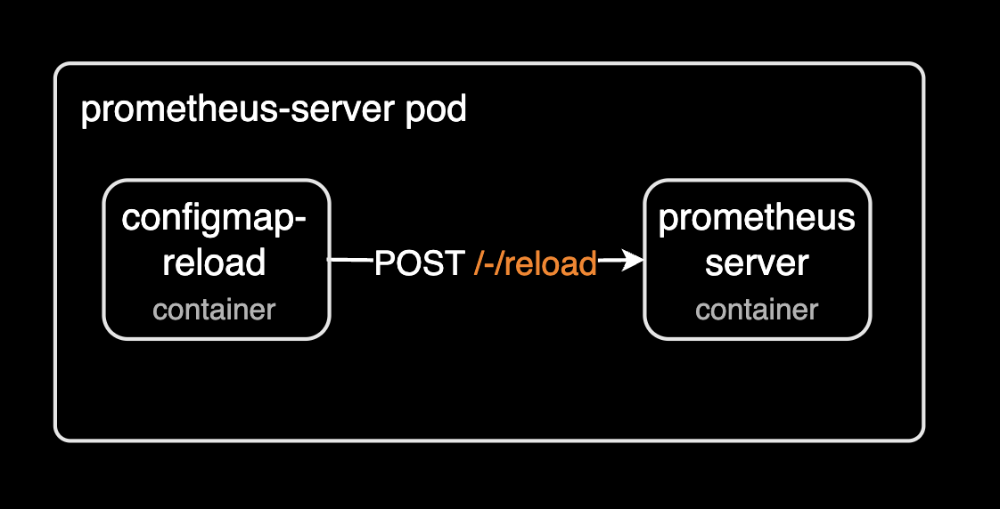

## 개요

Prometheus Server 2.48.0 버전에서 파드 재시작 없이 Prometheus Server의 설정 변경을 핫 리로드(Hot Reload)하는 방법을 정리한 문서입니다.



처음에는 헬름 차트로 설치한 Prometheus Server 파드에서 핫 리로드에 대한 에러 로그가 지속적으로 발생한게 발단이었습니다. 이 문제를 해결하기 위해 Prometheus Server 2.48.0 버전에서 핫 리로드 기능을 사용할 수 있도록 설정하는 방법을 정리한 문서입니다.

&nbsp;

## 환경

헬름 차트로 설치한 Prometheus Server 환경은 다음과 같습니다.

- [prometheus helm chart 25.8.0](https://github.com/prometheus-community/helm-charts/tree/prometheus-25.8.0/charts/prometheus): 25.8.0에는 Prometheus Server 2.48.0 버전이 포함되어 있습니다.
- Prometheus Server 2.48.0
- EKS v1.30.x

&nbsp;

## 설정 방법

처음 발단은 핫리로드를 애초에 설정하려고 했던 것은 아니고, Prometheus Server 파드의 로그를 조회할 일이 마침 생겼습니다.

```bash
prometheus-server-configmap-reload level=error ts=2025-02-28T11:34:28.030021992Z caller=runutil.go:100 msg="function failed. Retrying in next tick" err="trigger reload: reload request failed: Post \"http://127.0.0.1:9090/-/reload\": context deadline exceeded"
prometheus-server-configmap-reload level=error ts=2025-02-28T11:34:28.030056858Z caller=reloader.go:386 msg="Failed to trigger reload. Retrying." err="trigger reload: reload request failed: Post \"http://127.0.0.1:9090/-/reload\": context deadline exceeded"
prometheus-server-configmap-reload level=error ts=2025-02-28T11:34:28.030830638Z caller=runutil.go:100 msg="function failed. Retrying in next tick" err="trigger reload: received non-200 response: 403 Forbidden; have you set `--web.enable-lifecycle` Prometheus flag?"
prometheus-server-configmap-reload level=error ts=2025-02-28T11:34:33.035226634Z caller=runutil.go:100 msg="function failed. Retrying in next tick" err="trigger reload: received non-200 response: 403 Forbidden; have you set `--web.enable-lifecycle` Prometheus flag?"
```

그런데 Prometheus Server 파드의 로그를 조회해보니 5초마다 Trigger Reload 요청을 보내는 컨테이너(prometheus-server-configmap-reload)에서 403 Forbidden 에러가 발생하고 있었습니다.

configmap-reload 컨테이너는 prometheus 차트에서 기본적으로 활성화되어 있습니다.

```yaml
# prometheus/values.yaml
configmapReload:
  ## URL for configmap-reload to use for reloads
  ##
  reloadUrl: ""

  ## env sets environment variables to pass to the container. Can be set as name/value pairs,
  ## read from secrets or configmaps.
  env:
    []
    # - name: SOMEVAR
    #   value: somevalue
    # - name: PASSWORD
    #   valueFrom:
    #     secretKeyRef:
    #       name: mysecret
    #       key: password
    #       optional: false

  prometheus:
    ## If false, the configmap-reload container will not be deployed
    ##
    enabled: true

    ## configmap-reload container name
    ##
    name: configmap-reload
```


이 문제를 해결하기 위해 에러 로그가 제안하는 것과 같이 web.enable-lifecycle 플래그를 prometheus-server 컨테이너의 인자(args)로 추가해주면 문제는 해결됩니다.

```bash
trigger reload: received non-200 response: 403 Forbidden; have you set `--web.enable-lifecycle` Prometheus flag?
```

&nbsp;

prometheus 헬름 차트의 server.extraFlags를 처음에 저는 비어있는 값으로 설정해서 운영하고 있었습니다.

```yaml
# prometheus 2.48.0 (chart version: 25.8.0)
# prometheus/values.yaml
server:
  ## Additional Prometheus server container arguments
  ##
  extraFlags: {}
```

&nbsp;

기본적으로 prometheus 헬름 차트의 구조상 server.extraFlags를 비어있는 값으로 설정하면 다음과 같이 5개의 플래그가 prometheus-server 컨테이너의 인자(args)로 기본적으로 추가됩니다.

```yaml
# prometheus-server pod's spec
spec:
  containers:
  - args:
    - --storage.tsdb.retention.time=15d
    - --config.file=/etc/config/prometheus.yml
    - --storage.tsdb.path=/data
    - --web.console.libraries=/etc/prometheus/console_libraries
    - --web.console.templates=/etc/prometheus/consoles
    # ... omitted for brevity ...
    name: prometheus-server
```

&nbsp;

이 문제를 해결하려면 prometheus-server 컨테이너의 인자(args)에 `--web.enable-lifecycle` 플래그를 추가해주면 해결됩니다. 기본적으로 비활성화되어 있는 플래그이기 때문에 명시적으로 활성화해주어야 합니다.

[storage.tsdb.wal-compression](https://prometheus.io/docs/prometheus/latest/storage/#operational-aspects) 플래그는 이 에러 로그와 직접적인 연관은 없습니다. 하지만 기본적으로 Prometheus Server에서 사용하는 WAL 압축을 활성화하면 디스크 사용량이 줄어들기 때문에 추가해주는 것이 좋습니다. WAL(write-ahead log) 압축으로 발생하는 약간의 CPU 사용량 증가는 무시할 수 있을 정도로 적으므로 같이 추가해주는 것이 좋습니다.

```yaml
# prometheus 2.48.0 (chart version: 25.8.0)
# prometheus/values.yaml
server:
  ## Additional Prometheus server container arguments
  ##
  extraFlags:
    - web.enable-lifecycle
    - storage.tsdb.wal-compression
```

Prometheus 헬름 차트에서 extraFlags에 선언한 인자들의 앞에 자동으로 `--`를 붙여주기 때문에 플래그 이름만 추가해주면 됩니다.

&nbsp;

[--web.enable-lifecycle](https://prometheus.io/docs/prometheus/2.49/management_api/#reload) 플래그를 인자(args)로 추가하면 Prometheus Server의 설정 변경을 파드 재시작 없이 핫 리로드(Hot Reload) 기능을 사용할 수 있습니다.

```yaml
# prometheus-server pod's spec
spec:
  containers:
  - args:
    - --storage.tsdb.retention.time=15d
    - --config.file=/etc/config/prometheus.yml
    - --storage.tsdb.path=/data
    - --web.console.libraries=/etc/prometheus/console_libraries
    - --web.console.templates=/etc/prometheus/consoles
    - --web.enable-lifecycle
    - --storage.tsdb.wal-compression
    # ... omitted for brevity ...
    name: prometheus-server
```

&nbsp;

실제로 핫 리로드(Hot Reload)를 실행하는 방법은 prometheus-server 컨테이너의 `/-/reload` 엔드포인트에 POST 요청을 보내면 됩니다. [관리용 엔드포인트](https://prometheus.io/docs/prometheus/latest/management_api/) 중 하나인 /-/reload는 Prometheus 설정 및 룰 파일을 다시 로드하도록 트리거합니다.

wget은 기본적으로 GET 요청을 보내기 때문에 `--post-data` 옵션을 사용해서 POST 요청을 보내야 동작합니다.

```bash
kubectl exec -n monitoring prometheus-server-d7db8bcf7-d2wvw -c prometheus-server \
  -- wget --post-data="" -qO- http://localhost:9090/-/reload
```

참고로 prometheus-server 컨테이너에는 기본적으로 curl 명령어가 없어서 wget 명령어를 사용하거나 컨테이너 내부에 curl 명령어를 설치해야 합니다.

&nbsp;

[/-/reload 엔드포인트](https://prometheus.io/docs/prometheus/2.49/management_api/#reload)에 POST 요청을 보낸 직후에 prometheus-server 파드 로그를 조회하면 다음과 같이 설정파일을 다시 로드하는 과정을 확인할 수 있습니다.

```bash
prometheus-server ts=2025-02-28T11:59:14.985Z caller=main.go:1229 level=info msg="Loading configuration file" filename=/etc/config/prometheus.yml
prometheus-server ts=2025-02-28T11:59:15.004Z caller=kubernetes.go:329 level=info component="discovery manager scrape" discovery=kubernetes config=kubernetes-service-endpoints msg="Using pod service account via in-cluster config"
prometheus-server ts=2025-02-28T11:59:15.004Z caller=kubernetes.go:329 level=info component="discovery manager scrape" discovery=kubernetes config=kubernetes-services msg="Using pod service account via in-cluster config"
prometheus-server ts=2025-02-28T11:59:15.004Z caller=kubernetes.go:329 level=info component="discovery manager scrape" discovery=kubernetes config=kubernetes-pods msg="Using pod service account via in-cluster config"
prometheus-server ts=2025-02-28T11:59:15.004Z caller=kubernetes.go:329 level=info component="discovery manager scrape" discovery=kubernetes config=kubernetes-nodes msg="Using pod service account via in-cluster config"
prometheus-server ts=2025-02-28T11:59:15.005Z caller=kubernetes.go:329 level=info component="discovery manager notify" discovery=kubernetes config=config-0 msg="Using pod service account via in-cluster config"
prometheus-server ts=2025-02-28T11:59:15.005Z caller=main.go:1266 level=info msg="Completed loading of configuration file" filename=/etc/config/prometheus.yml totalDuration=19.504735ms db_storage=1.164µs remote_storage=15.248197ms web_handler=1.08µs query_engine=1.191µs scrape=855.253µs scrape_sd=1.036299ms notify=87.754µs notify_sd=163.208µs rules=104.074µs tracing=4.742µs
```

이후 prometheus-server 컨테이너 로그에서 403 Forbidden 에러가 발생하지 않는 것을 확인할 수 있습니다.

&nbsp;

## 마치며

Prometheus Server에 핫 리로드(Hot Reload)를 활성화한 후 에러 로그가 발생하지 않는 것을 확인할 수 있었습니다. 이번 경우처럼 어떤 문제를 트러블슈팅 할 때에는 시스템 로그, 어플리케이션 로그가 중요한 단서가 될 수 있으므로 세심하게 살펴보는 것이 중요합니다.

&nbsp;

## 관련자료

- [관리용 API 목록](https://prometheus.io/docs/prometheus/latest/management_api/): Prometheus 공식문서
- [Cannot launch with --web.enable-lifecycle #5986](https://github.com/prometheus/prometheus/issues/5986)
- [프로메테우스 데몬 api로 재시작없이 reload하기](https://nevido.tistory.com/369)