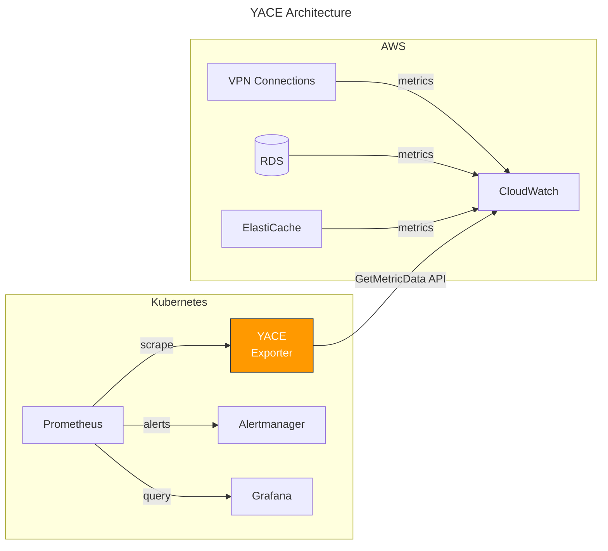

## Overview

When running Kubernetes on AWS, you often end up with two separate monitoring worlds: Prometheus for cluster metrics and CloudWatch for AWS-native resources. YACE (Yet Another CloudWatch Exporter) bridges this gap by exposing CloudWatch metrics as Prometheus endpoints.

## How it works

YACE runs in Kubernetes, pulls metrics from CloudWatch via API, and exposes them for Prometheus to scrape.



## Why CloudWatch to Prometheus

Key benefits of unifying metrics in Prometheus:

- **Single alerting pipeline**: One Alertmanager, one on-call workflow
- **Correlated dashboards**: See VPN tunnel state alongside pod health
- **PromQL for everything**: Use the same query language you already know
- **Longer retention**: CloudWatch charges for extended retention; Prometheus can store metrics cheaper

## YACE vs AWS Official Exporter

AWS provides an official [CloudWatch Exporter](https://github.com/prometheus/cloudwatch_exporter), but YACE has become the community favorite:

| Aspect | YACE | AWS CloudWatch Exporter |
|--------|------|------------------------|
| Auto-discovery | Yes (finds resources by tags) | Manual dimension config |
| Performance | Concurrent API calls | Sequential |
| Memory footprint | Lower | Higher for large metric sets |
| Configuration | Declarative YAML | Java properties |

YACE's auto-discovery is the killer feature. Instead of hardcoding resource IDs, you can discover resources automatically by tags.

## Installation Method

Use the [prometheus-yet-another-cloudwatch-exporter](https://github.com/prometheus-community/helm-charts/tree/main/charts/prometheus-yet-another-cloudwatch-exporter) Helm chart. It includes ServiceMonitor and PrometheusRule resources out of the box.

YACE pairs well with [kube-prometheus-stack](https://github.com/prometheus-community/helm-charts/tree/main/charts/kube-prometheus-stack). Prometheus Operator auto-discovers these resources, so alerts integrate directly into your existing pipeline.

1. **Select metrics**: Identify which CloudWatch metrics you need to export
2. **Configure IAM Role**: Set up IAM role with required permissions. I used [EKS Pod Identity](https://docs.aws.amazon.com/eks/latest/userguide/pod-identities.html) without issues.
3. **Install chart**: Deploy the Helm chart with your configuration

> ⚠️ YACE requires IAM permissions to collect metrics from CloudWatch. Without proper IAM role configuration, metrics collection will fail.

```yaml
# charts/prometheus-yet-another-cloudwatch-exporter/values.yaml
serviceMonitor:
  enabled: true
  interval: 60s
  timeout: 30s
  # Drop global metrics (without any dimension)
  metricRelabelings:
    - sourceLabels: [__name__, dimension_VpnId, dimension_TunnelIpAddress]
      regex: "aws_vpn_.*;^$;^$"
      action: drop
```

## Practical Use Case: VPN Monitoring

A common use case is monitoring Site-to-Site VPN tunnels. These connections are critical for hybrid architectures but invisible to Kubernetes-native monitoring.

```yaml
# charts/prometheus-yet-another-cloudwatch-exporter/values.yaml
configMap:
  enabled: true
config: |-
  apiVersion: v1alpha1
  sts-region: ap-northeast-2
  discovery:
    exportedTagsOnMetrics:
      AWS/VPN:
        - Name
        - Environment
    jobs:
      - type: AWS/VPN
        regions:
          - ap-northeast-2
        period: 60
        length: 600
        metrics:
          - name: TunnelState
            statistics:
              - Average
          - name: TunnelDataIn
            statistics:
              - Sum
          - name: TunnelDataOut
            statistics:
              - Sum
```

This configuration discovers all VPN connections in ap-northeast-2 and exports TunnelState (1 = up, 0 = down), TunnelDataIn, and TunnelDataOut.

- **period**: CloudWatch metric aggregation interval (60s = 1 min)
- **length**: How far back to query CloudWatch API (600s = last 10 min)

length should be >= period to prevent data loss when Prometheus scraping is delayed.

### Metric naming convention

YACE converts CloudWatch metrics to Prometheus format:

```text
aws_{service}_{metric_name}_{statistic}
```

The statistic suffix can be average, sum, minimum, maximum, or sample_count.

Examples:
- aws_vpn_tunnel_state_average (VPN tunnel up/down state)
- aws_rds_free_storage_space_average (RDS available storage in bytes)
- aws_elasticache_cpu_utilization_average (ElastiCache CPU usage percentage)

### exportedTagsOnMetrics

The exportedTagsOnMetrics field converts AWS resource tags into Prometheus labels:

```promql
aws_vpn_tunnel_state_average{
  dimension_VpnId="vpn-abc123",
  dimension_TunnelIpAddress="203.0.113.1",
  tag_Name="vpn-to-datacenter",
  tag_Environment="production"
} 1
```

This enables human-readable alert messages using {{ $labels.tag_Name }} and environment-based filtering in Grafana.

## Alert Configuration

```yaml
# charts/prometheus-yet-another-cloudwatch-exporter/values.yaml
prometheusRule:
  enabled: true
  rules:
    - alert: VPNTunnelDown
      expr: aws_vpn_tunnel_state_average == 0
      for: 5m
      labels:
        severity: critical
      annotations:
        summary: "VPN Tunnel {{ $labels.dimension_VpnId }} is down"
        description: "VPN tunnel {{ $labels.dimension_VpnId }} ({{ $labels.dimension_TunnelIpAddress }}) has been down for 5+ minutes."
```

## Cost Considerations

CloudWatch API calls cost money. YACE provides a self-monitoring metric to track usage:

```promql
yace_cloudwatch_requests_total
```

Manage costs by:

- **period/length tuning**: 5-minute periods are usually sufficient
- **Metric filtering**: Only export what you actually use
- **metricRelabelings**: Drop unused metrics before storage (see Installation Method example)

## Deployment Notes

**IAM permissions**: YACE needs cloudwatch:GetMetricData, cloudwatch:ListMetrics, tag:GetResources, iam:ListAccountAliases, and service-specific describe permissions.

**Resource placement**: Place YACE on system/infra nodes, not application nodes. Deploy in the monitoring namespace alongside Prometheus for easier management.

**Scrape interval alignment**: Match ServiceMonitor scrape interval to YACE's CloudWatch period.

## Summary

YACE enables unified observability by bringing CloudWatch metrics into your Prometheus ecosystem: one dashboard, one query language, one alert pipeline.

If you're already using [kube-prometheus-stack](https://github.com/prometheus-community/helm-charts/tree/main/charts/kube-prometheus-stack), I highly recommend YACE. ServiceMonitor and PrometheusRule integrate seamlessly, so you get metrics and alerts working with zero additional setup.

## References

- [YACE GitHub Repository](https://github.com/nerdswords/yet-another-cloudwatch-exporter)
- [Prometheus Helm Charts - YACE](https://github.com/prometheus-community/helm-charts/tree/main/charts/prometheus-yet-another-cloudwatch-exporter)
- [AWS CloudWatch Pricing](https://aws.amazon.com/cloudwatch/pricing/)
