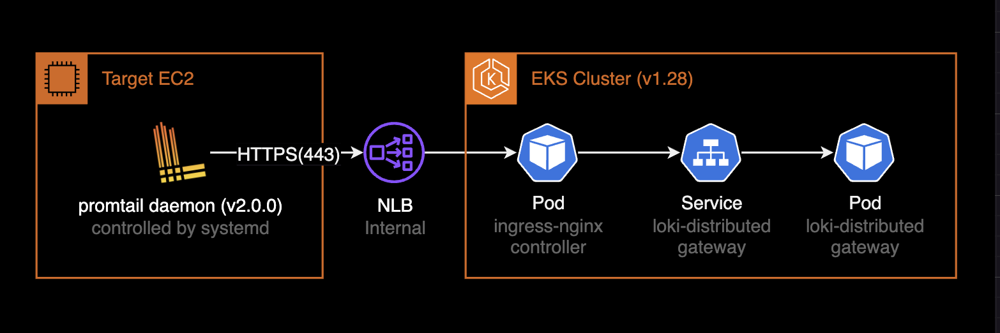

## 개요

로그 수집대상인 EC2에서 `"filetarget.fsnotify.NewWatcher: too many open files"` 에러가 발생하는 경우 해결방법.

크게 3가지 방법이 있고, 3가지 방법 모두 적용하는 걸 권장합니다.

&nbsp;

## 환경

promtail에서 loki로 로그를 발송하는 시스템 구조는 다음과 같았습니다.



&nbsp;

### 로그 수집대상

loki의 통상적인 로그 수집대상은 파드지만 이 시나리오의 경우 standalone으로 구동되는 EC2 인스턴스였습니다.

- **로그 수집대상**<sup>Target</sup>: EC2, amd64, Ubuntu 20.04.5 LTS
- **수집하는 로그**<sup>Logs to scrape</sup>: the ec2_sd_configs located in `/var/log/**.log`, the journal located in `/var/log/journal`
- **설치된 로그수집 데몬**: Promtail v2.0.0 (controlled by systemd)

&nbsp;

### 로그 저장소

- **EKS v1.28**
- **loki-distributed**: [chart 0.79.2](https://github.com/grafana/helm-charts/tree/main/charts/loki-distributed) (loki v2.9.8)

&nbsp;

## 문제점

promtail에서 `filetarget.fsnotify.NewWatcher: too many open files` 에러가 발생하면, 로그 파일을 더 이상 열 수 없어 로그 수집이 중단됩니다. 이는 Loki로의 로그 전달에 실패하여 로그 데이터가 누락될 수 있습니다.

&nbsp;

## 설정방법

> 앞으로 설명하는 모든 조치 작업은 `sudo -s` 명령어를 통해 `root` 계정으로 전환한 후 수행하거나, `sudo` 명령어를 앞에 붙여서 root 권한으로 실행해야 정확한 결과를 얻을 수 있습니다.

### max_user_instances 커널 파라미터

조치를 취하기 전에, 파일 디스크립터와 관련된 커널 파라미터를 먼저 조회합니다.

```bash
$ sysctl fs.inotify
fs.inotify.max_queued_events = 16384
fs.inotify.max_user_instances = 128
fs.inotify.max_user_watches = 59498
```

`fs.inotify.max_user_instances`와 `fs.inotify.max_user_watches`는 사용자당 생성할 수 있는 inotify 인스턴스와 파일 감시기의 최대 수를 제한하는 설정입니다.

inotify는 파일 시스템 이벤트(예: 파일 생성, 수정, 삭제 등)를 모니터링하는 데 사용되며, 이 제한에 도달하면 파일 변경 사항을 감시하는 프로그램이 더 이상 새로운 파일을 추적할 수 없습니다. 이로 인해 promtail 데몬에서 `filetarget.fsnotify.NewWatcher: too many open files` 오류 메시지가 발생할 수 있습니다.

&nbsp;

제 경우 커널 파라미터 `fs.inotify.max_user_instances`을 `128`에서 `1024`로 늘려주는 작업도 같이 해서 `filetarget.fsnotify.NewWatcher: too many open files` 문제를 해결할 수 있었습니다. [Issue #1153](https://github.com/grafana/loki/issues/1153#issuecomment-564991396)를 참고했습니다.

```bash
echo "fs.inotify.max_user_instances = 1024" | sudo tee -a /etc/sysctl.conf
sudo sysctl -p
sysctl fs.inotify
```

위 명령어는 `fs.inotify.max_user_instances = 1024` 설정을 `/etc/sysctl.conf` 파일에 추가하고, 변경된 내용을 즉시 시스템에 적용합니다.

&nbsp;

그 후, 설정이 정상적으로 적용되었는지 확인합니다. 출력 결과로 `fs.inotify.max_user_instances = 1024`가 나타나면 설정이 성공적으로 적용된 것입니다.

```bash
$ sysctl fs.inotify
fs.inotify.max_queued_events = 16384
fs.inotify.max_user_instances = 1024
fs.inotify.max_user_watches = 59498
```

이 설정은 `/etc/sysctl.conf` 파일에 추가되었기 때문에 시스템을 재부팅하더라도 계속 유지됩니다.

&nbsp;

### LimitNOFILE

promtail 프로세스에서 inotify를 얼마나 점유하는지 확인합니다.

```bash
$ sudo lsof | grep inotify | tr -s ' ' | cut -f1,2 -d" " | sort | uniq -c | sort
  25550 promtail- 2965164
```

&nbsp;

공식문서 [Run the Promtail client on AWS EC2](https://grafana.com/docs/loki/latest/send-data/promtail/cloud/ec2/)에 나와있는 방법 그대로 EC2에 promtail을 설치한 후, systemd 데몬을 구성했습니다.

promtail 데몬의 설정파일인 `promtail.service`를 열고 `500000`으로 설정합니다.

```yaml
# /etc/systemd/system/promtail.service
[Service]
...
LimitNOFILE=500000
```

&nbsp;

`LimitNOFILE` 설정이 추가된 `promtail.service` 설정파일의 내용은 다음과 같습니다.

```yaml
# /etc/systemd/system/promtail.service
[Unit]
Description=Promtail

[Service]
User=root
WorkingDirectory=/opt/promtail/
ExecStartPre=/bin/sleep 30
ExecStart=/opt/promtail/promtail-linux-amd64 --config.file=./ec2-promtail.yaml
SuccessExitStatus=143
TimeoutStopSec=10
Restart=on-failure
RestartSec=5
LimitNOFILE=500000

[Install]
WantedBy=multi-user.target
```

&nbsp;

변경된 설정을 적용하기 위해 `promtail` 데몬을 reload 한후, 다시 시작합니다.

```bash
systemctl daemon-reload
systemctl restart promtail.service
```

&nbsp;

promtail 데몬에 `LimitNOFILE` 설정이 맞게 적용되었는지 확인합니다.

```bash
$ systemctl show promtail.service -p LimitNOFILE
LimitNOFILE=500000
```

&nbsp;

데몬이 구동중인 시간동안 `too many open files` 에러가 지속 발생하는지 다시 관측합니다.

```bash
# Continue to monitor whether the too many open files error occurs again.
watch -d -n2 "systemctl status promtail -l"
```

&nbsp;

`LimitNOFILE`을 `500000`으로 설정한 후, promtail이 사용하는 inotify 개수가 110418개로 증가된 걸 확인할 수 있습니다.

```bash
$ sudo lsof | grep inotify | tr -s ' ' | cut -f1,2 -d" " | sort | uniq -c | sort
 110418 promtail- 3040317
```

5 ~ 10초에 한 번씩 발생하던 `too many open files` 에러도 promtail 데몬에서 더 이상 출력되지 않았습니다.

&nbsp;

### sync interval 완화시키기

기본값이 10초인 target sync 간격과 positions 업데이트 간격을 30초로 늘립니다. 이는 로그 수집 과정에서 Promtail에 의해 발생하는 Disk I/O 과부하를 방지하고 부하를 줄일 수 있습니다.

```yaml
# /opt/promtail/ec2-promtail.yaml
...
positions:
  filename: /opt/promtail/positions.yaml
  # default: 10s
  sync_period: 30s

target_config:
  # default: 10s
  sync_period: 30s
```

&nbsp;

## 마치며

systemd 즉 리눅스 커널에 걸쳐있는 문제이긴 하지만 프롬테일 문서에는 어떠한 단서도 제공해주지 않아 이틀을 삽질했던 리눅스 커널 관련 이슈였습니다.

공식 promtail 설치 가이드에는 이 문제에 대한 어떠한 언급도 없는 점이 아쉽습니다. [Run the Promtail client on AWS EC2](https://grafana.com/docs/loki/latest/send-data/promtail/cloud/ec2/) 페이지에 구체적인 해결방법 또는 팁을 추가 해달라는 목적으로 [Document feedback](https://github.com/grafana/loki/issues/13809)을 올렸는데 빨리 받아들여졌으면 좋겠습니다.

&nbsp;

## 관련자료

**Loki docs**  
[Run the Promtail client on AWS EC2](https://grafana.com/docs/loki/latest/send-data/promtail/cloud/ec2/)

**Loki github**  
[failed to create target - too many open files, ulimit -n 1048576 #1153](https://github.com/grafana/loki/issues/1153)  
[Document feedback](https://github.com/grafana/loki/issues/13809)

**Blog**  
[Dealing with too many open files](https://www.robustperception.io/dealing-with-too-many-open-files/)
