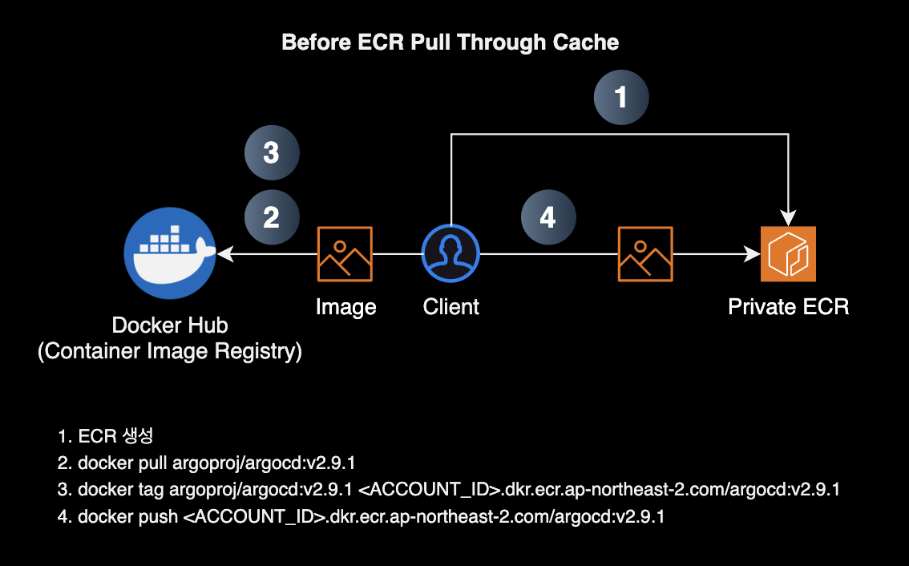
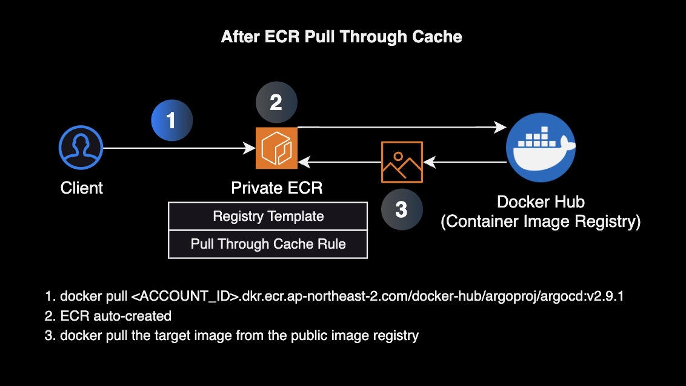

## 개요

[Pull through cache 기능](https://docs.aws.amazon.com/ko_kr/AmazonECR/latest/userguide/pull-through-cache.html)을 사용해 Docker Hub Rate Limit을 회피하는 방법을 소개합니다.

&nbsp;

## 배경

Docker Hub는 이미지 다운로드에 대한 Rate Limit을 초과하면 429 Too Many Requests 에러를 반환합니다.

[각 사용자 유형별 Pull rate limit](https://docs.docker.com/docker-hub/download-rate-limit/#pull-rate-limit)은 다음과 같습니다.

| 사용자 유형 | Pull Rate Limit |
|----------|-----------------|
| 익명 유저 (로그인 안함) | 6시간 동안 최대 100번 `docker pull` 요청 |
| 로그인 계정 (로그인 함) | 6시간 동안 최대 200번 `docker pull` 요청 |
| 프로 이상 (로그인 함) | 제한 없음 (No limit) |

&nbsp;

이를 해결하기 위해 대안으로 사용할 수 있는 방법은 다음과 같습니다.

1. 쿠버네티스 시크릿 기반의 [imagePullSecret](https://kubernetes.io/ko/docs/tasks/configure-pod-container/pull-image-private-registry/)을 파드에 설정해 퍼블릭 이미지를 받아오는 데 사용합니다.
2. 수작업으로 이미지를 받아와 Private ECR에 저장
3. Pull through cache 기능을 사용해서 퍼블릭 이미지를 Private ECR에 캐싱

이 글에서는 3번 방법을 사용해 Docker Hub Rate Limit을 회피하는 방법을 소개합니다.

&nbsp;

## 구성하기

### Pull Through Cache 기능 사용 전

Pull Through Cache를 사용하게 된 발단은 Airbyte 버전 업그레이드를 위해 필요한 이미지를 받아오는 데 총 15개가 필요했습니다.

Pull Through Cache 기능을 저는 처음에는 몰랐고 아래와 같은 번거로운 절차로 퍼블릭 이미지 15개를 Private ECR에 수작업으로 캐싱하고 있었습니다.

&nbsp;

### Pull Through Cache 기능 사용 후

ECR의 Pull Through Cache 기능을 사용하면 아래와 같이 `pull` 절차 한 번만 수행하면 됩니다. 여러 레지스트리에 흩어져 있는 여러 개의 퍼블릭 이미지를 캐싱할 때 작업 절차가 간소화되고 Pull 비용도 절감됩니다.

이 과정에서 Private ECR이 자동으로 생성되며 퍼블릭 이미지를 캐싱해줍니다. 좋은 점은 퍼블릭 레지스트리로부터 컨테이너 이미지 메니페스트와 이미지 파일 모두를 캐싱해주기 때문에, 모든 CPU 아키텍처에 대해 캐싱이 가능하다는 점입니다.

대신 아래와 같은 ECR 사전 설정이 필요합니다.

- **Registry Template 만들기** : Pull Through Cache에 의해 자동으로 만들어진 Private ECR에 대한 Permission, Tag, Lifecycle Policy 자동 정의
- **Pull Through Cache Rule 생성** : 퍼블릭 이미지를 캐싱할 Private ECR 레지스트리의 인증 정보를 정의

&nbsp;

## 관련자료

- [Pull Through Cache](https://docs.aws.amazon.com/ko_kr/AmazonECR/latest/userguide/pull-through-cache.html)
- [Announcing Pull Through Cache Repositories for Amazon Elastic Container Registry](https://aws.amazon.com/ko/blogs/korea/announcing-pull-through-cache-repositories-for-amazon-elastic-container-registry/)
