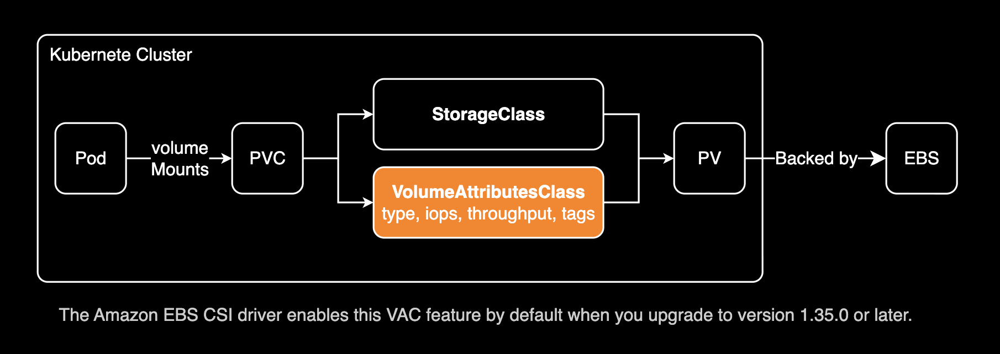

## 개요

이 가이드는 Kubernetes 환경에서 VolumeAttributesClass를 사용해 EBS gp3 볼륨을 io2로 마이그레이션하는 절차를 설명합니다. 처음 두 방법은 파드 재시작이나 PV 재생성 없이 in-place 마이그레이션을 지원하여 무중단으로 볼륨 타입과 스펙(IOPS, Throughput)을 변경할 수 있습니다:

1. [**Volume Attributes Class (VAC)**](https://github.com/kubernetes-sigs/aws-ebs-csi-driver/tree/master/examples/kubernetes/modify-volume#volume-modification-via-volumeattributesclass) - 선언적 방식 (권장)
2. **PVC Annotation** - 명령형 방식
3. **VolumeSnapshot** - 레거시 방식 (⚠️ 파드 재시작 필요)

## 제한사항

**VolumeAttributesClass는 In-tree PV를 조작할 수 없습니다.**

In-tree PV는 Kubernetes 내장 스토리지 드라이버로 프로비저닝된 볼륨을 의미합니다. StorageClass의 `PROVISIONER` 필드가 `kubernetes.io/*` 형식(예: `kubernetes.io/aws-ebs`)으로 시작하면 In-tree 볼륨입니다. **EKS에서 기본 제공하는 gp2 StorageClass는 기본적으로 In-tree 프로비저너(`kubernetes.io/aws-ebs`)를 사용합니다.** 반면, CSI 드라이버로 프로비저닝된 볼륨은 `ebs.csi.aws.com`과 같이 CSI 드라이버 이름을 사용합니다.

VolumeAttributesClass와 PVC Annotation은 모두 CSI 드라이버를 통해서만 작동하므로, In-tree PV(예: 기본 gp2 StorageClass로 생성된 볼륨)에는 사용할 수 없습니다. In-tree PV는 먼저 CSI로 마이그레이션하거나 [VolumeSnapshot 방법](/blog/pv-gp3-migration/)을 사용해야 합니다.

현재 클러스터의 StorageClass를 확인하여 In-tree와 CSI 프로비저너를 구분합니다:

```bash
$ kubectl get sc
NAME            PROVISIONER             RECLAIMPOLICY   VOLUMEBINDINGMODE      ALLOWVOLUMEEXPANSION   AGE
gp2             kubernetes.io/aws-ebs   Delete          WaitForFirstConsumer   true                   5y213d
gp3 (default)   ebs.csi.aws.com         Delete          WaitForFirstConsumer   true                   2y122d
```

## 볼륨 수정 프로세스

**프로덕션 환경에 권장하는 방식입니다.** 이 섹션에서는 VolumeAttributesClass (VAC)를 사용하는 최신 선언적 방법을 설명합니다. 이 방식은 무중단 in-place 볼륨 마이그레이션을 지원하며 GitOps 친화적인 구성 관리를 제공합니다.

### Volume Attributes Class (VAC) - 선언적 방식

이 방법은 파드 재시작이나 PV 재생성 없이 in-place 볼륨 마이그레이션을 수행하여 무중단 볼륨 타입 변경을 지원합니다. GitOps 워크플로우와 표준화된 프로파일로 여러 볼륨을 관리하는 데 가장 적합합니다.

**VolumeAttributesClass 사용 요구사항:**
- [ ] Kubernetes 1.31 이상 (VolumeAttributesClass가 업스트림에서 Beta로 승격됨)
- [ ] EBS CSI driver v1.35.0+ (EKS 관리형 애드온 v1.35.0-eksbuild.2+)
- [ ] VolumeAttributesClass 기능 게이트
  - EKS 1.31+: 기본적으로 자동 활성화됨
  - 업스트림 Kubernetes 1.31: 수동 활성화 필요



#### VolumeAttributesClass란 무엇인가요?

[VolumeAttributesClass (VAC)](https://kubernetes.io/docs/concepts/storage/volume-attributes-classes/)는 기존 PersistentVolume을 재생성하지 않고도 적용할 수 있는 볼륨 속성(타입, IOPS, 처리량 등) 집합을 정의합니다. 무중단 in-place 업데이트를 지원하는 볼륨 수정 "프로파일"로 생각하시면 됩니다.

**중요**: `parameters` 필드 문법은 CSI 드라이버마다 다릅니다. `ebs.csi.aws.com`의 경우 `type`, `iops`, `throughput`을 사용합니다. 다른 드라이버는 다른 파라미터 이름을 사용할 수 있으므로 항상 CSI 드라이버 문서를 확인하시기 바랍니다.

#### 1단계: 데모 환경 설정

먼저 현재 클러스터에서 volumeAttributesClass 리소스가 활성화되어 있는지 확인합니다.

```bash
kubectl api-resources --api-group=storage.k8s.io
```

명령어 실행 결과 `volumeattributesclasses` 리소스가 출력되면 VAC를 사용할 수 있습니다:

```bash
NAME                      SHORTNAMES   APIVERSION          NAMESPACED   KIND
csidrivers                             storage.k8s.io/v1   false        CSIDriver
csinodes                               storage.k8s.io/v1   false        CSINode
csistoragecapacities                   storage.k8s.io/v1   true         CSIStorageCapacity
storageclasses            sc           storage.k8s.io/v1   false        StorageClass
volumeattachments                      storage.k8s.io/v1   false        VolumeAttachment
volumeattributesclasses   vac          storage.k8s.io/v1   false        VolumeAttributesClass
```

VAC를 통해 Amazon EBS 리소스 태그를 수정하려면 Amazon EBS CSI 드라이버가 사용하는 IAM Role에 다음 AWS Identity and Access Management (IAM) 정책을 연결해야 합니다:

```json
{
  "Version": "2012-10-17",
  "Statement": [
    {
      "Sid": "ModifyVolumeTagsByVolumeAttributesClass",
      "Effect": "Allow",
      "Action": [
        "ec2:CreateTags"
      ],
      "Resource": [
        "arn:aws:ec2:*:*:volume/*",
        "arn:aws:ec2:*:*:snapshot/*"
      ]
    }
  ]
}
```

gp3 PVC를 사용하는 파드:

```yaml
kubectl apply -f - <<EOF
---
apiVersion: v1
kind: PersistentVolumeClaim
metadata:
  name: ebs-claim
spec:
  accessModes:
    - ReadWriteOnce
  storageClassName: gp3
  resources:
    requests:
      # In this scenario, io2 volumes to migrate require a minimum of 4GB
      storage: 10Gi
---
apiVersion: v1
kind: Pod
metadata:
  name: app
spec:
  containers:
  - name: app
    image: public.ecr.aws/amazonlinux/amazonlinux
    command: ["/bin/sh"]
    args: ["-c", "while true; do echo $(date -u) | tee /data/out.txt; sleep 5; done"]
    volumeMounts:
    - name: persistent-storage
      mountPath: /data
  volumes:
  - name: persistent-storage
    persistentVolumeClaim:
      claimName: ebs-claim
EOF
```

#### 2단계: VolumeAttributesClass 생성

원하는 io2 구성으로 [VolumeAttributesClass](https://kubernetes.io/docs/concepts/storage/volume-attributes-classes/) 리소스를 생성합니다.


```bash
kubectl apply -f - <<EOF
---
apiVersion: storage.k8s.io/v1beta1
kind: VolumeAttributesClass
metadata:
  name: io2-migration
driverName: ebs.csi.aws.com
parameters:
  type: io2
  iops: "3000"
  tagSpecification_1: "location=seoul"
EOF
```

VolumeAttributesClass가 성공적으로 생성되었습니다:

```bash
volumeattributesclass.storage.k8s.io/io2-migration created
```

생성된 VAC를 확인합니다:

```bash
$ kubectl get vac
NAME            DRIVERNAME        AGE
io2-migration   ebs.csi.aws.com   22s
```

#### 3단계: PVC 패치

기존 PVC를 패치하여 [VolumeAttributesClass](https://kubernetes.io/docs/concepts/storage/volume-attributes-classes/)를 참조하도록 합니다.

```bash
kubectl patch pvc <PVC_NAME> --type merge --patch '{"spec":{"volumeAttributesClassName":"io2-migration"}}'
```

**참고**: `storageClassName`과 `volumeAttributesClassName`은 다를 수 있습니다. `storageClassName`(예: `gp2`)은 PV가 **처음 생성될 때** 사용된 원래 StorageClass를 나타내며 변경할 수 없습니다. `volumeAttributesClassName`(예: `gp3-migration`)은 **기존 PV의 속성을 in-place로 수정**하는 데 사용됩니다. 이것이 볼륨 마이그레이션 시나리오에서 예상되는 패턴입니다.

PVC에 VolumeAttributesClass가 적용되었는지 확인합니다:

```bash
$ kubectl get pvc
NAME        STATUS   VOLUME                                     CAPACITY   ACCESS MODES   STORAGECLASS   VOLUMEATTRIBUTESCLASS   AGE
ebs-claim   Bound    pvc-808e60b0-954a-4e35-8673-19652a5a7a56   10Gi       RWO            gp3            io2-migration           9m35s
```

PVC의 이벤트를 확인하여 볼륨 수정이 성공적으로 완료되었는지 확인합니다:

```bash
kubectl describe pvc ebs-claim | grep -A 20 "^Events:"
```

```bash
Events:
  Type    Reason                  Age    From                                                                                     Message
  ----    ------                  ----   ----                                                                                     -------
  Normal  WaitForFirstConsumer    5m56s  persistentvolume-controller                                                              waiting for first consumer to be created before binding
  Normal  Provisioning            5m55s  ebs.csi.aws.com_ebs-csi-controller-f899476d4-grm4x_98f65ad3-c66f-439c-b07a-d7d6504cda8d  External provisioner is provisioning volume for claim "default/ebs-claim"
  Normal  ExternalProvisioning    5m55s  persistentvolume-controller                                                              Waiting for a volume to be created either by the external provisioner 'ebs.csi.aws.com' or manually by the system administrator. If volume creation is delayed, please verify that the provisioner is running and correctly registered.
  Normal  ProvisioningSucceeded   5m53s  ebs.csi.aws.com_ebs-csi-controller-f899476d4-grm4x_98f65ad3-c66f-439c-b07a-d7d6504cda8d  Successfully provisioned volume pvc-808e60b0-954a-4e35-8673-19652a5a7a56
  Normal  VolumeModify            4m54s  external-resizer ebs.csi.aws.com                                                         external resizer is modifying volume ebs-claim with vac io2-migration
  Normal  VolumeModifySuccessful  4m49s  external-resizer ebs.csi.aws.com                                                         external resizer modified volume ebs-claim with vac io2-migration successfully
```

PVC에 기록된 이벤트 로그에서 VAC에 의한 볼륨 변경 과정을 확인할 수 있습니다:

1. **WaitForFirstConsumer**: 파드가 생성되어 PVC를 사용할 때까지 대기합니다.
2. **Provisioning**: EBS CSI 드라이버가 볼륨 프로비저닝을 시작합니다.
3. **ProvisioningSucceeded**: 초기 gp3 볼륨이 성공적으로 생성됩니다.
4. **VolumeModify**: external-resizer가 VolumeAttributesClass(io2-migration)를 사용하여 볼륨 수정을 시작합니다.
5. **VolumeModifySuccessful**: 볼륨이 gp3에서 io2로 성공적으로 변경되었습니다. 이 시점부터 파드는 io2 볼륨을 사용합니다.

## 관련자료 

- [Kubernetes Storage Volume Attributes Classes](https://kubernetes.io/docs/concepts/storage/volume-attributes-classes/) - Kubernetes Official Docs
- [Migrating Amazon EKS clusters from gp2 to gp3 EBS volumes](https://aws.amazon.com/ko/blogs/containers/migrating-amazon-eks-clusters-from-gp2-to-gp3-ebs-volumes/) - AWS Blog

Github (kubernetes-sigs/aws-ebs-csi-driver):

- [Volume Modification via VolumeAttributesClass](https://github.com/kubernetes-sigs/aws-ebs-csi-driver/tree/master/examples/kubernetes/modify-volume#volume-modification-via-volumeattributesclass)
