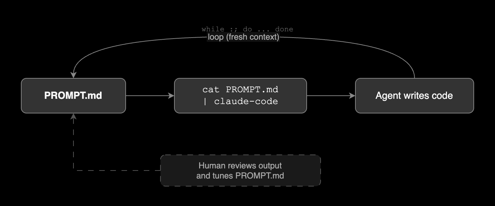

<small>Photo by [Ryunosuke Kikuno](https://unsplash.com/ko/%EC%82%AC%EC%A7%84/%ED%9D%B0%EC%83%89-%EB%B0%B0%EA%B2%BD%EC%97%90-%EA%B2%80%EC%9D%80-%EC%84%A0-zE-MrTmjzd4) on Unsplash</small>

## Overview

[Ralph](https://ghuntley.com/ralph/) is a way to build software by running an AI coding agent in a bash loop. Geoffrey Huntley made it popular. The idea is simple:

```bash
while :; do cat PROMPT.md | claude ; done
```

Write a prompt. Feed it to an AI agent. Let the agent write code. Loop. Repeat.

The name comes from [Ralph Wiggum](https://en.wikipedia.org/wiki/Ralph_Wiggum), a character in The Simpsons who is not smart but never gives up. The technique works the same way. The agent is not perfect, but it keeps trying through brute force, failure, and repetition until the job is done. [VentureBeat](https://venturebeat.com/technology/how-ralph-wiggum-went-from-the-simpsons-to-the-biggest-name-in-ai-right-now/) covered how this Simpsons character became the biggest name in AI coding.

**Ralph is not about removing humans from the loop.** The human role changes. Instead of writing code directly, **the human writes the requirements in PROMPT.md, reviews the output, and tunes the prompt.** The agent handles the coding. Huntley compares this to tuning a guitar. When the agent makes a mistake, don't blame the tool. Adjust the prompt.

## Where to run Ralph

Run the bash loop at the project root where PROMPT.md and CLAUDE.md live. The execution path itself is simple. What matters is the scope of work you define in PROMPT.md.

```bash
my-project/
├── CLAUDE.md      # Project-level context for Claude Code
├── PROMPT.md      # Task-level requirements for Ralph loop
├── Cargo.toml
└── src/
    ├── main.rs
    └── lib.rs
```

Ralph's core principle is "carve off small bits of work into independent context windows." Don't ask the agent to rewrite the whole repo at once. Keep the scope narrow and focused.

A good prompt targets a specific part of the codebase with a clear goal:

- "Write tests for all handlers in internal/handler/"
- "Make sure the code base matches the standards" (with a well-defined standards doc already in the repo)

A bad prompt is vague and wide:

- "Refactor this entire repo"
- "Improve the code quality everywhere"

The recommended approach for existing codebases is to run the loop once overnight on a cron, then review and merge the small change set in the morning.

## How it works



Each loop runs in a fresh context window. This is on purpose. Starting clean each time avoids context buildup and confusion. The human stays outside the loop, reviewing output and tuning PROMPT.md between runs.

## Role of PROMPT.md

PROMPT.md is the brain of Ralph. The bash loop just reads this file and pipes it into the agent. Without a good PROMPT.md, Ralph does nothing useful.

### What goes in PROMPT.md

Ralph users found that **declarative requirements work better than imperative instructions**. PROMPT.md should describe *what* you want as the end result, not *how* to do it step by step. It should contain:

- **Goal**: What the project or task should achieve
- **Tech stack**: Languages, frameworks, databases to use
- **Requirements**: Features and endpoints to build
- **Rules**: Constraints the agent must follow

Below is a PROMPT.md example that follows declarative best practices:

```markdown
# Project: User Management API

## Goal
A REST API server that handles user registration,
login, and profile retrieval.

## Tech Stack
- Language: Go 1.22
- Framework: net/http (standard library only)
- Database: PostgreSQL 16
- Auth: JWT with RS256 signing

## API Spec

### POST /api/register
- Request body: { "email": string, "password": string }
- Password must be hashed with bcrypt before storage
- Return 201 on success, 409 if email already exists

### POST /api/login
- Request body: { "email": string, "password": string }
- Return 200 with { "token": string } on success
- Return 401 on wrong email or password
- Token expires in 24 hours

### GET /api/profile
- Requires Authorization: Bearer <token> header
- Return 200 with { "email": string, "created_at": string }
- Return 401 if token is missing or invalid

## Project Layout
- Follow standard Go project layout

## Quality
- No ORM. Raw SQL only.
- No third-party routers. Standard library only.
- All handlers must have table-driven tests.
- All code must pass go vet and tests.
- All errors must return JSON: { "error": string }
```

This prompt describes *what* the result should look like, not *how* to build it. The project layout says "follow standard Go project layout" instead of listing every directory. The quality section defines conditions the code must meet, not commands to run.

### PROMPT.md vs CLAUDE.md

| File | Purpose |
|------|---------|
| PROMPT.md | Task-level instructions piped into each loop. Defines what to build right now. |
| CLAUDE.md | Project-level context loaded by Claude Code on startup. Defines how the project works. |

CLAUDE.md gives the agent background knowledge about the codebase. PROMPT.md gives it a specific job to do. Ralph uses PROMPT.md to drive each iteration.

## Prompt tuning

When Ralph gives bad results, fix the prompt. Don't blame the tool.

### The playground metaphor

Huntley explains prompt tuning with a playground analogy. You tell Ralph to build a playground. Ralph builds it, but kids fall off the slide. The fix is not to rebuild the playground. The fix is to put a sign next to the slide: "SLIDE DOWN, DON'T JUMP, LOOK AROUND."

Each time Ralph does something wrong, you add a sign. Over time, Ralph only thinks about the signs. The same mistakes stop happening. Huntley calls this process "tuning a guitar."

### What good tuning looks like

A [real-world example](https://www.humanlayer.dev/blog/brief-history-of-ralph) from Dex Horthy, an engineer at [HumanLayer](https://humanlayer.dev) who collaborated with Huntley on Ralph, shows what good prompt tuning looks like:

1. Spent 30 minutes writing coding standards with Claude.
2. Spent another 30 minutes reviewing those standards with a senior engineer.
3. Created a focused prompt: "make sure the code base matches the standards."
4. Ran the Ralph loop. Ralph built a REACT_REFACTOR_PLAN.md on its own and worked through the whole plan in 6 hours.

The prompt was short but backed by well-defined requirements. That's why it worked.

### What bad tuning looks like

The same author also shared a failure case:

1. Wrote a half-page outline for a productivity tool.
2. Had Ralph generate the requirements without reviewing it.
3. Had Ralph build the code without reading the requirements.
4. Checked the output at the end. The requirements were way off. The code was useless.

The lesson: if the requirements are bad, the results will be bad. If you don't know what the end state looks like, Ralph can't build it for you.

### When not to use Ralph

Ralph works best with well-defined, stable requirements. If you are still exploring or figuring out what to build, Ralph is the wrong tool. As Dex puts it: "if you are iterating/exploring, you probably don't want ralph in the first place."

Ralph needs a good PROMPT.md to work, and you can't write a good PROMPT.md if you don't know what you want yet. For the exploration phase, use Claude Code interactively instead. Figure out what to build first, then write the requirements, then run the loop.

## Why not the official plugin?

Anthropic released an official [Ralph Wiggum plugin](https://github.com/anthropics/claude-code/tree/main/plugins/ralph-wiggum) for Claude Code. But the people who actually built and used Ralph still prefer the raw bash loop.

[A Brief History of Ralph](https://www.humanlayer.dev/blog/brief-history-of-ralph) explains why. The plugin has problems:

- Needs the --dangerously-skip-permissions flag
- Puts hooks in hard-to-find folders
- Uses hidden markdown state tracking
- Adds stop hooks that break other Claude sessions

The bigger issue: the plugin tries to "run forever." But Ralph's real point is to **break work into small, fresh context windows**. Each loop is a clean start.

Dex tested the plugin and went back to the bash loop. His take: "dumb things can work surprisingly well."

## Real-world case: RepoMirror

At the YC Agents hackathon, a team ran Ralph overnight to port entire codebases between languages. The [results](https://github.com/repomirrorhq/repomirror/blob/main/repomirror.md) were striking:

- Ported [Browser Use](https://github.com/browser-use/browser-use) from Python to TypeScript. Woke up to an almost fully working port.
- Ported [Vercel AI SDK](https://github.com/vercel/ai) from TypeScript to Python. The agent even added extra features like Flask and FastAPI integrations on its own.
- Shipped 6 repos overnight with around 1,100 commits total.
- Total cost: about $800. Each Sonnet agent cost roughly $10.50/hour.

The prompts were short. One was only 103 words. When they tried expanding a prompt to 1,500 words with Claude's help, the agent got slower and dumber. They went back to the short version.

Other lessons from the hackathon:

- The agents never got stuck or drifted into random features. They stayed on task.
- After finishing the port, agents settled into writing extra tests or updating their TODO.md.
- In one case, an agent used pkill to terminate itself after realizing it was stuck in an infinite loop.
- The output was about 90% correct. The last 10% needed human review and interactive Claude Code sessions.

## Tips

- **Code is cheap.** When merge conflicts happen, just re-run the loop on clean code with the same prompt.
- **Keep changes small.** One small fix per loop is better than a huge rewrite.
- **Prompt is everything.** Good prompt, good output. Bad prompt, bad output.
- **Use an alias.** The original Ralph is just a bash one-liner. Adding an alias to your shell config makes it easier to run from any project root.

```bash
echo "alias ralph='while :; do cat PROMPT.md | claude ; done'" | tee -a ~/.zshrc
source ~/.zshrc
```

Then just run:

```bash
ralph
```

## References

- [Ralph - ghuntley.com](https://ghuntley.com/ralph/)
- [A Brief History of Ralph - humanlayer.dev](https://www.humanlayer.dev/blog/brief-history-of-ralph)
- [RepoMirror - repomirrorhq/repomirror](https://github.com/repomirrorhq/repomirror/blob/main/repomirror.md)
