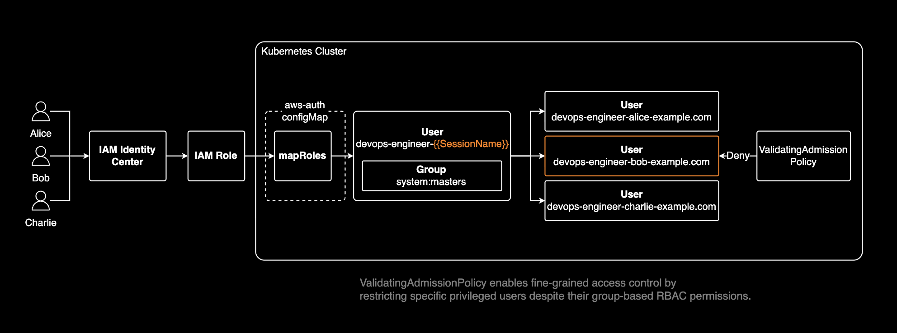

## 개요

쿠버네티스 RBAC은 화이트리스트 방식으로 허용 정책만 지원하고 거부 정책은 지원하지 않습니다. 이로 인해 동일한 IAM Role을 공유하는 cluster-admin 사용자들을 개별적으로 제어하기 어렵습니다. 이 글에서는 SessionName 패턴과 [ValidatingAdmissionPolicy](https://kubernetes.io/docs/reference/access-authn-authz/validating-admission-policy/)를 조합하여 사용자별 세밀한 접근 제어를 구현하는 방법을 소개합니다.

## 배경지식

Kubernetes는 비교적 최근에 네이티브 정책 엔진을 지원하기 시작했습니다. Kyverno나 OPA와 같은 서드파티 도구 없이도 정책 기반 접근 제어를 구현할 수 있습니다.

- [**ValidatingAdmissionPolicy**](https://kubernetes.io/docs/reference/access-authn-authz/validating-admission-policy/): Kubernetes 1.30+부터 Stable
- [**MutatingAdmissionPolicy**](https://kubernetes.io/docs/reference/access-authn-authz/mutating-admission-policy/): Kubernetes 1.34+부터 Beta

이 글에서는 ValidatingAdmissionPolicy (VAP)를 사용하여 특정 cluster-admin 사용자의 CREATE, UPDATE, DELETE 작업과 Pod exec/attach 권한을 제한하는 방법을 다룹니다.



## RBAC 가드레일 구현

### 문제점과 해결책

쿠버네티스 RBAC은 화이트리스트 방식으로 거부 정책(블랙리스트)을 지원하지 않아 세밀한 접근 제어가 어렵습니다. ValidatingAdmissionPolicy의 거부 정책을 활용하면 이 문제를 해결할 수 있습니다.

### SessionName 패턴

IAM Role에 RBAC 권한을 할당할 때 `{{SessionName}}`을 포함하는 것이 [EKS 모범사례](https://docs.aws.amazon.com/ko_kr/eks/latest/best-practices/identity-and-access-management.html#_cluster_access_recommendations)입니다. `{{SessionName}}`은 IAM Role을 assume한 실제 사용자의 세션 이름으로 자동 치환되는 변수입니다. AWS IAM Identity Center를 사용하는 경우, 기본적으로 sessionName은 사용자의 이메일 주소와 일치합니다.

이를 통해 감사 로그에 세션 이름이 기록되어 CloudTrail과 함께 실제 사용자를 추적할 수 있고, 동일한 IAM Role을 공유하더라도 각 사용자를 개별 식별하여 ValidatingAdmissionPolicy로 특정 사용자만 선택적으로 제한할 수 있습니다.


#### aws-auth ConfigMap 설정

aws-auth ConfigMap의 mapRoles에서 username 필드를 `devops-engineer-{{SessionName}}` 형태로 설정합니다.

```yaml,hl_lines=9
apiVersion: v1
kind: ConfigMap
metadata:
  name: aws-auth
  namespace: kube-system
data:
  mapRoles: |
    - rolearn: arn:aws:iam::123456789012:role/AWSReservedSSO_DevOps_Admin_1234abcd
      username: devops-engineer-{{SessionName}}
      groups:
        - system:masters
```

`{{SessionName}}`이 각 사용자의 이메일 주소로 치환되어 개별 username이 생성됩니다. 예를 들어 `alice@example.com`은 `devops-engineer-alice-example.com`으로 매핑됩니다. 이를 통해 동일한 IAM Role을 공유하는 Alice, Bob, Charlie를 개별 사용자로 식별하고, Kyverno로 특정 사용자만 선택적으로 권한을 제한할 수 있습니다.

#### 사용자 정보 확인

`kubectl auth whoami` 명령어로 현재 인증된 사용자 정보를 확인할 수 있습니다. `sessionName`이 어떻게 Kubernetes `username`으로 변환되는지 확인할 수 있습니다.

```bash
kubectl auth whoami -o yaml
```

```yaml,hl_lines=24
apiVersion: authentication.k8s.io/v1
kind: SelfSubjectReview
metadata:
  creationTimestamp: "2025-02-06T19:49:41Z"
status:
  userInfo:
    extra:
      accessKeyId:
      - ASIA1234567890EXAMPLE
      arn:
      - arn:aws:sts::123456789012:assumed-role/AWSReservedSSO_DevOps_Admin_1234abcd/john.doe@example.com
      canonicalArn:
      - arn:aws:iam::123456789012:role/AWSReservedSSO_DevOps_Admin_1234abcd
      principalId:
      - AROA1234567890EXAMPLE
      sessionName:
      - john.doe@example.com # <-- sessionName is the email address of the IAM Identity Center user by default
      sigs.k8s.io/aws-iam-authenticator/principalId:
      - AROA1234567890EXAMPLE
    groups:
    - system:masters
    - system:authenticated
    uid: aws-iam-authenticator:123456789012:AROA1234567890EXAMPLE
    username: devops-engineer-john.doe-example.com # <-- HERE
```

주목할 부분은 `sessionName`(이메일 주소)이 aws-auth ConfigMap 패턴과 결합되어 Kubernetes `username`(`devops-engineer-john.doe-example.com`)으로 생성된다는 점입니다.

```yaml,hl_lines=3
status:
  userInfo:
    username: devops-engineer-john.doe-example.com
```

### ValidatingAdmissionPolicy

가드레일 정책은 새로운 클러스터 관리자의 실수를 방지합니다. 신입 관리자가 프로덕션 환경에 익숙하지 않은 상태에서 잘못된 명령을 실행하거나, 테스트 작업이 의도치 않게 운영 환경에 영향을 미치는 상황을 막을 수 있습니다.

이 정책을 사용하면 클러스터의 모든 cluster-admin이 아닌 특정 사용자만 선택적으로 제한할 수 있어 cluster-admin 그룹 내에서도 세분화된 접근 제어가 가능합니다.

> ⚠️ **주의**: 이 정책이 적용된 사용자의 경우 `kubectl auth whoami` 명령어도 SelfSubjectReview를 CREATE하는 작업이므로 거부됩니다. 따라서 사용자 정보 확인조차 불가능하므로 정책 적용 전에 미리 sessionName 값을 확인해야 합니다.

특정 사용자의 CREATE, UPDATE, DELETE 작업을 거부하는 ValidatingAdmissionPolicy 예시:

```yaml
apiVersion: admissionregistration.k8s.io/v1
kind: ValidatingAdmissionPolicy
metadata:
  name: block-specific-cluster-admin
  annotations:
    admissionregistration.k8s.io/title: "Block Specific Cluster Admin"
    admissionregistration.k8s.io/description: >-
      Blocks CREATE, UPDATE, DELETE operations and Pod exec/attach access
      for a specific cluster-admin user while allowing read-only access
    admissionregistration.k8s.io/category: "Security, Access Control"
spec:
  failurePolicy: Fail
  matchConstraints:
    resourceRules:
    - apiGroups: ["*"]
      apiVersions: ["*"]
      operations: ["CREATE", "UPDATE", "DELETE"]
      resources: ["*"]
    - apiGroups: [""]
      apiVersions: ["v1"]
      operations: ["CONNECT"]
      resources: ["pods/exec", "pods/attach"]
  validations:
  - expression: |
      !(
        request.userInfo.username == 'devops-engineer-elon.musk-example.com' &&
        has(request.userInfo.groups) &&
        'system:masters' in request.userInfo.groups
      )
    message: "The cluster-admin user 'devops-engineer-elon.musk-example.com' is not allowed to perform CREATE, UPDATE, or DELETE operations."
    reason: Forbidden
---
apiVersion: admissionregistration.k8s.io/v1
kind: ValidatingAdmissionPolicyBinding
metadata:
  name: block-specific-cluster-admin-binding
spec:
  policyName: block-specific-cluster-admin
  validationActions: ["Deny"]
```

이 정책은 cluster-admin 역할(`system:masters` 그룹)을 가진 특정 사용자(`devops-engineer-elon.musk-example.com`)의 모든 리소스에 대한 CREATE, UPDATE, DELETE 작업과 Pod exec/attach 작업을 거부합니다.

> ⚠️ **주의**: `resources: ["*"]`는 서브리소스(예: pods/exec, pods/attach)를 포함하지 않습니다. 서브리소스를 제어하려면 별도의 resourceRules로 명시해야 합니다. 자세한 내용은 [kubernetes/kubernetes#115523](https://github.com/kubernetes/kubernetes/issues/115523) 이슈를 참고하세요.

CEL 표현식은 다음과 같이 해석됩니다:

```cel
!(  # 전체를 부정 (NOT)
  request.userInfo.username == 'devops-engineer-elon.musk-example.com' &&  # 사용자 이름이 일치하고
  has(request.userInfo.groups) &&  # groups 필드가 존재하고
  'system:masters' in request.userInfo.groups  # system:masters 그룹에 속해있는가
)
```

ValidatingAdmissionPolicy는 expression이 `true`를 반환할 때 요청을 허용하고, `false`를 반환하면 거부합니다. 따라서 특정 사용자와 그룹의 조합이 일치할 때만 `false`가 되어 요청이 거부됩니다.

#### 정책 테스트

정책이 정상적으로 동작하는지 확인하기 위해 `--as`와 `--as-group` 플래그를 사용하여 특정 사용자로 가장(impersonate)하여 테스트할 수 있습니다:

```bash
kubectl create namespace test \
  --as=devops-engineer-elon.musk-example.com \
  --as-group=system:masters
```

정책이 올바르게 적용되었다면 다음과 같은 오류 메시지가 표시됩니다:

```
Error from server (Forbidden): The cluster-admin user 'devops-engineer-elon.musk-example.com' is not allowed to perform CREATE, UPDATE, or DELETE operations.
```

## 결론

SessionName 패턴과 ValidatingAdmissionPolicy를 조합하면 RBAC의 한계를 극복하고 사용자별 세밀한 접근 제어가 가능합니다. 동일한 IAM Role을 공유하는 cluster-admin 그룹 내에서도 특정 사용자만 선택적으로 제한할 수 있어, 여러 팀원이 관리자 역할을 공유하는 환경에서 특히 유용합니다.

SessionName을 통해 실제 사용자를 추적할 수 있어 CloudTrail과 함께 감사 로그를 강화할 수 있고, ValidatingAdmissionPolicy로 신규 관리자의 실수나 의도치 않은 운영 환경 변경을 사전에 차단할 수 있습니다. 이 접근 방식을 통해 팀의 경험 수준에 맞춰 권한을 단계적으로 확대하며 안전하게 클러스터를 운영할 수 있습니다.

## 관련자료

- [Kubernetes ValidatingAdmissionPolicy](https://kubernetes.io/docs/reference/access-authn-authz/validating-admission-policy/)
- [Kubernetes Admission Controllers](https://kubernetes.io/docs/reference/access-authn-authz/admission-controllers/)
- [EKS Best Practices - Cluster Access Management](https://docs.aws.amazon.com/ko_kr/eks/latest/best-practices/identity-and-access-management.html#_cluster_access_recommendations)
