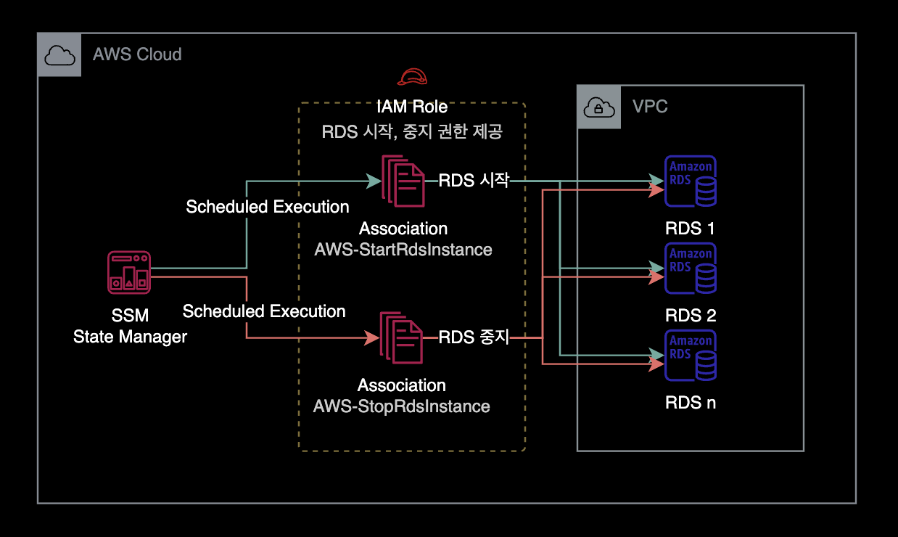
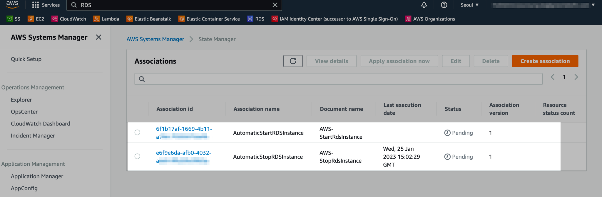
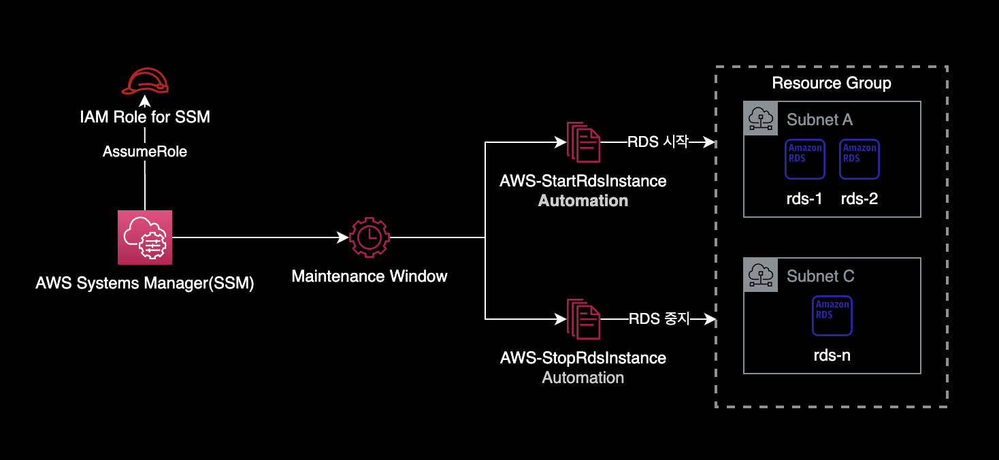

## 개요

클라우드 비용 절감을 위해 업무 시간 외에 DB 인스턴스를 자동종료하는 방법을 소개합니다.

AWS Systems Manager에서는 `AWS-StartRdsInstance`와 `AWS-StopRdsInstance`라고 하는 Document를 제공합니다.  
이 방법을 사용하면 별도의 Lambda Function 생성 없이도 여러 개의 RDS 인스턴스를 자동 시작, 중지를 자동화할 수 있습니다.

&nbsp;

## 환경

완성된 AWS 아키텍처는 다음과 같습니다.



&nbsp;

## 설정방법

1대의 RDS 인스턴스에 자동 중지, 시작 스케줄을 설정하는 방법입니다.

&nbsp;

### IAM Role 생성

#### IAM Policy

해당 Execution Role에 RDS 목록 확인, 시작, 중지, 리부팅에 대한 권한을 부여합니다.

```json
{
    "Version": "2012-10-17",
    "Statement": [
        {
            "Sid": "AllowStopAndStartAllRdsInstances",
            "Effect": "Allow",
            "Action": [
                "rds:Describe*",
                "rds:Start*",
                "rds:Stop*",
                "rds:Reboot*"
            ],
            "Resource": "*"
        }
    ]
}
```

새 IAM Policy 이름은 `AutomaticStopStartRebootRDS`로 생성합니다.

&nbsp;

#### Trust Relationship

SSM State Manager만 해당 Execution Role에 접근할 수 있도록 제한된 신뢰 관계를 설정합니다.

```json
{
    "Version": "2012-10-17",
    "Statement": [
        {
            "Effect": "Allow",
            "Principal": {
                "Service": "ssm.amazonaws.com"
            },
            "Action": "sts:AssumeRole"
        }
    ]
}
```

새 IAM Role 이름은 `AutomaticStopStartRebootRDS`로 생성합니다.

&nbsp;

### Association 생성

#### Cron 표현식

##### 작성 시 주의사항

Association 생성 시 Cron Expression에 입력하는 시간은 UTC 기준입니다.  
KST와 UTC는 9시간 차이가 나므로 원하는 시간대에 맞게 설정하려면 UTC 시간대로 변환하여 입력해야 합니다.

&nbsp;

##### cron 표현식 치트시트

AWS SSM State Manager에서 사용하는 Cron 표현식은 다음과 같습니다.

```bash
cron(* * * * * *)
     – – – – – -
     | | | | | |
     | | | | | +—– year
     | | | | +—– day of week (SUN - SAT or 1 – 7)
     | | | +——- month (1 – 12)
     | | +——— day of month (1 – 31)
     | +———– hour (0 – 23)
     +————- min (0 – 59)
```

&nbsp;

#### RDS 중지 Association 생성

매일 업무 종료 시간에 지정한 RDS를 중지합니다.  
아래 예시의 경우, 업무 종료 시간은 KST PM 06:00 (= UTC AM 09:00)를 의미합니다.

```bash
$ aws ssm create-association \
    --association-name "AutomaticStopRDSInstance" \
    --parameters "AutomationAssumeRole=arn:aws:iam::<YOUR_ACCOUNT_ID>:role/AutomaticStopStartRebootRDS,InstanceId=<YOUR_TARGET_RDS_NAME>" \
    --schedule-expression "cron(0 9 ? * * *)" \
    --name AWS-StopRdsInstance \
    --apply-only-at-cron-interval \
    --tags "Key=ManagedBy,Value=Console"
```

&nbsp;

#### RDS 시작 Association 생성

매일 업무 시작 시간에 지정한 RDS를 시작합니다.  
아래 예시의 경우, 업무 시작 시간은 KST AM 09:00 (= UTC AM 00:00)를 의미합니다.

```bash
$ aws ssm create-association \
    --association-name "AutomaticStartRDSInstance" \
    --parameters "AutomationAssumeRole=arn:aws:iam::<YOUR_ACCOUNT_ID>:role/AutomaticStopStartRebootRDS,InstanceId=<YOUR_TARGET_RDS_NAME>" \
    --schedule-expression "cron(0 0 ? * * *)" \
    --name AWS-StartRdsInstance \
    --apply-only-at-cron-interval \
    --tags "Key=ManagedBy,Value=Console"
```

&nbsp;

AWS Systems Manager → State Manager → Associations를 확인한 결과입니다.



RDS 시작 Association, 중지 Association 총 2개가 생성된 것을 확인할 수 있습니다.

&nbsp;

현재 저희는 Association 생성할 때 `--apply-only-at-cron-interval` 옵션을 실행해서 즉시 테스트해볼 수 없습니다.  
즉시 테스트를 원하는 경우, 상단에 Apply association now 버튼을 클릭합니다. Association이 의도한 대로 잘 동작하는 지 테스트할 수 있습니다.

&nbsp;

## 주의사항

### State Manager의 cron 표현식 한계

아쉽게도 State Manager의 Association에서는 `cron(0 8 ? * MON-FRI *)`와 같은 평일 기간 Cron 표현을 지원하지 않습니다.

자세한 사항은 AWS 공식문서 [Association의 Cron and Rate 표현식](https://docs.aws.amazon.com/systems-manager/latest/userguide/reference-cron-and-rate-expressions.html#reference-cron-and-rate-expressions-association)를 참조하세요.

&nbsp;

## 더 나아가서

### maintenance window

이 가이드에서는 SSM의 State Manager를 사용하여 RDS 자동시작과 중지 스케줄링을 구현했습니다. 더 나아가서 SSM의 Maintenance Window로도 RDS 자동시작, 중지를 자동화해봅니다.



&nbsp;

SSM의 State Manager 대신 Maintenance Window를 사용해서 구현하면 State Manager와 비교해서 크게 2가지 장점이 있습니다.

- **cron 요일 기간 사용** :`cron(0 8 ? * MON-FRI *)`와 같은 [평일 기간 Cron 표현식](https://docs.aws.amazon.com/systems-manager/latest/userguide/reference-cron-and-rate-expressions.html#reference-cron-and-rate-expressions-maintenance-window)을 사용할 수 있습니다.
- **타임존 설정 가능** : `maintenance window`는 `Asia/Seoul`과 같은 Time Zone을 설정할 수 있어서 스케줄 시작, 중지시간 관리 및 계산이 더 편합니다.

**더 읽으러 가기**  
[maintenance window로 RDS 가동시간 자동화](/blog/auto-schedule-ssm-mw/)

&nbsp;

## 참고자료

[Schedule Amazon RDS stop and start using AWS Systems Manager](https://aws.amazon.com/ko/blogs/database/schedule-amazon-rds-stop-and-start-using-aws-systems-manager/)

[Automatically stop and start an Amazon RDS DB instance using AWS Systems Manager Maintenance Windows](https://docs.aws.amazon.com/prescriptive-guidance/latest/patterns/automatically-stop-and-start-an-amazon-rds-db-instance-using-aws-systems-manager-maintenance-windows.html)  
AWS Systems Manager의 Maintenance Windows 기능을 활용하는 방법도 있습니다.  
Maintenance Windows에서는 `MON-FRI`와 같은 평일 기간 Cron 표현식을 지원합니다.
