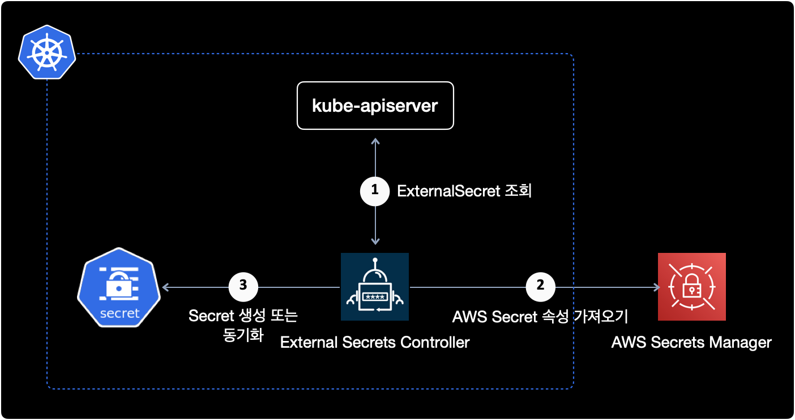

## 개요

External Secrets `v0.4.4`를 사용할 경우, 설정과 구성에 전혀 문제가 없더라도 무조건 최초 동기화에 실패하는 버그가 있습니다.  
이에 대한 트러블슈팅 가이드입니다.

&nbsp;

## 배경지식

### External Secrets Operator

쿠버네티스의 [External Secrets Operator](https://external-secrets.io/)는 쿠버네티스 클러스터 외부에 위치한 시크릿 매니저(예: AWS Secrets Manager, HashiCorp Vault)와 통합하는 기능을 제공합니다.

보안 상 중요한 정보들을 저장하는 것은 매우 중요한 일입니다. 일반적으로 이러한 정보는 외부 시스템에 저장되며, 이를 쿠버네티스에서 사용할 수 있도록 가져오는 것은 쉽지 않은 일입니다. 이 때 External Secrets Operator를 사용하면 외부 시스템에서 시크릿 정보를 안전하게 가져와서 쿠버네티스의 파드, 컨테이너 등에서 사용할 수 있습니다.

External Secrets Operator는 쿠버네티스의 Custom Resource Definition(CRD)를 사용하여 외부 시크릿 매니저에서 시크릿 정보를 가져오는 방법을 정의합니다. 이 CRD를 사용하여 쿠버네티스 오브젝트(예: Pod, Deployment)에서 시크릿 정보를 참조할 수 있습니다.

이를 통해 시크릿 정보를 쿠버네티스 클러스터 환경에서 쉽게 관리할 수 있으며, 보안성도 높아집니다.

&nbsp;

## 증상

EKS 클러스터에 External Secrets `v0.4.4` 버전을 배포해서 사용 중입니다.  
External Secrets을 ArgoCD에 배포했을 경우 처음 한 번은 무조건 Sync 실패가 발생하는 버그가 있습니다.

```bash
$ helm list -A -f 'external-secrets'
NAME              NAMESPACE         REVISION  UPDATED                               STATUS    CHART                   APP VERSION
external-secrets  external-secrets  2         2022-05-10 11:13:09.719108 +0900 KST  deployed  external-secrets-0.4.4  v0.4.4
```

&nbsp;

아래는 ArgoCD에서 문제가 발생한 Application을 확인한 화면입니다.


아래는 ExternalSecret에서 발생하는 에러 메세지입니다.  

```bash
Operation cannot be fulfilled on secrets "sample-application-name-here": the object has been modified; please apply your changes to the latest version and try again
```

ArgoCD에서 Application을 배포하면 External Secret에서 위와 같은 에러 메세지가 발생하며 AWS Secret과 싱크에 실패합니다.  
ArgoCD의 application은 degraded 상태가 됩니다.

&nbsp;

## 환경

- External Secrets `v0.4.4`

External Secrets 배포는 헬름 차트 `v0.4.4`를 사용했습니다.



클러스터 외부에 있는 AWS Secrets Manager의 Secret을 사용하기 위해 External Secrets를 EKS 클러스터에 배포한 구성입니다.

- EKS v1.21
- EC2 Managed Node로 구성된 EKS 클러스터

&nbsp;

## 원인

External Secrets `v0.4.4`에서 발생하는 버그입니다.

&nbsp;

## 해결방법

### 근본적인 해결방안

근본적인 해결방법은 External Secrets 릴리즈를 `v0.4.4`에서 최신 버전으로 업그레이드하면 됩니다.

&nbsp;

### 대안

하지만 여러가지 이유로 External Secrets 버전 업그레이드가 불가능한 상황일 경우, External Secret의 `spec.refreshInterval` 설정을 수정해서 싱크 문제를 해결할 수 있습니다.

ArgoCD에 Application을 배포할 때 External Secrets 리소스의 `spec.refreshInterval` 주기를 기본값 `1h`보다 더 짧게 설정합니다.


&nbsp;

문제가 발생한 ExternalSecrets의 yaml 파일입니다.

```yaml
apiVersion: external-secrets.io/v1alpha1
kind: ExternalSecret
metadata:
  ...
spec:
  refreshInterval: 1h
  ...
```

`spec.refreshInterval` 기본값은 1시간(`1h`)입니다.

&nbsp;

`spec.refreshInterval` 설정을 `1h`에서 `1m`으로 변경합니다.

```yaml
apiVersion: external-secrets.io/v1alpha1
kind: ExternalSecret
metadata:
  ...
spec:
  # Change `refreshInterval` 1h to 1m.
  refreshInterval: 1m
  ...
```

&nbsp;

`refreshInterval` 값을 수정한 후 ArgoCD에 재배포하면 정상적으로 싱크된 걸 확인할 수 있습니다.

```bash
$ kubectl get externalsecrets.external-secrets.io \
    -n your-namespace
```

```bash
NAME                      STORE             REFRESH INTERVAL   STATUS
testweb-testweb-cred      secrets-manager   1m                 SecretSynced
testweb-datadog-env       secrets-manager   1m                 SecretSynced
testweb-fluentbit-cred    secrets-manager   1m                 SecretSynced
```

상태값이 `SecretSynced`로 변경된 걸 확인할 수 있습니다.

&nbsp;

## 참고자료

[API specification](https://external-secrets.io/v0.4.4/spec/#external-secrets.io/v1alpha1.ExternalSecret)  
External Secrets Operator `v0.4.4`의 API 스펙 공식문서
