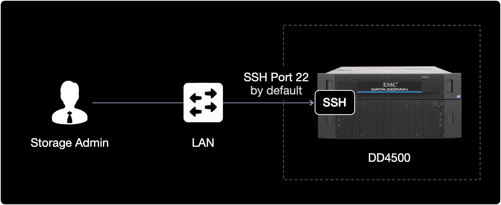
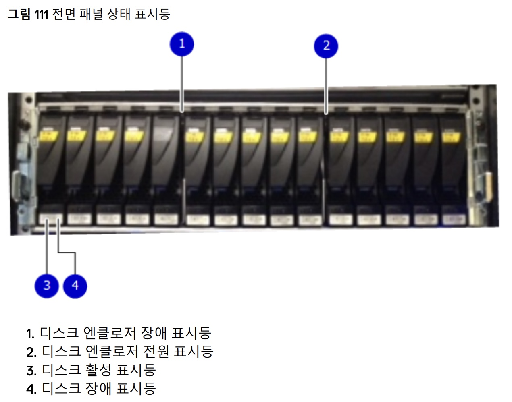
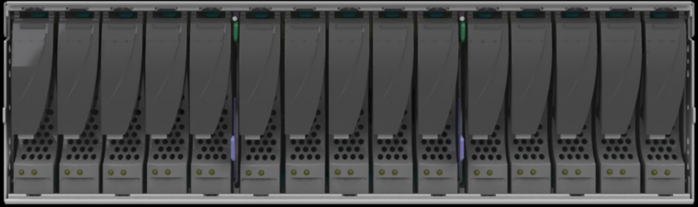

## 개요

DD4500 백업장치의 폴트 디스크 교체 작업 시, 인적실수를 방지하고 안전하게 교체하는 정식 절차를 소개합니다.  

&nbsp;

## 환경

- **Hardware** : EMC DD4500

  > EMC 사에서 만든 Data Domain 4500은 백업 및 아카이브용 **데이터 중복 제거 스토리지 시스템**입니다.

- **작업형태** : 데이터센터 현장의 하드웨어 작업과 CLI 작업이 혼합된 시나리오

&nbsp;

## 전제조건

폴트 발생 디스크를 제거하고 신규로 투입할 교체용 디스크 파트를 준비합니다.

&nbsp;

## 작업절차

### failed disk 교체

#### 1. SSH Login

작업 대상인 Data Domain 4500 장비에 SSH로 로그인합니다.  
Data Domain 2500, Data Domain 4500 모델의 SSH 포트 기본값은 TCP/22로 설정되어 있습니다.



**참고사항**  
Data Domain의 관리자가 Data Domain 명령어를 사용해서 SSH 포트를 TCP/22가 아닌 다른 포트로 변경할 수 있습니다.

&nbsp;

#### 2. Failed Disk 확인

DD4500의 전체 인클로저에 장착된 디스크 상태를 확인합니다.

```bash
$ disk show state
Enclosure   Disk
             1  2  3  4  5  6  7  8  9  10 11 12 13 14 15
---------   ----------------------------------------------
...
14           .  .  .  f  .  .  .  .  .  .  .  .  .  .  .
```

`f` 는 폴트 발생한 디스크<sup>Failed Disks</sup>를 의미합니다.  
14번 Enclosure의 4번 디스크가 고장난 상황입니다.

&nbsp;

#### 3. 교체 대상 디스크 LED 표시

**명령어 형식**

```bash
$ disk beacon <enclosure-id>.<disk-id>
```

정상 디스크를 잘못 분리하는 인적 실수<sup>Human Fault</sup>를 방지하기 위해 고장난 Disk의 전면부 LED를 깜빡거리도록 표시하는 명령어입니다.

제조사인 EMC의 공식문서에서도 `disk beacon` 명령어를 실행한 상태에서 디스크를 교체하기를 권장하고 있다.

&nbsp;

**실제 수행 명령어**  
14번 인클로저의 4번 디스크 LED를 점멸<sup>blinking</sup> 시킵니다.

```bash
$ disk beacon 14.4
```

<kbd>Ctrl</kbd> + <kbd>C</kbd> 키를 누르면 LED 점멸을 중지합니다.

`disk beacon` 명령어를 실행하면 아래 사진 기준으로 **3. 디스크 활성 표시등**이 깜빡이게 됩니다.



&nbsp;

**참고사항**  
`disk beacon` 명령어를 실행해도 특정 슬롯의 디스크 LED가 동작하지 않는 경우가 있습니다.  
이 경우, 디스크 LED의 고장도 의심해봐야 합니다.

아래 명령어를 사용해서 모든 디스크에서 상태 표시등이 깜박이는지 확인할 수 있습니다.

```bash
$ enclosure beacon
```

&nbsp;

#### 4. 디스크 교체

DD4500의 Enclosure 앞으로 이동합니다.



고장난 디스크를 제거(eject)한 후 신규 디스크를 장착(insert)합니다.  
디스크 교체 직후 약 5분간 기다립니다.

교체한 디스크가 `failed` 상태에서 정상 상태인 `spare` 또는 `In-use`로 변화하는 데까지 시간이 소요될 수 있기 때문입니다.

&nbsp;

디스크 교체 시 Data Domain이 동작하는 과정은 다음과 같습니다.

- Examine the newly inserted disk for any partitions that exist.
- If there are no partitions on the disk, then a number of partitions will be created. In one partition, specifically partition 3, will we create a DataDomain superblock. This disk will then become a spare disk as indicated by the 's' state above.
- If partition 3 exists, it is checked for the presence of a superblock. If a superblock exists and the superblock shows the information from another system, the disk will become a foreign or unknown.
- If partition 3 exists but there is no superblock, the disk will become a 'v' available disk.

&nbsp;

#### 5. Disk 상태 확인

전체 디스크 상태를 확인합니다.

```bash
$ disk show state
Enclosure   Disk
             1  2  3  4  5  6  7  8  9  10 11 12 13 14 15
---------   ----------------------------------------------
...
14           .  .  .  v  .  .  .  .  .  .  .  .  .  .  .
```

교체 후 4번 슬롯의 디스크 상태가 Failed Disks `f`에서 Available `v`로 변경되었습니다.

&nbsp;

**디스크 상태 표시 정보**  
인클로저의 디스크 상태는 크게 5가지로 구분됩니다.

| Symbol  | State Name      | Description                               |
|---------|-----------------|-------------------------------------------|
| **`.`** | In-use Disks    | 서비스 중인 정상 디스크.                       |
| **`v`** | Available Disks | 사용 가능하나 투입되지 않은 디스크.               |
| **`f`** | Failed Disks    | 고장으로 사용 불가능한 상태의 디스크.              |
| **`s`** | Spare Disks     | 예비 디스크. 다른 In-use 디스크가 고장시 투입됩니다. |
| **`U`** | Unknown Disks   | 현재 상태를 알 수 없는 디스크.                   |

&nbsp;

## 트러블슈팅

### 증상

고장난 디스크를 정상 디스크로 교체 후에 `disk show state`로 확인해보니, 해당 디스크의 상태가 정상이 아닌 `Unknown`으로 표시되는 상황.

```bash
$ disk show state
Enclosure   Disk
             1  2  3  4  5  6  7  8  9  10 11 12 13 14 15
---------   ----------------------------------------------
...
14           .  .  .  U  .  .  .  .  .  .  .  .  .  .  .
```

&nbsp;

### 해결방안

디스크 상태 제어 명령어를 사용해서 교체한 디스크를 강제로 Online 상태로 전환시키면 됩니다.

> 교체한 디스크 상태가 이미 In-use<sup>`.`</sup> 또는 Spare<sup>`s`</sup>일 경우 아래 조치방법을 실행할 필요 없습니다.

&nbsp;

### 상세 조치방법

#### 1. Disk 상태 변경 명령어를 실행

**명령어 형식**  
특정 위치에 장착된 Disk 상태를 Unknown에서 Online 상태로 변경해주는 명령어입니다.  
정확히는 `disk unfail` 기능을 사용하면 장애가 발생한 디스크를 운영<sup>operation</sup> 상태로 되돌립니다.

```bash
$ disk unfail <enclosure-id>.<disk-id>
```

&nbsp;

**실제 수행 명령어**  
14번 인클로저의 4번 디스크를 Online 상태로 변경합니다.

```bash
$ disk unfail 14.4
```

&nbsp;

명령어 실행결과입니다.

```bash
The 'disk unfail' command will add the disk to the active stroage tier and mari it as a space. Any existing data on this disk will be lost.
Are you sure? (yes|no|?) [no] yes

ok, proceeding
```

중간에 실행여부를 묻는데 <kbd>yes</kbd> 입력 후 <kbd>Enter</kbd> 를 누릅니다.  
Disk 상태가 Unknown에서 Online 상태로 변경합니다.

마지막에 `ok, proceeding` 메세지가 출력되면 새로 장착한 디스크가 활성화 스토리지 티어<sup>active storage tier</sup>에 정상적으로 투입 완료된 것입니다.

```bash
...
ok, proceeding
```

&nbsp;

```bash
$ disk unfail 14.4

**** Disk 14.4 is already available.
```

`disk unfail` 실행 후 위와 같이 `Disk x.x is already available.` 메세지가 출력된다면 이미 해당 디스크는 `available` 상태를 의미합니다.

이 경우 `disk unfail` 명령어를 실행시킬 필요가 없습니다.

&nbsp;

#### 2. Disk 상태 재확인

`unfail` 조치한 디스크의 상태를 최종 확인합니다.  

```bash
$ disk show state
```

&nbsp;

## 참고자료

[Dell EMC Data Domain Hardware Features and Specifications Guide (6.2 버전)](https://www.delltechnologies.com/asset/ko-kr/products/data-protection/technical-support/docu89768.pdf)  
Dell EMC 메뉴얼 자료

[디스크 교체 시 Data Domain이 동작하는 과정](https://www.dell.com/community/Data-Domain/Data-Domain-DD880-Disk-showing-quot-Available-quot-V-instead-of/td-p/7145899)  
Dell Community
