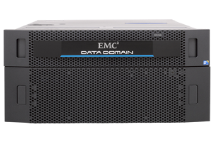
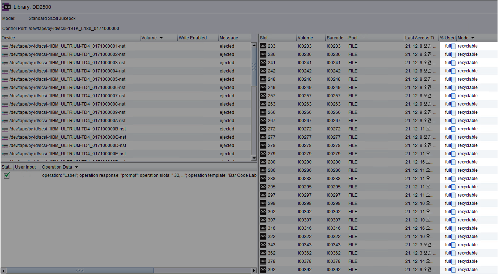
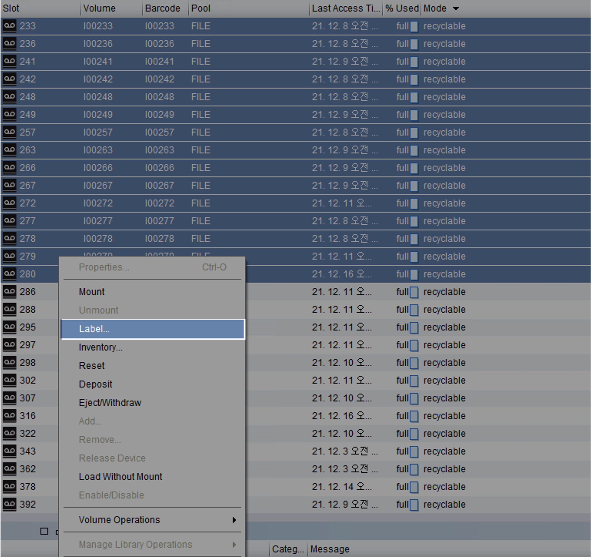
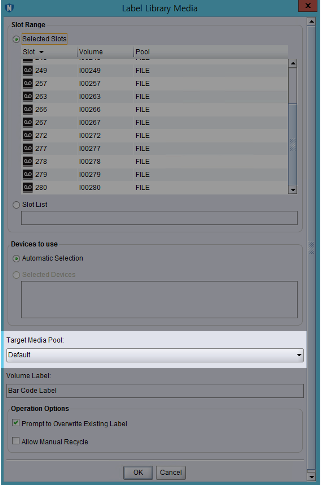
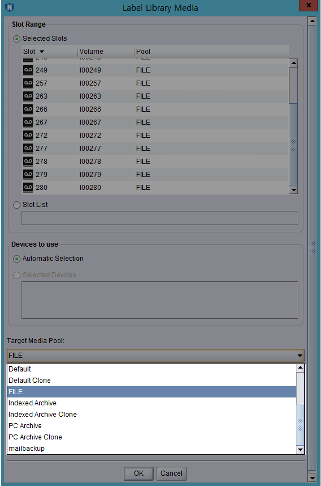
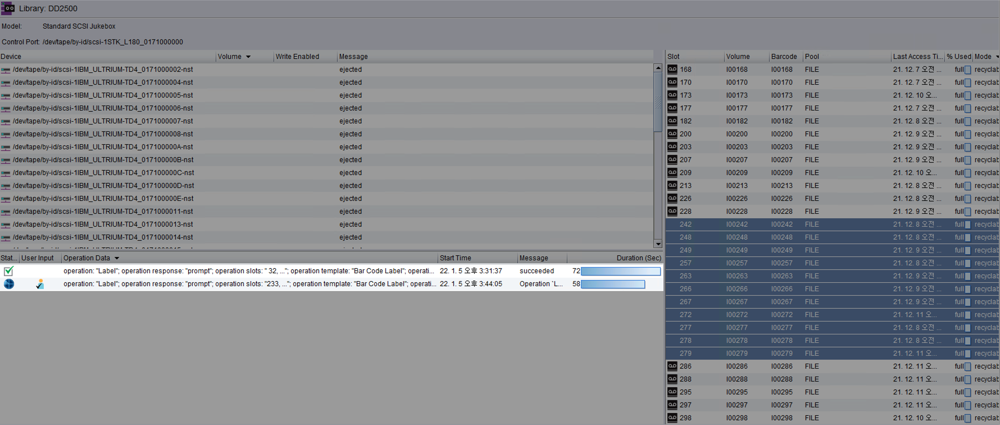
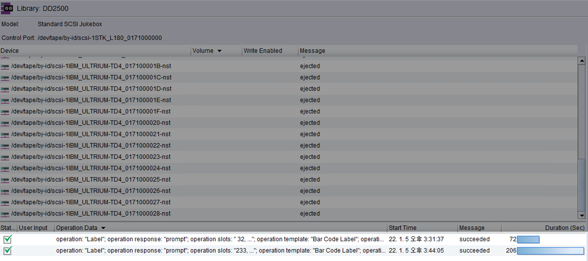

## 개요

EMC사의 VTL(Virtual Tape Library) 장비인 DD2500에서 디스크 여유공간이 부족할 때 파일시스템 정리(Filesystem cleanining) 조치를 통해 용량 확보하는 방법을 설명한다.

&nbsp;

### DD2500



EMC사에서 만든 백업 및 재해 복구(DR, Disaster Recovery) 기능을 제공하는 중복 제거 스토리지 제품의 모델명이다.

&nbsp;

## 환경

- **Vendor** : EMC
- **Model** : Data Domain 2500
- **DD OS** : Data Domain OS 5.7.3.0-548132

**Alert**  
**DD OS**는 Data Domain Operating System의 약자로 Dell EMC Data Domain 장비를 구동하는 운영체제입니다.  
Data Domain 플랫폼이 백업, 아카이브 및 재해 복구를 위한 확장 가능한 고속 클라우드 지원 보호 스토리지를 제공할 수 있도록 하는 민첩성, 보안 및 안정성을 제공합니다.

- **Networker** : Networker 9.1.1.1
  
&nbsp;

## 문제점

평화롭던 어느날.  
평소처럼 시스템 점검을 위해 Data Domain 2500에 SSH 로그인을 했더니 "알람이 발생했으니 확인해보라"는 메세지가 출력됐다.

```bash
Last login: Wed Jan  5 14:16:30 KST 2022 from xx.xxx.x.xx on pts/0

Welcome to Data Domain OS 5.7.3.0-548132
----------------------------------------

**
** NOTICE: There is 1 outstanding alert. Run "alerts show current"
**         to display outstanding alert(s).
**
$ system show version
Data Domain OS 5.7.3.0-548132
```

&nbsp;

**현재 발생한 알람 보기**  
NOTICE 안내문이 알려준대로 쉘에서 `alerts show current` 명령어를 실행한다.

```bash
$ alert show current
Id      Post Time                  Severity   Class        Object          Message                                                                    

-----   ------------------------   --------   ----------   -------------   ---------------------------------------------------------------------------

p0-59   Wed Jan  5 13:02:58 2022   CRITICAL   Filesystem   FilesysType=2   EVT-SPACE-00004: Space usage in Data Collection has exceeded 90% threshold.

-----   ------------------------   --------   ----------   -------------   ---------------------------------------------------------------------------

There is 1 active alert.
```

데이터 저장공간의 용량이 90% 초과해서 부족하다는 경보(Alert)가 발생했다.  
Alert의 심각도는 `Critical`이라서 그냥 무시하기에는 부담스럽다.

&nbsp;

## 해결방안

Data Domain의 여유 공간을 확보하는 작업은 크게 세 단계로 구분할 수 있다.

1. Networker에서 Recyclable 상태인 가상 테이프들을 확인한다.
2. 가상 테이프에 라벨을 지정해서 정리할 수 있는<sup>Cleanable</sup> 용량을 확보한다.
3. Data Domain에서 제공하는 Filesystem cleaning을 실행해 용량을 확보한다.

&nbsp;

## 상세 조치방법

### 1. DD 용량 확인

Data Domain의 파일시스템 용량을 확인한다.

```bash
$ df

Active Tier:
Resource           Size GiB   Used GiB   Avail GiB   Use%   Cleanable GiB*

----------------   --------   --------   ---------   ----   --------------

/data: pre-comp           -    68789.7           -      -                -
/data: post-comp    10436.7     9348.8      1087.9    90%           3576.0
/ddvar                 49.2        7.2        39.5    15%                -
/ddvar/core            49.2        0.2        46.5     0%                -

----------------   --------   --------   ---------   ----   --------------

* Estimated based on last cleaning of 2022/01/04 11:06:35.
```

Data Domain의 파일시스템 사용률이 현재 90%이다.  
데이터 중복 제거<sup>post-comp</sup>를 한 사용률이 90%이면 위험한 수준이기 때문에 조치가 필요하다.

&nbsp;

### 2. 테이프 라벨링

가상 테이프에 라벨을 부여하는 작업은 가상 테이프에 담긴 데이터를 한번 밀어서 정리하는 작업이다.  

Mode가 recyclable인 가상 테이프의 라벨을 다른 라벨이나 이전과 동일한 라벨로 설정하면 해당 가상 테이프들이 초기화되면서 재활용 분으로 들어간다.  

이 방식으로 Cleanble GiB를 확보해야한다.

&nbsp;

Networker 프로그램을 실행 → 로그인 → devices 메뉴로 들어간다.  



Mode가 `recyclable` 인 가상 테이프들이 20개 이상 보인다.  
 `recyclable`은 가상 테이프에 담긴 데이터 보존기간이 지나서 재활용 가능한 테이프라는 의미이다.  

&nbsp;

recyclable 모드인 테이프에 라벨링을 새롭게 한다.  

Tape 선택 → 우클릭 → Label...  



라벨을 설정할 때는 새로운 라벨로 지정하거나 또는 기존과 같은 라벨로 지정해도 전혀 무관하다.  

가상 테이프에 라벨을 지정한다는 것은 해당 테이프에 기록한 데이터를 밀고 새로운 테이프처럼 **재활용**해서 쓰겠다는 의미와 동일하다.  

&nbsp;

라벨 메뉴에서 Target Media Pool를 확인한다.



&nbsp;

기존과 동일한 라벨 or 원하는 라벨로 지정한다.



이후 OK 버튼을 눌러 변경된 라벨 설정을 적용한다.  
이제 지정된 가상 테이프들에 라벨이 새롭게 붙고 데이터를 밀어낼 것이다.

&nbsp;

OK를 누르면 새로운 Label 작업(`operation: "Label"`)이 생성되고 작업을 시작한다.  



&nbsp;

약 1분 정도 기다리면 작업이 완료(`succeeded`)된다.  



&nbsp;

다시 Data Domain의 shell로 돌아온다.  

테이프에 라벨을 다시 붙이는 작업이 끝났다면 `df` 명령어를 실행해서 `Cleanable GiB` 값이 늘어난 것을 확인할 수 있다.  

&nbsp;

### 3. Filesystem Cleaning

#### Filesystem cleaning 스케줄 확인

현재 설정된 Data Domain의 파일시스템 자동정리 스케줄을 확인한다.

```bash
$ filesys clean show config
        50 Percent Throttle
Filesystem cleaning is scheduled to run "Tue" at "0600".
```

매주 화요일 오전 6시<sup>`"Tue" at "0600".`</sup>마다 Filesystem cleaning 작업이 자동 시작되도록 스케줄 등록이 되어 있다.

이 글을 작성하는 현재 요일은 수요일이다.  
결과적으로 다음 Filesystem cleaning 작업은 다음주 화요일 오전 6시에 실행될 것이다.

Data Domain의 파일시스템 사용률이 90% 초과하면 위험하다.  
다음주 화요일까지 기다릴 수 없는 상태이기 때문에 수동으로 클리닝 작업을 실행하고 여유 용량을 확보하자.

&nbsp;

#### Cleaning 작업 수동 시작

```bash
$ filesys clean start 
Cleaning started.  Use 'filesys clean watch' to monitor progress.
```

Filesystem cleaning이 시작됐다.  
`filesys clean watch` 명령어를 실행해서 진행 과정을 모니터링할 수 있다고 안내해준다.

&nbsp;

### 4. Cleaning 모니터링

Filesystem Cleaning 작업 상태를 중간에 모니터링할 수 있다.  

```bash
$ filesys clean watch
Beginning 'filesys clean' monitoring.  Use Control-C to stop monitoring.

Cleaning: phase 1 of 12 (pre-merge)
  100.0% complete,  1088 GiB free; time: phase  0:01:03, total  0:01:04
```

<kbd>Ctrl</kbd> + <kbd>C</kbd> 키를 누르면 Filesys Cleaning 모니터링 모드에서 빠져나올 수 있다.

&nbsp;

#### cleaning phase

DD OS 5.5 이상에서 Cleaning phase는 총 12단계로 구성된다.  
DD OS 5.4 이하는 Cleaning phase가 총 10단계로 구성된다.  
현재 시나리오는 DD OS 5.7이기 때문에 12단계로 구성된 것을 확인할 수 있다.

```bash
...

Cleaning: phase 3 of 12 (pre-enumeration)
   21.1% complete,  1088 GiB free; time: phase  0:57:01, total  1:03:05
```

&nbsp;

**<abbr title="Data Domain File System">DDFS</abbr>의 정리/가비지 수집 단계**  
아래는 Cleaning 단계별 이름과 평균 걸리는 시간에 대한 자료이다.  
단계별 평균 걸리는 시간<sup>Average Time</sup>은 공식문서에 나온 예시값으로 용량과 디스크 스펙 등의 환경에 따라 천차만별이기 때문에 참고만 하도록 한다.

| Phase # | Phase Name      | Average Time | Time-consuming phase |
|---------|-----------------|--------------|----------------------|
| 1       | pre-merge       | 154s         |                      |
| 2       | pre-analysis    | 1768s        |                      |
| 3       | pre-enumeration | 31832s       | ✓                    |
| 4       | pre-filter      | 1805s        |                      |
| 5       | pre-select      | 2479s        |                      |
| 6       | merge           | 69s          |                      |
| 7       | analysis        | 900s         |                      |
| 8       | candidate       | 739s         |                      |
| 9       | enumeration     | 20074s       | ✓                    |
| 10      | filter          | 910s         |                      |
| 11      | copy            | 49496s       | ✓                    |
| 12      | summary         | 2427s        |                      |

&nbsp;

시간이 좀 지난 후 다시 진행사항을 모니터링한다.

```bash
$ filesys clean watch
Beginning 'filesys clean' monitoring.  Use Control-C to stop monitoring.

Cleaning: phase 4 of 12 (pre-filter)
   65.4% complete,  1088 GiB free; time: phase  0:03:07, total  1:15:51
```

1시간 15분이 지난 시점이다.  
현재 Filesystem cleaning의 전체 12단계 중 4단계를 진행하고 있다.

참을성을 가지고 시간날 때마다 가끔씩 Filesystem cleaning의 진행사항을 모니터링한다.  
이제 긴 시간을 기다려야 한다.

&nbsp;

### 5. Cleaning 결과 확인

Filesystme cleaning을 실행한 지 약 3시간이 지난 후 다시 Data Domain에 접속한다.

```bash
$ filesys clean watch

**** Cleaning is not in progress.
```

진행중인 Cleaning 작업이 없다고 한다.

&nbsp;

```bash
$ filesys clean status
Cleaning finished at 2022/01/05 17:49:06.
```

Cleaning이 완료된 시간을 확인할 수 있다.  
cleaning이 완료된 후 `df` 명령어로 사용률(`Use%`)이 낮아지고 여유공간이 확보되었는지 다시 확인한다.

&nbsp;

```bash
$ df 

Active Tier:
Resource           Size GiB   Used GiB   Avail GiB   Use%   Cleanable GiB*
----------------   --------   --------   ---------   ----   --------------
/data: pre-comp           -    25769.9           -      -                -
/data: post-comp    10436.7     8866.3      1570.4    85%           2213.3
/ddvar                 49.2        7.1        39.6    15%                -
/ddvar/core            49.2        0.2        46.5     0%                -
----------------   --------   --------   ---------   ----   --------------
 * Estimated based on last cleaning of 2022/01/05 17:49:06.
```

`/data: post-comp`(중복제거 후 용량)의 사용률(`Use%`)이 90%에서 `85%`로 5% 감소했다.

&nbsp;

이것으로 DD2500의 파일시스템 정리 작업이 끝났다.
