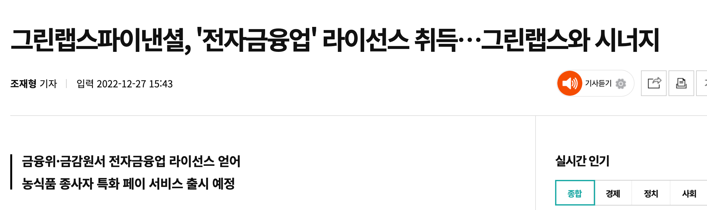

## 개요

2022년의 마지막 날인 2022년 12월 31일에 쓰는 회고록.  

&nbsp;

## 2월

### 커리어 전환

2022년 2월은 저에게 큰 터닝 포인트였습니다.

8년간 다닌 첫 직장을 퇴사하고 OTT 기업인 왓챠의 클라우드 엔지니어로 이직하게 되었습니다.

주변에서는 제 얘기를 들으면, 짤릴 위험 없는 공기업에서 왜 퇴사했냐라는 질문을 많이 하곤 합니다.

제가 공공기관을 떠나게 된 이유를 정리하자면 다음과 같습니다.

- 일하는 사람만 일하는 문화
- 성과를 낸다고 해서 그만큼 인정받거나 대가가 없음
- SI 특성상 수동적인 업무 진행방식
- 레거시로 가득한 인프라 스트럭쳐
- 내가 원하는 기술 스택과 너무 동떨어진 현실

왓챠로 이직하는 일이 단순히 회사만 옮긴 것은 아니고, 엔지니어 커리어 자체의 큰 터닝 포인트였습니다.  
시스템 엔지니어 포지션에서 온프레미스 레거시를 하다가 클라우드 엔지니어로 전환한 것도 큰데, 업무 도메인까지 공공에서 OTT로 전환했기 때문입니다.

그렇게 2022년 2월은 새로운 업무 환경과 문화에 정착하고 적응하느라 에너지를 많이 쓴 것 같아요.

왓챠에서 프로덕션 레벨의 AWS 인프라와 스크럼을 처음 경험했고, 테라폼을 프로덕션한 환경에서 처음 써봤으니까요.

&nbsp;

## 3월

3월 16일. 신속항원검사 결과, 코로나 확진 판정을 받았습니다.

그 주 월요일부터 금요일까지 열과 몸살 기운 때문에 아파서 죽는 줄 알았습니다.  
"모더나 백신을 3차까지 맞은 내가 이정도로 아픈데 도대체 비접종자는 얼마나 더 아플까?"라는 의문이 들었습니다.

고열과 몸살 증상은 5일만에 나았는데 잔기침은 두 달 동안 계속 달고 살았습니다.

&nbsp;

## 8월

### 희망퇴직

왓챠를 약 6개월 정도 다니고 희망퇴직 했습니다.  
이유는 제 개인적인 의사결정 보다는 투자유치, 경영과 관련된 외부 요인이었어요.

🗞️ [왓챠, 사업구조 전면 개편…희망퇴직 받는다](https://zdnet.co.kr/view/?no=20220727092619)  
🗞️ [인력 줄이고 몸값 낮추고 상장 연기…스타트업 혹한기 ‘버티기’](https://www.hani.co.kr/arti/economy/it/1067832.html)

위 기사에서 보는 것처럼 VC 업계의 투자 상황이 악화되었고, 대다수 스타트업들이 손익분기점(BEP)을 달성하기 위해 온갖 방법을 동원해서 버티기에 들어가는 시기였습니다.

제가 회사를 옮긴 왓챠의 경우도 예외는 없었으며 바짝 허리띠를 졸라맸습니다.  

어느날 타운홀 미팅이 열렸는데 CEO 분이 희망퇴직을 받겠다고 공지를 했습니다.

이 얘기를 듣고 저는 충격에 먹었습니다. 크게 한 방 먹은 기분이었어요.  
핵심 문화로 오버 커뮤니케이션을 외치며 하루종일 메세지가 올라오던 수 백개의 슬랙 채널이 그 날 부로 모두 멈췄습니다.  
모든 회사용 깃허브 저장소에 코드 커밋도 멈췄습니다.  

발표 한 번으로 모든 직원은 사기를 잃었고 회사는 길 한가운데 엔진이 퍼진 차처럼 제자리에 멈췄습니다.

인수합병 후 구조조정되는 상황을 가정합니다. 경영진이 모두 새롭게 교체될텐데 과연 왓챠 직원 리스트에서 제가 체리픽 되어 생존할 수 있을까라는 의문이 들었습니다.

결국 저는 여러가지 이유로 희망퇴직을 결정했습니다. 저말고도 수많은 인원이 이 시기에 함께 퇴사했습니다.

&nbsp;

왓챠를 나오면서 느낀 점들을 정리하면 다음과 같습니다.

- 스타트업은 언제나 불확실성을 가지고 있는 조직입니다. 이 불확실성은 시리즈 C, D, Pre IPO 단계에 상관없이 항상 존재합니다.
- 회사의 문화는 슬로건이 적힌 이쁜 포스터를 만들어서 벽에 붙인다고 해서 형성되는 건 아닙니다. 형식적인 것보다 중요한 건 경영진을 포함한 모든 구성원 행동으로 실천하는 겁니다.
- OTT 시장 전체가 침체되고 있습니다. OTT라는 사업 자체의 사업모델이 지속 가능할까라는 의문이 들었습니다. 제게 OTT, 미디어 도메인은 이제 관심 밖 영역으로 영원히 남아있을 겁니다.

공공기관에 그대로 남아 있었더라면 이렇게 의도하지 않게 회사를 나와야하는 경우는 발생하지 않았을 겁니다. 하지만 제 결정을 후회하지는 않습니다. 이 과정에서 또 배우고 느낀 점들이 있고 그것도 성장의 경험치니까요.

왓챠에서 보낸 짧은 6개월이라는 시간은 클라우드 엔지니어로서 앞으로 어떤 식으로 더 준비해야겠다는 이정표 역할을 해준 것 같습니다.

왓챠에서의 6개월은 짧은 시간이었으나 그래도 많이 성장했습니다.  
확실한 건 저와 같은 팀에서 일한 시니어 클라우드 엔지니어 두 분은 의심의 여지 없이 훌륭한 분들입니다.  
그것만으로도 왓챠에서 보낸 시간은 만족스럽습니다.  
다만 외부 요인으로 인해 제가 왓챠를 나올 수 밖에 없었던 상황이 아쉽습니다.

&nbsp;

### 백수 생활

왓챠를 나온 후 약 한 달동안 다른 직장을 알아보러 다녔습니다.  
면접 보고 남는 시간에는 AWS와 쿠버네티스 공부를 했습니다.

여러 스타트업 회사를 다니며 면접을 봤는데 "좋은 회사도 많지만 그만큼 이상한 회사도 많구나"라는게 결론입니다.  
가장 충격적인 두 가지 사례를 꼽자면 다음과 같습니다. 제가 여러 군데 면접 보면서 직접 경험한 사례입니다.

- AWS 클라우드 권한 관리, IAM Role 분리 조차 되지 않은 회사
- 면접 질문 자체가 무례한 회사. _면접자의 나이는 도대체 왜 궁금한 걸까요?_

위와 같은 케이스들이 기억에 남네요.

지금까지 일을 쉬어본 기간은 없었는데 거의 일을 안한 기간이 2주가 넘어가니 손이 간질간질했습니다.

&nbsp;

### 제안이 오다

쿠버네티스 공부, 클라우드 공부를 꾸준히 하면서 힘든 한 달을 보내던 중 원티드를 통해 어느 리크루터 분에게 연락이 왔습니다.  
에그테그 계에 유명한 그린랩스의 자회사인 그린랩스 파이낸셜이었어요.

현재 저는 그린랩스 파이낸셜을 만족하며 행복하게 일하면서 다니고 있지만 제안이 왔던 그 시기(아마 8월 말로 기억합니다)에는 초기 제안을 망설일 정도로 많은 고민을 했습니다.
핀테크 도메인 경험도 없었고, 아직 AWS 경력이 6개월밖에 되지 않았으니까요.

그래서 리크루터 분에게 정중하게 다시 말씀드렸습니다.

> 제가 핀테크 도메인 경험도 없고, AWS 경력이 6개월 뿐인데 초기 인프라 셋업은 제게 벅찬 과제일 수도 있다.  
> 의사결정권자 분에게 제 상황을 전달해주고, 그 분의 의견을 다시 알려달라.

며칠이 지난 후 리크루터 분의 연락을 받았고 관계자 분들은 오히려 제 경험을 좋게 봐주셔서 합류를 원하고 계셨습니다.  
그 답변을 듣고 안심이 된 저는 그렇게 연봉계약서에 서명을 하고 그린랩스파이낸셜 합류를 결정했습니다.

전체 채용 프로세스를 완료하고 출근하는 데 걸린 시간은 2주였던 것 같습니다.

&nbsp;

## 9월

### CKA

쿠버네티스와 클라우드는 제게 큰 의미를 갖는데요.
공공기관에서 스타트업으로 이직하게 된 계기 중 하나가 기술 스택인데 그 중에서도 특히 K8s와 AWS가 큰 비중을 차지합니다.

그래서 제대로 각잡고 배워볼려고 왓챠를 퇴사한 8월 말부터 CKA 공부를 시작했어요.

제 합격 수기는 [CKA 합격 후기와 가이드](/blog/k8s/cka-pass-guide/)에 모두 적어놓았어요.

9월 12일에 리모트로 CKA 시험을 응시하고 13일 드디어 CKA를 취득했습니다.  

매년마다 최소 1개의 자격증은 취득하는 걸 목표로 하고 있는데 다행히도 CKA 덕분에 그 목표를 이뤄냈네요.

&nbsp;

### 그린랩스 파이낸셜

그린랩스파이낸셜로 취업했습니다.  
이전에 왓챠를 나와서 쉬고 있는 상태였기 때문에 이직은 아니고 필드로의 복귀가 맞겠네요.

&nbsp;

### 초기 셋업 시작

처음 신사 위워크로 출근한 날이 아직도 생생합니다.  
저는 9월 5일 입사 후 바로 다음날인 9월 6일부터 업무를 시작했습니다.

AWS 콘솔을 접속해서 확인해보니 리소스가 아무것도 없었습니다.  
VPC와 Subnet 같은 네트워크 리소스만 기존 협업자 분들이 테라폼으로 생성해놓은 상태였습니다.  
이제 제가 개발에 필요한 내부툴 서버와 실제 서비스용 인프라를 구축해서 올리면 되는 상황이었습니다.

합류를 하기 전에 힘든 초기셋업을 해야하는 상황을 미리 알고 있었습니다. 그래서 크게 당황하지는 않았습니다.  
차분하게 제가 알고 있는 지식들을 동원해서 AWS 초기 셋업을 시작했습니다.

마치 빈 공터에 집을 짓는 것처럼 처음부터 시작했습니다.  
Github Enterprise 서버를 만들고, Direct Connect 전용선을 연결하고, 컨테이너 이미지를 만들고, ECS 배포를 하는 등 많은 작업이 오고 갔어요.  
제 다음으로 들어올 데브옵스 엔지니어와 개발자들이 좀 더 상황을 쉽게 이해할 수 있도록 인프라 관련 지식들도 노션에 차곡차곡 쌓았습니다.

제가 합류 후 해결할 가장 최우선 과제는 전자금융업 라이센스 취득이었습니다.  
심사를 통과하기 위해 금융 컴플라이언스를 지키면서 인프라를 구축하는 시간이 힘들었지만 그만큼 성장한 것 같네요.

&nbsp;

### 핀테크 도메인을 찍먹한 소감

핀테크 도메인은 보안과 규제가 빡세서 OTT 도메인의 스타트업보다 개발환경이 훨씬 불편합니다.  
이해합니다. 수많은 사람의 돈이 암호화된 패킷 형태로 저희가 만든 핀테크 시스템 상에서 오고갑니다. 이런 중요도 높은 시스템을 운영하는 기업이 보안이 빡세야 하는 건 당연하죠.

&nbsp;

제가 약 4개월간 핀테크 영역에서 일해본 소감을 요약합니다.

- 핀테크 기업에 요구되는 컴플라이언스와 보안이 빡셉니다.
- 그만큼 개발환경도 빡셉니다.
- 그럼에도 불구하고 금융 도메인만이 가진 안정성과 대중성 그리고 계속 성장하는 핀테크 시장의 파이는 매력적인 부분입니다.

그래서 앞으로도 핀테크 도메인을 유지할 거냐고 물어보시면 저는 망설임 없이 _Yes_ 입니다.

&nbsp;

### 주짓수

초기 스타트업의 특성상 개인당 업무 범위가 넓을 수 밖에 없는데요, 제 스스로가 번아웃이 올 것 같은 징후가 보여서 컨디션 관리를 시작했습니다.

여러가지 컨디션 관리 방법 중에서 컨디셔닝도 되고 자기 방어도 할 수 있는 장점을 가진 주짓수를 하기로 결정했습니다.  
9월 1일부터 지금까지 일주일에 세 번씩 꾸준히 나가고 있습니다.

이제 화이트 2그랄 승급한 주린이지만 컨디션 관리 효과를 톡톡히 보고 있어서 앞으로도 꾸준히 주짓수를 수련할 생각입니다.

&nbsp;

## 12월

### 전자금융업 라이센스 취득

금감원 심사를 받은 후, 2022년 12월 26일 드디어 전자금융업 라이센스를 받았습니다.

이제 그린랩스파이낸셜이 공식적으로 선불전자지급수단 발행 및 관리업, 전자지급결제대행업 등의 취급업무를 할 수 있다는 걸 의미합니다.  
금융법상으로 당근페이나 네이버파이낸셜 같은 기업이 페이 관련 서비스를 하려면 전자금융업 라이센스가 반드시 있어야만 합니다.

이 전자금융업(줄여서 전금업) 라이센스가 없으면 사업을 할 수도 없으니 회사에게 큰 의미를 가집니다.  
물론 이 목표를 달성하기 위해 클라우드 인프라를 구축하고 협업하는 과정에서 저도 DevOps 엔지니어로서 많은 성장을 한 것 같습니다.

2022년의 마지막 날인 12월 31일 오늘.  
그린랩스 파이낸셜에서 보낸 3개월을 돌이켜보면 고통 없는 성장은 없는 것 같습니다. 힘들게 보낸 시간만큼 저는 많이 성장했습니다.

&nbsp;

> 실력은 고통의 총합이다.

요즘 제가 꽂힌 문장입니다. 의미를 생각해보면 볼수록 간결하면서도 함축된 의미를 가진 문장인 것 같아요.

위 문장은 나는 프로그래머다의 저자 임백준님이 쓰신 개발자의 평생공부라는 [칼럼](https://zdnet.co.kr/view/?no=20170616090644)의 부제이기도 한데요, 힘든 시기가 되면 저 문장이 가진 의미에 대해 고민해봅니다.  
그러면 어느새 제가 며칠간 머리 싸매고 고민하던 문제가 거부감 없이 받아들여지고 부정적인 마인드도 긍정적으로 바뀌는 매직을 경험하게 됩니다.  

비슷한 느낌의 문장으로 _기록은 기억을 이긴다_ 가 떠오르네요.

&nbsp;

### 갑상선저하증 판정

**2022년 11월 29일 (화)** 오전 8:00  
경희의료원에서 종합 건강검진을 받았습니다.  
갑상선자극호르몬수치(TSH)가 정상치의 2배인 **9.66**이 나왔습니다.  
보통 갑상선자극호르몬수치(TSH)가 10 이상부터 갑상선 호르몬 약을 복용하면서 치료를 시작한다고 합니다.

건강검진 결과서에는 내분비내과에 방문해서 정밀 검진이 필요하다고 적혀있었습니다.  
이렇게 정밀 검진을 받아보라고 소견서에 적혀있는 경우는 처음이었습니다.

&nbsp;

**2022년 12월 21일 (수)** 오전 10:00  
좀 더 제 몸 상태를 알아봐야 할 것 같아서 12월 초에 건강검진을 받았던 경희의료원에 다시 방문했습니다.  

의사 선생님의 진료가 시작되었습니다.  

갑상선은 몸에 신진대사를 담당하고 있는 기관인데, 제 기능을 못할 경우 보일러가 고장난 거라고 이해하면 쉽다고 합니다.  
의사 선생님은 혈액검사 결과가 나와봐야 알겠지만 제가 갑상선저하증일 확률이 높다고 얘기했습니다.
만약 피 검사 결과에서 갑상선 자가항체 검사가 양성이 나오면 갑상선 호르몬을 정상치로 맞추기 위해 약을 복용해야 한다고 했습니다.  

진료가 끝난 후에는 채혈실로 가서 피 검사를 했습니다.

약간의 걱정을 안고 집으로 돌아갔습니다. 검사 결과를 빨리 받아보고 싶다는 생각 뿐이었습니다.

&nbsp;

**2022년 12월 30일 (금)** 오전 8:44  
간만에 지옥철을 타고 회기역에 위치한 경희의료원에 다시 방문했습니다.  

피 검사 결과가 나왔습니다.

검사 결과 의사 선생님 예상대로 갑상선 자가항체가 양성이 나왔습니다. 갑상선 기능 저하증 판정을 받은 것입니다.

의사 선생님 말로는 병의 원인으로는 스트레스 보단 대신 유전적인 요인과 생활환경 요인이 큰 영향을 준다고 합니다.  
제 경우는 아마도 아버지쪽 가족력 때문인 것 같습니다.

12월 30일 이후로 약국에서 신지록신이라고 하는 갑상선호르몬약을 처방 받아서 매일 복용하고 있습니다.

약사분이 친절하게도 김, 미역, 멀티 비타민을 꼭 챙겨먹으라는 안내까지 해주시면서 이 일은 마무리 되었습니다.  
내년 3월에 제 갑상선자극호르몬 수치를 다시 중간점검하러 병원을 가야합니다. 앞으로 매년 두 번 주기로 체크하러 가야 한다고 하네요.

&nbsp;

## 마치며

올해는 정말 다사다난한 이벤트가 많은 한 해였습니다.  
겨울 날씨도 역대급으로 추워서 기억에 오래 남을 것 같은 2022년입니다.
_미국 몬태나주 엘크파크는 최저기온이 섭씨 영하 45도를 찍었다고 하네요._

2022년 전체를 놓고 보면 올 한 해는 스타트업의 냉혹한 현실을 알게되었고, 건강에 대한 중요성을 뒤늦게 실감한 시간이었습니다.  
경험치 2배 이벤트를 받은 것처럼 짧은 시간 안에 많이 성장한 시간인 것 같아요.

다행히 매년 최소 1개 자격증은 반드시 취득한다는 저만의 목표를 올해도 달성했습니다.  
내년에는 쿠버네티스 자격증 보다는 클라우드나 테라폼 관련 자격증을 다시 취득해보려고 합니다.  
기초 지식을 배우기에는 자격증 만큼 좋은 방법은 없는 것 같아요. 그 기술을 만든 사람이 짜놓은 커리큘럼이기 때문에 검증도 이미 되어 있구요.

이 글을 읽고 계신 여러분들도 올 한 해를 잘 마무리하시길 바라겠습니다.  
건강관리 소홀히 하지 마시고 꼭 건강 잘 챙기시구요.  
2023년에 이 블로그에서 다시 만나요. 감사합니다.
