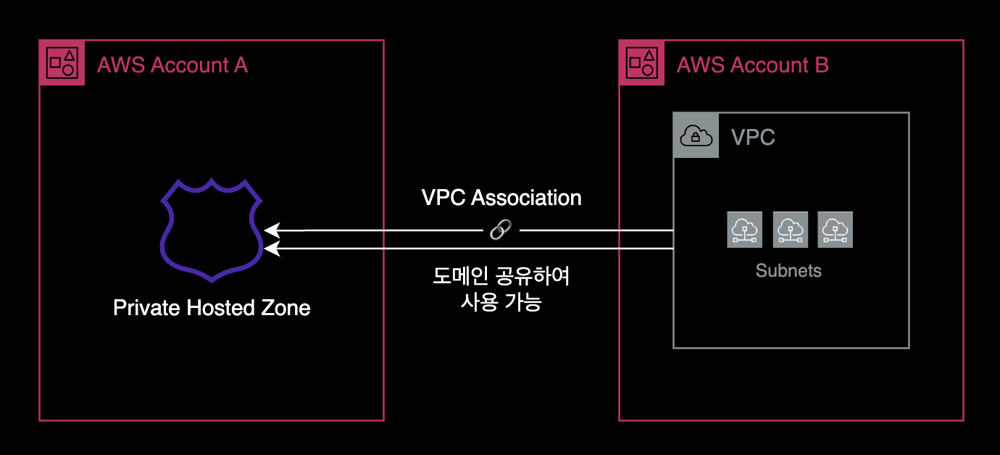
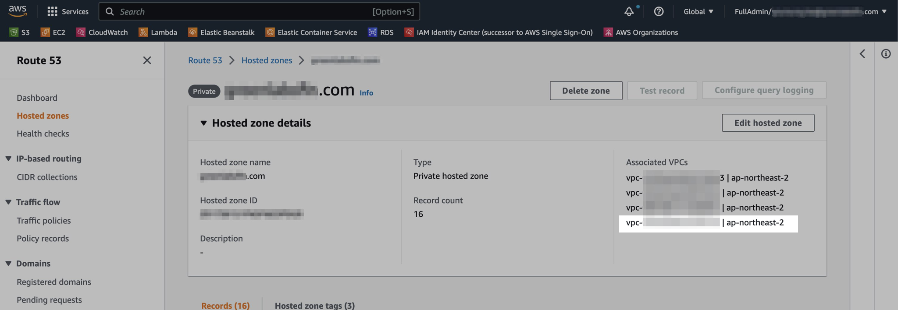

## 개요

Route 53의 Private Hosted Zone에 다른 계정 VPC를 연결하는 방법을 설명합니다.



Route 53의 [VPC Association](https://docs.aws.amazon.com/ko_kr/Route53/latest/DeveloperGuide/hosted-zone-private-associate-vpcs-different-accounts.html) 기능을 사용하면 여러 AWS VPC에 걸쳐 같은 Private 도메인을 통합 관리할 수 있습니다.

&nbsp;

## 배경지식

### 설정 방식

VPC Association 구성은 AWS Management Console을 아직 지원하지 않기 때문에 AWS CLI 또는 AWS SDK를 통해서만 작업 진행이 가능합니다.

&nbsp;

## 준비사항

### AWS CLI

로컬 환경에 AWS CLI가 설치되어 있어야 합니다.

```bash
$ aws --version
aws-cli/2.9.8 Python/3.11.0 Darwin/22.2.0 source/arm64 prompt/off
```

macOS 패키지 관리자인 [brew](https://brew.sh)를 사용하는 경우, `brew install awscli`로 쉽게 설치가 가능합니다.

&nbsp;

## VPC Association 설정방법

이 가이드는 AWS CLI를 사용하는 방식으로 설명합니다.

&nbsp;

### 1. 환경변수 설정

먼저, Route 53의 Private Hosted Zone ID와 VPC ID를 환경변수로 설정하세요. 이 값들은 나중에 AWS CLI 명령어 실행 시 사용됩니다.

```bash
PRIVATE_HOSTED_ZONE_ID=<여기에 Private Hosted Zone ID 입력>
VPC_ID=<여기에 VPC ID 입력>
```

설정한 환경변수를 확인하려면 다음 명령어를 실행하세요.

```bash
echo $PRIVATE_HOSTED_ZONE_ID $VPC_ID
```

이 과정을 통해 AWS CLI를 사용하여 Hosted Zone에 VPC를 연결할 준비를 합니다.

&nbsp;

### 2. 다른 계정의 VPC 연결 허용

설정한 환경변수를 사용하여 Private Hosted Zone을 보유한 AWS 계정에서 다음 AWS CLI 명령어를 실행합니다. 이 예에서는 Account A에서 실행됩니다.

```bash
# Run in Account A owns the private hosted zone
aws route53 create-vpc-association-authorization \
  --hosted-zone-id ${PRIVATE_HOSTED_ZONE_ID} \
  --vpc VPCRegion=ap-northeast-2,VPCId=${VPC_ID} \
  --region ap-northeast-2
```

이 명령어는 Private Hosted Zone에 VPC를 연결하는 권한을 요청합니다. 이 과정은 한 AWS 계정의 VPC를 다른 계정의 Private Hosted Zone에 연결할 때 필요합니다.

&nbsp;

### 3. VPC 연결

연결할 VPC가 위치한 AWS 계정 (Account B에 해당)에서 아래의 AWS CLI 명령어를 실행합니다.

```bash
# Run in Account B owns the VPC
aws route53 associate-vpc-with-hosted-zone \
  --hosted-zone-id ${PRIVATE_HOSTED_ZONE_ID} \
  --vpc VPCRegion=ap-northeast-2,VPCId=${VPC_ID} \
  --region ap-northeast-2
```

이 명령어는 지정된 Private Hosted Zone과 VPC를 연결합니다.

&nbsp;

### 4. 결과 확인

Private Hosted Zone에 연결된 VPC ID를 조회하기 위해 AWS CLI에서 [get-hosted-zone](https://docs.aws.amazon.com/cli/latest/reference/route53/get-hosted-zone.html) 명령어를 실행하세요. 이 작업은 Private Hosted Zone을 소유한 계정(Account A)에서 수행됩니다.

```bash
# Run in Account A owns the private hosted zone
aws route53 get-hosted-zone \
  --id ${PRIVATE_HOSTED_ZONE_ID} \
  --query 'VPCs' \
  --output json
```

&nbsp;

아래는 연결된 VPC ID와 해당 VPC가 위치한 리전을 보여주는 예시 결과입니다.

```json
[
    {
        "VPCRegion": "ap-northeast-2",
        "VPCId": "vpc-<REDACTED>"
    },
    {
        "VPCRegion": "ap-northeast-2",
        "VPCId": "vpc-<REDACTED>"
    },
    {
        "VPCRegion": "ap-northeast-2",
        "VPCId": "vpc-<REDACTED>"
    }
]
```

위 결과에서 VPC ID가 나타나면, Private Hosted Zone과 VPC의 연결이 성공적으로 완료된 것입니다.

&nbsp;

#### AWS Management Console

모든 설정을 완료한 후, AWS 콘솔에서 Route 53으로 이동합니다. 좌측의 'Hosted zones' 메뉴를 선택한 다음, 관련 Private Hosted Zone을 클릭합니다. 이후 "Associated VPCs" 섹션에서 새로 연결된 VPC가 추가된 것을 확인할 수 있습니다.



이 이미지는 새로 연결된 VPC가 성공적으로 등록된 것을 보여줍니다.

&nbsp;

## 참고자료

**AWS 공식문서**  
[더 많은 VPC를 프라이빗 호스팅 영역에 연결](https://docs.aws.amazon.com/ko_kr/Route53/latest/DeveloperGuide/hosted-zone-private-associate-vpcs.html)  
[Amazon VPC와 다른 AWS 계정에서 생성한 프라이빗 호스팅 영역의 연결](https://docs.aws.amazon.com/ko_kr/Route53/latest/DeveloperGuide/hosted-zone-private-associate-vpcs-different-accounts.html)

**Brunch**  
[Route53 프라이빗 영역, 다른 VPC연결](https://brunch.co.kr/@topasvga/1589)
