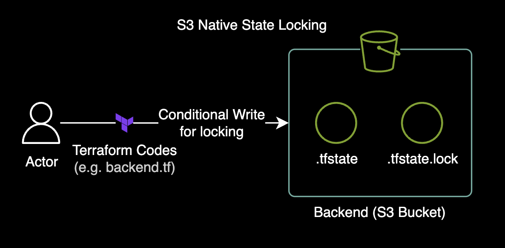
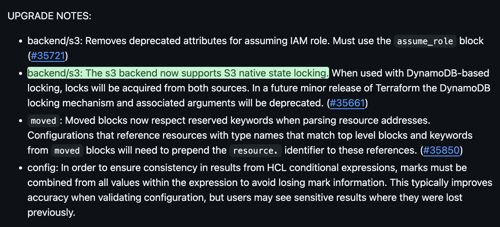

## 개요

[Terraform 1.10.0 버전](https://github.com/hashicorp/terraform/releases/tag/v1.10.0)부터는 백엔드 저장소로 DynamoDB 없이 S3 버킷만 사용해서 리소스 상태 파일 `.tfstate`의 Lock을 관리할 수 있습니다.



이 기능이 출시되기 전에는 상태파일의 잠금 설정을 위해 DynamoDB 테이블을 구성하고 접근해야 했지만 이제는 완전히 불필요해졌습니다. DynamoDB가 완전히 삭제되므로 인프라 운영 오버헤드를 많이 줄일 수 있고 더 직관적입니다.



기존에 DynamoDB에서 Lock 파일을 관리하던 테라폼 코드를 S3에서 Lock 파일을 관리하도록 구성을 변경하는 방법을 알아봅니다.

&nbsp;

## 환경

- tfenv를 사용해서 Terraform CLI를 사용하는 구성
- Terraform v1.10.4 버전
- macOS 15.2, ARM64 (M1 Max)

&nbsp;

## 주의사항

### terraform 버전 제약조건

S3 Native State Locking 기능은 **Terraform v1.10.0 버전부터** 사용할 수 있습니다. 이전 버전의 Terraform CLI를 사용하는 경우 S3 Native State Locking 기능을 사용할 수 없으므로 주의해야 합니다.

&nbsp;

## 설정 방법

`tfenv` 명령어가 설치되어 있지 않은 경우 패키지 관리자인 `brew`를 사용해서 설치합니다.

```bash
which tfenv || brew install tfenv
```

&nbsp;

`tfenv`에서 현재 사용중인 Terraform 버전을 조회합니다.

```bash
tfenv list
```

```bash
* 1.6.0 (set by /Users/younsung.lee/.terraform-version)
  1.3.2
```

&nbsp;

`tfenv`를 사용해서 다운로드 가능한 `terraform` 버전 전체 목록을 조회할 수 있습니다.

```bash
tfenv list-remote
```

&nbsp;

Terraform v1.10.4를 다운로드 받고 로컬 환경에 세팅합니다.

```bash
tfenv install 1.10.4
tfenv use 1.10.4
```

```bash
No installed versions of terraform matched '1.10.4:^1.10.4$'. Trying to install a matching version since TFENV_AUTO_INSTALL=true
Installing Terraform v1.10.4
Downloading release tarball from https://releases.hashicorp.com/terraform/1.10.4/terraform_1.10.4_darwin_arm64.zip
######################################################################################################################## 100.0%
Downloading SHA hash file from https://releases.hashicorp.com/terraform/1.10.4/terraform_1.10.4_SHA256SUMS
Not instructed to use Local PGP (/opt/homebrew/Cellar/tfenv/3.0.0/use-{gpgv,gnupg}) & No keybase install found, skipping OpenPGP signature verification
Archive:  /var/folders/6c/wglxkxkd5vqgn319s185kwjr0000gn/T/tfenv_download.XXXXXX.rcPvvZaFbA/terraform_1.10.4_darwin_arm64.zip
  inflating: /opt/homebrew/Cellar/tfenv/3.0.0/versions/1.10.4/LICENSE.txt
  inflating: /opt/homebrew/Cellar/tfenv/3.0.0/versions/1.10.4/terraform
Installation of terraform v1.10.4 successful. To make this your default version, run 'tfenv use 1.10.4'
Switching default version to v1.10.4
Default version file overridden by /Users/younsung.lee/.terraform-version, changing the default version has no effect
Default version (when not overridden by .terraform-version or TFENV_TERRAFORM_VERSION) is now: 1.10.4
```

&nbsp;

`terraform version` 명령어를 통해 현재 사용중인 Terraform 버전을 조회합니다.

```bash
terraform version
```

```bash {hl_lines="1"}
Terraform v1.10.4
on darwin_arm64
+ provider registry.terraform.io/hashicorp/aws v5.84.0
+ provider registry.terraform.io/hashicorp/cloudinit v2.3.5
+ provider registry.terraform.io/hashicorp/kubernetes v2.35.1
+ provider registry.terraform.io/hashicorp/null v3.2.3
+ provider registry.terraform.io/hashicorp/time v0.12.1
+ provider registry.terraform.io/hashicorp/tls v4.0.6
```

`v1.10.4` 버전을 사용하고 있는 것을 확인할 수 있습니다.

&nbsp;

`backend.tf` 파일에서 `dynamodb_table` 설정을 삭제하고 이를 대체하기 위해 backend 설정에 [use_lockfile](https://developer.hashicorp.com/terraform/language/backend/s3#credentials-and-shared-configuration) 값을 추가합니다. `use_lockfile`의 기본값은 `false`이므로 명시적으로 `true`로 설정해야 합니다.

> **주의사항**: `use_lockfile` 옵션은 2025년 1월 22일 기준으로 실험 단계(Experimental)이므로 추후 큰 변경사항이 있을 수 있습니다.

```hcl {hl_lines="11"}
# backend.tf
terraform {
  backend "s3" {
    encrypt = true
    region  = "ap-northeast-2"
    acl     = "bucket-owner-full-control"
    bucket  = "<REDACTED-BUCKET-NAME>"
    key     = "dev/ap-northeast-2/eks/<REDACTED-CLUSTER-NAME>/terraform.tfstate"

    # S3 state lock feature is only available in Terraform CLI version 1.10.0 and above.
    use_lockfile = true
  }
}
```

테라폼의 `use_lockfile`을 사용하기 위해 S3 버킷에 객체 잠금(Object Lock) 기능을 활성화할 필요는 없습니다. 이 새로운 기능은 상태 파일과 같은 이름을 사용하여 만든 파일(예: `terraform.tfstate.tflock`)에 의존하여 해당 테라폼 리소스가 잠겨 있는지 확인합니다. 따라서 Amazon S3의 최근 도입된 [조건부 쓰기 기능(Conditional Writes)](https://aws.amazon.com/ko/about-aws/whats-new/2024/08/amazon-s3-conditional-writes/)을 사용하여 잠금 메커니즘을 구현합니다.

&nbsp;

`backend` 설정이 변경되었기 때문에 재설정 옵션인 `-reconfigure` 옵션을 추가하여 초기화합니다.

```bash
terraform init -reconfigure
terraform plan
```

&nbsp;

`terraform apply`를 실행해 인프라를 반영해봅니다.

```bash
terraform apply
```

&nbsp;

```bash
Plan: 0 to add, 3 to change, 0 to destroy.

Do you want to perform these actions?
  Terraform will perform the actions described above.
  Only 'yes' will be accepted to approve.

  Enter a value:
```

&nbsp;

`Enter a value:` 메세지가 출력되고 작업이 진행되기 전에 해당 리소스의 backend 경로의 상태 파일을 조회해봅니다.

```bash
aws s3 ls s3://<REDACTED-BUCKET-NAME>/dev/ap-northeast-2/eks/<REDACTED-CLUSTER-NAME>/
```

&nbsp;

```bash {hl_lines="3"}
2024-10-22 12:06:19          0
2025-01-13 17:49:35     364547 terraform.tfstate
2025-01-22 15:39:27        258 terraform.tfstate.tflock
```

S3 내부에 `terraform.tfstate.tflock` 파일이 새로 생성된 걸 확인할 수 있습니다.

&nbsp;

작업이 완료된 이후에는 상태파일의 잠금(Lock)이 해제되고 Lock 파일이 버킷 내부에서 자동으로 삭제됩니다.

```bash
aws s3 ls s3://<REDACTED-BUCKET-NAME>/dev/ap-northeast-2/eks/<REDACTED-CLUSTER-NAME>/
```

```bash
2024-10-22 12:06:19          0
2025-01-22 15:46:04     364882 terraform.tfstate
```

`terraform.tfstate.tflock` 파일이 버킷 내부에서 자동으로 삭제된 것을 확인할 수 있습니다.

&nbsp;

## 관련자료

**Terraform**:

- [Terraform state with native s3 locking](https://dev.to/drewmullen/terraform-state-with-native-s3-locking-1fck)
- [Terraform 1.10.0 Release Note](https://github.com/hashicorp/terraform/releases/tag/v1.10.0)
- [Introduce S3-native state locking #35661](https://github.com/hashicorp/terraform/pull/35661)

**AWS**:

- [Amazon S3 조건부 쓰기(Conditional Writes) 기능](https://aws.amazon.com/ko/about-aws/whats-new/2024/08/amazon-s3-conditional-writes/)
