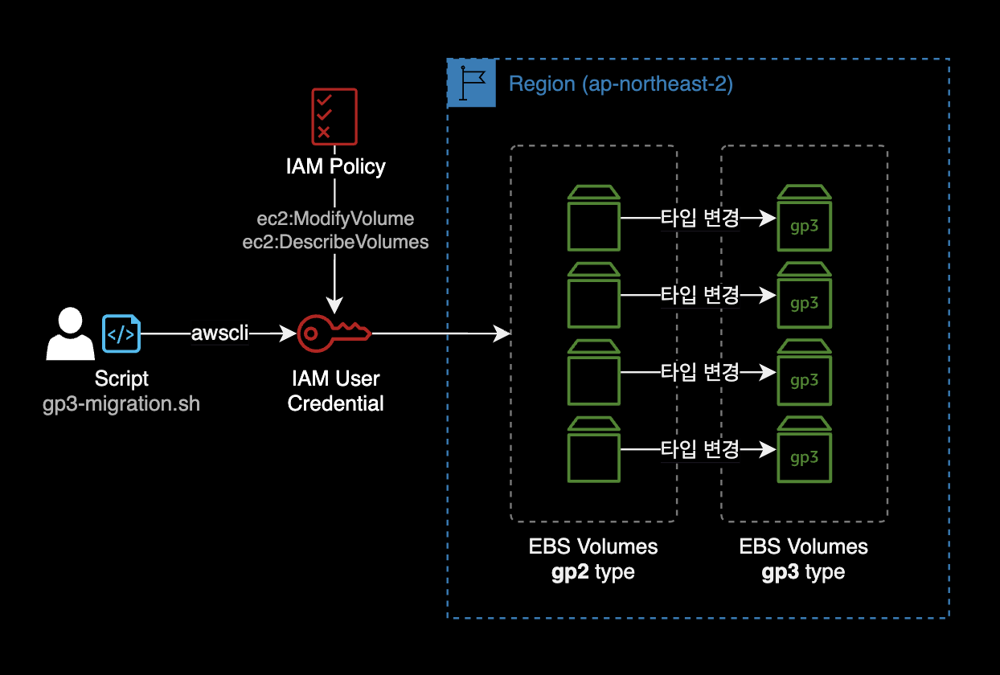
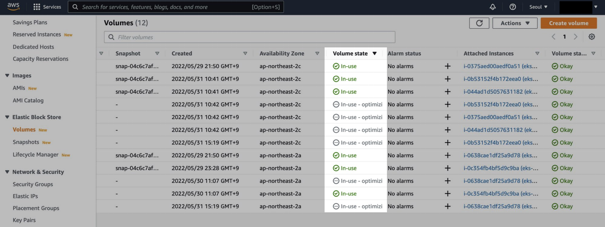

## 개요

자동화 스크립트를 이용해서 지정한 리전의 모든 gp2 타입의 EBS 볼륨을 gp3로 전환하는 방법을 소개합니다.

AWS Management Console에서도 수작업으로 가능하지만 이 글에서는 AWS <abbr title="Command Line Interface">CLI</abbr>를 활용한 쉘 스크립트로 변경 작업을 진행합니다.

만약 gp3 타입으로 변경해야할 <abbr title="Elastic Block Storage">EBS</abbr> 볼륨이 200개일 경우, DevOps Engineer가 AWS Management Console로 하나씩 작업해야 한다면 생지옥이 없을 겁니다.

이를 해결하기 위해 쉘스크립트를 작성해서 자동화했습니다.

&nbsp;

## 배경지식

### 스크립트

#### 동작방식

스크립트를 실행하게 되면 지정한 AWS 리전에 위치한 gp2 타입의 EBS 볼륨이 gp3로 변경 시작됩니다.



&nbsp;

#### 주의사항

EBS 볼륨 타입 변경 과정은 기본적으로 무중단으로 진행되기 때문에 실제 프로덕션 환경에서 실행하더라도 서비스에는 영향을 주지 않고 안전하게 완료됩니다.

- 상황에 따라 EBS 볼륨 타입 변경이 최대 24시간 소요될 수 있습니다.

- EBS 볼륨의 Disk I/O가 낮고, 할당된 총 용량보다 실제 사용중인 용량이 작을 수록 타입 변경이 더 빨리 끝납니다.

- [EBS 볼륨 변경 시 제한사항](https://docs.aws.amazon.com/ko_kr/AWSEC2/latest/UserGuide/modify-volume-requirements.html#elastic-volumes-limitations)이 있습니다. 한 번 타입이나 사이즈를 변경한 EBS 볼륨은 6시간이 지난 후에 다시 변경 가능합니다.

  

- 타입 변경이 진행 중인 EBS 볼륨의 상태는 콘솔에서 확인할 때 `In-use - optimizing (n%)`으로 표시됩니다.

&nbsp;

#### EKS 환경의 Persistent Volume

Amazon EKS<sup>Elastic Kubernetes Service</sup> 워커노드에서 gp3, io2 타입의 EBS 볼륨을 사용하려면 [EBS CSI Driver](https://docs.aws.amazon.com/ko_kr/eks/latest/userguide/ebs-csi.html) 설치가 필요합니다.

```bash
# -- EKS 클러스터에서 EBS CSI Driver 설치 확인
$ kubectl get sc gp3
```

```bash
NAME            PROVISIONER       RECLAIMPOLICY   VOLUMEBINDINGMODE      ALLOWVOLUMEEXPANSION   AGE
gp3 (default)   ebs.csi.aws.com   Delete          WaitForFirstConsumer   false                  55d
```

더 자세한 설명은 AWS Korea 블로그의 [Migrating Amazon EKS clusters from gp2 to gp3 EBS volumes](https://aws.amazon.com/ko/blogs/containers/migrating-amazon-eks-clusters-from-gp2-to-gp3-ebs-volumes/)를 참고하세요.

&nbsp;

## 준비사항

### jq 설치

`jq`는 커맨드라인 환경에서 JSON 데이터를 조작할 수 있는 명령어입니다.  
`jq`는 리눅스의 `sed`, `awk`, `grep`의 텍스트 제어와 동일한 방식으로 구조화된 JSON 데이터를 슬라이스, 필터링, 매핑 및 변환하는 데 사용합니다.

해당 스크립트 안에서 json 응답을 파싱해서 Volume ID와 Volume 상태를 추출하도록 동작하기 때문에, 스크립트를 실행하는 클라이언트에 `jq` 설치가 필요합니다.

macOS의 경우 패키지 관리자인 [brew](https://brew.sh/ko)를 통해 간단하게 `jq`를 설치할 수 있습니다.

```bash
$ brew install jq
```

&nbsp;

설치 후 `jq` 명령어의 동작을 확인합니다.

```bash
$ jq --version
jq-1.6
```

&nbsp;

### AWS CLI 설정

AWS CLI 설치와 인증이 미리 구성된 상태여야 합니다.

```bash
$ aws --version
aws-cli/2.7.5 Python/3.9.13 Darwin/21.5.0 source/arm64 prompt/off
```

&nbsp;

### IAM 권한

스크립트를 실행하기 전에 자신이 어떤 AWS 권한을 가지고 있는지 확인합니다.

```bash
$ aws sts get-caller-identity
# Check your aws permission before run shellscript.
```

**중요**: 스크립트를 실행하는 주체인 IAM User는 다음 2개의 EBS 볼륨 관련 Permission이 필요합니다.

- `ec2:ModifyVolume` : EBS 볼륨 타입 gp2 → gp3로 변경할 때 필요
- `ec2:DescribeVolumes` : gp2 타입의 EBS 볼륨을 필터링해서 조회할 때 필요

&nbsp;

## 사용법

### 스크립트 작성

스크립트 파일 이름은 `gp3-migration.sh`로 지정하고, 내용은 아래 그대로 복사 붙여넣기 합니다.

<details>
<summary>스크립트 내용 확인</summary>

```bash
#!/bin/bash

#==================================================
# [Last Modified Date]
# 2023-08-01
#
# [Author]
# Younsung Lee (cysl@kakao.com)
#
# [Description]
# Change all gp2 volumes to gp3 in a specific region
# Prerequisite: You have to install `jq` and `awscli`, FIRST.
#==================================================

region='ap-northeast-2'
aws_cmd_path=$(command -v aws)

# Function to check if a command exists
function command_exists() {
    command -v "$1" >/dev/null 2>&1
}

# Function to check if jq is installed, and if not, exit the script
function check_jq_installed() {
    if ! command_exists "jq"; then
        echo "[e] 'jq' command not found. Please install 'jq' before running this script."
        exit 1
    fi
}

# Function to check if AWS CLI is installed, and if not, exit the script
function check_awscli_installed() {
    if ! command_exists "aws"; then
        echo "[e] 'aws' command not found. Please install 'awscli' before running this script."
        exit 1
    fi
}

# Function to find all gp2 volumes within the given region
function find_gp2_volumes() {
    echo "[i] Start finding all gp2 volumes in ${region}"
    volume_ids=$(
        ${aws_cmd_path} ec2 describe-volumes \
        --region "${region}" \
        --filters Name=volume-type,Values=gp2 | \
        jq -r '.Volumes[].VolumeId'
    )

    echo "[i] List up all gp2 volumes in ${region}"
    echo "========================================="
    echo "$volume_ids"
    echo "========================================="
}

# Function to confirm the action before migration
function confirm_migration() {
    while true; do
        read -p "Do you want to proceed with the migration? (y/n): " choice
        case "$choice" in
            [yY])
                echo "[i] Starting volume migration..."
                return 0
                ;;
            [nN])
                echo "[i] Migration canceled by the user."
                exit 0
                ;;
            *)
                echo "[e] Invalid choice. Please enter 'y' or 'n'."
                ;;
        esac
    done
}

# Function to migrate a single gp2 volume to gp3
function migrate_volume_to_gp3() {
    local volume_id="$1"
    result=$(${aws_cmd_path} ec2 modify-volume \
        --region "${region}" \
        --volume-type gp3 \
        --volume-id "${volume_id}" | \
        jq -r '.VolumeModification.ModificationState'
    )

    if [ $? -eq 0 ] && [ "$result" == "modifying" ]; then
        echo "[i] Volume $volume_id changed to state 'modifying' successfully."
    else
        echo "[e] ERROR: Couldn't change volume $volume_id type to gp3!"
        exit 1
    fi
}

# Main function to run the entire process
function main() {
    check_jq_installed
    check_awscli_installed

    find_gp2_volumes
    confirm_migration

    echo "[i] Migrating all gp2 volumes to gp3"
    for volume_id in $volume_ids; do
        migrate_volume_to_gp3 "$volume_id"
    done

    echo "[i] All gp2 volumes have been migrated to gp3 successfully!"
}

# Call the main function to start the script
main
```

</details>

&nbsp;

### 스크립트 실행

스크립트를 실행하기 전에 `region` 환경변수를 자신의 환경에 맞게 수정합니다.

```bash
region='ap-northeast-2'
```

&nbsp;

터미널에서 스크립트를 실행합니다.

```bash
$ sh gp3-migration.sh
```

&nbsp;

## 실행결과

### 터미널

`gp3-migration.sh` 스크립트를 실행하면 터미널에 결과값이 나타납니다.

```bash
$ sh gp3-migration.sh
[i] Start finding all gp2 volumes in ap-northeast-2
[i] List up all gp2 volumes in ap-northeast-2
=========================================
vol-1234567890abcdef0
vol-0987654321abcdef0
vol-abcdefgh123456780
vol-ijklmnop123456780
vol-12345678abcdefgh0
vol-098765abcdef12340
vol-abcdef12345678900
=========================================
Do you want to proceed with the migration? (y/n): y
[i] Starting volume migration...
[i] Migrating all gp2 volumes to gp3
[i] Volume vol-1234567890abcdef0 changed to state 'modifying' successfully.
[i] Volume vol-0987654321abcdef0 changed to state 'modifying' successfully.
[i] Volume vol-abcdefgh123456780 changed to state 'modifying' successfully.
[i] Volume vol-ijklmnop123456780 changed to state 'modifying' successfully.
[i] Volume vol-12345678abcdefgh0 changed to state 'modifying' successfully.
[i] Volume vol-098765abcdef12340 changed to state 'modifying' successfully.
[i] Volume vol-abcdef12345678900 changed to state 'modifying' successfully.
[i] All gp2 volumes have been migrated to gp3 successfully!
```

이 예제에서는 7개의 gp2 타입이 서울 리전에 존재하고, 이를 gp3로 모두 타입 변경하는 시나리오입니다.

&nbsp;

### AWS Management Console

`gp3-migration.sh` 스크립트를 실행한 후 AWS Management Console → EC2 → Volume 페이지를 확인합니다.



타입 변경이 진행중인 EBS 볼륨의 상태는 `in-use - optimizing`으로 표시됩니다.  
gp2 → gp3 타입 변경은 EBS의 사용중인 용량, 인프라 환경에 따라 최대 24시간 소요될 수 있습니다.

&nbsp;


잠시 기다리면 볼륨 상태가 `in-use`로 바뀌며 볼륨 타입이 변경 완료됩니다.

&nbsp;

수십 개의 gp2 타입의 EBS 볼륨을 gp3로 전환하는 작업이 명령어 몇 줄로 끝났습니다.  
작업 완료.

&nbsp;

## 참고자료

[AWS Storage Blog](https://aws.amazon.com/ko/blogs/storage/migrate-your-amazon-ebs-volumes-from-gp2-to-gp3-and-save-up-to-20-on-costs/)  
Migrate your Amazon EBS volumes from gp2 to gp3 and save up to 20% on costs

[볼륨 수정 시 요구사항](https://docs.aws.amazon.com/ko_kr/AWSEC2/latest/UserGuide/modify-volume-requirements.html#elastic-volumes-limitations)  
Amazon EBS 볼륨을 변경 작업 시의 요구 사항과 제한 사항

[Script to automatically change all gp2 volumes to gp3 with aws-cli](https://www.daniloaz.com/en/script-to-automatically-change-all-gp2-volumes-to-gp3-with-aws-cli/)  
gp3 타입으로 마이그레이션하는 스크립트에 대해 인사이트를 준 글
