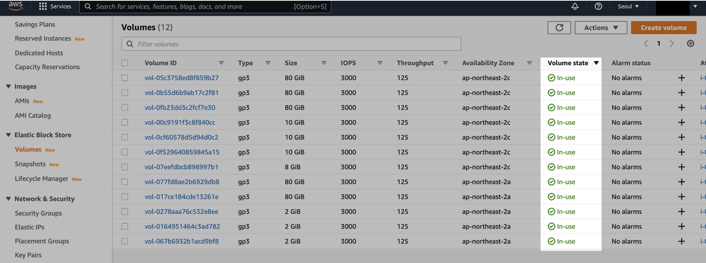

## 개요

AWS CLI 기반 쉘 스크립트를 사용해 지정한 리전의 모든 gp2 EBS 볼륨을 gp3로 일괄 전환합니다.


## 주의사항

볼륨 타입 변경은 무중단으로 진행되므로 프로덕션 환경에서도 안전합니다.

- 상황에 따라 최대 24시간 소요될 수 있습니다.
- I/O가 낮고 실제 사용량이 적을수록 빨리 완료됩니다.
- [볼륨 변경 후 6시간이 지나야](https://docs.aws.amazon.com/ko_kr/AWSEC2/latest/UserGuide/modify-volume-requirements.html#elastic-volumes-limitations) 다시 변경 가능합니다.

  

- 진행 중인 볼륨 상태는 콘솔에서 `In-use - optimizing (n%)`으로 표시됩니다.

## EKS 환경

EKS에서 gp3 EBS 볼륨을 사용하려면 [EBS CSI Driver](https://docs.aws.amazon.com/ko_kr/eks/latest/userguide/ebs-csi.html) 설치가 필요합니다.

```bash
$ kubectl get sc gp3
```

```bash
NAME            PROVISIONER       RECLAIMPOLICY   VOLUMEBINDINGMODE      ALLOWVOLUMEEXPANSION   AGE
gp3 (default)   ebs.csi.aws.com   Delete          WaitForFirstConsumer   false                  55d
```

gp3를 기본 StorageClass로 사용하는 경우, gp2의 default 어노테이션을 제거합니다.

```bash
kubectl annotate sc gp2 storageclass.kubernetes.io/is-default-class-
```

> [EKS v1.30](https://docs.aws.amazon.com/eks/latest/userguide/kubernetes-versions-extended.html)부터는 gp2 StorageClass에 default 어노테이션이 자동으로 설정되지 않으므로 위 작업이 불필요합니다.

더 자세한 내용은 [Migrating Amazon EKS clusters from gp2 to gp3 EBS volumes](https://aws.amazon.com/ko/blogs/containers/migrating-amazon-eks-clusters-from-gp2-to-gp3-ebs-volumes/)를 참고하세요.

## 준비사항

스크립트 실행에 `jq`와 `aws` CLI가 필요합니다.

```bash
$ brew install jq
$ jq --version
$ aws --version
```

IAM User에 다음 권한이 필요합니다.

- `ec2:DescribeVolumes` : gp2 볼륨 조회
- `ec2:ModifyVolume` : 볼륨 타입 변경

## 스크립트

`gp3-migration.sh` 파일을 생성하고 `region` 변수를 환경에 맞게 수정합니다.

<details>
<summary>스크립트 내용 확인</summary>

```bash
#!/bin/bash

#==================================================
# [Last Modified Date]
# 2023-08-01
#
# [Author]
# Younsung Lee (cysl@kakao.com)
#
# [Description]
# Change all gp2 volumes to gp3 in a specific region
# Prerequisite: You have to install `jq` and `awscli`, FIRST.
#==================================================

region='ap-northeast-2'
aws_cmd_path=$(command -v aws)

# Function to check if a command exists
function command_exists() {
    command -v "$1" >/dev/null 2>&1
}

# Function to check if jq is installed, and if not, exit the script
function check_jq_installed() {
    if ! command_exists "jq"; then
        echo "[e] 'jq' command not found. Please install 'jq' before running this script."
        exit 1
    fi
}

# Function to check if AWS CLI is installed, and if not, exit the script
function check_awscli_installed() {
    if ! command_exists "aws"; then
        echo "[e] 'aws' command not found. Please install 'awscli' before running this script."
        exit 1
    fi
}

# Function to find all gp2 volumes within the given region
function find_gp2_volumes() {
    echo "[i] Start finding all gp2 volumes in ${region}"
    volume_ids=$(
        ${aws_cmd_path} ec2 describe-volumes \
        --region "${region}" \
        --filters Name=volume-type,Values=gp2 | \
        jq -r '.Volumes[].VolumeId'
    )

    echo "[i] List up all gp2 volumes in ${region}"
    echo "========================================="
    echo "$volume_ids"
    echo "========================================="
}

# Function to confirm the action before migration
function confirm_migration() {
    while true; do
        read -p "Do you want to proceed with the migration? (y/n): " choice
        case "$choice" in
            [yY])
                echo "[i] Starting volume migration..."
                return 0
                ;;
            [nN])
                echo "[i] Migration canceled by the user."
                exit 0
                ;;
            *)
                echo "[e] Invalid choice. Please enter 'y' or 'n'."
                ;;
        esac
    done
}

# Function to migrate a single gp2 volume to gp3
function migrate_volume_to_gp3() {
    local volume_id="$1"
    result=$(${aws_cmd_path} ec2 modify-volume \
        --region "${region}" \
        --volume-type gp3 \
        --volume-id "${volume_id}" | \
        jq -r '.VolumeModification.ModificationState'
    )

    if [ $? -eq 0 ] && [ "$result" == "modifying" ]; then
        echo "[i] Volume $volume_id changed to state 'modifying' successfully."
    else
        echo "[e] ERROR: Couldn't change volume $volume_id type to gp3!"
        exit 1
    fi
}

# Main function to run the entire process
function main() {
    check_jq_installed
    check_awscli_installed

    find_gp2_volumes
    confirm_migration

    echo "[i] Migrating all gp2 volumes to gp3"
    for volume_id in $volume_ids; do
        migrate_volume_to_gp3 "$volume_id"
    done

    echo "[i] All gp2 volumes have been migrated to gp3 successfully!"
}

# Call the main function to start the script
main
```

</details>

스크립트를 실행합니다.

```bash
$ sh gp3-migration.sh
```

## 실행결과

```bash
$ sh gp3-migration.sh
[i] Start finding all gp2 volumes in ap-northeast-2
[i] List up all gp2 volumes in ap-northeast-2
=========================================
vol-1234567890abcdef0
vol-0987654321abcdef0
vol-abcdefgh123456780
=========================================
Do you want to proceed with the migration? (y/n): y
[i] Starting volume migration...
[i] Migrating all gp2 volumes to gp3
[i] Volume vol-1234567890abcdef0 changed to state 'modifying' successfully.
[i] Volume vol-0987654321abcdef0 changed to state 'modifying' successfully.
[i] Volume vol-abcdefgh123456780 changed to state 'modifying' successfully.
[i] All gp2 volumes have been migrated to gp3 successfully!
```

AWS Console에서 타입 변경 중인 볼륨은 `in-use - optimizing`으로 표시됩니다.


완료되면 `in-use`로 바뀝니다.



## 참고자료

- [Migrate your Amazon EBS volumes from gp2 to gp3 and save up to 20% on costs](https://aws.amazon.com/ko/blogs/storage/migrate-your-amazon-ebs-volumes-from-gp2-to-gp3-and-save-up-to-20-on-costs/)
- [EBS 볼륨 변경 시 요구사항 및 제한사항](https://docs.aws.amazon.com/ko_kr/AWSEC2/latest/UserGuide/modify-volume-requirements.html#elastic-volumes-limitations)
