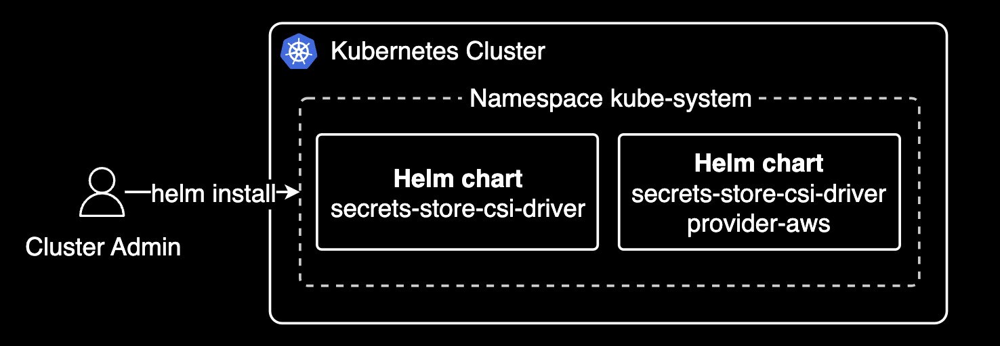
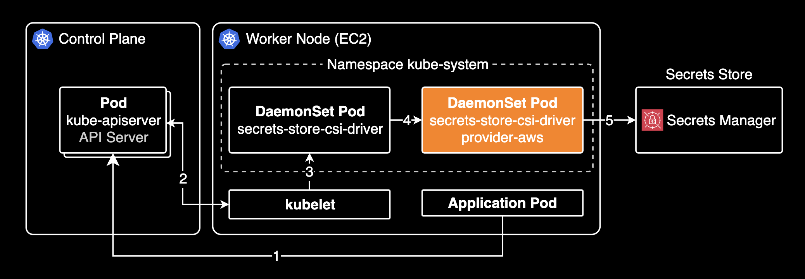

## 개요

Secrets Store CSI Driver는 AWS Secrets Manager에 저장된 시크릿을 Kubernetes Secret으로 마운트할 수 있도록 해주는 CSI(Container Storage Interface) 드라이버입니다.

&nbsp;

이 포스트에서는 EKS Pod Identity를 사용하여 Secrets Store CSI Driver를 설정하는 방법을 설명합니다. 처음에 Secrets Store CSI Driver를 IRSA 방식에서 EKS Pod Identity 방식으로 전환할 때, `usePodIdentity` 파라미터에 대해 혼동이 있었는데 이 포스트에서는 그 부분을 명확하게 정리합니다.

&nbsp;

## 배경지식

### Secrets Store CSI Driver

Secrets Store CSI Driver는 쿠버네티스 시크릿을 외부 비밀 관리 시스템(AWS Secrets Manager, HashiCorp Vault 등)과 연동하여 자동으로 가져오고 Pod에서 사용할 수 있도록 하는 도구로, 모든 노드에 데몬셋으로 배포됩니다. Pod이 비밀 값을 요청하면, 드라이버가 외부 시스템에서 값을 가져와 파일 형태로 마운트하거나 쿠버네티스 시크릿으로 생성하며, 변경 사항이 있으면 자동으로 업데이트합니다.

아래는 Secrets Store CSI Driver 공식문서에 나오는 아키텍처 이미지입니다.


&nbsp;

Secrets Store CSI Driver는 쿠버네티스의 표준 CSI(Container Storage Interface) 스펙을 구현한 범용 드라이버로, 외부 시크릿을 쿠버네티스 파드에 볼륨으로 마운트하는 기본 기능을 제공합니다. 하지만 이 드라이버 자체는 특정 클라우드 프로바이더나 시크릿 저장소와 직접 통신하지 않기 때문에, AWS Secrets Manager와 같은 특정 시크릿 서비스와 연동하기 위해서는 해당 서비스에 특화된 Provider가 필요합니다. secrets-store-csi-driver-provider-aws는 AWS 인증, AWS API 호출, AWS Secrets Manager와의 통신 등 AWS 특화 기능을 구현하여 Secrets Store CSI Driver와 AWS Secrets Manager 사이의 다리 역할을 합니다.

따라서 AWS Secrets Manager의 시크릿을 쿠버네티스 파드에서 사용하기 위해서는 Secrets Store CSI Driver와 Secrets Store CSI Driver Provider AWS를 함께 설치해야 합니다.



&nbsp;

Secrets Store CSI Driver는 크게 아래 순서로 작동합니다.



1. Application 파드 생성 → kube-apiserver (파드 생성 요청, CSI 볼륨 설정 + SecretProviderClass 설정 포함)
2. kube-apiserver → kubelet (파드 생성 요청 전달)
3. kubelet → secrets-store-csi-driver (Unix Domain Socket으로 통신)
4. secrets-store-csi-driver → secrets-store-csi-driver-provider-aws (파일시스템 기반 통신)
5. secrets-store-csi-driver-provider-aws → AWS Secrets Manager (AWS SDK 사용)

&nbsp;

kubectl 명령어를 통해 Secrets Store CSI Driver가 사용하는 커스텀 리소스(Custom Resource, CR)를 확인할 수 있습니다.

```bash
kubectl api-resources --api-group secrets-store.csi.x-k8s.io
```

```bash
NAME                             SHORTNAMES   APIVERSION                      NAMESPACED   KIND
secretproviderclasses                         secrets-store.csi.x-k8s.io/v1   true         SecretProviderClass
secretproviderclasspodstatuses                secrets-store.csi.x-k8s.io/v1   true         SecretProviderClassPodStatus
```

Secrets Store CSI Driver는 두 가지 커스텀 리소스를 사용해서 외부 비밀 관리 시스템과 연결합니다.

- **SecretProviderClass** : 특정 Pod이 사용할 비밀 정보의 원본(외부 비밀 관리 시스템, 키 경로 등)을 정의하는 리소스
- **SecretProviderClassPodStatus** : 특정 Pod이 SecretProviderClass를 통해 비밀 정보를 정상적으로 가져왔는지 상태를 나타내는 리소스로, 파드 이름, 시크릿 마운트 성공 여부, 파드 안에 마운트된 절대 경로 등을 포함합니다.

이를 통해 Secrets Store CSI Driver가 외부 비밀 관리 시스템과 연결되고, 원하는 설정을 적용할 수 있으며, 시크릿 연동 상태를 모니터링할 수 있습니다. 더 자세한 정보는 Secrets Store CSI Driver 공식문서의 [Concepts](https://secrets-store-csi-driver.sigs.k8s.io/concepts.html#custom-resource-definitions-crds) 페이지를 참고합니다.

&nbsp;

## 설정 가이드

당연한 이야기이지만 클러스터에서 EKS Pod Identity 데몬셋이 [에드온](https://docs.aws.amazon.com/ko_kr/eks/latest/userguide/workloads-add-ons-available-eks.html)으로 설치되어 있어야 [EKS Pod Identity 방식](https://docs.aws.amazon.com/ko_kr/eks/latest/userguide/pod-id-how-it-works.html)을 사용할 수 있습니다.

아래 명령어를 통해 Kubernetes 클러스터에 EKS Pod Identity 데몬셋이 설치되어 있는지 확인할 수 있습니다.

```bash
kubectl get daemonset -n kube-system eks-pod-identity-agent
```

&nbsp;

### `usePodIdentity` 파라미터

SecretProviderClass 리소스의 `usePodIdentity` 파라미터는 인증 방법을 결정하는 선택적(Optional) 필드로 Boolean 타입입니다. secretProviderClass 리소스에서 `usePodIdentity` 값이 생략된 경우, 기본적으로 IRSA(IAM Roles for Service Accounts) 방식을 사용해서 Secrets Manager에 저장된 시크릿을 가져옵니다.

[secrets-store-csi-driver-provider-aws](https://github.com/aws/secrets-store-csi-driver-provider-aws?tab=readme-ov-file#secretproviderclass-options) 레포지토리의 문서에서는 `usePodIdentity` 설정에 대해 다음과 같이 설명합니다.

> `usePodIdentity`: An optional field that determines the authentication approach. When not specified, it defaults to using IAM Roles for Service Accounts (IRSA).  
> - To use EKS Pod Identity, use any of these values: "true", "True", "TRUE", "t", "T".  
> - To explicitly use IRSA, set to any of these values: "false", "False", "FALSE", "f", or "F".

즉 파드가 EKS Pod Identity를 사용해서 Secrets Manager에 저장된 시크릿을 가져오려면 `usePodIdentity` 파라미터를 `true`로 설정해야 합니다. 반대로 IRSA를 사용해서 Secrets Manager에 저장된 시크릿을 가져오려면 `usePodIdentity` 파라미터를 `false`로 설정해야 합니다.

&nbsp;

### IAM Roles for Service Accounts (IRSA)

Secrets Store CSI Driver Provider AWS가 EKS Pod Identity 에드온이 설치된 클러스터에서 파드가 IRSA를 사용해야 하는 경우, SecretProviderClass 리소스의 `usePodIdentity` 파라미터를 `false`로 설정해야 합니다.

아래는 IRSA 방식을 사용하는 SecretProviderClass 리소스의 예시입니다.

```yaml
apiVersion: secrets-store.csi.x-k8s.io/v1
kind: SecretProviderClass
metadata:
  name: example-irsa-spc
spec:
  parameters:
    usePodIdentity: "false"
    objects: |
      - objectName: <REDACTED>
        objectType: secretsmanager
```

`usePodIdentity` 파라미터를 `false`로 설정하면, Secrets Store CSI Driver Provider AWS는 IRSA 방식을 사용해서 Secrets Manager에 저장된 시크릿을 가져옵니다.

&nbsp;

### EKS Pod Identity

Secrets Store CSI Driver Provider AWS는 [0.3.11](https://github.com/aws/secrets-store-csi-driver-provider-aws/releases/tag/secrets-store-csi-driver-provider-aws-0.3.11) 버전부터 EKS Pod Identity 방식을 지원합니다. 자세한 사항은 [PR #416](https://github.com/aws/secrets-store-csi-driver-provider-aws/pull/416) 이슈를 참고합니다.

[EKS Pod Identity][eks-pod-identity]는 IRSA 방식을 대체하기 위해 2023년 11월에 출시된 파드 권한 획득 방식입니다. 기존 방식인 IRSA 방식에 비해 더 간결한 설정으로 파드 권한 획득을 지원하기 때문에 [EKS 모범사례][eks-best-practices]에서도 권장하는 방식입니다.

Secrets Store CSI Driver Provider AWS가 EKS Pod Identity 방식을 사용해서 Secrets Manager에 저장된 시크릿을 가져오려면 `spec.parameters.usePodIdentity` 파라미터를 `true`로 설정해야 합니다.

아래는 EKS Pod Identity 방식을 사용하는 SecretProviderClass 리소스의 예시입니다.

```yaml
apiVersion: secrets-store.csi.x-k8s.io/v1
kind: SecretProviderClass
metadata:
  name: example-pod-identity-spc
spec:
  parameters:
    usePodIdentity: "true"
    objects: |
      - objectName: <REDACTED>
        objectType: secretsmanager
```

`usePodIdentity` 파라미터를 `true`로 설정하면, Secrets Store CSI Driver Provider AWS는 EKS Pod Identity 방식을 사용해서 Secrets Manager에 저장된 시크릿을 가져옵니다.

&nbsp;

## 관련자료

AWS:

- [EKS 모범사례 - ID 및 액세스 관리][eks-best-practices]

Secrets Store CSI Driver:

- [Secrets Store CSI Driver](https://secrets-store-csi-driver.sigs.k8s.io/): 공식 문서
- [Secrets Store CSI Driver](https://github.com/kubernetes-sigs/secrets-store-csi-driver): Github
- [Secrets Store CSI Driver Provider AWS](https://github.com/aws/secrets-store-csi-driver-provider-aws): Github
- [Add support for EKS Pod Identity #416](https://github.com/aws/secrets-store-csi-driver-provider-aws/pull/416)

[eks-best-practices]: https://docs.aws.amazon.com/ko_kr/eks/latest/best-practices/identity-and-access-management.html#_identities_and_credentials_for_eks_pods
[eks-pod-identity]: https://docs.aws.amazon.com/eks/latest/userguide/pod-identities.html