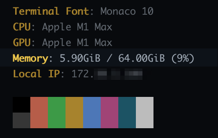

## 개요

neofetch를 사용해서 터미널에 좋아하는 사진을 걸어놓는 방법을 소개합니다.
이 글은 터미널 프로그램으로 iTerm2를 사용하는 환경 기준으로 설명합니다.

&nbsp;

neofetch를 사용하면 자신이 좋아하는 이미지를 걸어서 터미널을 꾸밀 수 있고, 터미널을 열 때마다 시스템 스펙과 상세정보를 자동 확인할 수 있는 장점이 있습니다.

&nbsp;

저는 최근에 `neofetch`로 스티브 잡스와 빈 방 사진을 출력해서 쓰고 있습니다.


&nbsp;

## 환경

- **OS** : macOS Ventura 13.6 (M1 Max)
- **Shell** : zsh + oh-my-zsh
- **neofetch** 7.1.0
  - brew로 설치
- **iTerm2** 3.4.20
  - brew로 설치

&nbsp;

## 주의사항

[neofetch 프로젝트](https://github.com/dylanaraps/neofetch)는 2024년 4월부로 아카이빙되었으며 더 이상 유지보수가 이루어지지 않습니다. [fastfetch](https://github.com/fastfetch-cli/fastfetch)는 neofetch를 대체하는 프로젝트이므로 fastfetch를 사용하는 것을 권장합니다.

&nbsp;

## 준비사항

### 사용자 로컬 환경

- macOS 패키지 관리자인 [brew](https://brew.sh/) 설치가 필요합니다.
- brew를 사용해서 터미널 프로그램인 [iTerm2](https://iterm2.com/) 설치가 필요합니다.

brew와 iTerm2 설치 방법은 이 글의 주제를 벗어나는 내용이기 때문에 생략합니다.

&nbsp;

## 사용방법

### neofetch 설치

패키지 관리자인 brew를 이용해서 `neofetch`를 설치합니다.

```bash
$ brew install neofetch
```

&nbsp;

### imagemagick 설치

이미지 렌더링에 필요한 `imagemagick`도 설치합니다.

```bash
$ brew install imagemagick
```

[imagemagick](https://imagemagick.org/index.php)는 디지털 이미지를 생성, 편집, 구성 또는 변환하는 플러그인입니다. PNG, JPEG, GIF, WebP, HEIC, SVG, PDF, DPX, EXR 및 TIFF를 포함한 다양한 확장자(200개 이상)의 이미지를 읽고 쓸 수 있습니다.

&nbsp;

`neofetch` 명령어가 잘 동작하는 지 확인합니다.

```bash
$ which neofetch
/opt/homebrew/bin/neofetch
```

```bash
$ neofetch --version
Neofetch 7.1.0
```

현재 `Neofetch 7.1.0`이 설치된 상태입니다.

&nbsp;

### 소스 이미지 준비

neofetch에서 사용할 이미지 파일을 인터넷에서 검색한 후 다운로드 받습니다.

**neofetch에서 사용할 수 있는 이미지 확장자**  
`.jpg`, `.jpeg`, `.png`, `.webp` 확장자 모두 정상 동작합니다.

&nbsp;

이후 neofetch 경로 안에 띄울 이미지를 보관할 전용 디렉토리를 만듭니다.

```bash
$ mkdir -p ~/.config/neofetch/images
```

&nbsp;

준비한 이미지 파일을 `mv` 명령어 또는 finder 탐색기를 통해서 `~/.config/neofetch/images/` 경로에 옮깁니다.

```bash
$ tree ~/.config/neofetch
/Users/younsung.lee/.config/neofetch
├── config.conf
└── images
    └── steve-jobs.jpg

2 directories, 2 files
```

저같은 경우는 보기만 해도 마음이 편안해지는 스티브 잡스와 빈 방 사진을 준비했습니다.

&nbsp;

`neofetch` 설정파일인 `config.conf`를 수정합니다.

```bash
$ vi ~/.config/neofetch/config.conf
```

&nbsp;

### 이미지 소스 설정

Neofetch 설정파일 `config.conf`에서 이미지 관련 설정을 먼저 아래와 같이 설정합니다.

```bash
# ~/.config/neofetch/config.conf
# default value is "ascii"
image_backend="iterm2"

...

# NOTE: 'auto' will pick the best image source for whatever image backend is used.
#       In ascii mode, distro ascii art will be used and in an image mode, your
#       wallpaper will be used.
image_source="/사용할/이미지/절대/경로.jpg"

...

# default value is "auto"
image_size="auto"
```

각 설정값에 대한 상세 설명입니다.

1. **이미지를 그릴 백엔드** : `image_backend` 값을 `ascii` (기본값)에서 `iterm2`로 변경합니다.
2. **이미지 소스 경로** : `image_source` 값을 이미지 파일이 위치한 절대경로로 변경합니다.
3. **이미지 크기** : 이미지가 출력될 크기를 지정합니다. `auto` (기본값)로 설정된 경우 이미지는 터미널 전체의 절반을 차지하게 됩니다. 픽셀 절대값 `400px` 또는 퍼센트 비율 `30%` 로도 설정이 가능합니다.

&nbsp;

#### `image_source` 값 설정 시 주의사항

- `image_source` 값의 경우 무조건 절대경로를 써야 합니다.
- `~/.config/neofetch/images/test.jpg` 같이 상대경로 `~`를 사용하면 이미지 로드에 실패합니다.  
- 이미지 파일 경로에 `$HOME` 환경변수가 포함되는 건 가능합니다.

&nbsp;

### 메모리 표기 설정

메모리 사용률 표기 관련하여 2가지 설정을 변경합니다.

1. **메모리 사용률 퍼센트 표기** : `memory_percent`를 `off` (기본값)에서 `on`으로 변경합니다.
2. **메모리 단위 표기** : `memory_unit`을 `mib` (기본값)에서 `gib`로 변경해서 사람이 좀 더 이해하기 쉽게 변경합니다.

```bash
# ~/.config/neofetch/config.conf
# Show memory pecentage in output.
#
# Default: 'off'
# Values:  'on', 'off'
# Flag:    --memory_percent
#
# Example:
# on:   '1801MiB / 7881MiB (22%)'
# off:  '1801MiB / 7881MiB'
memory_percent="on"
```

```bash
# Change memory output unit.
#
# Default: 'mib'
# Values:  'kib', 'mib', 'gib'
# Flag:    --memory_unit
#
# Example:
# kib  '1020928KiB / 7117824KiB'
# mib  '1042MiB / 6951MiB'
# gib: ' 0.98GiB / 6.79GiB'
memory_unit="gib"
```

`memory_percent`와 `memory_unit` 설정을 적용한 결과입니다.



&nbsp;

neofetch 설정파일에서 이미지 관련 설정 정보를 마지막으로 확인합니다.

```bash
$ cat -n ~/.config/neofetch/config.conf \
    | egrep 'image_size=|image_source=|image_backend'
```

```bash
   697  image_backend="iterm2"
   711  image_source="$HOME/.config/neofetch/images/steve-jobs.jpg"
   829  image_size="auto"
```

위 설정처럼 `image_source` 경로에 `$HOME` 환경변수가 들어간 경우, 로컬 환경에 `$HOME` 환경변수가 제대로 설정되어 있어야 이미지를 정상적으로 불러올 수 있습니다.

`echo` 명령어를 실행해서 `$HOME` 환경변수가 설정되어 있는지 미리 확인할 수 있습니다.

```bash
$ echo $HOME
/Users/younsung.lee
```

&nbsp;

Visual Studio Code를 사용할 경우, `code` 명령어로 IDE를 실행하면서 지정한 설정파일을 띄울 수 있습니다.

```bash
$ code ~/.config/neofetch/config.conf
```

&nbsp;

### iTerm2 최적화 설정

neofetch 이미지가 출력될 때 iTerm2에서 간격이 크게 벌어지는 문제가 발생합니다.  
이를 해결하기 위해 iTerm2에서 2가지 설정을 변경해야 합니다.

&nbsp;

#### 첫번째 설정

왼쪽 위에 있는 메뉴바 → iTerm2 → `Settings...` 클릭


`Settings...` 메뉴를 클릭하면 iTerm2 설정창이 열립니다.

&nbsp;

Preferences → Advanced → 검색창 → `Disable potentially insecure escape sequences` → `No`로 설정


&nbsp;

#### 두번째 설정

Preferences → Advanced → 검색창 → `Show inline images at retina resolution` → `No`로 설정


이제 neofetch를 사용할 준비가 되었습니다.

&nbsp;

### neofetch 자동 적용

zsh 설정파일인 `.zshrc`의 마지막 라인에 neofetch를 실행하도록 아래 라인을 추가합니다.

```bash
$ vi ~/.zshrc
neofetch
```

이제 iTerm2 터미널을 열 때마다 `neofetch` 명령어가 실행되면서 설정파일에 지정된 이미지를 불러옵니다.

&nbsp;

### 테스트

iTerm2를 최초로 실행하거나 탭을 새로 생성할 때마다 제가 지정한 이미지가 터미널에 출력됩니다.


보기만 해도 마음이 평온해지는 사진입니다.  
여러분들은 `neofetch` 덕분에 좋아하는 사진을 터미널에서 자주 보기 때문에, 개발 생산성이 향상되고 편안한 마음으로 코딩에 집중할 수 있습니다.

자신이 지정한 사진이 중간중간 보고싶다면 `neofetch` 명령어를 직접 실행해도 이미지가 나옵니다.

&nbsp;

**참고**:  
위 터미널에서 사진 아래쪽에 같이 출력되는 명언이나 구절은 `fortune`이라는 툴을 사용했습니다. `fortune`도 `neofetch`와 동일하게 zsh에 설정해서 사용할 수 있습니다.

`fortune`에 관심 있으신 분들은 [zsh 플러그인 설치](/blog/installing-zsh-plugins/#랜덤-명언-조합하기) 페이지를 참고하세요.

&nbsp;

## 트러블슈팅 가이드

neofetch의 이미지 출력에 문제가 있는 경우, `neofetch` 로그를 상세하게 출력하면 트러블슈팅 할 때 로그를 통해 좀 더 쉽게 문제 원인을 찾을 수 있습니다.

```bash
$ neofetch --help
...
OTHER:
    --config /path/to/config    Specify a path to a custom config file
    --config none               Launch the script without a config file
    --no_config                 Don't create the user config file.
    --print_config              Print the default config file to stdout.
    --stdout                    Turn off all colors and disables any ASCII/image backend.
    --help                      Print this text and exit
    --version                   Show neofetch version
    -v                          Display error messages.
    -vv                         Display a verbose log for error reporting.
...
```

&nbsp;

### verbose 옵션

`-v` 옵션 또는 `-vv` 옵션을 사용해서 상세한 로그를 출력합니다.

```bash
$ neofetch --iterm2 /path/to/image/ \
    --size 400 \
    -v
```

```bash
...
[!] Config: Sourced user config.    (/Users/younsung.lee/.config/neofetch/config.conf)
[!] Image: Using image ''
[!] Image: '' doesn't exist, falling back to ascii mode.
[!] Info: Couldn't detect Theme.
[!] Info: Couldn't detect Icons.
[!] Neofetch command: /opt/homebrew/bin/neofetch -v --iterm2 /path/to/image/
[!] Neofetch version: 7.1.0
```

&nbsp;

## 참고자료

[younsl/dotfiles](https://github.com/younsl/dotfiles/tree/main/neofetch)  
제가 현재 사용중인 neofetch 설정파일입니다.  
설정하실 때 예시로 참고 삼아 보시면 도움이 될 것 같습니다.
