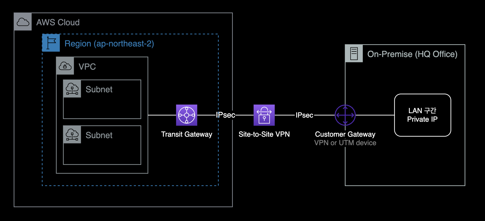
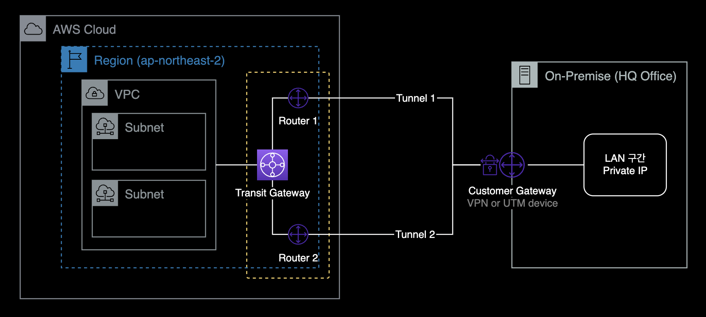

## 개요

Transit Gateway + Site-to-Site VPN 연결 가이드.

&nbsp;

## 환경

### 네트워크 구성

[AWS Transit Gateway](https://docs.aws.amazon.com/whitepapers/latest/building-scalable-secure-multi-vpc-network-infrastructure/transit-gateway.html)와 온프레미스 데이터센터를 Site-to-Site VPN으로 연결하는 상황입니다.



&nbsp;

### 로컬 작업환경

- **OS** : macOS 13.2.1 (Ventura)
- **AWS CLI** : 2.10.1
  - brew로 설치
- **Shell** : zsh + oh-my-zsh
- **IAM 권한** : FullAdmin

&nbsp;

## 준비사항

### AWS CLI

작업자의 로컬 환경에 AWS CLI가 설치되어 있어야 합니다.

```bash
$ aws version
aws-cli/2.10.1 Python/3.11.2 Darwin/22.3.0 source/arm64 prompt/off
```

&nbsp;

macOS 사용자의 경우 패키지 관리자인 [brew](https://brew.sh/ko)를 사용하면 간단하게 설치 가능합니다.

```bash
$ brew --version
Homebrew 4.0.4
Homebrew/homebrew-core (git revision 18b3215d6d3; last commit 2023-02-17)
Homebrew/homebrew-cask (git revision 90f1b9d0c9; last commit 2023-02-17)

$ brew install awscli
```

&nbsp;

### 충분한 IAM 권한

AdministratorAccess IAM 권한 혹은 EC2, VPC 서비스에 대한 충분한 IAM 권한을 보유하고 있어야 VPN 구성 작업 진행이 가능합니다.

&nbsp;

## 배경지식

### VPN Tunneling

Site-to-Site VPN 연결을 생성할 때 각 터널 구성 정보를 포함하여 디바이스 구성 정보가 포함된 고객 게이트웨이 디바이스별 구성 파일을 다운로드합니다. Site-to-Site VPN 연결을 만들 때 선택적으로 일부 터널 옵션을 직접 지정할 수 있습니다. 따로 설정하지 않으면 AWS에 지정된 기본값으로 VPN Tunneling 옵션이 설정됩니다.

**관련 문서** : [Site-to-Site VPN Tunnel 옵션 설명](https://docs.aws.amazon.com/vpn/latest/s2svpn/VPNTunnels.html)

&nbsp;

### Transit Gateway + VPN 구성

Virtual Private Gateway 대신 Transit Gateway에 VPN을 연결하면 아래와 같은 장단점이 있습니다.

**관련 문서** : [네트워크간의 연결 옵션 설명](https://docs.aws.amazon.com/whitepapers/latest/aws-vpc-connectivity-options/network-to-amazon-vpc-connectivity-options.html)

&nbsp;

#### 장점

- Direct Connect와 같은 전용선 구매 없이도 기존 퍼블릭 인터넷을 활용해 전용선과 같은 네트워크 구성이 가능합니다. 이는 VPN 연결 방식이 가진 고유한 장점입니다.
- 한 개의 VPN Connection을 여러 개의 VPC에 연결할 수 있습니다. (혹은 여러 개의 VPN Connection을 여러 개의 VPC에도 연결할 수 있습니다.)
  - Transit Gateway 대신 Virtual Private Gateway를 사용해서 VPN을 구성하는 경우, 각 VPC마다 Virtual Private Gateway를 생성하고 온프레미스 장비와 각각 연결해야 합니다.
  
  

- 네트워크 회선 구성이 간결해집니다. 이를 통해 인프라 담당자는 운영 오버헤드를 줄일 수 있고 다른 일에 집중할 수 있습니다.

&nbsp;

#### 한계점

- Transit Gateway 비용이 비쌉니다. Virtual Private Gateway(VGW)를 쓰는 것보다 Transit Gateway에 연결하는 비용이 훨씬 비쌉니다.
- 인터넷 회선 상태에 따라 VPN 네트워크도 같이 지연, 끊김 현상 등의 영향을 받을 수 있습니다.
  - VPN 운영중에 아주 적은 빈도로 2개 VPN 터널 중 하나가 끊긴 후 다시 자동 재구성되는 케이스를 경험했습니다.
  
    

  - 물론 VPN 터널링이 끊긴 즉시, AWS와 On-prem VPN 장비가 서로 터널링을 재구성하고 자동 복구해주기 때문에 크게 걱정할 문제는 아닙니다.
  - **관련문서** : [AWS Site-to-Site VPN의 복원성](https://docs.aws.amazon.com/ko_kr/vpn/latest/s2svpn/disaster-recovery-resiliency.html#resiliancy-tunnels)

&nbsp;

## 작업절차

### Customer Gateway 정보 수집

AWS에서 Customer Gateway는 온프레미스 사이트에 위치해서 VPN 연결을 제공하는 네트워크 장비를 의미합니다.  
일반적으로 네트워크 라우터, UTM 장비, VPN 장비 등에 Customer Gateway에 해당됩니다.

VPN 연결을 하기 위해 필요한 Customer Gateway 장비 정보는 다음과 같습니다.

- Customer Gateway의 공인 IP
- 장비의 제조사 및 모델명
- 장비의 OS 버전
- VPN을 통해 AWS 네트워크에 접속하려고 하는 내부 장비/사용자 네트워크 대역

위와 같은 네트워크 정보는 온프레미스 데이터센터를 관리하는 네트워크 엔지니어나 VPN 장비 및 연결을 관리하는 보안 엔지니어에게 문의해서 얻을 수 있습니다.

&nbsp;

### Customer Gateway 생성

얻은 정보를 바탕으로 AWS CLI의 [create-customer-gateway](https://docs.aws.amazon.com/cli/latest/reference/ec2/create-customer-gateway.html) 명령어를 사용해서 Customer Gateway를 생성합니다.

```bash
# Customer Gateway 생성
aws ec2 create-customer-gateway \
  --type ipsec.1 \
  --bgp-asn 65000 \
  --ip-address "11.11.11.11" \
  --tag-specifications 'ResourceType="customer-gateway",Tags=[{Key="Name",Value="test-customer-gateway"}]'
```

#### Customer Gateway 생성 시 옵션 설명

- **IP Address** : Customer Gateway의 IP Address는 온프레미스 사이트에 위치한 UTM 혹은 VPN 장비의 공인 IP이어야 합니다.
- **BGP ASN** : Customer Gateway의 BGP ASN은 기본값을 사용해도 무관합니다.
- **Type** : 2023년 2월 기준으로 Site-to-Site VPN에서는 ipsec.1만 지원하고 있습니다.

자세한 정보는 AWS 공식문서 "[Site-to-Site VPN 연결을 위한 고객 게이트웨이 옵션](https://docs.aws.amazon.com/vpn/latest/s2svpn/cgw-options.html)"을 참고합니다.

&nbsp;

Customer Gateway가 정상적으로 생성된 경우, 다음과 같이 json 포맷으로 결과값이 출력됩니다.

```json
{
    "CustomerGateway": {
        "BgpAsn": "65000",
        "CustomerGatewayId": "cgw-0ead937284c8c2383",
        "IpAddress": "11.11.11.11",
        "State": "available",
        "Type": "ipsec.1",
        "Tags": [
            {
                "Key": "Name",
                "Value": "test-customer-gateway"
            }
        ]
    }
}
```

&nbsp;

AWS 콘솔 → VPC → [Customer gateways](https://ap-northeast-2.console.aws.amazon.com/vpc/home?region=ap-northeast-2#CustomerGateways:) 메뉴에 접속합니다.


새로 생성한 Customer Gateway 정보를 확인합니다.

&nbsp;

### VPN Connection 생성

이후 VPN Connection을 생성합니다.  
VPN Connection을 통해 Transit Gateway와 이전에 만든 Customer Gateway를 VPN 연결할 수 있습니다.  
VPN Connection을 생성하면 기본적으로 2개의 VPN 터널이 생성됩니다.

- **Target gateway type** : `Transit Gateway`
  - 이 시나리오의 경우 Transit Gateway와 Customer Gateway 장비를 VPN 연결하는 구성입니다. VPN Gateway와 Customer Gateway를 연결하는 선택지도 있는 점 참고 바랍니다.
- **Routing options** : `Static`
- **Tunnel inside IP version** : `IPv4`
- **Local IPv4 network CIDR - optional** : 내부 온프레미스 사용자 대역 (예시: `172.16.0.0/16`)
- **Remote IPv4 network CIDR - optional** : `0.0.0.0/0` (기본값으로 설정)
- **Outside IP address type** : `PublicIpv4` (기본값으로 설정)

&nbsp;

### Config 전달

Customer Gateway(UTM 또는 VPN) 장비에 VPN Config를 입력해야 AWS의 Transit Gateway와 VPN 터널링이 완료됩니다.

&nbsp;

VPN 샘플 파일을 다운로드를 받기 전에 Customer Gateway의 제조사와 모델명, OS 버전 정보를 먼저 확인합니다.

```bash
# VPN Connection 설정파일에서 고를 수 있는 장비타입 확인
aws ec2 get-vpn-connection-device-types \
  --region ap-northeast-2 \
  --query 'VpnConnectionDeviceTypes[]' \
  --output table
```

```bash
-----------------------------------------------------------------------------------------------------------------------
|                                             GetVpnConnectionDeviceTypes                                             |
+-----------------------------+--------------------------------+-------------------------+----------------------------+
|          Platform           |           Software             |         Vendor          | VpnConnectionDeviceTypeId  |
+-----------------------------+--------------------------------+-------------------------+----------------------------+
|  NextGen Firewall F-Series  |  6.2+                          |  Barracuda              |  36ef5d04                  |
|  Gaia                       |  R77.10+                       |  Checkpoint             |  feabc07e                  |
|  Gaia                       |  R80.10+                       |  Checkpoint             |  1b270706                  |
|  MX Series                  |  15.12+ (WebUI)                |  Cisco Meraki           |  42ff1bfc                  |
|  MX Series                  |  9.0+ (WebUI)                  |  Cisco Meraki           |  866e027c                  |
|  ASA 5500 Series            |  ASA 8.2+                      |  Cisco Systems, Inc.    |  6883834a                  |
|  ASA 5500 Series            |  ASA 9.7+ VTI                  |  Cisco Systems, Inc.    |  b556dcd1                  |
|  ASA 5500 Series            |  ASA 9.x                       |  Cisco Systems, Inc.    |  78c1a727                  |
|  Cisco ASR 1000             |  IOS 12.4+                     |  Cisco Systems, Inc.    |  48548f98                  |
|  CSRv AMI                   |  IOS 12.4+                     |  Cisco Systems, Inc.    |  7b754310                  |
|  Firepower                  |  v6.2.2+                       |  Cisco Systems, Inc.    |  ae4cefeb                  |
|  ISR Series Routers         |  IOS 12.4+                     |  Cisco Systems, Inc.    |  b0adb196                  |
|  Netscaler CloudBridge      |  NS 11+                        |  Citrix                 |  d995c2ab                  |
|  CR15iNG                    |  V 10.6.5 MR-1                 |  Cyberoam               |  f8eac8fc                  |
|  BIG-IP                     |  v12.0.0+                      |  F5 Networks, Inc.      |  56c86b54                  |
|  Fortigate 40+ Series       |  FortiOS 4.0+                  |  Fortinet               |  2b2c1a73                  |
|  Fortigate 40+ Series       |  FortiOS 4.0+ (GUI)            |  Fortinet               |  980b2a2d                  |
|  Fortigate 40+ Series       |  FortiOS 5.0+                  |  Fortinet               |  9d9470de                  |
|  Fortigate 40+ Series       |  FortiOS 5.0+ (GUI)            |  Fortinet               |  887cd1a5                  |
|  Fortigate 40+ Series       |  FortiOS 6.4.4+ (GUI)          |  Fortinet               |  7125681a                  |
|  Generic                    |  Vendor Agnostic               |  Generic                |  9005b6c1                  |
|  MSR800                     |  Version 5.20                  |  H3C                    |  670add1b                  |
|  SEIL/B1                    |  SEIL/B1 3.70+                 |  IIJ                    |  40b66cf5                  |
|  SEIL/X1 and SEIL/X2        |  SEIL/X 3.70+                  |  IIJ                    |  a0c6b2f4                  |
|  SEIL/x86                   |  SEIL/x86 2.30+                |  IIJ                    |  4b8b2ed4                  |
|  J-Series Routers           |  JunOS 9.5+                    |  Juniper Networks, Inc. |  8a961875                  |
|  SRX Routers                |  JunOS 11.0+                   |  Juniper Networks, Inc. |  1361227b                  |
|  SSG and ISG Series Routers |  ScreenOS 6.1                  |  Juniper Networks, Inc. |  acabcac0                  |
|  SSG and ISG Series Routers |  ScreenOS 6.2+                 |  Juniper Networks, Inc. |  631f834b                  |
|  SSG and ISG Series Routers |  ScreenOS 6.2+ (GUI)           |  Juniper Networks, Inc. |  d36a4756                  |
|  Windows Server             |  2008 R2                       |  Microsoft              |  dd55903b                  |
|  Windows Server             |  2012 R2                       |  Microsoft              |  411e7147                  |
|  RouterOS                   |  6.36                          |  Mikrotik               |  2b5427d7                  |
|  RouterOS                   |  6.47                          |  Mikrotik               |  37d8aff6                  |
|  Openswan                   |  Openswan 2.6.38+              |  Openswan               |  6e62f3e3                  |
|  PA Series                  |  PANOS 4.1.2+                  |  Palo Alto Networks     |  754a6372                  |
|  PA Series                  |  PANOS 4.1.2+ (GUI)            |  Palo Alto Networks     |  9612cbed                  |
|  PA Series                  |  PANOS 7.0+                    |  Palo Alto Networks     |  5fb390ba                  |
|  pfSense                    |  pfsense 2.2.5+(GUI)           |  pfSense                |  74671aaa                  |
|  NSA, TZ                    |  OS 5.8                        |  SonicWall              |  4280e43e                  |
|  NSA, TZ                    |  OS 5.9                        |  SonicWall              |  60ca5da1                  |
|  NSA, TZ                    |  OS 6.2                        |  SonicWall              |  46154821                  |
|  NSA, TZ                    |  OS 6.5                        |  SonicWall              |  fa2df246                  |
|  ASG                        |  V8.300+                       |  Sophos                 |  758d1557                  |
|  Sophos Firewall            |  v19+                          |  Sophos                 |  90f254e7                  |
|  UTM                        |  V9                            |  Sophos                 |  e5ec51ed                  |
|  Ubuntu 16.04               |  Strongswan 5.5.1+             |  Strongswan             |  51cb26fd                  |
|  Vyatta Network OS          |  Vyatta Network OS 6.5+        |  Vyatta                 |  f1647754                  |
|  XTM, Firebox               |  Fireware OS 11.11.4 (WebUI)   |  WatchGuard, Inc.       |  a0745ade                  |
|  XTM, Firebox               |  Fireware OS 11.12.2+ (WebUI)  |  WatchGuard, Inc.       |  dbeffb53                  |
|  RTX Routers                |  Rev.10.01.16+                 |  Yamaha                 |  e7a2d626                  |
|  ZyWALL                     |  ZLD 4.3+                      |  Zyxel                  |  400e7aee                  |
|  Zywall Series              |  Zywall 4.20+                  |  Zyxel                  |  1153d0d2                  |
+-----------------------------+--------------------------------+-------------------------+----------------------------+
```

위 표는 AWS에서 Site-to-Site VPN 연결을 지원하는 전체 VPN 장비 목록입니다.

&nbsp;

제 경우 온프레미스 데이터센터에서 FortiGate 제조사의 UTM을 VPN 장비로 사용하고 있습니다.  
또한 FortiOS 7.x를 사용하고 있어서 이에 맞게 `VpnConnectionDevieTypeId` 값을 찾았습니다.

**주의사항**  
이 과정은 제 글 그대로 따라하면 오류가 발생하므로, 각자 사용중인 온프레미스 데이터센터 환경에 맞는 값으로 진행해야 합니다.

```bash
-----------------------------------------------------------------------------------------------------------------------
|                                             GetVpnConnectionDeviceTypes                                             |
+-----------------------------+--------------------------------+-------------------------+----------------------------+
|          Platform           |           Software             |         Vendor          | VpnConnectionDeviceTypeId  |
+-----------------------------+--------------------------------+-------------------------+----------------------------+
|  ...                        |  ...                           |  ...                    |  ...                       |
|  Fortigate 40+ Series       |  FortiOS 5.0+                  |  Fortinet               |  9d9470de                  |
|  Fortigate 40+ Series       |  FortiOS 5.0+ (GUI)            |  Fortinet               |  887cd1a5                  |
|  Fortigate 40+ Series       |  FortiOS 6.4.4+ (GUI)          |  Fortinet               |  7125681a                  |
|  ...                        |  ...                           |  ...                    |  ...                       |
+-----------------------------+--------------------------------+-------------------------+----------------------------+
```

제 경우 `VpnConnectionDeviceTypeId` 값인 `7125681a`을 사용해서 VPN 설정파일을 생성해야 합니다.

&nbsp;

이제 Customer Gateway의(VPN, UTM 장비을 의미) 장비 타입을 확인했으니, 그 버전에 맞는 샘플 Config 파일을 다운로드 받습니다.

#### 명령어 형식

```bash
aws ec2 get-vpn-connection-device-sample-configuration \
  --vpn-connection-id <vpn-id> \
  --vpn-connection-device-type-id <device-type-id> \
  --internet-key-exchange-version <ike-version> \
  --region <aws-region> \
  --output text
```

&nbsp;

#### 실제 명령어

새로 만든 VPN Connection에 대한 Config 파일 전체 내용을 다운로드 받습니다.

```bash
# 지정한 VPN Connection의 Config 파일 다운로드
aws ec2 get-vpn-connection-device-sample-configuration \
  --vpn-connection-id vpn-012d34567c8d901a2 \
  --vpn-connection-device-type-id 7125681a \
  --internet-key-exchange-version ikev2 \
  --region ap-northeast-2 \
  --output text
```

&nbsp;

### VPN 구성 작업

이후 과정은 VPN 네트워크와 온프레미스 장비를 관리하는 보안 엔지니어 혹은 네트워크 엔지니어가 진행합니다.  
다운로드 받은 VPN Config 파일을 VPN 담당 보안/네트워크 엔지니어에게 전달합니다.

&nbsp;

구성 완료 후 AWS 콘솔 → VPC → VPN → Site-to-Site VPN connections 메뉴로 이동합니다.  
여기서 Site-to-Site VPN Connection의 터널링 연결상태를 확인할 수 있습니다.


2개의 VPN Tunnel 상태가 모두 Up이면 정상적으로 구성 완료된 것입니다.

&nbsp;

### Transit Gateway 라우팅

VPN 내부 대역 사용자가 VPC 내부에 있는 서비스들에 접근 가능하도록 Transit Gateway에서 다음 설정을 진행합니다.

- VPC Attachment : Transit Gateway에 VPC 붙이기
- Transit Gateway의 Routing 룰 설정하기

&nbsp;

### VPN 터널 Failover 테스트

#### Failover 테스트

- 2개의 VPN 터널 중 하나씩 내려본 후 정상적으로 VPC 내부에 위치한 테스트용 EC2와 온프레미스 내부 대역의 통신이 유지되는지 테스트합니다.
  - **테스트 진행순서**
    1. Tunnel#1 Down, Tunnel#2 Up
    2. Tunnel#1 Up, Tunnel#2 Down
    3. Tunnel#1 Up, Tunnel#2 Up

&nbsp;

#### 테스트 시 주의사항

- Transit Gateway에서 VPN 터널을 내리거나 올리는 등의 컨트롤은 할 수 없습니다. VPN 터널을 하나씩 내리는 작업은 온프레미스 VPN 장비<sup>Customer Gateway</sup>를 통해서만 테스트할 수 있습니다.
  - **관련문서** : [Site-to-Site VPN 연결 테스트](https://docs.aws.amazon.com/ko_kr/vpn/latest/s2svpn/HowToTestEndToEnd_Linux.html)


- AWS의 중요 권장사항으로 VPN 터널 Failover 테스트 완료 후에는 반드시 VPN 터널 2개 모두를 다시 정상 상태(Up)로 돌려놓아야 합니다.

&nbsp;

절체 테스트를 마친 후에는 Site-to-Site VPN 네트워크 구성 작업은 종료됩니다.

&nbsp;

## 구성 결과

완성된 Customer Gateway와 Transit Gateway간의 Site-to-Site VPN 구성은 다음과 같습니다.

&nbsp;

### Resource Access Manager 구성

- Transit Gateway는 여러 계정의 VPC, VPN 장비 등을 쉽게 연결하기 위한 네트워크 중앙 라우터입니다.
- Transit Gateway 리소스는 [RAM](https://aws.amazon.com/ko/ram/)<sup>Resource Access Manager</sup> 서비스 설정을 통해 여러 계정에 걸쳐 리소스를 공유해서 사용합니다.


- 온프레미스 VPN 장비와 여러 VPC를 연결하기 위해서는 반드시 위와 같이 RAM + Transit Gateway 조합을 통해 중앙관리형 네트워크를 구성해야 합니다.

&nbsp;

### Site-to-Site VPN Connection 구성



- Site-to-Site VPN은 기본적으로 2개의 IPSec VPN 터널링을 구성하도록 설계되어 있으며, 각 VPN 터널은 고유한 Public IP 주소를 사용합니다.
  - **관련문서** : [Site-to-Site VPN 연결의 터널 옵션](https://docs.aws.amazon.com/ko_kr/vpn/latest/s2svpn/VPNTunnels.html)
- 위 구성도에서 노란 점선 안의 Router 1, Router 2의 경우 VPN Connection을 생성하면 자동으로 따라서 생성되는 가상의 리소스들입니다.  
- 해당 라우터들에 대한 Outside IP 주소, Inside IP 주소도 생성과 동시에 AWS에서 자동 할당된 주소로 결정됩니다.

&nbsp;

### Route 53 Inbound Resolver

Route 53 Inbound Resolver를 구성해서 온프레미스 네트워크 내부에 Route 53 Private DNS를 제공했습니다.


- Route 53 Inbound Resolver는 온프레미스에서 온 DNS 쿼리가 AWS 호스팅 도메인을 해석할 수 있도록 [인바운드 쿼리 전달](https://docs.aws.amazon.com/ko_kr/Route53/latest/DeveloperGuide/resolver-forwarding-inbound-queries.html) 기능을 제공합니다.
  - **비용 주의** : [Route 53 Inbound Resolver의 엔드포인트 1개당 비용](https://aws.amazon.com/ko/route53/pricing/)은 시간당 0.125 USD로 비쌉니다.
- Route 53 Inbound Resolver의 단일 구성은 불가능합니다. 최소 2개 ~ 최대 6개의 Inbound Resolver를 사용해야 합니다.
- 온프레미스 내부 네트워크에서도 AWS 내부 Private DNS를 조회하고 접속할 수 있도록 [Route 53 Inbound Resolver](https://aws.amazon.com/ko/blogs/korea/new-amazon-route-53-resolver-for-hybrid-clouds/)를 구성했습니다.
- Customer Gateway인 UTM 장비에서 DNS 서버 설정에 Route 53 Inbound Resolver의 IP를 등록해서 DNS 서버로 지정했습니다.
- 온프레미스 데이터센터의 네트워크와 Route 53 Inbound Resolver를 제공하는 AWS VPC 사이에는 Direct Connect(DX) 또는 Site-to-Site VPN을 통해 네트워크가 서로 연결되어 있어야 합니다.

&nbsp;

이상으로 Site-to-Site VPN 구축 가이드를 마치겠습니다.
