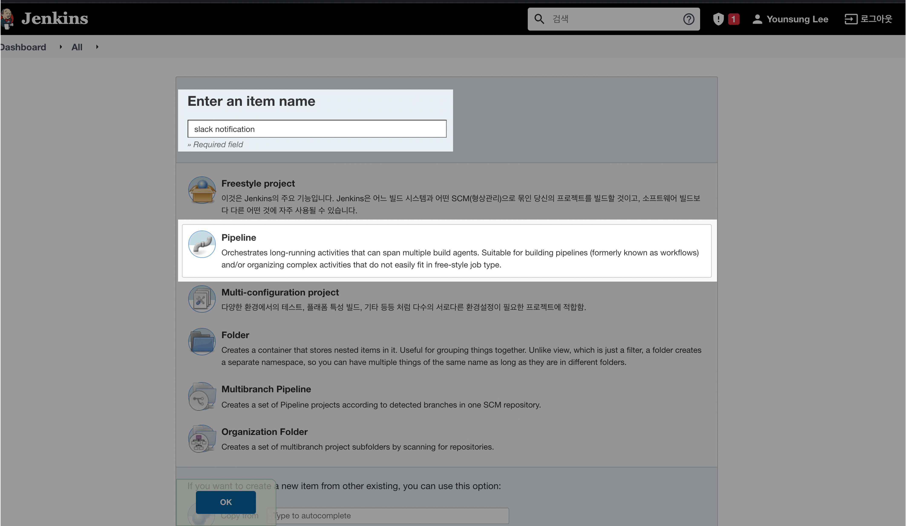

## 개요

이 글에서는 Jenkins 파이프라인 실행 결과를 Slack으로 자동 알림받는 방법을 설명합니다.

주요 내용:

- Jenkins Slack Notification 플러그인 설치
- Slack Incoming Webhook 설정
- Jenkins Pipeline에서 Slack 알림 구현
- 빌드 실패 시 자동 알림 테스트

최신 CI/CD 트렌드와 관련 도구들(Github Actions, ArgoCD)도 함께 다룹니다.

&nbsp;

## 필요 조건

- **컨테이너 형태로 구축된 Jenkins Server** : 실습에서 중요한 핵심 요소
- **Slack 계정** : Jenkins와 Slack을 연동할 때 필요
- **Github 계정** : Github Repository를 만들고 Jenkinsfile 코드를 업로드할 때 필요

&nbsp;

## 환경

### 시스템 구성도


DigitalOcean이라는 클라우드 플랫폼 위에 Ubuntu 20.04.3 OS가 설치된 Virtual Server 1대를 생성해놓았다.

아래는 호스트 서버의 운영체제 정보이다.

```bash
$ cat /etc/os-release | grep VERSION
VERSION="20.04.3 LTS (Focal Fossa)"
VERSION_ID="20.04"
VERSION_CODENAME=focal
$ arch
x86_64
```

&nbsp;

그 리눅스 서버 위에 Docker를 설치후 Jenkins를 도커 컨테이너로 올린 구성이다.  

```bash
$ ps -ef | grep docker
root        2924       1  0  2021 ?        00:01:10 /usr/bin/dockerd -H fd:// --containerd=/run/containerd/containerd.sock
```

```bash
$ docker ps
CONTAINER ID   IMAGE            COMMAND                  CREATED        STATUS        PORTS                                                                                      NAMES
c269a4e8a445   jenkins-docker   "/sbin/tini -- /usr/…"   26 hours ago   Up 26 hours   0.0.0.0:8080->8080/tcp, :::8080->8080/tcp, 0.0.0.0:50000->50000/tcp, :::50000->50000/tcp   jenkins
```

&nbsp;

이 포스팅에서는 Jenkins 서버를 설치하고 구축하는 과정을 다루지 않습니다.

Jenkins Server를 직접 구축하고 싶다면 다른 글을 참고하세요.

&nbsp;

### Virtual Server 환경 상세정보

- **Cloud Service Provider** : DigtialOcean
- **OS** : Ubuntu 20.04.3 LTS
- **Linux Kernel** : 5.4.0-88-generic
- **Docker** : Docker version 20.10.12, build e91ed57
  - **Jenkins** : 2.319.1
  - 젠킨스 컨테이너를 생성할 때 사용한 컨테이너 이미지는 Jenkins 공식 도커허브 이미지( [`jenkins/jenkins:lts`](https://hub.docker.com/r/jenkins/jenkins))이다.
  - **Jenkins Plugin** : Slack Notification 2.49

&nbsp;

## 젠킨스와 슬랙 연동

### 1. Jenkins 플러그인 설치

Jenkins 관리 페이지로 로그인한다. Jenkins에서 사용하는 기본 포트는 8080이다.


현재 사용중인 Jenkins 버전은 2021년 12월 1일에 출시된 `2.319.1`이다.  
[Jenkins | LTS Changelog](https://www.jenkins.io/changelog-stable/)

&nbsp;

Jenkins 메인화면 → Jenkins 관리 → 플러그인 관리 메뉴로 들어가자.


&nbsp;

설치 가능 탭으로 이동한다.


&nbsp;

설치 가능 탭에서 slack으로 검색한다.


Slack Notification 2.49 버전이 검색된다.

&nbsp;

[Slack Notification](https://plugins.jenkins.io/slack/#documentation) 2.49 버전 플러그인을 설치한다.  
Slack Notification에 Install 체크 → Download now and install after restart 클릭


&nbsp;

젠킨스가 Slack Notification 플러그인을 설치한 후 자동으로 재시작할 것이다.


잠시 기다린 후 다시 젠킨스에 로그인한다.

&nbsp;

### 2. Slack setup

[slack 공식 홈페이지](www.slack.com)로 접속한후 새로운 계정으로 가입한다.  

이미 Slack 계정을 가지고 있다면 또 가입할 필요는 없다.  


&nbsp;

새 워크스페이스를 만든 후, 워크스페이스에 사용할 앱을 추가하기 위해 앱 화면으로 들어간다.


&nbsp;

검색창에 webhook을 입력한다.


Incoming Webhooks를 워크스페이스에 연결하기 위해 추가한다.

&nbsp;

Incoming Webhooks의 설정에 들어간다.  

채널에 포스트 값에 alerts를 입력한다. #alerts 채널이 웹후크 메세지를 받겠다는 것이다.


[수신 웹후크 통합 앱 추가] 버튼을 클릭한다.  

&nbsp;

하단에 내려보면 웹후크 URL이 보인다.  

지금 바로 사용할 것은 아니기 때문에 웹후크 URL을 메모장에 따로 복사해놓는다.  


&nbsp;

### 3. Jenkins Slack 설정

Jenkins 메인화면 → 시스템 설정 메뉴로 들어간다.


&nbsp;

환경설정에서 하단으로 쭉 내려보면, Slack 섹션이 있다.  
젠킨스에 Slack Notification 플러그인이 설치되어 있는 경우에만 해당 메뉴가 보인다.

여기서 Credential 값에 아까 슬랙에서 복사한 웹후크 URL이 들어갈 것이다.


[고급...] 버튼을 눌러서 전체 속성을 볼 수 있게 화면을 확장 시킨다.

&nbsp;

Credential → Add → Jenkins 를 눌러서 Slack용 로그인 정보를 새로 생성하자.


&nbsp;

아까 복사한 웹후크 URL을 보자.


웹후크 URL의 앞부분(`https://hooks.slack.com/services/`)을 제외하고 뒷부분만 복사한다.  

&nbsp;

#### Slack Credential 생성

[Add] 버튼을 누르면 아래와 같은 Credential 생성화면이 나타난다.


- **Kind** : Secret text
- **Secret** : 웹후크 URL의 뒷부분을 복사 붙여넣기한다.
- **ID** : slack-alerts (본인이 원하는 걸로 바꿔도 무방하다.)
- **Description** : ID에 대한 부가설명

&nbsp;

참고로 이렇게 Credential을 쓰는 이유는 보안을 강화하기 위해서이다.  

실제 운영 환경에서 Webhook URL이라던지 ID/PW 값을 공개할 수는 없으니, Jenkins가 따로 Credential을 안전하게 관리한다.  

&nbsp;

#### Slack 세팅 점검

- **Credential** : slack-alerts (우리가 방금 만든)
- **Default channel / member id** : #alerts
- **Override url** : `https://hooks.slack.com/services/`

위 설정값들을 입력 후 `Test Connection` 버튼 클릭


설정값을 올바르게 넣었다면 접속 성공이라는 메세지(Success)가 떨어진다. `Test Connection` 버튼을 여러번 눌러본다.

&nbsp;

`Test Connection` 버튼을 누를 때마다 #alert 채널로 메세지가 들어온다.


&nbsp;

최종적으로는 Jenkins 파이프라인에서 build 실패가 발생하는 경우에 Slack 메세지를 자동으로 보내주도록 구현할 것이다.


&nbsp;

### 4. Jenkinsfile 준비

Jenkinsfile은 젠킨스 파이프라인이 동작하는 전체 과정을 코드로 적어놓은 명세서라고 생각하면 된다. Jenkinsfile은 groovy라는 언어를 사용한다.

새 레포지터리를 만들고 Jenkinsfile 을 올려놓는다. 내 경우 환경은 아래와 같다.

- **레포지터리 이름** : jenkins-pipeline-toyproj [바로가기](https://github.com/seyslee/jenkins-pipeline-toyproj)
- **Jenkinsfile 경로** : `/5-slack-notifications/Jenkinsfile` (깃허브 레포 기준)


&nbsp;

내 경우 로컬 환경에서 Jenkinsfile 코드를 작성하고 레포지터리를 연결한 다음, `git push`로 코드(Jenkinsfile)를 미리 레포지터리에 밀어넣은 상태이다.


&nbsp;

Jenkinsfile 코드는 다음과 같다.

```groovy
node {

  // job
  try {
    stage('build') {
      println('so far so good...')
    }
    stage('test') {
      println('A test has failed!')
      sh 'exit 1'
    }
  } catch(e) {
    // mark build as failed
    currentBuild.result = "FAILURE";

    // send slack notification
    slackSend (color: '#FF0000', message: "FAILED: Job '${env.JOB_NAME} [${env.BUILD_NUMBER}]' (${env.BUILD_URL})")

    // throw the error
    throw e;
  }
}
```

#### Jenkinsfile 실행시 파이프라인 진행순서

1. `try{}` 블록에서 `build` stage 실행 (정상 실행)
2. `test` stage 실행 중 `exit 1` 명령어로 의도적 실패 발생
3. `catch{}` 블록에서 실패 감지 및 `currentBuild.result`를 "FAILURE"로 설정
4. `slackSend()` 함수로 Slack에 실패 알림 전송 (Slack Notification 플러그인이 제공하는 함수이며, Jenkins 기본 내장 함수가 아님)
   - Jenkins 시스템 설정의 'Default channel'에 지정된 채널(#alerts)로 전송
   - `slackSend()` 함수에서 channel 파라미터를 별도로 지정하지 않았기 때문
   - 다른 채널로 보내고 싶다면 `slackSend(channel: '#다른채널')` 형태로 지정 가능
   - color: 슬랙 알림 메세지의 사이드바 색깔을 결정. `#FF0000`은 빨간색이므로 사용자가 실패 상황을 빠르게 인지할 수 있도록 함
   - message에는 동적으로 job 이름(`${env.JOB_NAME}`), 빌드 번호(`${env.BUILD_NUMBER}`), 빌드 URL(`${env.BUILD_URL}`)이 포함되어 있어 받는 사람이 빠르게 문제를 파악하고 해당 빌드 페이지로 이동할 수 있도록 함
5. 에러를 발생(throw)시킴으로써 파이프라인 종료

&nbsp;

### 5. Jenkins pipeline 생성

Jenkins 메인화면 → create a new job으로 들어간다.



- **Item name** : slack notification (본인이 하고 싶은걸로 바꿔도 무방함)
- **종류** : Pipeline

[OK] 버튼을 누르면 다음 화면으로 넘어간다.  

&nbsp;

Pipeline 정보를 넣는다.  

Branch Specifier 값이 master가 아닌 main이라는 점을 체크한다.  

- **Definition** : Pipeline script from SCM
- **SCM** : Git
- **Repository URL** : `https://github.com/seyslee/jenkins-pipeline-toyproj.git`
  - 스스로 구축한 Github Repository가 있다면 그걸로 바꿔서 입력.
- **Branch Specifier** : `*/main`
  - 2020년 10월을 기점으로 github는 default branch 이름인 master가 인종 차별적 단어라는 이유로 main이 기본 생성되도록 변경했다.
  - **원문** : [The default branch for newly-created repositories is now main | GitHub Changelog](https://github.blog/changelog/2020-10-01-the-default-branch-for-newly-created-repositories-is-now-main/)


&nbsp;

- **Script Path** : `5-slack-notification/Jenkinsfile` (해당 레포 기준에서의 Jenkinsfile의 경로를 의미한다.)


입력 후 저장한다.  

&nbsp;

slack notification 초기화면 → [Build Now] 버튼 클릭  


&nbsp;

Build를 시작하면 Jenkins이 Github Repository에 저장되어 있는 Jenkinsfile을 기반으로 파이프라인을 실행한다.  

우리가 의도한대로 build stage는 문제없이 통과하고 test stage에서 실패한다.  


&nbsp;

**에러화면**


아랫줄에 출력된 로그를 자세히 보자.  

&nbsp;

```bash
.....
[Pipeline] // stage
[Pipeline] slackSend
Slack Send Pipeline step running, values are - baseUrl: https://hooks.slack.com/services/, teamDomain: <empty>, channel: #alert, color: #FF0000, botUser: false, tokenCredentialId: slack-alerts, notifyCommitters: false, iconEmoji: <empty>, username: <empty>, timestamp: <empty>
[Pipeline] }
[Pipeline] // node
.....
```

`baseUrl`, `channel` 값이 jenkins slack 설정값과 동일하게 제대로 넘어갔는지 체크한다.  

&nbsp;

build가 실패하자 #alert 채널에 FAILED: Job 메세지가 출력되었다.  


&nbsp;

전달받은 slack 메세지에 딸린 URL을 클릭하면 해당 오류를 발생시킨 Jenkins build 페이지로 연결된다!  


&nbsp;

정상 접속된 Jenkins 웹페이지  


&nbsp;

## 최근 CI/CD 트렌드 변화

최근 클라우드 네이티브 환경으로의 전환이 가속화되면서 CI/CD 아키텍처도 크게 변화하고 있다.

&nbsp;

### Jenkins에서 Github Actions + ArgoCD로의 전환

기존에는 Jenkins가 CI/CD를 모두 담당했다. 풍부한 플러그인 생태계와 검증된 안정성으로 단일 도구만으로도 빌드부터 배포까지 전체 파이프라인을 효율적으로 관리할 수 있었기 때문이다.

하지만 최근에는 CI는 Github Actions가, CD는 ArgoCD가 담당하는 구성이 늘어나고 있다.

&nbsp;

이러한 변화의 주요 원인은:

1. **클라우드 네이티브 지향**: Kubernetes가 컨테이너 오케스트레이션의 표준이 되면서 K8s 친화적 도구들이 선호되고 있다. Jenkins의 무거운 아키텍처보다 경량화된 도구들이 클라우드 환경에 더 적합하며, 컨테이너 기반 배포에 최적화된 도구들의 수요가 증가하고 있다.
2. **운영 부담 감소**: Jenkins 서버 자체의 업데이트/패치/백업 관리가 불필요하고, 플러그인 호환성 이슈와 버전 관리에서 자유롭다. 특히 SaaS 형태의 Github Actions는 인프라 운영 부담이 없다는 큰 장점이 있다.
3. **GitOps 패러다임**: Git을 통한 인프라 변경 이력 추적과 감사가 용이하며, 선언적 인프라 관리로 환경 일관성을 보장할 수 있다. ArgoCD의 자동 동기화(auto sync) 기능으로 인프라와 배포 상태의 불일치를 방지할 수 있다.


&nbsp;

### 대비가 필요한 시점

Jenkins는 여전히 강력하고 범용성 높은 도구지만, DevOps 엔지니어라면 다음에 대한 학습을 병행하는 것이 좋다.

- Github Actions 파이프라인 구성 방법
- ArgoCD를 통한 K8s 배포 자동화
- GitOps 기반 운영 방식

&nbsp;

## 결론

ChatOps가 요즘 운영 트렌드이며, Jenkins는 여전히 많은 기업에서 핵심 CI/CD 도구로 사용되고 있다. Jenkins와 Slack의 다양한 앱을 통합하면 서비스 모니터링과 알람 자동화를 쉽게 구현할 수 있다는 장점이 있다.

다만 앞서 설명했듯이 클라우드 네이티브 환경에서는 Github Actions, ArgoCD 등 새로운 도구들의 채택이 늘어나는 추세다. DevOps 엔지니어라면 Jenkins의 기본기를 탄탄히 하면서도, 새로운 도구들에 대한 학습을 병행하는 것이 좋다.

이상으로 긴 글 읽어주신 독자분들 감사합니다.
