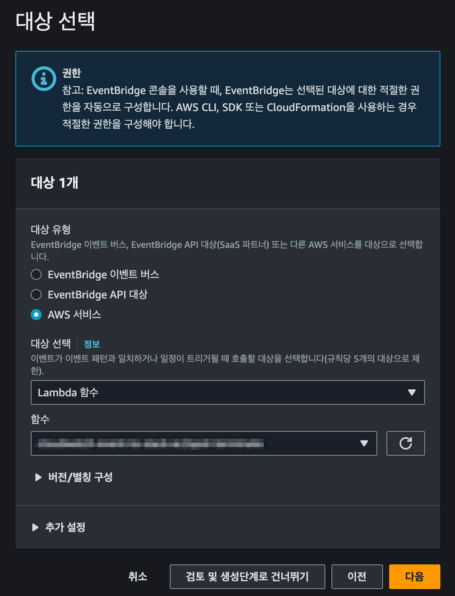

## 개요

Spot 인스턴스 중단 알림이 발생할 때마다 Slack 채널로 메세지를 발송하도록 자동화합니다.

EventBridge와 Lambda Function을 사용해 별도 인프라 관리가 필요 없는 서버리스 형태로 구현했습니다.

&nbsp;

## 아키텍처

AWS 아키텍처는 다음과 같습니다.


핵심 컴포넌트는 크게 2가지입니다.

- **EventBridge** : EventBridge Rule을 통해 스팟 인스턴스 중단 안내 이벤트만 필터링한 후, 해당 이벤트 정보를 Lambda Function으로 전달합니다.
- **Lambda Function** : 안내 메세지를 내부적으로 가공한 다음, Slack incoming webhook을 사용해 슬랙 채널로 알림 메세지를 보냅니다.

&nbsp;

## 준비사항

알림 메세지를 보낼 슬랙 채널에 Incoming Webhook이 미리 생성되어 있어야 합니다.


&nbsp;

## 배경지식

Amazon EC2는 스팟 인스턴스를 중단할 때 실제 중단 2분 전에 중단 알림<sup>Spot Instance interruption notice</sup> 이벤트를 전송합니다.

스팟 인스턴스의 생명주기는 다음과 같습니다.


Lambda Function을 사용해서 구현하면 Interruption Notice가 발생한 즉시 슬랙을 통해 안내 메세지를 받을 수 있습니다.

&nbsp;

## 구성하기

### 구성에 대한 개요

슬랙 메시지 알림 자동화를 구성할 때, 일반적으로 Lambda 함수를 먼저 생성하는 것이 좋습니다. Lambda 함수는 실제로 이벤트를 처리하고, 해당 이벤트에 대한 액션을 수행하는 역할을 합니다.

따라서, Lambda 함수를 먼저 생성한 후에 EventBridge Rule을 생성하여 Lambda 함수와 연결하는 것이 일반적인 접근 방식입니다.

&nbsp;

전체적인 시스템 구성 작업은 2단계로 구분됩니다.

1. 필요한 작업을 수행하기 위한 Lambda 함수를 생성합니다.
2. Lambda 함수의 환경변수를 설정합니다.
3. Lambda 함수를 트리거하기 위한 EventBridge Rule을 생성합니다.
   - EventBridge Rule을 설정하여 원하는 이벤트를 감지하고 Lambda 함수를 호출하도록 구성합니다.
   - EventBridge Rule 생성과정에 이벤트를 전달할 대상(Lambda 함수) 지정이 포함되어 있습니다.

&nbsp;

### 1. Lambda Function 생성

슬랙 메세지를 보내는 Lambda Function은 boto3 라이브러리를 사용해서 인스턴스의 Private IP와 Instance의 이름을 출력합니다.


스팟 인스턴스 이름과 Private IP를 얻어오기 위해 boto3의 [ec2 instance resource](https://boto3.amazonaws.com/v1/documentation/api/latest/reference/services/ec2/instance/index.html)를 사용합니다.

1. 인스턴스 이름은 ec2 instance resource의 [instance.tags](https://boto3.amazonaws.com/v1/documentation/api/latest/reference/services/ec2/instance/tags.html) 속성<sup>attribute</sup>을 사용해서 얻어옵니다.
2. 인스턴스의 Private IP 주소는 ec2 instance resource의 [instance.private_ip_address](https://boto3.amazonaws.com/v1/documentation/api/latest/reference/services/ec2/instance/private_ip_address.html) 속성<sup>attribute</sup>을 사용해서 얻어옵니다.

[사용 가능한 전체 Attribute 목록 확인하기](https://boto3.amazonaws.com/v1/documentation/api/latest/reference/services/ec2/instance/index.html#attributes)

&nbsp;

아래는 람다가 슬랙 채널로 보낸 스팟 인스턴스 중단 안내 메세지 예시입니다.


&nbsp;

Lambda Function을 생성합니다.

- **함수 이름 지정** : test_ec2spot_terminate_notification
- **런타임** : Python 3.7
- **아키텍처** : x86_64
- **실행 역할** : 기본 Lambda 권한을 가진 새 역할 생성

&nbsp;

Lambda Function를 생성하면 CloudWatch Logs 권한이 부여된 기본 IAM Role이 생성됩니다.

기본 생성되는 Lambda Function용 IAM Role은 `<LAMBDA_FUNCTION_NAME>-role-xyz1xy2z`와 같은 포맷의 이름이 자동 부여됩니다.

&nbsp;

AWS 콘솔에서 새로 생성될 기본 IAM Role의 이름을 미리 확인할 수 있습니다.


&nbsp;

새로 생성된 Lambda Function의 기본 IAM Role을 확인합니다.

```json
{
    "Version": "2012-10-17",
    "Statement": [
        {
            "Effect": "Allow",
            "Action": "logs:CreateLogGroup",
            "Resource": "arn:aws:logs:ap-northeast-2:111122223333:*"
        },
        {
            "Effect": "Allow",
            "Action": [
                "logs:CreateLogStream",
                "logs:PutLogEvents"
            ],
            "Resource": [
                "arn:aws:logs:ap-northeast-2:111122223333:log-group:/aws/lambda/<YOUR_LAMBDA_NAME>:*"
            ]
        }
    ]
}
```

기본적으로 CloudWatch Logs를 생성하고 쓸 수 있는 권한만 부여되어 있습니다.

&nbsp;

Lambda가 EC2 스팟 인스턴스의 Private IP와 Instance Name을 파악하기 위해 관련된 EC2 권한을 추가합니다.

Lambda의 IAM Role에 EC2 권한을 추가한 결과는 다음과 같습니다.

```json
{
    "Version": "2012-10-17",
    "Statement": [
        {
            // ... 람다 생성 시 기본으로 부여되는 CloudWatch Logs 권한 ...
        },
        {
            "Sid": "GetDetailedInfoFromInterruptedSpotInstance",
            "Effect": "Allow",
            "Action": [
                "ec2:DescribeInstances",
                "ec2:DescribeTags"
            ],
            "Resource": "*",
            "Condition": {
                "StringEquals": {
                    "ec2:Region": "ap-northeast-2"
                }
            }
        }
    ]
}
```

[ec2:Region](https://docs.aws.amazon.com/IAM/latest/UserGuide/reference_policies_examples_ec2_region.html) 조건을 활용하여 최소 권한 원칙을 유지하며, 특정 리전의 EC2 인스턴스에 대한 상세 정보를 조회할 수 있도록 제한합니다.

&nbsp;

이제 람다 Python 코드를 아래와 같이 작성합니다.

```python
import json
import logging
import os
import boto3

from base64 import b64decode
from urllib.request import Request, urlopen
from urllib.error import URLError, HTTPError

HOOK_URL = os.environ['hookUrl']
SLACK_CHANNEL = os.environ['slackChannel']

logger = logging.getLogger()
logger.setLevel(logging.INFO)


def get_instance_name(instance_id):
    # Create an EC2 resource
    ec2 = boto3.resource("ec2")
    instance = ec2.Instance(instance_id)

    # Retrieve instance name tag
    instance_name = None
    for tag in instance.tags:
        if tag["Key"] == "Name":
            instance_name = tag["Value"]
            break

    # Return the instance name tag
    return instance_name


def get_instance_private_ip(instance_id):
    # Create an EC2 resource
    ec2 = boto3.resource("ec2")
    instance = ec2.Instance(instance_id)

    # Retrieve instance private ip
    try:
        instance_private_ip = instance.private_ip_address
    except Exception as e:
        logger.error(f"Error occurred while retrieving private IP for instance id: {instance_id}")
        logger.error(f"Request failed: {e}")

    # Return the instance private ip
    return instance_private_ip
    

def lambda_handler(event, context):
    logger.info("Event: " + str(event))
    message = event

    region = message['region']
    account_id = message['account']
    instance_arn = ''.join(message['resources'])
    instance_id = message['detail']['instance-id']
    instance_name = get_instance_name(instance_id)
    instance_private_ip = get_instance_private_ip(instance_id)
    instance_action = message['detail']['instance-action']
    instance_url = f"https://{region}.console.aws.amazon.com/ec2/home?region={region}#Instances:instanceId={instance_id}"

    # Send slack message for spot instance interruption events.
    slack_message = {
        "channel": SLACK_CHANNEL,
        "username": "EC2 Spot Instance Interruption Warning",
        "icon_url": "https://raw.githubusercontent.com/aendrew/aws-slack-emojipack/master/General_AWScloud.png",
        "blocks": [
            {
                "type": "section",
                "text": {
                    "type": "mrkdwn",
                    "text": 'EC2 스팟 인스턴스가 중단될 예정입니다.'
                }
            },
            {
                "type": "divider"
            }
        ],
        "attachments": [
            {
                "fallback": "EC2 Spot Instance Interruption Warning",
                "color": "#FFC300",
                "blocks": [
                    {
                        "type": "section",
                        "fields": [
                            {
                                "type": "mrkdwn",
                                "text": f"*Account*:  {account_id}"
                            },
                            {
                                "type": "mrkdwn",
                                "text": f"*ARN*:  {instance_arn}"
                            },
                            {
                                "type": "mrkdwn",
                                "text": f"*Instance ID*:  {instance_id}"
                            },
                            {
                                "type": "mrkdwn",
                                "text": f"*Instance Name*:  {instance_name}"
                            },
                            {
                                "type": "mrkdwn",
                                "text": f"*Instance Private IP*:  {instance_private_ip}"
                            },
                            {
                                "type": "mrkdwn",
                                "text": f"*Action*:  {instance_action}"
                            }
                        ]
                    },
                    {
                        "type": "actions",
                        "elements": [
                            {
                                "type": "button",
                                "text": {
                                    "type": "plain_text",
                                    "text": "AWS 콘솔에서 EC2 조회  :waving_white_flag:"
                                },
                                "style": "primary",
                                "url": instance_url
                            }
                        ]
                    }
                ]
            }
        ]
    }
    
    try:
        req = Request(HOOK_URL, json.dumps(slack_message).encode('utf-8'))
        req.add_header('Content-Type', 'application/json')
        response = urlopen(req)
        response.read()
        logger.info("Message posted to %s", slack_message['channel'])
    except HTTPError as e:
        logger.error("Request failed: %d %s", e.code, e.reason)
    except URLError as e:
        logger.error("Server connection failed: %s", e.reason)

```

EventBridge에게 받은 json 이벤트를 파싱해서 슬랙 채널로 발송하는 코드입니다.

boto3 라이브러리는 이벤트에 포함된 Instance ID를 기준으로 스팟 인스턴스의 Private IP와 인스턴스 이름(Name 태그)을 찾은 후 반환해주는 역할을 합니다.

&nbsp;

#### 메세지 구성요소 `attachments`

Slack 메세지 구성요소에서 `attachments`는 2019년 초에 도입된 새로운 메시지 구성 방식 `blocks`의 등장으로부터 레거시(구식)로 간주되기 시작했습니다.  
이후, `blocks`를 사용하여 풍부한 레이아웃과 상호 작용을 가능하게 하는 새로운 메시지 구성 방식이 주로 사용되고 권장되었습니다.

`attachments`는 2019년 이전에 사용되던 방식이며, 현재 슬랙에서는 [공식적으로](https://api.slack.com/messaging/composing/layouts#when-to-use-attachments) `attachments` 대신 `blocks` 사용을 권장하고 있습니다.

자세한 사항은 슬랙 공식 레퍼런스 [_Migrate your legacy message compositions to blocks_](https://api.slack.com/messaging/attachments-to-blocks)를 참고하세요.

&nbsp;

제 경우 메세지의 사이드바에 커스텀하게 오렌지 색<sup>#FFC300</sup>을 입히고 싶어서 어쩔 수 없이 `attachments`를 사용했습니다.

```json
{
    "attachments": [
        {
            "color": "#FFC300"
        }
    ]
}
```

> **참고사항**  
> 2023년 6월 기준 `color`는 `blocks`에서 지원하지 않고 `attachments` 안에서만 사용 가능한 속성입니다.

&nbsp;

## 2. Lambda Function 환경변수 설정

이제 Lambda Function의 환경변수를 설정합니다.


&nbsp;

AWS 콘솔 → Lambda Function → 구성 탭 → 환경변수 메뉴로 들어갑니다.


&nbsp;

Lambda Function에 환경변수를 추가합니다.

| Key              | Value                           | Value 예시 |
|------------------|---------------------------------|-----------|
| **hookUrl**      | Incoming webhook의 고유한 URL 주소 | <https://hooks.slack.com/serivces/.../.../...> |
| **slackChannel** | 슬랙 채널 이름                     | #인프라_이벤트_알림 |

위 환경변수 2개는 슬랙 메세지 발송에 필요한 채널명과 Incoming webhook의 URL 정보입니다.

&nbsp;

운영 체제에 설정되어 있는 모든 환경변수는 `os` 모듈의 `environ`이라는 속성을 통해서 접근이 가능합니다. 이 `os.environ` 속성은 마치 파이썬 내장 자료 구조인 사전(dictionary)을 사용하듯이 사용할 수 있습니다.

위 2개 환경변수 값은 람다 코드에서 `os.environ[]` 속성으로 받아 변수로 활용하게 됩니다.

```python
import json
import logging
import os
import boto3

from base64 import b64decode
from urllib.request import Request, urlopen
from urllib.error import URLError, HTTPError

# ...

HOOK_URL = os.environ['hookUrl']
SLACK_CHANNEL = os.environ['slackChannel']

# ...
```

&nbsp;

### 3. EventBridge Rule 생성

[EventBridge의 Rule](https://docs.aws.amazon.com/eventbridge/latest/userguide/eb-rules.html)을 새로 생성합니다.

EC2 스팟 인스턴스 중지 안내 이벤트가 발생하면, EventBridge Rule이 해당 이벤트를 감지하고 Lambda 함수를 호출하여 원하는 작업을 수행하는 구조입니다.

&nbsp;

이벤트 패턴은 다음과 같이 설정합니다.

```bash
{
  "source": [
    "aws.ec2"
  ],
  "detail-type": [
    "EC2 Spot Instance Interruption Warning"
  ]
}
```

위의 패턴은 AWS EC2 스팟 인스턴스 중단 경고에 대한 EventBridge Rule의 패턴을 나타냅니다.  
이 패턴은 EC2 스팟 인스턴스가 중단될 예정임을 알리는 경고 이벤트를 감지하기 위해 사용됩니다.

&nbsp;

대상은 이전 단계에서 생성한 Lambda Function으로 지정하고 다음 단계로 넘어갑니다.



&nbsp;

대상을 지정한 후 EventBridge Rule을 생성하면 Lambda Function에 자동 연결됩니다.

아래는 AWS 콘솔에서 Lambda Function의 트리거 설정을 확인한 화면입니다.


새로 생성한 EventBridge Rule이 Lambda의 트리거로 연결된 걸 확인할 수 있습니다.

&nbsp;

EventBridge Rule 설정을 AWS 콘솔에서 확인합니다.


EC2 Spot 인스턴스 중단 안내 이벤트를 감지하도록 이벤트 패턴이 설정된 걸 확인할 수 있습니다.

&nbsp;

이제 EC2 Spot 인스턴스 중단 안내 이벤트가 발생할 때마다 EventBrige가 이를 감지하고 Lambda Function을 트리거합니다.

EventBridge에 의해 트리거된 Lambda Function은 코드를 실행하고, 지정된 슬랙 채널로 다음과 같은 안내 메세지를 발송합니다.


&nbsp;

메세지 하단의 **EC2 콘솔에서 해당 인스턴스 조회하기** 버튼을 누르면 해당 인스턴스 정보를 검색한 상태의 EC2 콘솔로 연결됩니다.


&nbsp;

## 참고자료

[Best practices for handling EC2 Spot Instance interruptions](https://aws.amazon.com/ko/blogs/compute/best-practices-for-handling-ec2-spot-instance-interruptions/)  
AWS Compute Blog

[Lambda: IAM, SG 변경 사항을 Slack으로 알람 받기](https://nyyang.tistory.com/126)  
이 글에서는 메세지에 포함된 클릭 버튼이나 섹션 구분 등 슬랙 메세지 형태를 위주로 참고했습니다.

[Taking Advantage of Amazon EC2 Spot Instance Interruption Notices](https://aws.amazon.com/ko/blogs/compute/taking-advantage-of-amazon-ec2-spot-instance-interruption-notices/)  
AWS Compute Blog의 Amazon EC2 스팟 인스턴스 중단 공지 활용 글

[Karpenter와 Spot으로 저렴하고 유연하게 노드 프로비저닝하기](https://tech.scatterlab.co.kr/spot-karpenter/)  
스팟 인스턴스 생명주기를 위주로 참고함

[스팟 관련 AWS 자동화 코드 예제](https://github.com/awslabs/ec2-spot-labs)  
AWS에서 공식 운영하는 깃허브 저장소 `ec2-spot-labs`. 여기서 Spot 인스턴스 사용과 관련된 다양한 툴, 코드 예제를 볼 수 있습니다.
