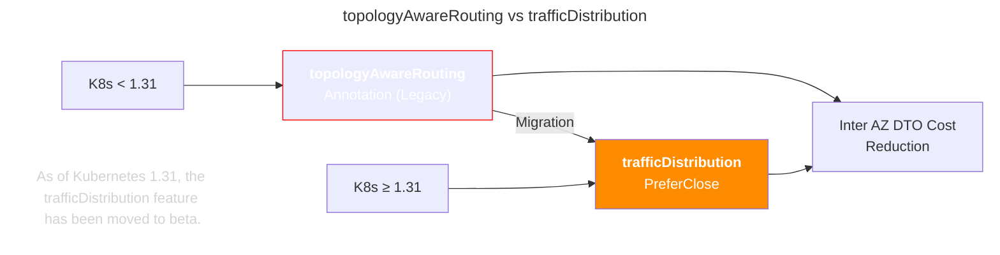
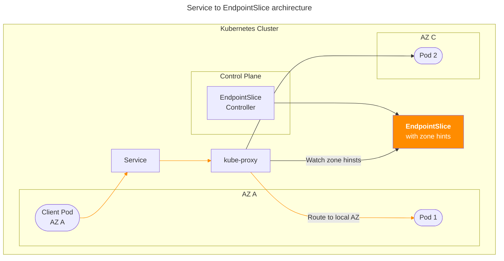

## 개요

프록시 서버 구성과 관리는 DevOps Engineer or SRE의 주요 업무입니다.

레거시 포워드 프록시 서버였던 EC2 기반의 [Tinyproxy](https://github.com/tinyproxy/tinyproxy)를 Kubernetes 클러스터에서 구동되는 squid로 마이그레이션한 여정을 소개합니다.

## TLDR

- **대상 독자**: DevOps 엔지니어, SRE, 쿠버네티스 운영자
- **얻을 수 있는 점**: 
EC2 기반 [Tinyproxy](https://github.com/tinyproxy/tinyproxy)를 K8s Squid로 마이그레이션하여 운영 효율성과 모니터링 가시성을 크게 개선한 경험담입니다. 레거시 인프라의 컨테이너화 과정과 헬름 차트 개발을 통한 자동화 구현 방법을 다룹니다.

## 환경

- EKS 1.32
- Amazon Linux 2, amd64
- Squid 6.10-24.10_beta
  - [squid 헬름 차트](https://github.com/younsl/charts/tree/main/charts/squid)로 설치

## 구성 가이드

### Squid

슬픈 현실부터 말하자면 오픈소스 프록시 서버인 squid는 공식 컨테이너 이미지는 제공하지만 헬름 차트는 제공하지 않습니다. 그래서 제가 직접 [squid 헬름 차트](https://github.com/younsl/charts/tree/main/charts/squid)를 개발했고 현재 지속적으로 개선하고 있습니다.

#### 헬름 차트 설치

squid 헬름 차트를 설치하려면 먼저 사용 가능한 버전을 [crane](https://github.com/google/go-containerregistry/tree/main/cmd/crane)으로 확인할 수 있습니다:

```bash
crane ls ghcr.io/younsl/charts/squid
```

OCI 기반 차트 저장소는 `helm search repo`로 직접 검색할 수 없습니다. `helm search repo`는 기본적으로 전통적인 Helm repository (HTTP-based)를 검색하는 명령어이므로, OCI registry에 저장된 차트의 검색은 제한적입니다. 따라서 [crane](https://github.com/google/go-containerregistry/tree/main/cmd/crane)과 같은 별도 도구로 버전을 확인한 후 OCI 기반 헬름 차트를 다운로드하고 설치할 수 있습니다:

```bash
# 헬름 차트 다운로드 및 압축 해제
helm pull oci://ghcr.io/younsl/charts/squid --untar --version 0.7.0

# 헬름 차트 설치
helm upgrade --install squid ./squid --namespace squid --create-namespace
```

> Helm 3.8.0 이상에서만 OCI 기반 헬름 차트 다운로드를 지원합니다. 자세한 사항은 Helm 공식문서 [Use OCI-based registries](https://helm.sh/docs/topics/registries/)를 참고합니다.

### 기존 Tinyproxy 구성 (레거시)

포워드 프록시 역할을 EC2 기반의 tinyproxy 서버 2대가 하고 있었습니다.


프록시 서버 운영 중에 여러가지 어려움이 있었습니다.

- **유지보수 어려움**: Tinyproxy 서버 설정 파일 변경과 같은 작업시 유지보수 절차가 번거로웠습니다.
- **확장성**: ASG 기반이 아닌 직접 구축이라 서버의 확장과 축소가 유연하지 못함
- **비용**: 해당 EC2에 tinyproxy만 달랑 하나 떠있어서 컴퓨팅 리소스가 낭비되었으며, Elastic IP, NLB 등의 부가 리소스들의 비용이 부과되었습니다.
- **버그**: 간헐적으로 tinyproxy 버그([#383](https://github.com/tinyproxy/tinyproxy/issues/383#issuecomment-2411862355))로 행이 걸려 주기적으로 저를 포함한 DevOps Engineer들이 tinyproxy EC2 인스턴스를 재시작해줘야 했습니다. 우여곡절 끝에 tinyproxy 1.8.3을 1.11.2로 버전 업그레이드한 후 문제는 해결했지만 설치와 업그레이드 절차는 복잡했습니다. 더 심각한 건 GitOps로 tinyproxy 설정파일과 모든 EC2 형상을 선언적(Declarative) 인프라로 관리할 수 없는 환경이 DR 측면에서 매우 취약했습니다.
- **가시성 문제**: NLB나 타겟그룹의 상태에 대한 기존 메트릭 알람은 걸려 있었지만 세부적인 Squid 메트릭, 로그 등 운영 가시성이 전무했기 때문에 블랙박스 영역이었습니다.

이런 여러가지 운영의 한계점 때문에 저는 이 Tinyproxy 서버들을 쿠버네티스 위에 squid로 옮기기로 결심합니다.

### Squid proxy

그리고 다음과 같이 컨테이너 기반의 포워드 프록시 서버를 Kubernetes 클러스터에 구성했습니다.

Squid 설치는 제가 직접 만든 squid 헬름차트를 사용하고 ArgoCD의 Application으로 말아 올려 GitOps 패턴으로 운영했습니다.


이 아키텍처에서 Squid 파드는 포워드 프록시로서 내부 파드들을 직접 노출하지 않고도, 외부 요청을 대신 처리해주고 응답을 가져다주는 중간다리 역할을 합니다:


다행히 누군가 [squid-exporter](https://github.com/boynux/squid-exporter)를 이미 만들어두어서 아래와 같이 squid 파드에 사이드카로 추가해 메트릭을 쉽게 수집할 수 있었습니다.


- 쿠버네티스 클러스터에 컨테이너로 배포된 덕분에 기존에 운영중이던 Grafana와 Prometheus를 별도 설정 없이 즉시 사용할 수 있었습니다.
  - 전용 Grafana 대시보드는 squid 헬름 차트의 템플릿에 포함되어 있습니다.
- squid-exporter를 squid 파드의 사이드카로 심어서 쉽게 메트릭을 수집할 수 있었습니다.
- 프록시 서버인 squid 버전 업그레이드의 허들이 매우 낮아지며, 롤링 업데이트로 안정성도 확보됨. 컨테이너가 고장이 나더라도 Kubernetes의 셀프힐링으로 자율 운영이 가능합니다.

### Local AZ 통신 전략 

Squid 운영시 Local AZ 통신을 위한 Service의 trafficDistribution 설정도 중요합니다. 네트워크 지연시간 감소(소폭의), 장애 내결함성, AZ간(Inter AZ) 데이터 전송 비용 절감 3가지 이점을 얻을 수 있기 때문에 안하면 손해인 설정입니다.

참고로 Kubernetes 1.31부터는 [trafficDistribution](https://kubernetes.io/docs/concepts/services-networking/service/#traffic-distribution) 기능이 Beta로 승격되어 기본 활성화되었으며, 기존 topologyAwareRouting 어노테이션 대신 Service spec의 trafficDistribution: PreferClose 설정을 통한 Local AZ 통신 최적화가 권장됩니다.



더 자세한 사항은 [#50229](https://github.com/kubernetes/website/issues/50229)과 [Comparison with service.kubernetes.io/topology-mode: Auto](https://kubernetes.io/docs/reference/networking/virtual-ips/#comparison-with-service-kubernetes-io-topology-mode-auto) 페이지를 참고하세요.



trafficDistribution 설정 방법은 매우 간단합니다. 클러스터 내부 통신에서 되도록 같은 AZ(Local AZ)간의 통신을 선호하도록 spec.trafficDistribution 필드를 Service에 추가합니다.

```yaml
# service yaml (Kubernetes 1.31+ Beta)
spec:
  trafficDistribution: PreferClose
```

2개의 AZ를 사용하는 환경이었기 때문에 AZ A, C로 squid 파드들이 균등 분배되도록 토폴로지 분산 제약사항(topologySpreadConstraints)도 추가합니다.

```yaml
# deployment yaml
spec:
  replicas: 6
  template:
    spec:
      topologySpreadConstraints:
      - maxSkew: 1
        topologyKey: topology.kubernetes.io/zone
        whenUnsatisfiable: DoNotSchedule # Or ScheduleAnyway
        labelSelector:
          matchLabels:
            app: squid 
        # At least keep 2 availability zones
        minDomains: 2
```

trafficDistribution: PreferClose만 사용하면 특정 Zone에 Pod가 몰릴 경우 과부하(핫스팟)에 걸릴 위험이 있어서, topologySpreadConstraints로 Pod를 여러 Zone에 고르게 분산시켜 안전장치를 만드는 것이 권장됩니다.

공식 squid 헬름 차트가 존재하지 않는다는 점 빼면 많은 부분이 개선된 완벽한 전환기였습니다.

## 마치며

Envoy나 HAProxy처럼 좀 더 기능이 다양하고 대중적인 프록시 서버도 존재했습니다. HAProxy는 당근마켓이나 토스 뱅크 등에서 프로덕션 환경에서 사용하는 검증된 프록시 서버입니다.

하지만 이 포워드 프록시 서버가 처리하는 요구사항 자체가 너무 단순하다보니, 오버 엔지니어링을 지양하면서 동시에 제게 익숙한 squid를 선정했습니다. squid도 1996년에 출시된 오래된 프록시 서버 소프트웨어라 tinyproxy보다 낫다 수준이지 클라우드 네이티브한 녀석은 아니므로 다른 분들에게 추천은 못드리겠습니다. 툴이 오래되었건 구리건 잘쓰는 사람이 있으면 그만이긴 합니다.

## 관련자료

Github:

- [tinyproxy](https://github.com/tinyproxy/tinyproxy)
- [squid](https://github.com/squid-cache/squid)
- [squid-exporter](https://github.com/boynux/squid-exporter)

Kubernetes docs:

- [Topology Aware Routing](https://kubernetes.io/docs/concepts/services-networking/topology-aware-routing/)
- [Comparison with service.kubernetes.io/topology-mode: Auto](https://kubernetes.io/docs/reference/networking/virtual-ips/#comparison-with-service-kubernetes-io-topology-mode-auto)
