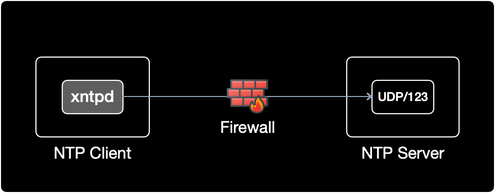

## 개요

IBM AIX의 클라이언트 서버에서 NTP 데몬을 동작후 NTP 서버와 시간 동기화하는 방법을 설명한다.  

어느날 내가 관리하는 IBM AIX 서버가 NTP 동기화가 안되고 있길래 점검하면서 공부할 겸 정리한 메뉴얼이다.

&nbsp;

## 증상

IBM AIX 클라이언트에서 NTP 서버와 시간 동기화가 불가능하다.

```bash
$ ntpq -p
ntpq: read: A remote host refused an attempted connect operation.
```

&nbsp;

## 원인

NTP 데몬인 xntpd가 실행중이지 않았다.

&nbsp;

## 환경

- **OS** : IBM AIX 7.2.0.0
- **Shell** : ksh

&nbsp;

## 조치방법

### 1. NTP 데몬 상태확인

IBM AIX에서 NTP 데몬의 이름은 `xntpd`이다. 리눅스의 경우는 `ntpd`이다.

가장 먼저 xntpd가 실행중인지 확인한다.

```bash
$ ps -ef | grep xntpd
    root 16449928  8848040   0 08:25:49  pts/0  0:00 grep xntpd
```

xntpd 가 실행중이지 않다.

&nbsp;

### 2. NTP 설정파일 확인

IBM AIX의 NTP 설정파일의 절대경로는 `/etc/ntp.conf`로 리눅스와 동일하다.  
xntpd는 시작될 때 `/etc/ntp.conf` 설정 정보를 읽는다.  
해당 설정파일을 수정하자.

```bash
$ cat /etc/ntp.conf | grep -v ^#
...
broadcastclient
driftfile /etc/ntp.drift
tracefile /etc/ntp.trace

server 10.10.10.123 prefer
```

**prefer**  
NTP 서버 IP 뒤에 `prefer` 키워드가 붙을 경우, 해당 NTP 서버와 우선적으로 연결한다.  

**명령어 설명**  
`grep -v ^#`는 주석을 제외한 내용만 출력하겠다는 의미이다.  
NTP 설정파일인 `ntp.conf` 상단에는 제조사인 IBM에서 초기 작성한 주석 라인이 약 30줄 정도로 많다.  
`grep -v ^#` 명령어를 붙이면 주석이 아닌 실제 설정 내용만 필터링해서 출력하기 때문에 보기 편하다.

&nbsp;

### 3. NTP 서비스 기동

```bash
$ startsrc -s xntpd -a "-x"
0513-059 The xntpd Subsystem has been started. Subsystem PID is 19268504.
```

xntpd 서비스가 시작되었다.

#### startsrc 명령어 설명

- `-s` : 서비스 이름
- `-a` : 서비스 옵션 파라미터
- `"-x"` : 클라이언트의 시간이 뒤로 돌아가는 것을 방지하는 옵션

&nbsp;

#### 시간롤백 방지 "-x"

- 만약 참조하는 NTP 서버(time server)가 현재 시간보다 과거시점으로 시간이 변경되었을 때, 해당 NTP 서버를 참조하는 클라이언트 측에서 시간이 뒤로 돌아가는 현상을 방지하기 위해서 xntpd 시작시, `-x` 옵션을 준다.
- Oracle DB 서버의 경우 시간 롤백이 발생할 경우 충돌될 수 있으므로 반드시 xntpd 시작시 `-x` 옵션을 넣어서 시간이 뒤로 돌아가는 것(time backward)을 방지한다.

&nbsp;

### 4. NTP 데몬 동작상태 확인

```bash
$ ps -ef | grep xntpd
    root 11010996  8848040   0 08:55:57  pts/0  0:00 grep xntpd
    root 19268504  3146712   0 08:55:54      -  0:00 /usr/sbin/xntpd -x
```

19268504 PID를 가진 xntpd 데몬이 `-x` 옵션이 붙은 상태로 잘 동작중이다.

&nbsp;

```bash
$ lssrc -s xntpd
Subsystem         Group            PID          Status 
 xntpd            tcpip            19268504     active
```

xntpd의 PID는 `19268504`, 상태는 동작중(`active`)이다.

&nbsp;

### 5. NTP 수동 동기화 실행

```bash
$ ntpdate -d 10.10.10.123
26 Oct 09:51:07 ntpdate[16777548]: 3.4y
transmit(10.10.10.123)
receive(10.10.10.123)
transmit(10.10.10.123)
receive(10.10.10.123)
transmit(10.10.10.123)
receive(10.10.10.123)
transmit(10.10.10.123)
receive(10.10.10.123)
transmit(10.10.10.123)
server 10.10.10.123, port 123
stratum 1, precision -19, leap 00, trust 000
refid [GPS], delay 0.02525, dispersion 0.00034
transmitted 4, in filter 4
reference time:      e521cf7a.00000000  Tue, Oct 26 2021  9:51:06.000
originate timestamp: e521cf7b.6dd2f12b  Tue, Oct 26 2021  9:51:07.429
transmit timestamp:  e521cf7b.6dd32000  Tue, Oct 26 2021  9:51:07.429
filter delay:  0.02649  0.02769  0.02525  0.02640 
               0.00000  0.00000  0.00000  0.00000 
filter offset: 0.000229 -0.00127 -0.00016 -0.00039
               0.000000 0.000000 0.000000 0.000000
delay 0.02525, dispersion 0.00034
offset -0.000160

26 Oct 09:51:07 ntpdate[16777548]: adjust time server 10.10.10.123 offset -0.00016
```

만약 `ntpdate -d` 실행후 `no server suitable for synchronization found` 에러 메세지가 발생할 경우, 아래 2가지 사항을 점검해보자.



1. NTP 서버에서 NTP 데몬(리눅스의 경우 `ntpd`, AIX의 경우 `xntpd`)이 정상 동작중인가?
2. 클라이언트와 NTP 서버 사이에 위치한 방화벽에서 NTP용 포트인 123번 포트가 통과 허용되어 있는가?
   - NTP 클라이언트와 NTP 서버의 iptables
   - 물리 방화벽 장비, IPS, IDS와 같은 네트워크 보안 장비

&nbsp;

`transmit`과 `receive`가 반복되면 NTP 서버와 클라이언트간 시간 데이터를 잘 주고 받고 있다는 의미이다.

```bash
...
transmit(10.10.10.123)
receive(10.10.10.123)
transmit(10.10.10.123)
receive(10.10.10.123)
transmit(10.10.10.123)
receive(10.10.10.123)
transmit(10.10.10.123)
receive(10.10.10.123)
transmit(10.10.10.123)
...
```

&nbsp;

시간 오차값(offset)은 -0.000160 이다.

```bash
...
offset -0.000160
...
```

&nbsp;

### 6. NTP 동기화 여부 확인

등록된 NTP 서버와 동기화된 상태인지 확인한다.

```bash
$ ntpq -p
     remote           refid      st t when poll reach   delay   offset    disp
==============================================================================
*10.10.10.123    .GPS.            1 u   20   64  377     0.76    0.183    0.20
```

#### ntpq 설명

- `remote` : IP 앞에 `*` 표시가 붙으면 해당 NTP 서버와 클라이언트가 정상적으로 동기화된 상태를 의미한다.
- `when` : NTP 서버로부터 데이터를 수신한 후 경과된 시간으로 데이터를 받으면 0으로 초기화된다. 단위는 초(second).

- `poll` : 클라이언트가 NTP 서버에 동기화 요청하는 주기. 단위는 초(second).

- `reach` : 최근 8번 Poll 요청에 대한 NTP 서버의 응답 여부. reach는 8진수로 표기된 값이다. 시간이 지날수록 오르면서 377에 도달하면 동기화가 완료된다.
  | reach | 10진수  |      2진수       |             해석          |
  | :---: | :----: | :-------------: | :---------------------: |
  |   1   |   1    | 0 0 0 0 0 0 0 1 | 최근 8번 시도중 **1번** 성공 |
  |   3   |   3    | 0 0 0 0 0 0 1 1 | 최근 8번 시도중 **2번** 성공 |
  |   7   |   7    | 0 0 0 0 0 1 1 1 | 최근 8번 시도중 **3번** 성공 |
  |  17   |   15   | 0 0 0 0 1 1 1 1 | 최근 8번 시도중 **4번** 성공 |
  |  37   |   31   | 0 0 0 1 1 1 1 1 | 최근 8번 시도중 **5번** 성공 |
  |  77   |   63   | 0 0 1 1 1 1 1 1 | 최근 8번 시도중 **6번** 성공 |
  |  177  |  127   | 0 1 1 1 1 1 1 1 | 최근 8번 시도중 **7번** 성공 |
  |  377  |  255   | 1 1 1 1 1 1 1 1 | 최근 8번 시도중 **8번** 성공 |

- `delay` : 네트워크 지연시간. 단위는 밀리초(millisecond). `delay` 값이 5보다 작아야 한다.

&nbsp;

### 7. NTP 자동시작 설정

`/etc/rc.tcpip`는 부팅시 TCP/IP 데몬들과 Subsystem을 호출하는 설정 파일이다.  
서버가 리부팅 되더라도 NTP 데몬을 자동시작 하도록 설정파일을 수정한다.

&nbsp;

#### 변경 전 설정파일

```shell
$ vi /etc/rc.tcpip
...
# Start up Network Time Protocol (NTP) daemon
#start /usr/sbin/xntpd "$src_running" "-x"
```

`start /usr/sbin/xntpd ...` 라인의 주석을 제거해서 서버 재부팅 후에도 NTP Daemon이 자동 기동되도록 설정한다.  
시간롤백을 방지하는 `-x` 옵션도 선언되어 있는지 잘 확인한다.

&nbsp;

#### 변경 후 설정파일

```shell
$ vi /etc/rc.tcpip
...
# Start up Network Time Protocol (NTP) daemon
start /usr/sbin/xntpd "$src_running" "-x"
```

&nbsp;

## 참고자료

[AIX 공식문서: xntpd 데몬](https://www.ibm.com/docs/ko/aix/7.2?topic=x-xntpd-daemon)  
IBM-AIX 7.2 버전의 xntpd 공식문서입니다.
