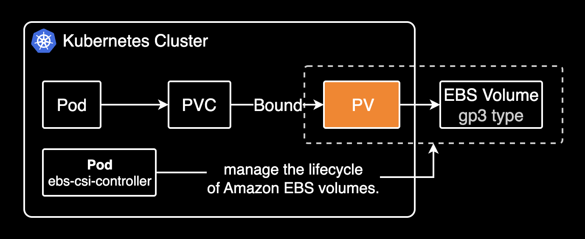
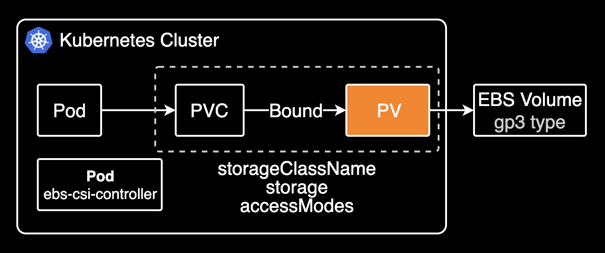
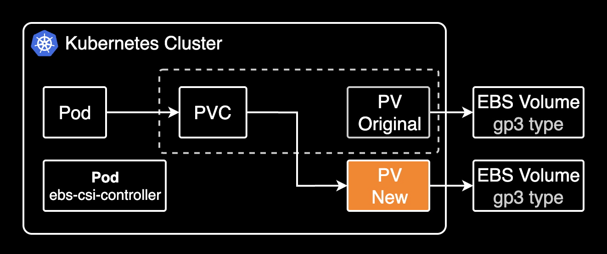

## 개요

Terminating 상태로 걸려있는 Persistent Volume을 복구하는 가이드를 소개합니다.

&nbsp;

## TLDR

- **대상 독자**: 쿠버네티스 클러스터 관리자
- **얻을 수 있는 이점**: 데이터 손실 없이 안전하게 PV를 복구할 수 있습니다.

&nbsp;

## 복구 절차 요약

Terminating 상태로 전환된 PV를 다시 Bound로 돌릴 방법은 없습니다. 따라서 PV를 지운 후 다시 보존된 EBS를 가져와서 새로 만드는 절차로 진행됩니다.

쿠버네티스 클러스터에서 복구 절차를 진행하는 과정을 그림으로 표현하면 다음과 같습니다.



&nbsp;

## 상세 복구 절차

PersistentVolume이 [EBS CSI Driver](https://github.com/kubernetes-sigs/aws-ebs-csi-driver)로 관리되는 경우를 가정합니다.

1. persistentVolume이 Terminating 상태로 걸려있음.
2. persistentVolume 리소스의 `spec.persistentVolumeReclaimPolicy`를 `Retain`으로 설정합니다. 잠재적인 데이터 손실을 방지하기 위함입니다.

```yaml
apiVersion: v1
kind: PersistentVolume
metadata:
  name: pvc-889dfdd4-e2cd-43aa-ad80-4df39d310f81
spec:
  persistentVolumeReclaimPolicy: Retain
```

3. ⚠️ **중요**: [Velero](https://github.com/vmware-tanzu/velero)나 AWS의 EBS 스냅샷 기능을 사용해서 복구 전 시점의 persistentVolume 리소스를 스냅샷 백업합니다.
4. persistentVolume 리소스의 `spec.claimRef` 설정을 삭제합니다.

아래 PV 설정에서 claimRef 삭제:

```yaml
apiVersion: v1
kind: PersistentVolume
metadata:
  name: pvc-889dfdd4-e2cd-43aa-ad80-4df39d310f81
spec:
  persistentVolumeReclaimPolicy: Retain
  claimRef:
    apiVersion: v1
    kind: PersistentVolumeClaim
    name: n8n
    namespace: n8n
    resourceVersion: "732371520"
    uid: ee90f911-f51f-4048-86c6-4a50ff457b80
```

5. `spec.claimRef`를 삭제하면 Terminating 상태의 persistentVolume 리소스가 즉시 삭제됩니다.
6. persistentVolume을 [정적 프로비저닝(Static Provisioning)](https://github.com/kubernetes-sigs/aws-ebs-csi-driver/tree/master/examples/kubernetes/static-provisioning) 방식으로 클러스터 바깥에 존재하는 (기존에 보존된) EBS를 PV로 다시 가져옵니다.

```yaml
apiVersion: v1
kind: PersistentVolume
metadata:
  name: test-pv
spec:
  accessModes:
  - ReadWriteOnce
  capacity:
    storage: 5Gi
  csi:
    driver: ebs.csi.aws.com
    fsType: ext4
    volumeHandle: vol-<YOUR_EBS_VOLUME_ID> # Change to your EBS Volume ID
  nodeAffinity:
    required:
      nodeSelectorTerms:
      - matchExpressions:
        - key: topology.kubernetes.io/zone
          operator: In
          values:
          - ap-northeast-2a # Change to your zone
  persistentVolumeReclaimPolicy: Retain
  storageClassName: gp3
  volumeMode: Filesystem
```

7. [persistentVolumeClaim 리소스](https://kubernetes.io/docs/concepts/storage/persistent-volumes/#reserving-a-persistentvolume)의 `spec.volumeName`을 새로 만든 persistentVolume의 Name으로 변경합니다. 특정 PV에 PVC가 연결되게 하려면 이 작업이 필요합니다.

```yaml
apiVersion: v1
kind: PersistentVolumeClaim
metadata:
  name: n8n
spec:
  accessModes:
  - ReadWriteOnce
  resources:
    requests:
      storage: 5Gi
  storageClassName: gp3
  volumeMode: Filesystem
  volumeName: pvc-889dfdd4-e2cd-43aa-ad80-4df39d310f81
```



주의할 점은 PVC가 기존의 PV를 연결하려면 아래 값들이 동일해야 합니다.

- `spec.storageClassName`
- `spec.accessModes`
- `spec.resources.requests.storage`

만약 일치하지 않으면 PVC가 기존의 PV를 연결하지 못하고 새로운 PV를 생성합니다.



8. 파드에 다시 데이터가 마운트되어 복구 완료됨

&nbsp;

## 관련자료

- [Cancel or undo deletion of Persistent Volumes in kubernetes cluster](https://stackoverflow.com/questions/51585649/cancel-or-undo-deletion-of-persistent-volumes-in-kubernetes-cluster)
- [How to create a pv and pvc from EBS in eks](https://repost.aws/questions/QUDjnyA_QqQvqRyR4gwrDEog/how-to-create-a-pv-and-pvc-from-ebs-in-eks)